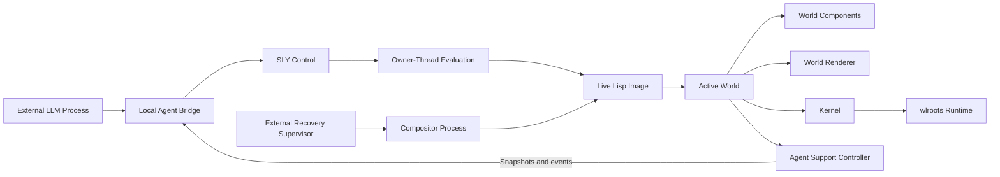
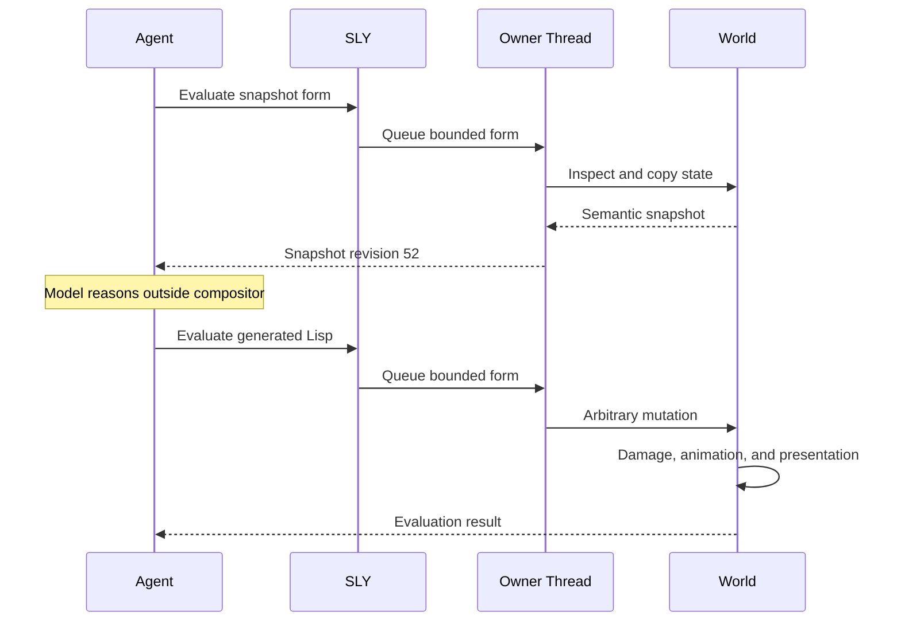
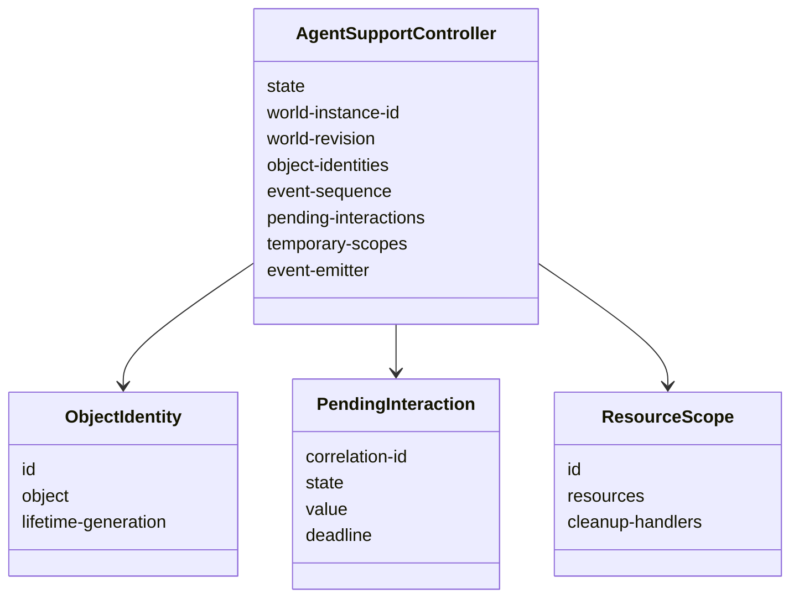
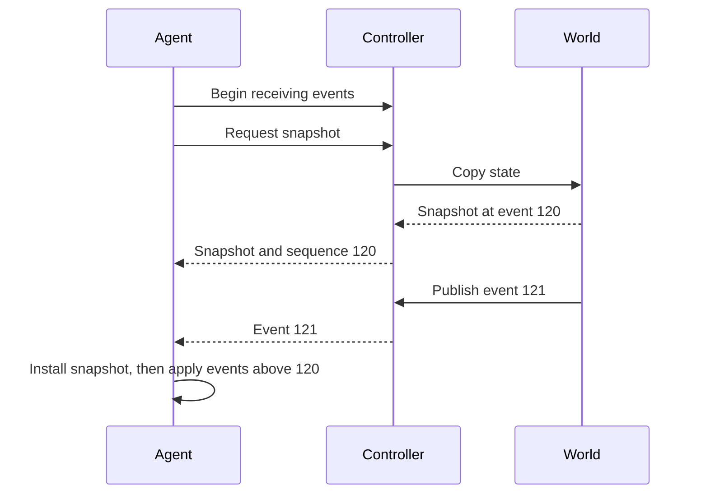
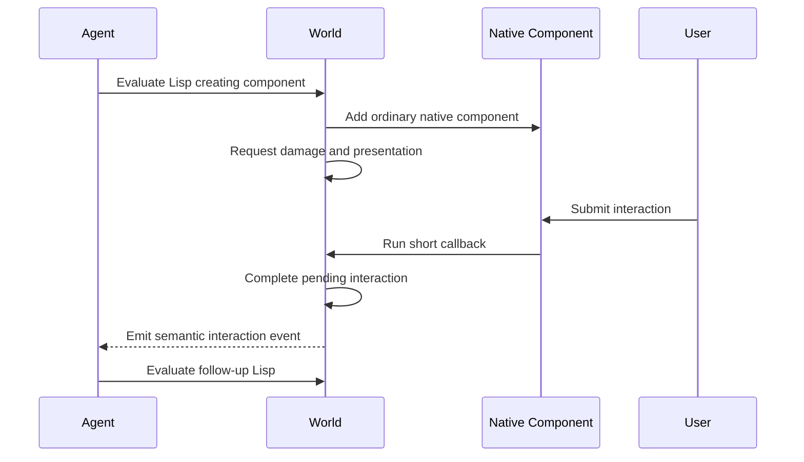
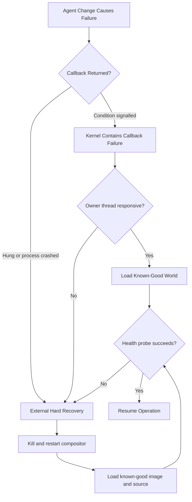
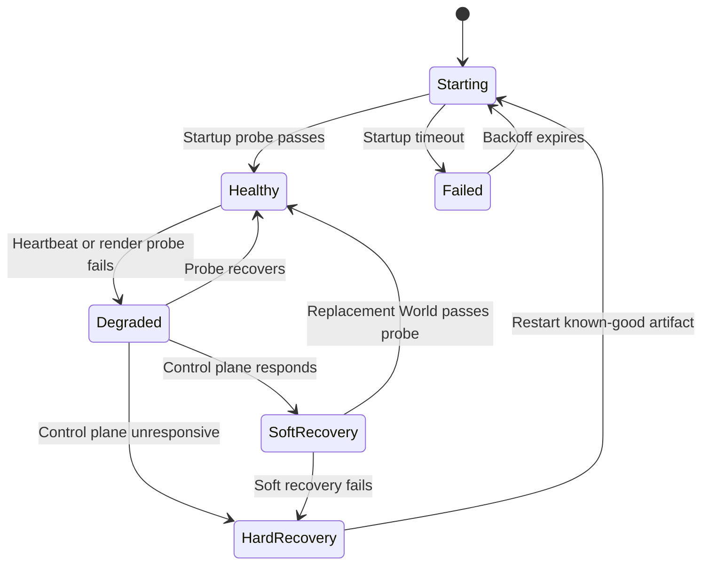

# Agent Integration

## Goal

Ataxia should let a trusted local LLM inspect and modify the live Common Lisp
image directly. The agent is not confined to a fixed compositor command API. It
may inspect CLOS objects, redefine methods, modify World metadata, create native
components, install hooks, replace rendering behavior, and swap the active
World.

The design must support:

- Reorganizing a World after inspecting its semantic and visual state.
- Grouping related applications in an infinite canvas.
- Creating native UI for questions, progress, choices, and messages.
- Receiving user interaction from agent-created components.
- Defining behavior that was not anticipated by the compositor author.
- Recovering when generated Lisp breaks the World, render loop, control path,
  or complete compositor process.

The central assumption is that the agent is powerful and trusted, but fallible.
Recovery therefore matters more than pretending raw Lisp evaluation can be
safely contained by an application-level permission model.

## Architectural Boundary

Agent inference remains outside the compositor process. The external agent uses
SLY or another local bridge to evaluate Lisp inside the running image.



The Runtime and Kernel remain agent-unaware. The Kernel continues to own
Wayland protocol objects, outputs, seats, frame leases, EGL activation, output
commits, and generic callback failure containment. It does not gain agent
sessions, agent permissions, or agent-specific rendering behavior.

## Direct Lisp Control

The LLM may evaluate arbitrary forms in the live image. Common operations can
have convenient APIs, but those APIs are not a security boundary.

The agent may:

- Inspect any reachable Lisp object.
- Store references in global variables or closures.
- Call internal or exported functions.
- Define and redefine functions, methods, classes, and hooks.
- Construct ordinary World-native components.
- Mutate World-owned application wrappers.
- Start animations and request damage or presentation.
- Replace a World implementation while the compositor remains running.

The only mandatory execution rule is that live compositor state is mutated on
the compositor owner thread. Model inference, image encoding, network access,
and other slow work remain outside that thread.



Calling World mutation functions directly from a SLY worker thread is not
acceptable. The existing owner-thread scheduling mechanism is the entry point
for mutations.

## Why There Is No Required Agent Session

Mandatory agent sessions would primarily provide permissions, isolation,
quotas, attribution, and disconnect cleanup. Arbitrary Lisp evaluation bypasses
all of those controls.

A mandatory session abstraction would therefore add complexity without
providing a real safety boundary. Conversation state and model identity remain
in the external agent service.

Temporary cleanup scopes may still be useful, but they are optional tools rather
than a requirement for accessing the World.

## Reusable Agent Support Controller

Different Worlds still need common mechanics for snapshots, object identity,
external events, and pending user interactions. These belong in one reusable
World-owned component, similar to the damage and shortcut controllers.



Each World may own one controller:

```lisp
(agent-controller
 :initform (ataxia.world:make-agent-support-controller)
 :reader world-agent-controller)
```

Like shortcut dispatch, controller entry points receive both the controller and
World when World-specific behavior is required. The controller does not become
another architectural layer.

## Controller Responsibilities

### Stable Snapshot Identities

An external snapshot needs stable IDs that associate semantic records, image
regions, and later agent instructions with the same World object.

The controller may maintain:

```text
stable ID -> World object
World object -> stable ID
```

This table is not the canonical World model. It stores no position, layout,
camera, focus, grouping, or rendering data.

Identity properties:

- IDs are unique within one World instance.
- Invalidated IDs are never reused.
- Removing an object invalidates its identity.
- Replacing the World invalidates the complete identity namespace.
- Wayland applications and native components use the same mechanism.
- Only objects explicitly exposed by the World appear in snapshots.

The agent may ignore IDs and locate objects through arbitrary Lisp, but IDs make
visual analysis and multi-step external reasoning practical.

### World Revision

The controller provides a monotonic revision for externally observable World
changes. Worlds bump it when state relevant to an agent snapshot changes.

The revision is advisory rather than a mandatory access gate. It allows an agent
to detect that its analysis is stale before applying a large reorganization.

A convenience operation may conditionally execute a form only when a revision
still matches, but unrestricted Lisp remains able to bypass that check.

### External Events

Worlds publish semantic events such as:

- Object exposed or withdrawn.
- Focus changed.
- Layout changed.
- Camera changed.
- Native component submitted or cancelled.
- Application created or closed.
- Snapshot capture completed.
- World replaced or quiescing.

Every event receives:

- A monotonically increasing sequence number.
- World instance ID.
- Current World revision.
- Event type.
- Optional stable object ID.
- Serializable World-defined payload.

The controller does not interpret World-specific payloads.

The outbound queue must be bounded and nonblocking. If the external consumer
falls behind, it receives a resynchronization marker and requests a new
snapshot. The compositor must never wait for an agent to read events.

### Pending Interactions

Agent-created UI may ask the user a question long after the original evaluation
form has returned. A pending interaction contains:

- Correlation ID.
- Current state.
- Optional deadline.
- Completion value or failure reason.

The controller can begin, complete, fail, cancel, and inspect interactions. It
does not understand buttons, text fields, seats, or component layout.

### Optional Resource Scopes

A resource scope collects temporary components, hooks, callbacks, or other
values with cleanup handlers.

```lisp
(ataxia.world:with-agent-resource-scope (scope controller)
  ...)
```

Explicitly releasing the scope runs its cleanup handlers. Agents may instead
create persistent ordinary World state without using a scope.

Scopes provide convenience after failed experiments; they do not isolate the
Lisp image or protect critical compositor code.

## What the Controller Must Not Own

- Agent identities or conversational sessions.
- Authentication or permissions.
- Window coordinates.
- Camera state.
- Groups, workspaces, or topology.
- Layout and focus policy.
- Cursor or seat state.
- Animation definitions.
- Damage tracking.
- Rendering commands or GLES resources.
- Wayland protocol objects.
- Application launch policy.
- Snapshot semantic fields.
- A fixed registry of permitted agent operations.
- Native component implementation.
- Model inference or transport threads.

The controller coordinates identity, snapshot revisions, events, pending
interactions, and optional cleanup scopes. All visible behavior remains in the
active World.

## World Snapshot Protocol

Each World implements a small protocol describing how its current state should
be copied for external reasoning.

The common protocol should support:

- Describing the active World type and available snapshot sections.
- Producing a structural snapshot.
- Requesting composed output captures.
- Requesting per-object thumbnails.
- Mapping image regions back to stable object IDs.
- Completing asynchronous image captures.

Snapshot payload fields remain World-specific.

### Structural Snapshot

Useful fields may include:

- World type and instance ID.
- Snapshot revision and event sequence.
- Stable object IDs.
- Application ID and title where available.
- Object type and World-specific metadata.
- Geometry, stacking, visibility, focus, and grouping.
- Output dimensions and camera state.
- Seat focus and active interaction state.

### Visual Snapshot

- Composed output images.
- Optional low-resolution image of each visible object.
- Optional crop around a selected region.
- Mapping between image bounds and stable object IDs.

Wayland normally exposes pixels, application identifiers, titles, and protocol
state. It does not expose browser DOM content, terminal text, document meaning,
or application intent. Better semantic grouping may require vision, OCR, AT-SPI,
browser integrations, application connectors, or persistent user labels.

Visual capture should be demand-driven. The World may render scaled captures on
the GPU, while image encoding and model preparation happen outside the
compositor thread.

## Snapshot and Event Consistency

A snapshot includes the latest event sequence known when its structural state
was copied.



This prevents changes from disappearing while screenshots are encoded or the
model is analyzing the scene.

## Reorganizing a World

The agent reads a snapshot, reasons externally, and generates Lisp appropriate
for the active World.

```mermaid
sequenceDiagram
    participant User
    participant Agent
    participant World

    User->>Agent: Group related windows
    Agent->>World: Capture semantic and visual snapshot
    World-->>Agent: Infinite World revision 42

    Note over Agent,World: User may continue interacting

    Agent->>World: Check current revision
    alt Relevant state is unchanged
        Agent->>World: Evaluate generated arrangement form
        World->>World: Mutate canvas metadata
        World->>World: Start animations and add damage
        World-->>Agent: New revision 43
    else Snapshot became stale
        World-->>Agent: Current revision and changed objects
        Agent->>World: Request refreshed snapshot
    end
```



The revision check is strongly recommended for delayed operations but not
enforced against privileged Lisp.

World mutations must use normal World mechanisms so animations, damage, cursor
interaction, and presentation remain coherent. Directly changing a coordinate
slot without adding the necessary damage is legal but incorrect; common helper
functions should make correct mutations easier than incomplete ones.

## Agent-Created UI

Agent-created UI becomes ordinary World-native components. The Kernel does not
gain an agent UI object type.

The agent may:

- Instantiate existing declarative components.
- Generate Slint source and construct a component.
- Define a new Lisp drawable/interactable component.
- Add the component to a World overlay or component tree.
- Attach a short callback that emits an external event.
- Remove or retain the component after interaction.



The callback must not perform model inference. It records the interaction and
emits an event. The external agent decides what to do and later submits another
bounded owner-thread evaluation.

## Recovery Principle

Unrestricted Lisp can redefine the exact functions responsible for rendering,
event dispatch, owner-thread scheduling, SLY control, or recovery inside the
image. Therefore the final recovery authority cannot live in that image.

Recovery uses several layers. Inner layers are faster and preserve more live
state. Outer layers are less graceful but remain available when the inner image
has been destroyed.

The intended authority is unrestricted access to the **live Lisp image**, not
unrestricted ownership of the recovery plane. Lisp code normally has the OS
permissions of the compositor process and could otherwise delete baselines,
kill its supervisor, or rewrite launch scripts. For meaningful recovery, the
supervisor and known-good artifacts should run under a separate service boundary
or reside somewhere the compositor user cannot overwrite accidentally.

This separation is not intended to constrain World experimentation. It only
keeps the restart mechanism outside the object being modified.



## Layer 1: Callback Failure Containment

The Kernel should generically contain failures from World callbacks where it is
safe to do so. This is not agent-specific behavior.

For a rendering failure, the Kernel can:

- Catch a Lisp condition escaping the World render callback.
- Abort the current frame lease.
- Avoid committing an invalid output buffer.
- Restore baseline GLES state where possible.
- Record the failing World and callback.
- Keep the Wayland event loop and control plane alive.

Similar containment can apply to input and object lifecycle callbacks when
protocol correctness permits it.

Containment cannot solve:

- Infinite loops inside a callback.
- Deadlocked owner-thread code.
- Native crashes or memory corruption.
- GPU or driver hangs.
- Redefinition of Kernel containment itself.
- Destruction of the SLY control path.

Those failures require external recovery.

## Layer 2: Soft World Recovery

If the process, owner thread, and control plane remain responsive, an external
recovery command can replace the damaged World with a known-good constructor.

Soft recovery should:

1. Mark the damaged World quiescing.
2. Stop calling it for new work.
3. Detach it using existing World replacement mechanics.
4. Construct a known-good minimal World.
5. Attach existing Kernel objects to the replacement World.
6. Request complete output damage.
7. Run a health probe before declaring recovery successful.

The recovery command belongs to the external control tooling. The Kernel only
needs its ordinary World replacement and callback containment mechanisms.

Soft recovery may lose World metadata. Restoration of application objects comes
from the Kernel's existing object inventory, not from retaining the broken World.

## Layer 3: External Supervisor

An independent supervisor process is the ultimate recovery authority.

It must not depend on:

- The active World.
- The Lisp owner thread.
- SLY.
- The compositor renderer.
- Agent-generated functions.

The supervisor manages:

- Process startup and termination.
- Crash restart.
- Owner-thread heartbeat monitoring.
- Explicit emergency restart requests.
- Selection of the known-good startup artifact.
- Startup log retention.
- Limited restart backoff to avoid a crash loop.



## Health Signals

Process existence alone is insufficient. A compositor may remain alive while
its render loop or owner thread is unusable.

Useful independent signals include:

- Process liveness.
- Periodic owner-thread heartbeat.
- SLY or control-plane responsiveness.
- Last successful output commit.
- Consecutive frame acquisition, render, or commit failures.
- An explicit render probe requested by the supervisor.

Idle outputs should not be expected to commit frames continuously. A render
probe deliberately requests damage and presentation, then verifies that an
output commit completes within a configurable deadline.

A deliberate debugger stop can look like a hang. The supervisor may support a
short, externally owned maintenance lease that pauses automatic restart. The
lease must expire automatically so a dead agent cannot disable recovery
permanently.

## Known-Good Artifacts

Agent experimentation should normally modify only the live Lisp image. A hard
restart then returns to deterministic known-good code.

The recovery baseline should include:

- A committed source revision.
- Matching native runtime libraries.
- A tested startup script or saved Lisp image.
- A known-good minimal World constructor.
- Configuration required to open outputs and seats.

Promoting a modified image or source tree into the recovery baseline must be an
explicit operation performed only after a restart and render health check.

Keep at least the previous baseline. Promotion should atomically switch a
pointer or manifest rather than overwrite the only recoverable artifact.


## Persistent World Metadata

Code recovery and World-state recovery are separate concerns.

Selected Worlds may serialize ordinary metadata such as:

- Application positions.
- Groups and labels.
- Camera locations.
- User-created persistent components.
- Layout preferences.

Snapshots must be versioned and validated before loading. Failure to restore
metadata must not prevent the compositor from starting with an empty World.

Arbitrary closures, GLES handles, Wayland pointers, pending callbacks, and agent
temporary resources should not be persisted.

## Evaluation Logging and Replay

The external bridge should record generated forms and their results outside the
compositor process. This provides an audit trail and helps identify the change
that caused a failure.

After hard recovery:

- Do not automatically replay the final failing form.
- Do not blindly replay mutations that depended on old object identities.
- Allow the agent or user to inspect the log and selectively regenerate safe
  changes against a fresh snapshot.
- Persist source changes through the normal version-controlled workflow rather
  than treating an evaluation log as source code.

## Emergency Controls

Recovery must be usable when nothing is visible and the compositor accepts no
input.

At least one out-of-band path should remain available:

- SSH into the VM.
- A host-side UTM control command.
- A supervisor control socket.
- A system service restart command.
- A separate virtual terminal where applicable.

Conceptual recovery operations are:

- Inspect supervisor and compositor health.
- Attempt soft World replacement.
- Force hard compositor restart.
- Start without persisted World metadata.
- Select the previous known-good baseline.
- Promote a validated candidate baseline.

These operations must not invoke agent-generated Lisp in order to function.

## Failure Cases

| Failure | Preferred response |
| --- | --- |
| World callback signals a condition | Contain callback, abort current work, attempt soft World replacement. |
| Generated shader fails compilation | Reject shader or retain previous program; keep World active. |
| World renderer leaves invalid GLES state | Abort frame, restore baseline state, mark World degraded. |
| Render callback loops forever | Supervisor detects stale heartbeat and hard-restarts. |
| Owner-thread queue stops progressing | Supervisor hard-restarts. |
| SLY becomes unavailable | Supervisor uses its independent control socket to restart. |
| Lisp process crashes | Supervisor restarts the known-good artifact. |
| New baseline crashes during startup | Supervisor falls back to previous baseline. |
| Persisted World metadata is invalid | Start empty and preserve the failed snapshot for inspection. |
| Agent-created UI callback fails | Remove or disable that component; keep the World active. |

## Central Rules

1. The LLM may have unrestricted access to the live Lisp image.
2. Slow reasoning never runs on the compositor owner thread.
3. Common helpers exist for correct damage, animation, presentation, snapshots,
   events, and native component interaction.
4. The agent support controller is an ergonomic World-owned component, not a
   security boundary or policy layer.
5. Kernel callback containment is generic and agent-unaware.
6. The final recovery authority lives outside the mutable Lisp process.
7. Live experiments are ephemeral until explicitly validated and promoted.
8. A hard restart must always be able to reach a known-good compositor without
   executing agent-generated code.
