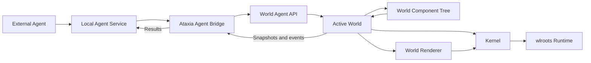
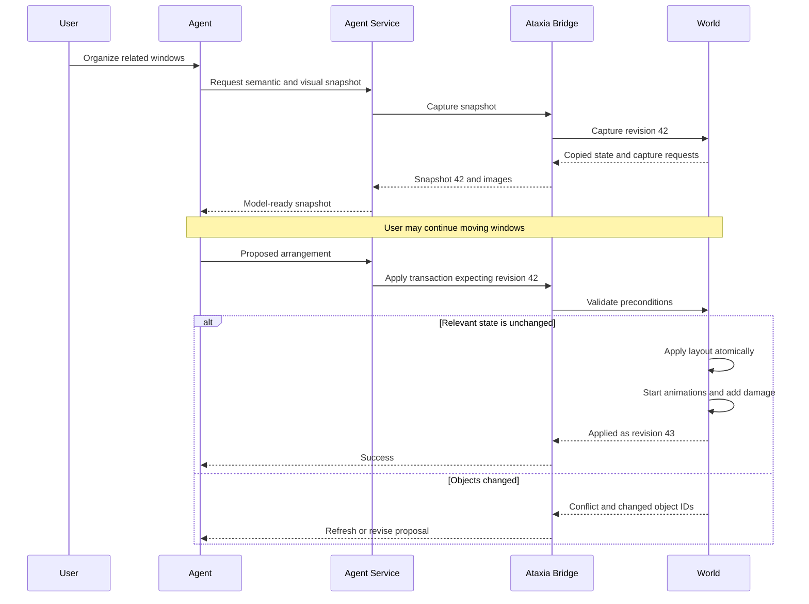
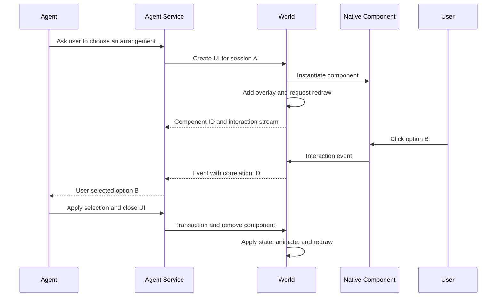
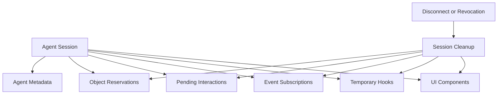
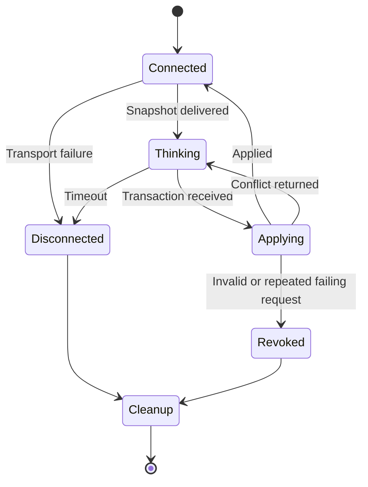

# Agent Integration

## Goal

Ataxia should let external agents understand and modify the active World without
placing model execution, network requests, or agent-specific policy inside the
Runtime or Kernel.

Important use cases include:

- Reorganizing windows after inspecting the visible scene and application data.
- Grouping related applications in an infinite canvas.
- Moving the camera to relevant content.
- Launching applications and focusing existing applications.
- Creating temporary native UI for questions, choices, progress, and results.
- Receiving user input from agent-created UI asynchronously.
- Running several independent agents without losing resource ownership.
- Recovering cleanly when an agent disconnects or submits invalid behavior.

## Architectural Boundary

Agent integration belongs above the Kernel. The Kernel should continue to know
only about Wayland objects, outputs, seats, frame leases, and the active World.
It should not know what an agent is, how inference works, or which operations a
particular World supports.

The external agent service performs slow work asynchronously. Calls entering
the active World are scheduled onto the compositor owner thread and must finish
quickly. The World returns copied data rather than live mutable objects whenever
work will continue outside that thread.

## Responsibilities

### External Agent

- Interprets user requests.
- Analyzes images and semantic snapshots.
- Chooses World operations.
- Generates UI descriptions or trusted component code.
- Maintains conversational and task state.

### Local Agent Service

- Hosts model and tool integrations.
- Maintains agent sessions and request correlation IDs.
- Encodes snapshots and images for the selected model.
- Receives World events without blocking the compositor.
- Translates transport requests into the transport-neutral World API.

### Ataxia Agent Bridge

- Locates the active World.
- Schedules short calls onto the Kernel owner thread.
- Serializes stable values and object handles.
- Delivers asynchronous World and UI events to the agent service.
- Tracks which resources belong to which agent session.
- Rejects requests for expired sessions or stale objects.

### World

- Defines the semantic meaning of its own state.
- Describes the operations it supports.
- Produces snapshots appropriate for its representation.
- Validates and applies agent transactions.
- Creates and owns native agent UI components.
- Routes input to those components.
- Owns all resulting animation, damage, camera, and layout changes.

### Kernel and Runtime

- Remain agent-unaware.
- Continue delivering protocol events and frame leases.
- Continue executing Wayland operations requested by the World.
- Never wait for an agent response.

## World Agent API

The common API should describe mechanics, not impose one spatial model on every
World. It should provide these conceptual operations:

| Operation | Purpose |
| --- | --- |
| Describe capabilities | List the operations and snapshot features supported by the active World. |
| Capture snapshot | Return versioned semantic state and requested visual captures. |
| Apply transaction | Validate and atomically apply a collection of World-specific operations. |
| Create UI | Add an agent-owned native component to the World. |
| Patch UI | Update an existing agent-owned component. |
| Remove UI | Remove an agent-owned component and its pending interactions. |
| Subscribe | Receive object, focus, layout, application, and UI interaction events. |
| Release session | Remove every resource owned by an agent session. |

The interface should not define universal operations such as `set-window-x`.
That operation is meaningful in a planar World but meaningless in a spherical,
tiling, or topology-based World.

Instead, every World advertises its own operation vocabulary.

### Infinite World Capabilities

- Move or resize an object on the plane.
- Create, modify, or dissolve a spatial group.
- Add labels and other native components.
- Reorder stacking.
- Pan or zoom a camera.
- Focus, reveal, or center an object.
- Apply an entire spatial arrangement atomically.

### Tiling World Capabilities

- Reorder tiled objects.
- Move an object before or after another object.
- Create or modify splits.
- Move objects between workspaces.
- Change master ratios.
- Select a layout strategy.

## Snapshot Model

A useful snapshot combines structural information with visual captures.

### Structural Snapshot

- Snapshot revision and timestamp.
- World type and capability revision.
- Stable object IDs.
- Application ID and title where available.
- Object type and World-specific metadata.
- Geometry, stacking, visibility, focus, and grouping.
- Output dimensions and camera state.
- Seat focus and active interaction state.
- Per-object generation used for conflict detection.

### Visual Snapshot

- A composed output image.
- Optional low-resolution image for each visible object.
- Optional crop around a selected region.
- Stable mapping from image regions to object IDs.

Wayland does not expose browser DOM content, terminal text, document meaning, or
application intent. A compositor normally receives surface pixels, application
identifiers, titles, and protocol state. High-quality semantic grouping may
therefore require a combination of:

- Vision over the composed output or per-window thumbnails.
- OCR over window pixels.
- AT-SPI accessibility integration.
- Browser extensions or application-specific connectors.
- User-provided labels and persistent World metadata.

Visual capture should be demand-driven. The World can render scaled captures on
the GPU, while image encoding and model preparation happen outside the
compositor thread. Continuous full-resolution GPU readback would be unnecessarily
expensive.

## Reorganizing a World

Agent inference can take seconds while the user continues interacting. Every
proposal must therefore be based on versioned state and carry explicit
preconditions.

Transactions should support both a World revision and per-object generations.
An unrelated cursor movement should not invalidate a layout proposal, while a
user moving one of the affected windows should.

The World remains responsible for translating the accepted target state into
its normal animations, layout changes, and damage requests. Agent integration
must not bypass those mechanisms.

## Agent-Created UI

Agent-created UI should become ordinary World-owned native components. It must
not become a special Kernel object type. The same component tree should render
and route input for built-in UI, Slint components, and agent-created UI.

Two levels of authority are useful.

### Declarative UI

The normal path accepts a small UI description containing elements such as:

- Text and formatted messages.
- Buttons.
- Text fields.
- Lists and selection controls.
- Progress indicators.
- Images.
- Horizontal and vertical layout containers.

The World instantiates a supported native component and returns a component ID.
This path is predictable, quick to generate, and easy to clean up.

### Code-Backed UI

A trusted local agent may define a complete Lisp or Slint component when the
declarative vocabulary is insufficient. The resulting object must still enter
the same World component tree and obey the same rendering and input lifecycle.

Code-backed UI offers full local extensibility, while the declarative path makes
routine questions and messages less error-prone.

## UI Interaction Flow

The compositor must never wait synchronously for a remote model response.

Text editing, selection state, hover, and immediate button feedback should be
owned locally by the component. The agent should receive meaningful events such
as `submitted`, `selected`, or `cancelled`, rather than every pointer motion.

An agent may request lower-level events when implementing a specialized
interactive component, but that should not be the default.

## Agent Sessions and Ownership

Every connected agent receives a session identity. Resources created through a
session remain associated with it.

Session ownership provides:

- Automatic cleanup after disconnects.
- Explicit revocation of a misbehaving agent.
- Separation between multiple agents.
- Clear attribution for UI and World mutations.
- Time-to-live policies for temporary resources.

It should be possible to make selected resources persistent, but persistence
must be explicit rather than an accidental consequence of a dead session.

## Concurrency and Human Control

Agents must not fight the user or one another.

- A user interaction affecting an object invalidates conflicting pending agent
  operations for that object.
- An agent may reserve objects while presenting a confirmation UI, but the user
  can always override the reservation.
- Multiple agents may inspect the same snapshot.
- Transactions touching disjoint objects may both succeed.
- Transactions touching the same object require compatible preconditions or
  one must be rejected.
- Agent-created animations remain World animations and can be interrupted by
  normal user interaction.

No general mailbox is needed between World components. Agent requests enter the
owner thread, call the active World synchronously, and leave with copied results.
Only external inference and transport are asynchronous.

## Transport

The World API should remain independent of the external protocol.

### SLY

SLY is valuable for development, unrestricted local control, and emergency
inspection. It is less suitable as the permanent agent protocol because raw
evaluation does not naturally provide stable serialization, event streams,
resource ownership, cancellation, or request correlation.

### Local RPC

A local Unix-domain protocol can provide:

- Session establishment.
- Request and response IDs.
- Event subscriptions.
- Structured values and stable object handles.
- Cancellation and timeouts.
- Efficient transfer of local image files or shared buffers.

Common Lisp S-expressions are a natural encoding, although the World-facing API
should not depend on that choice.

### MCP Adapter

An optional external MCP adapter could expose:

- World snapshots and captures as resources.
- Layout, focus, application, and UI operations as tools.
- World events through the agent service's subscription mechanism.

MCP support should live in the external service or adapter, not the compositor
Kernel. Other local agents must be able to use the same World API without MCP.

## Full Control and Structured Control

Structured operations should not remove the unrestricted local control Ataxia
already provides.

The recommended arrangement is:

1. Structured World operations for frequent, reliable tasks.
2. Declarative native UI for ordinary interaction.
3. Code-backed World components for novel trusted behavior.
4. Raw SLY evaluation as the privileged escape hatch.

This gives agents full power while making the correct path easy to validate,
attribute, and recover.

## Failure Handling

Agent failures must not terminate or stall the compositor.

- Inference timeouts affect only the agent request.
- Invalid transactions return errors without partially mutating the World.
- Agent UI should show a disconnected state or disappear according to its
  lease policy.
- Session cleanup removes transient resources.
- A supervisor outside the compositor remains responsible for restarting the
  process if unrestricted raw Lisp destroys the control loop.
- A known-good World constructor should remain available for recovery without
  requiring agent state to survive.

This is not a general undo system. It is transaction validation, resource
ownership, and process recovery around inherently privileged local agents.

## Suggested Initial Surface

The first useful agent-facing operations are:

- Inspect the active World and its capabilities.
- Capture semantic state and selected thumbnails.
- Apply a versioned World transaction.
- Focus or reveal an object.
- Launch an application.
- Create, patch, and remove declarative UI.
- Display an ephemeral or persistent message.
- Subscribe to application, focus, layout, and UI interaction events.
- Release every resource owned by a session.

This initial surface supports World organization and user interaction without
requiring the agent system to understand Kernel internals.

## Central Rule

Agents reason asynchronously. Worlds expose semantic state, validate mutations,
own native components, and schedule their own rendering work. The Kernel and
Runtime remain agent-unaware, and only short bounded operations execute on the
compositor owner thread.
