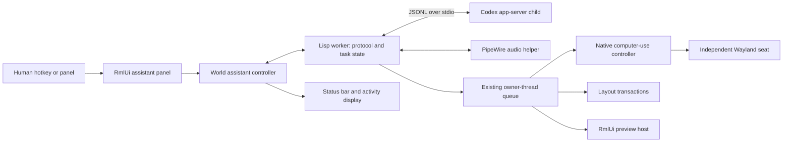

# Ataxia assistant

Status: implemented September 16, 2026, as the optional `ataxia-assistant` system.
Typed Codex tasks, native computer use, layout transactions with Undo, isolated
RmlUi previews, shortcuts and the panel are implemented. The realtime adapter has
passed synthetic-audio tests; the installed service requires API-key authentication,
so a real microphone conversation has not been verified. See [usage and validation](ASSISTANT.md).
“ADP” is interpreted here as the Codex app-server protocol.

An assistant should be available directly from the desktop: open a small panel,
type or speak a task, and continue using other applications while it works. The
panel shows the actual current operation, affected application, progress and any
question that needs an answer. Routine steps within the task continue without
repeated permission prompts. Pause and Stop remain immediate local operations.

## User interaction

- **Super+A** opens or focuses the assistant panel on the human seat's output.
- **Super+Shift+A** opens that panel and toggles talk mode. It is separate from
  **Super+Space**, which already opens the application launcher.
- A status-bar **Assistant** button opens the same panel. While work is active,
  it shows `Working`, `Needs you`, `Paused` or `Done`; microphone activity has an
  explicit `Listening` label. Idle state is a quiet text button.
- The default panel is 480 × 760 logical pixels, above the right end of the bar,
  clamped to the output. Narrow layouts retain the same single-column order.
- The header, Pause/Stop row and composer remain visible while the transcript
  scrolls. Closing the panel restores previous application focus and closes the
  microphone. Closing a view does not silently cancel an already-running task.
- Sending a correction steers the active turn. A completed conversation starts a
  new turn. There is one active turn per conversation.
- **Ctrl+Alt+Escape** immediately pauses all computer-use sessions, closes audio
  capture/playback and requests cancellation of assistant turns.

The displayed scope is part of starting a task: for example, this desktop's
layout, selected applications, or a chosen project directory. Pressing Send is the
human authorization for those resources. The integrated assistant can create and
approve its computer-use session from that human UI action; it does not approve
itself through an agent tool. External computer-use clients retain the existing
Allow/Resume controls. Resource expansion or a genuinely new consequential action
uses an inline request, with the existing grant preserved.

The prototype is [activity.rml](../examples/assistant/activity.rml). Run
`python3 examples/assistant/render-preview.py` from an environment with render
access after `make rmlui`. It produces `build/assistant-working-440.png`,
`build/assistant-working-304.png` and `build/assistant-listening-440.png` using the
real renderer. It contains sample content and starts no network or audio session.

## Runtime arrangement

The optional `ataxia-assistant` ASDF system depends on `ataxia-computer-use`
and the portable RmlUi shell. It has no concrete World dependency. Desktop and
layout adapters are described in [World services](WORLD-SERVICES.md).
It owns one controller per World. A Lisp worker handles process I/O, parsing,
model notifications, journal writes and image encoding. It starts a local
`codex --enable realtime_conversation app-server --stdio` child directly with an argument vector. No terminal,
Python bridge or additional network listener is required.

The owner thread only handles copied events, short validated mutations and UI
invalidation. It never waits for Codex, microphone I/O, a subprocess or a user
answer. Worker events carry the World generation, controller epoch, conversation,
turn and item IDs; stale events cannot affect a replacement World or task.
Use a single protocol writer and a bounded reader queue. Coalesce streaming text
for UI updates at most every 50 ms; preserve final text and control events.
A static panel must schedule no frames. Show elapsed time at most once per second
while expanded and working, and retain the existing idle bar schedule.

The native computer-use listener remains available to external clients. This
in-process controller shares its request validation, batch scheduling, approval,
input and capture implementation through the owner queue, without another socket
round trip or SLY evaluation of model-generated forms.

## Codex contract

The official app-server documentation describes bidirectional JSONL over stdio,
streamed task events, approval requests and experimental dynamic tools. Its Unix
socket transport uses WebSocket framing, so it must not be treated as raw JSONL.
Use stdio for this local integration. Generate schemas from the installed CLI and
pin compatibility to that version. [Official app-server documentation](https://learn.chatgpt.com/docs/app-server)

Local verification used **codex-cli 0.153.4**. Its generated experimental schema
and a real `initialize` / `initialized` / ephemeral `thread/start` exchange accepted
an Ataxia dynamic tool. A subsequent real model turn used the registered desktop snapshot tool and returned a public answer. The following field names and
voice observations were checked against that installed schema, rather than
inferred from the existence of a voice UI in another Codex client.

1. Launch the child and send `initialize` with `clientInfo` and
   `capabilities.experimentalApi: true`; await its response, then send
   `initialized`.
2. Read account state through app-server. If sign-in is required, show the returned
   login flow in the panel/browser. Never read or copy authentication files.
3. Start or resume one thread per conversation. Set an explicit working directory
   and permissions; use a restricted desktop task profile, or workspace write
   access for the selected development project. Respect required Codex approvals.
   Obtain available models through `model/list`; use the user's configured choice.
4. Register Ataxia tools through `thread/start.dynamicTools`. In 0.153.4 a function
   spec has `type: "function"`, `name`, `description` and `inputSchema`.
5. Send text via `turn/start` with `threadId` and `input` text items. Track the
   returned turn ID. For a correction, use `turn/steer` with `expectedTurnId`;
   handle a completed-turn race by presenting or starting a new user turn.
6. For a server `item/tool/call`, validate the thread/turn/call identity and
   arguments, run the corresponding local operation, then respond to the JSON-RPC
   request ID. Return `success` and `contentItems` with `inputText` and, when
   captured, `inputImage` / `imageUrl`. Keep the computer-use token and sequence in
   the controller; the model does not choose them.
7. Resolve completion from `turn/completed`, including interrupted and failed
   status. `turn/interrupt` acknowledgement alone does not mean the turn has ended.

Encode Codex field names as exact string keys. The existing computer-use JSON
encoder lowercases Lisp keyword keys: `:clientInfo` becomes `clientinfo` and is
rejected. Use string-keyed hash tables or a dedicated schema encoder. Give Codex
messages their own bounded parser configuration: the computer-use decoder's
4,096-character strings and depth-eight limit are too small for general Codex
messages. Start with an 8 MiB frame limit and depth 32, and bounded image/audio
payloads; reject oversize data explicitly without relaxing the public input API.

For tool images, turn the trusted local capture into a PNG data URL in the worker.
Do not return a model-supplied file path, or treat a screenshot path as a public
URL. Label every image with its window/output ID, coordinate dimensions, view
mode and capture time. A stale or resized view requires observation before input.

## Capabilities and tools

These assistant tools wrap the native computer-use API and the Metaworld layout controller.

| Tool | Operation and implementation |
| --- | --- |
| `ataxia_observe` | Existing observe plus optional capture; default to the selected application's view. Return semantic window identities alongside the image. |
| `ataxia_act` | Existing bounded `batch`: focus, pointer, keys, typing, launch, waits and a settled capture. Preserve its sequence, timeout and human-takeover rules. |
| `ataxia_window` | Close, minimize, restore, maximize or fullscreen an explicitly identified window within the task scope. Close requests normal client shutdown and requires observing the result; these controls invalidate prior layout plans and Undo. |
| `ataxia_desktop_snapshot` | Copy groups, workspaces, membership, layout policy, window identities, geometry, minimized/expanded state and output transforms. Include minimized windows and return a layout revision. |
| `ataxia_layout_preview` | Validate a bounded proposed arrangement against that revision; return a plan ID and a visual/semantic preview. No mutation. |
| `ataxia_layout_apply` | Apply a validated plan once under the task's layout grant, including `remove-group` deletion that preserves its member windows. Return an undo token and a new snapshot. |
| `ataxia_layout_undo` | Restore the affected layout when the revision still matches; report conflicts instead of overwriting subsequent human changes. |
| `ataxia_ui_preview` | Load a project-relative RML document in an isolated preview host; return parse diagnostics, rendered image and a preview ID. |
| `ataxia_ui_update` | Replace a preview revision after successful parsing; keep the previous working document if it fails. |

Computer-use desktop mode supplies screen coordinates and application input. It
intentionally cannot click World chrome or invoke World shortcuts. Thus a
“reorganise my desktop” task needs the layout tools; simulating shortcuts through
the agent seat will not implement it.

Layout commands use existing Metaworld operations and stable object IDs. Add a
revision covering membership, geometry, workspace policy and camera changes.
Check the revision immediately before committing, and reject missing windows,
wrong outputs and active human drags. A transaction validates the whole plan
first, snapshots affected state, performs the bounded update on the owner thread,
and restores that state on failure. Preserve human focus and do not close apps.
After a successful explicit rearrangement request, apply automatically within the
grant and expose **Undo**. Ask only if intent or scope is unresolved.

For “create an app using RmlUi”, Codex edits and tests files in the chosen project.
The preview worker opens an ordinary Wayland window so the existing window-view
computer-use path can inspect and exercise it. RML remains data; predefined host
events supply application actions. The initial preview process contains no raw
World evaluator. Promoting a preview into a persistent compositor widget is a
separate user action. The trusted live-development workflow in
[AGENT_INTEGRATION.md](AGENT_INTEGRATION.md) remains available; arbitrary Lisp in
that workflow is privileged code, not a sandbox for background desktop tasks.

## What the panel shows

Use three independent state fields: connection (`offline`, `connecting`, `ready`,
`error`), task (`idle`, `working`, `needs-input`, `paused`, `done`, `failed`) and
microphone (`off`, `starting`, `listening`, `stopping`). A listening microphone
must never be inferred from a running task. A hidden panel must never hide an
active microphone indicator in the status bar.

| Source | Display |
| --- | --- |
| `turn/started`, `thread/status/changed` | Working or an explicit waiting state. |
| `item/agentMessage/delta` and completed message | Public commentary and final answer, accumulated by item ID. |
| `turn/plan/updated` | Current step and completed steps. Omit the checklist if no plan exists. |
| `item/started`, local computer-use operation | A concrete label such as “Typing in Firefox” or “Checking the layout”, with its target. |
| Command/file/permission approval request | Exact affected command, paths or resources, with scoped choices in the panel. |
| `item/tool/requestUserInput` | The question and available choices. |
| `turn/completed` | Result, failure or cancellation, with artifacts and layout undo when available. |

Show public activity and tool status; do not display raw reasoning events as a
thought transcript. Render common Markdown through the bounded assistant formatter; escape all model-supplied text before inserting the generated presentation tags into RML. Display real
step counts, not a fabricated percent-complete animation. Unknown events are
ignored with bounded diagnostic logging. Unsupported server requests receive an
explicit error so a task cannot silently wait forever.

## Talk mode

The installed 0.153.4 experimental schemas expose `thread/realtime/start`,
`appendAudio`, `appendText`, `appendSpeech`, `stop` and `listVoices`. Start requires
`threadId` and `outputModality`; the audio transport can be `websocket`. Audio
chunks contain `data`, `sampleRate` and `numChannels`, with optional sample count
and item ID. Notifications include transcript deltas/completion, output audio,
errors and closure. This is schema availability, **not proof of backend access,
audio encoding compatibility or a working microphone session**.

Implement audio as an optional adapter behind the same conversation controller.
On the talk hotkey, first show `Starting microphone`; then negotiate the realtime
session and open the selected PipeWire source. Show `Listening` only after both
succeed. Use the negotiated/verified encoding and sample rate; do not guess PCM
format from the JSON field names. `pw-record` and `pw-play` run outside the compositor owner thread and exchange bounded PCM16, mono, 24 kHz chunks. `pw-record` and `pw-play` are available
locally for initial device checks, but no capture is started merely by opening the
text panel.

The voice session and Codex task share the conversation ID. Verify whether the
selected realtime mode forwards completed speech to Codex itself. Choose exactly
one submission path; manually starting a second turn for the same transcript can
execute a request twice. Persist a submission ID for each completed utterance.
Partial transcripts update the panel without initiating actions.

Talking over an active operation pauses local input before steering the task;
resume only after the correction is accepted and the user's scope still applies.
The Talk button toggles the mic off; Escape while the voice panel owns focus ends
voice capture/playback. On permission denial, unavailable voice support, source
removal or network error, close the mic and retain the typed composer with a clear
reason. Do not silently substitute a separately billed audio API. Raw audio is not journaled. Transcripts stay in the bounded in-memory conversation and are not written to the operation journal.

## Cancellation, autonomy and recovery

The assistant continues the requested task through its own tool loop while the
human uses other applications. Begin with one assistant conversation executing at
a time; existing independently approved computer-use clients can still coexist.
Retain existing human-takeover detection. Never contend for the same window or
retry a paused input batch behind the user.

Pause first blocks local tools and releases held input, then interrupts the Codex
turn. Stop additionally closes the computer-use session. Neither operation waits
for the model server. A child exit, broken pipe or heartbeat failure pauses tools,
closes audio and marks the task disconnected. Reconnection does not replay
uncertain tool calls or resume physical actions automatically.

Deduplicate tool calls using `(controller epoch, threadId, turnId, callId)`. Keep a bounded metadata journal of accepted calls and completion; retain task artifacts in the conversation and preview registry. If a crash leaves a
call's outcome unknown, observe the application/layout and reconcile it before
continuing. Layout commits use transaction IDs; repeating an already-committed
transaction returns its recorded result. Expire computer-use grants on World or
output replacement and acquire a new human grant when continuing there.

Configure task time/action limits and expose them in task details. Stop at a real
question, permission boundary, exhausted budget or final result. Do not turn an
empty final answer into an unbounded self-prompting loop. Check concrete final
conditions—layout membership/geometry or rendered preview/test results—before
claiming success. A failed check can request a bounded continuation of the same
authorized task, with the failed observation attached.

## Implementation order and acceptance

| Stage | Deliverable | Acceptance |
| --- | --- | --- |
| 1 | `protocol.lisp`, `controller.lisp`, `ui.lisp`, shortcut integration and typed composer | Real text turn streams into RmlUi; child failure leaves the desktop responsive; Pause/Stop work; old events cannot cross task or World epochs. |
| 2 | `tools.lisp` adapter to native computer use | One human grant, independent agent seat, actual application input and screenshot returned to Codex, human takeover and cancellation during held input. |
| 3 | `layout.lisp` transactions | “Reorganise my desktop” changes the authorized shared canvas; concurrent human movement rejects stale plans; Undo restores the prior arrangement without lost windows. |
| 4 | `preview.lisp` and isolated RmlUi host | Codex creates a small app, opens it, exercises a button through computer use, and repairs a parse error while retaining the last good preview. |
| 5 | `voice.lisp` and native PipeWire adapter | Hotkey starts visible listening; one utterance starts one task; interruption works; missing mic/voice entitlement falls back to text; mic closes on every exit path. |

Use recorded app-server event fixtures for deterministic reducer, approval,
deduplication and reconnection tests. Run model-backed end-to-end checks separately
in a disposable project and headless desktop. Keep the existing computer-use and
shell tests as regressions. Verify that streaming responses and audio I/O cannot
block compositor frames and that a collapsed, idle assistant adds no rendering
loop.
