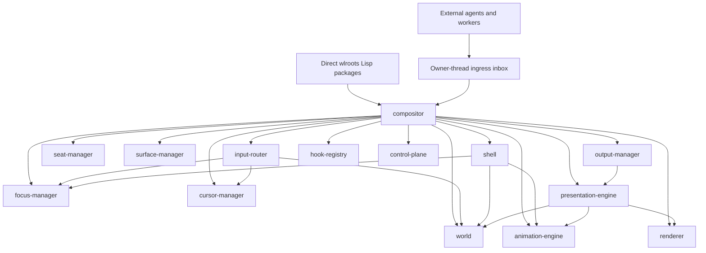
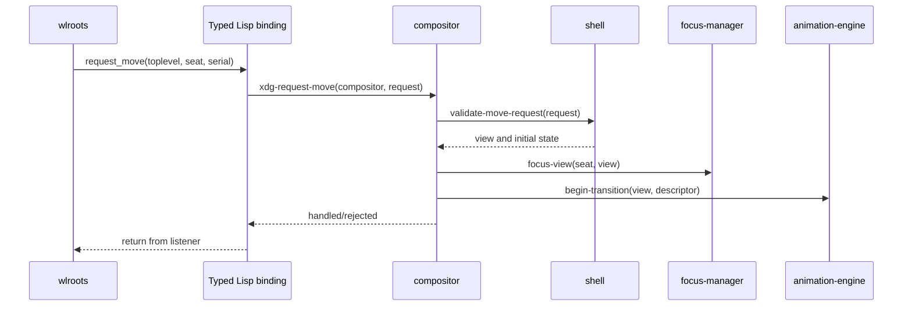
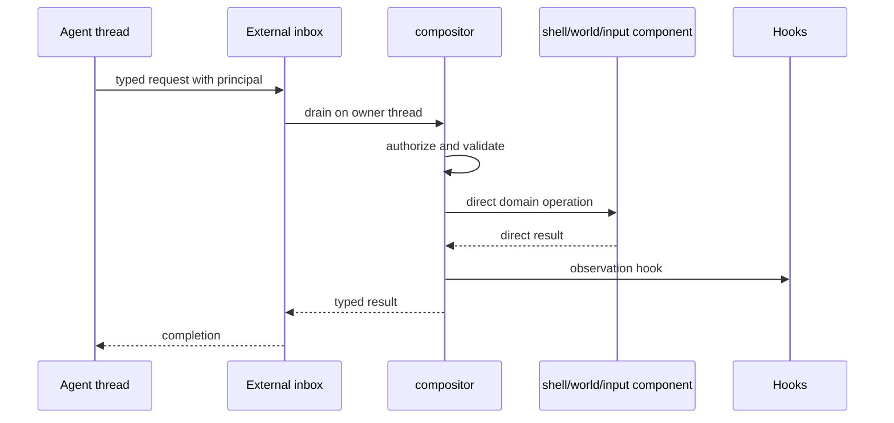

# Compositor Object Graph Design

## 1. Decision

Ataxia has one Common Lisp `compositor` object that is the aggregate root of the
running compositor. It owns the native runtime wrapper, all compositor
components, all live compositor objects, lifecycle ordering, and the owner-thread
execution context.

The previous independent Layer 2 kernel/service/transaction design is removed.
There is no internal actor system, service scope, component-schema registry,
generic event bus, immutable entity-component store, or mailbox between
compositor components.

Components communicate synchronously through ordinary functions and CLOS generic
functions on the compositor owner thread. The compositor mediates operations
that cross several component boundaries. Hooks remain available for optional
extensions, but required compositor behavior never depends on a hook broadcast.

The direct wlroots Common Lisp packages remain below the compositor object graph.
They expose exact typed callbacks and functions; they do not contain compositor
policy.

## 2. Core Rules

1. Exactly one owner thread mutates compositor state.
2. The `compositor` object owns and wires every compositor component.
3. Components call each other directly; they do not exchange internal messages.
4. Cross-domain invariants are coordinated by methods specialized on
   `compositor`.
5. State is ordinary owner-thread CLOS state, not an immutable component store.
6. Native and protocol atomicity is modeled only where the real API requires it.
7. Replaceability comes from strategy/component slots and generic functions, not
   from runtime service discovery.
8. Hooks are synchronous extension points with declared semantics and budgets.
9. A mailbox exists only for commands crossing into the owner thread from an
   agent, worker, process supervisor, or external control connection.
10. wlroots pointers remain inside typed native wrapper objects.

## 3. Object Graph



The arrows between components are direct method calls. They are not queues,
serialized events, or dynamically resolved service keys.

The compositor contains managers and registries rather than every transient
native object as a top-level slot. For example, `seat-manager` owns logical seat
objects, `surface-manager` owns surface bindings, and `output-manager` owns
output objects. All are reachable from the compositor aggregate.

## 4. Core CLOS Structure

### 4.1 Compositor aggregate

The initial shape is explicit:

```lisp
(defclass compositor ()
  ((native-runtime       :initarg :native-runtime
                         :reader compositor-native-runtime)
   (output-manager       :accessor compositor-output-manager)
   (seat-manager         :accessor compositor-seat-manager)
   (surface-manager      :accessor compositor-surface-manager)
   (shell                :accessor compositor-shell)
   (input-router         :accessor compositor-input-router)
   (focus-manager        :accessor compositor-focus-manager)
   (cursor-manager       :accessor compositor-cursor-manager)
   (world                :accessor compositor-world)
   (presentation-engine  :accessor compositor-presentation-engine)
   (renderer             :accessor compositor-renderer)
   (animation-engine     :accessor compositor-animation-engine)
   (hook-registry        :accessor compositor-hook-registry)
   (control-plane        :accessor compositor-control-plane)
   (applications         :reader compositor-applications)
   (views                :reader compositor-views)
   (callback-depth       :initform 0 :accessor compositor-callback-depth)
   (deferred-actions     :initform nil :accessor compositor-deferred-actions)
   (external-inbox       :reader compositor-external-inbox)
   (state                :initform :constructing :accessor compositor-state)))
```

The exact slot set may be split into implementation mixins, but the public
architecture remains one explicit aggregate. There is no keyword service lookup
on the input or rendering hot paths.

### 4.2 Component base

```lisp
(defclass compositor-component ()
  ((compositor :initarg :compositor
               :reader component-compositor)
   (state      :initform :detached
               :accessor component-state)))

(defgeneric attach-component (component))
(defgeneric detach-component (component reason))
(defgeneric validate-component (component compositor))
```

Every component can reach the aggregate root. Components expose domain-specific
generic functions; `compositor-component` does not define a generic event or
message method.

### 4.3 Live compositor objects

Core live objects are normal CLOS instances with direct slots and relationships:

- `application`: process/client identity, security context, and owned views;
- `view`: shell role, application, placement, animation policy, decoration, and
  current model/presentation state;
- `surface-binding`: typed native surface wrapper and its role-specific owner;
- `output`: typed native output wrapper, viewport, render state, and damage;
- `seat`: typed native seat wrapper, assigned devices, focus, grabs, and cursor;
- `world-placement`: implementation-defined placement owned by the selected
  world object;
- `interactive-operation`: move/resize/gesture state with initiating seat and
  serial provenance;
- `animation-definition` and `animation-instance`;
- `frame-context`: one output frame's short-lived presentation and native state.

Frequently accessed state uses explicit slots. An optional property table may
exist for low-frequency extension metadata, but core placement, focus, rendering,
animation, and native lifetime state cannot be hidden in an untyped property map.

### 4.4 Identity and native provenance

Compositor objects have Lisp identity independent of native wrapper identity.
A view can outlive one role-specific wrapper transition, and one application can
own several views and native surfaces.

Native wrappers are stored directly in the owning compositor object. The
authoritative native destroy callback clears or invalidates the wrapper and then
invokes the owning component's exact destruction method.

## 5. Component Communication

### 5.1 Direct calls

Normal communication is a synchronous call with direct arguments and return
values:

```lisp
(defmethod handle-pointer-motion ((input input-router) event)
  (let* ((compositor (component-compositor input))
         (world (compositor-world compositor))
         (focus (compositor-focus-manager compositor)))
    (multiple-value-bind (target surface-x surface-y)
        (world-hit-test world event)
      (update-pointer-focus focus target surface-x surface-y))))
```

The called component owns its slots. A caller uses its public generic functions
instead of mutating peer slots directly.

### 5.2 Compositor-mediated operations

An operation that changes several components is a method on `compositor`:

```lisp
(defgeneric begin-interactive-move
    (compositor seat view serial pointer-position))
```

Its implementation can validate the serial through the seat manager, establish
the grab through the input router, update focus, create an interactive operation,
resolve the view's animation, change cursor state, and request a frame. The
ordering is visible in one method rather than distributed across messages.

Use compositor-mediated methods when:

- more than one component invariant changes;
- failure requires coordinated cleanup;
- security authorization precedes several effects;
- a public shell or agent action must behave identically to local input;
- component replacement must not expose an intermediate state.

### 5.3 Direct peer references

Components normally resolve replaceable peers through compositor accessors. A
hot method fetches the peer once into a lexical variable before its loop.

A component may store a direct peer reference when the peer is guaranteed stable
for the component's entire attached lifetime. The compositor wiring code owns
that reference and must update it before either component becomes callable.

Arbitrary components must not cache replaceable peers. This prevents a hot swap
from leaving stale references without introducing service generations.

### 5.4 Hooks

Hooks are for optional policy, instrumentation, and plugins:

```lisp
(run-hook (compositor-hook-registry compositor)
          hook-context)
```

A required focus update never asks a hook to notify the cursor manager. The focus
or compositor method calls the cursor manager directly, then optionally emits an
observation hook.

### 5.5 No internal mailbox

The following are forbidden between compositor components:

- mailbox sends;
- generic command envelopes;
- serialized event records used only to cross an internal boundary;
- promise/future completion for an operation that is already on the owner
  thread;
- publish/subscribe as the only way to maintain a core invariant.

## 6. Owner Thread and Runtime Turns

### 6.1 Callback entry

Each direct wlroots package installs a protocol-specific sink object. The sink
is either the compositor or the exact owning component. A callback invokes a
typed generic function synchronously:



No intermediate queue or framework transaction is created.

### 6.2 Callback depth

The compositor tracks callback depth because some native destruction or listener
mutation is unsafe from inside the active callback. Outermost callback exit is a
safe point for the small set of explicitly deferred actions.

The deferred-action list is not a mailbox or event bus. It is owner-thread-only,
contains typed closures or typed cleanup objects, and is limited to operations
whose exact lifetime contract requires deferral.

### 6.3 External ingress

Threads outside the owner thread submit typed control requests to one bounded
external inbox and wake the Wayland event loop. The owner thread drains requests
between native dispatch turns and invokes the same compositor methods used by
local input.

After ingress, no further mailbox hop occurs.

Long-running agent inference, image processing, or blocking I/O must run outside
the owner thread. Its result re-enters through the external inbox as a bounded,
validated typed request.

### 6.4 Reentrancy

Component code must not re-enter the Wayland event loop. Public compositor
operations declare whether they are callback-safe, safe-point-only, or startup/
shutdown-only. A method that could synchronously trigger another wlroots callback
must leave its owning objects in a valid intermediate state first.

## 7. State Changes Without a General Transaction System

### 7.1 Direct owner-thread mutation

Ordinary state changes mutate their owning objects directly. The orchestrating
method validates first, applies changes in declared order, performs exact native
calls, and then runs observation hooks.

There is no universal mutation descriptor, write set, revision conflict check,
effect queue, or rollback engine.

### 7.2 Specialized pending state

Real asynchronous protocols still require explicit state objects:

- XDG configure serial and acknowledgement state;
- output test/commit and page-flip state;
- presentation feedback waiting for a committed frame;
- clipboard/DND transfer and owned FD state;
- session-lock acquisition and per-output presentation state;
- capture request and buffer completion state;
- interactive move/resize state;
- animation instances sampled across frames.

These objects are owned by the relevant component and model the actual protocol.
They are not instances of a general compositor transaction class.

### 7.3 Operation ordering

Cross-component methods follow this pattern where applicable:

1. validate arguments, object liveness, serials, permissions, and capabilities;
2. prepare any native or protocol-specific temporary state;
3. update the smallest set of owning Lisp objects;
4. call exact native functions in their required order;
5. repair or retire local state if an honest native failure occurs;
6. schedule presentation;
7. invoke non-veto observation hooks.

Veto hooks, when a hook point permits them, run before step 3 and cannot perform
untracked native mutations.

### 7.4 No false rollback

Wayland messages already sent, accepted FDs, DRM commits, and client-visible
globals cannot be rolled back by Lisp. Every operation documents its real failure
boundary. Cleanup restores internal consistency without pretending external
effects were atomic.

## 8. Construction and Lifecycle

### 8.1 Bootstrap order

1. create the native runtime and event loop;
2. allocate the compositor aggregate in `:constructing` state;
3. construct components with a reference to the compositor;
4. wire stable peer dependencies;
5. validate every required component;
6. create native globals/managers with their initial exact sinks;
7. attach components in dependency order;
8. start the backend;
9. mark the compositor `:running`.

Failure unwinds in reverse order through exact detach and native destroy/finish
operations.

### 8.2 Native object creation

The owning component directly calls the exact native package constructor. For a
new logical seat:

1. `seat-manager` validates the requested identity and policy;
2. it calls `seat-create` with the active exact seat sink;
3. the native package returns a live typed wrapper after listeners are installed;
4. `seat-manager` constructs the Lisp seat object and assigns devices;
5. the compositor makes it visible to shell, focus, input, and control methods.

If Lisp object publication fails after native construction, the owner schedules
the exact destructor at the outermost safe point.

### 8.3 Component replacement

Replacement is explicit and uncommon:

1. enter an owner-thread safe point with no active callback;
2. construct and validate the candidate component;
3. ask dependent components whether live-state migration is supported;
4. reject replacement if native resources or in-flight frames cannot migrate;
5. detach the old component from new calls;
6. replace the compositor slot and rewire declared direct references;
7. attach the candidate;
8. migrate or rebuild owned state;
9. destroy the old component after no retained frame/native callback uses it.

There is no service scope, generation lookup, or automatic migration. A renderer
may require all in-flight frames to complete. A world may require every placement
to implement an explicit conversion. Refusal is preferable to corrupt state.

### 8.4 Shutdown

Shutdown stops new external requests, cancels interactive operations and
transfers, completes or discards frames, clears focus/grabs, detaches components
in reverse dependency order, destroys protocol managers and native objects, stops
the backend, and finally destroys the display/runtime.

## 9. Hook System

Hooks dispatch on typed hook context objects rather than arbitrary event names:

```lisp
(defclass hook-context ()
  ((compositor :initarg :compositor :reader hook-compositor)
   (subject    :initarg :subject :reader hook-subject)
   (operation  :initarg :operation :reader hook-operation)
   (phase      :initarg :phase :reader hook-phase)
   (provenance :initarg :provenance :reader hook-provenance)))
```

Hook handlers may specialize on context, subject, operation descriptor, and
phase. This keeps the system general without hard-coding animation-specific
keywords such as map, pickup, or drop into the core.

Each hook point declares one of:

- `observe`: cannot alter the operation;
- `veto`: may reject before mutation;
- `transform`: may return a validated replacement descriptor;
- `around`: reserved for explicitly reentrant-safe control operations.

Hook order is deterministic. Hot-path hooks are bounded and synchronous. Slow
observers receive copied observations through the external control boundary
rather than blocking the compositor thread.

## 10. World, Coordinates, and Presentation

The compositor holds one active `world` strategy object. Views hold placement
objects understood by that world. Required generics include:

```lisp
(world-place-view world view placement-request)
(world-update-placement world view placement operation-context)
(world-project world output viewport view timestamp)
(world-unproject world output viewport output-x output-y)
(world-hit-test world output viewport output-x output-y timestamp)
```

A planar fixed workspace, infinite canvas, or spherical world replaces the world
object and placement classes. Input and rendering both call the same world
object, ensuring projected geometry and inverse hit testing agree.

The presentation engine asks the world for projected items, samples animation,
adds output-local overlays, builds a short-lived presentation snapshot, and
calls the active renderer directly.

## 11. Rendering

The active renderer is a compositor component/strategy with explicit methods:

```lisp
(renderer-begin-frame renderer output frame-context)
(renderer-draw-item renderer frame-context presentation-item)
(renderer-end-frame renderer frame-context)
(renderer-abort-frame renderer frame-context reason)
```

The renderer may use wlroots render passes, direct EGL/GLES, Vulkan, Pixman, or a
provider-defined backend. The compositor core does not depend on `wlr_scene`.

Frame execution is direct:

1. exact output frame callback enters `output-manager`;
2. it calls the presentation engine;
3. presentation freezes output/world/animation state for that frame;
4. renderer builds and submits exact native render/output state;
5. output manager records the real commit result;
6. later presentation/page-flip callbacks complete the frame context.

The snapshot exists to keep one frame internally coherent, not to implement a
global immutable state model.

## 12. Input, Focus, Cursor, and Interactive Operations

The input router performs device normalization and mapping, then directly calls:

1. active grab/interactive operation;
2. world inverse mapping and hit testing;
3. focus manager;
4. cursor manager;
5. shortcut/accessibility policy;
6. exact seat delivery functions.

Focus and cursor are separate components but coordinated through compositor
methods. Cursor appearance derives from the current seat operation and pointer
target; it is not independently latched by scattered event handlers.

An `interactive-operation` directly stores its seat, target view, initiating
serial, starting pointer/placement, mode, constraints, and cancellation rule.
Button release, view destruction, device removal, seat removal, focus loss, or
explicit cancellation terminates it through one compositor method.

## 13. Animation

Animation is direct object state, fully selectable per subject and per operation.

```lisp
(defclass view ()
  ((animation-policy :accessor view-animation-policy)
   (animations       :reader view-active-animations)))
```

Resolution receives a general transition descriptor:

```lisp
(resolve-animation animation-engine subject transition-descriptor context)
```

Resolution order is:

1. explicit operation override;
2. subject-specific animation policy;
3. application/profile policy;
4. world or shell policy;
5. compositor default.

Two windows can therefore use different definitions for the same transition.
Definitions may use different timelines, curves, springs, properties, blending,
interruption rules, and completion behavior.

Animation sampling is called directly by presentation. It does not publish
animation messages. Starting, retargeting, cancelling, and completing an
animation may invoke typed hooks, but the engine owns the active instances.

## 14. Output and Frame Coordination

`output-manager` owns physical and virtual output objects. Each output owns its
viewport, current native state, damage history, frame scheduling state, cursor/
layer resources, and outstanding frame contexts.

Output arrangement is policy in the manager/world relationship. Rendering uses
output-local top-left logical coordinates. Buffer transforms, output transforms,
scale, and backend projection are applied exactly once according to the renderer
contract.

Direct scanout is proposed by presentation/renderer and tested through the exact
native output API. Capture, software cursor, animation, effects, color conversion,
or world projection may veto it.

## 15. Agentic Control

The control plane exposes typed compositor operations, not unrestricted slot
mutation. A request contains principal, provenance, authority, target, expected
state where needed, and an action-specific payload.

External requests cross the owner-thread inbox once:



Local Lisp shell code already running on the owner thread may call the same
methods directly. Off-thread REPL/control code must use the inbox.

Observations are bounded snapshots created explicitly by owning components.
Secrets, clipboard contents, keystrokes, and client buffers require separate
capabilities and redaction policy.

## 16. Package Structure

Suggested Common Lisp systems:

- `ataxia.native.*`: direct typed wlroots/libwayland packages;
- `ataxia.compositor`: aggregate, lifecycle, safe points, external ingress;
- `ataxia.compositor.objects`: application, view, output, seat, operation;
- `ataxia.output`;
- `ataxia.surface`;
- `ataxia.shell`;
- `ataxia.input`;
- `ataxia.focus`;
- `ataxia.cursor`;
- `ataxia.world`;
- `ataxia.presentation`;
- `ataxia.render`;
- `ataxia.animation`;
- `ataxia.hooks`;
- `ataxia.control`;
- profile packages that construct and wire concrete component objects.

Domain packages may depend on shared value/object packages and public typed
native packages. They must not form accidental circular ASDF dependencies merely
because runtime objects call each other. Shared generic protocols belong in the
package that owns the operation or in a narrow protocol package.

## 17. Performance Rules

1. No internal mailbox, serialization, promise, or generic event allocation.
2. No service-key hash lookup on input, animation, hit-test, or render paths.
3. Fetch replaceable component slots once before tight loops.
4. Use specialized arrays/structs for presentation items and draw commands.
5. Reuse frame, damage, input-route, and animation scratch storage.
6. Keep CLOS dispatch outside per-pixel and other extremely fine-grained loops.
7. Type-declare numeric coordinate, matrix, timestamp, and buffer-index paths.
8. Bound every registry, hook list, external inbox, frame list, and observation.
9. Do not block, perform agent inference, or wait on I/O on the owner thread.
10. Measure callback latency, input-to-presentation latency, frame allocation,
    GC pauses, animation cost, and native-call overhead.

SBCL can optimize stable generic-function call sites effectively. The dominant
cost should remain scene preparation, GPU work, buffer synchronization, and
client/backend behavior—not component communication.

## 18. Invariants

1. One compositor object is the root of all compositor-owned state.
2. Only the owner thread mutates that state.
3. Components communicate through direct typed calls.
4. Required behavior never depends on internal publish/subscribe delivery.
5. The external inbox is the only mailbox in the compositor architecture.
6. Components mutate only their own slots unless an explicit compositor method
   coordinates a cross-component operation.
7. Every native callback targets the compositor or an exact owning component.
8. Every native object has one typed owner and exact lifetime operation.
9. Client/backend-originated objects are never misclassified as compositor-
   originated objects.
10. Render projection and input inverse mapping use the same world object.
11. Cursor state derives from current seat/focus/operation state.
12. Animation policy can vary per object and per transition descriptor.
13. Hooks are typed, ordered, bounded, and never the core communication path.
14. Component replacement happens only at a safe point and may be rejected.
15. No general transaction, entity-component, or service-generation framework is
    reintroduced under another name.

## 19. Decisions Before Implementation

1. Choose the initial concrete component classes and constructor wiring order.
2. Choose the exact pinned wlroots release and SBCL support baseline.
3. Define the callback-safe/safe-point/startup-only native function table.
4. Select the first world, renderer, and presentation implementations.
5. Choose the external inbox wake primitive.
6. Define which component replacements the first implementation supports live.
7. Define the first typed hook contexts and budgets.
8. Define the first control principals, capabilities, and observation redactions.

No compositor implementation begins until this aggregate-root design and the
direct component boundaries are approved.
