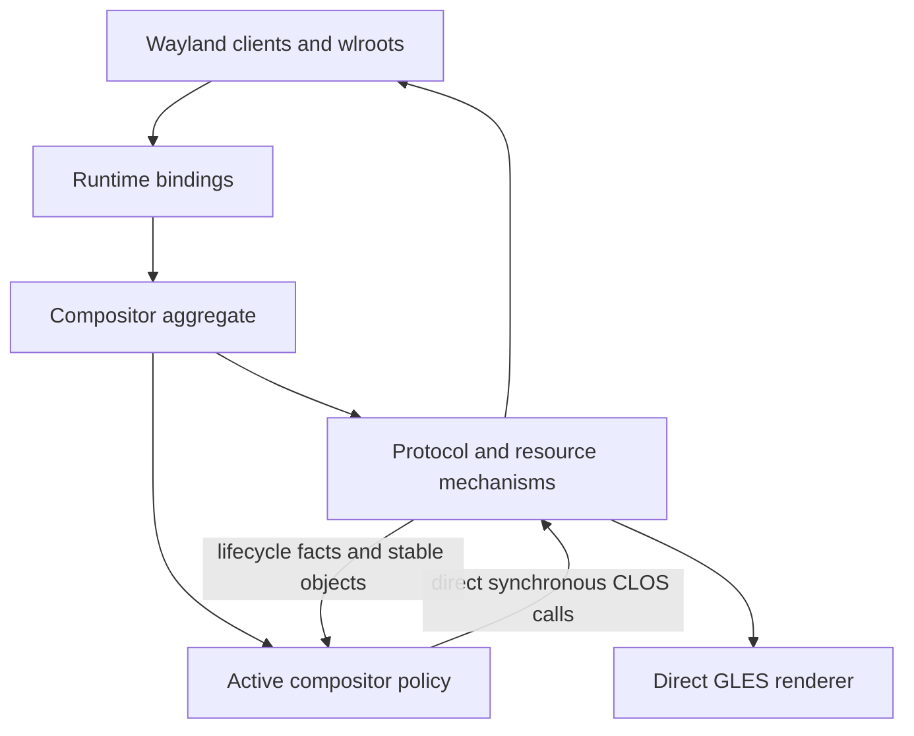
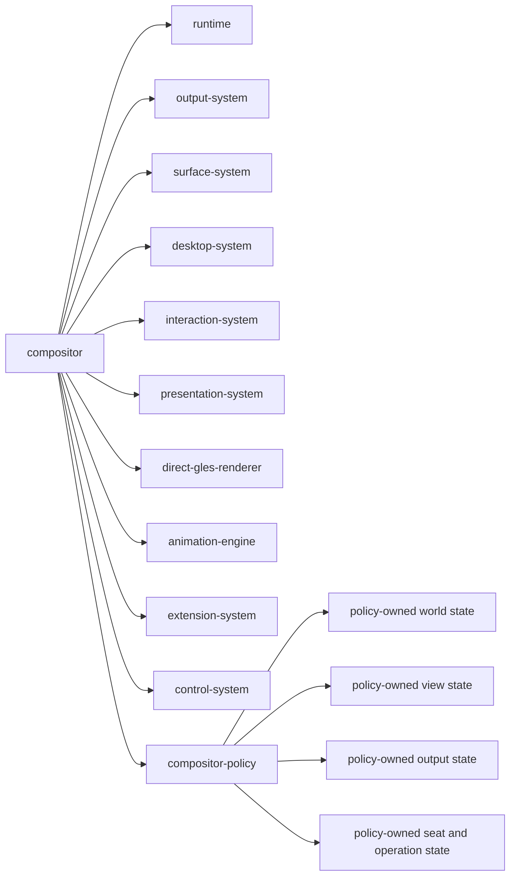
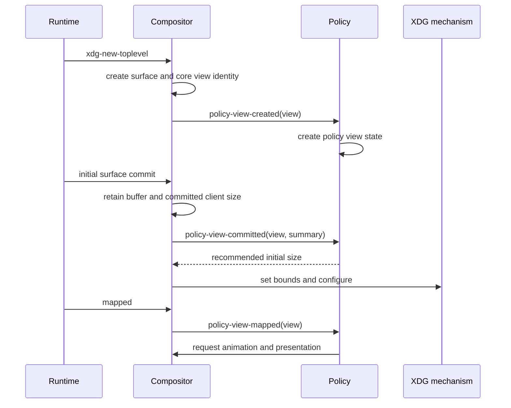
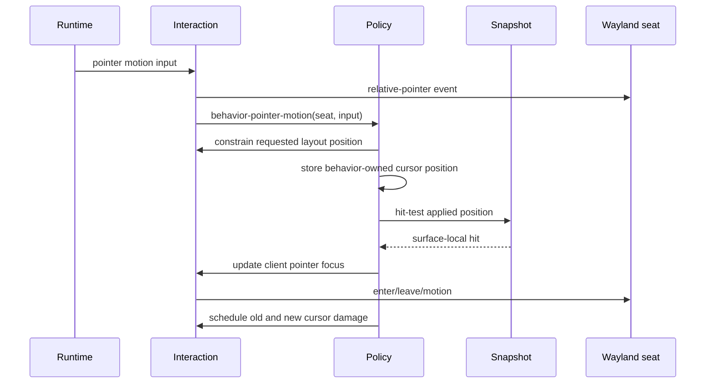
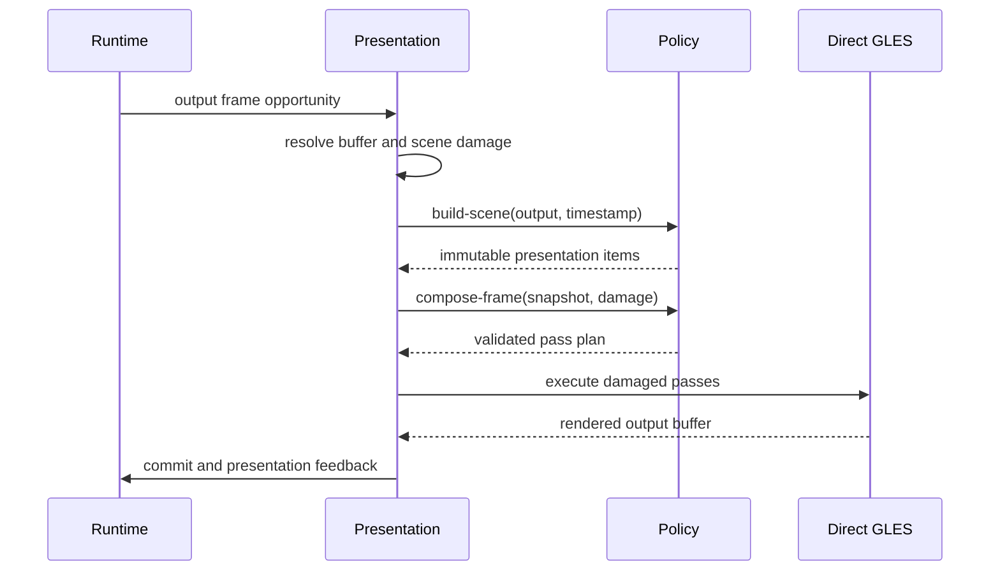
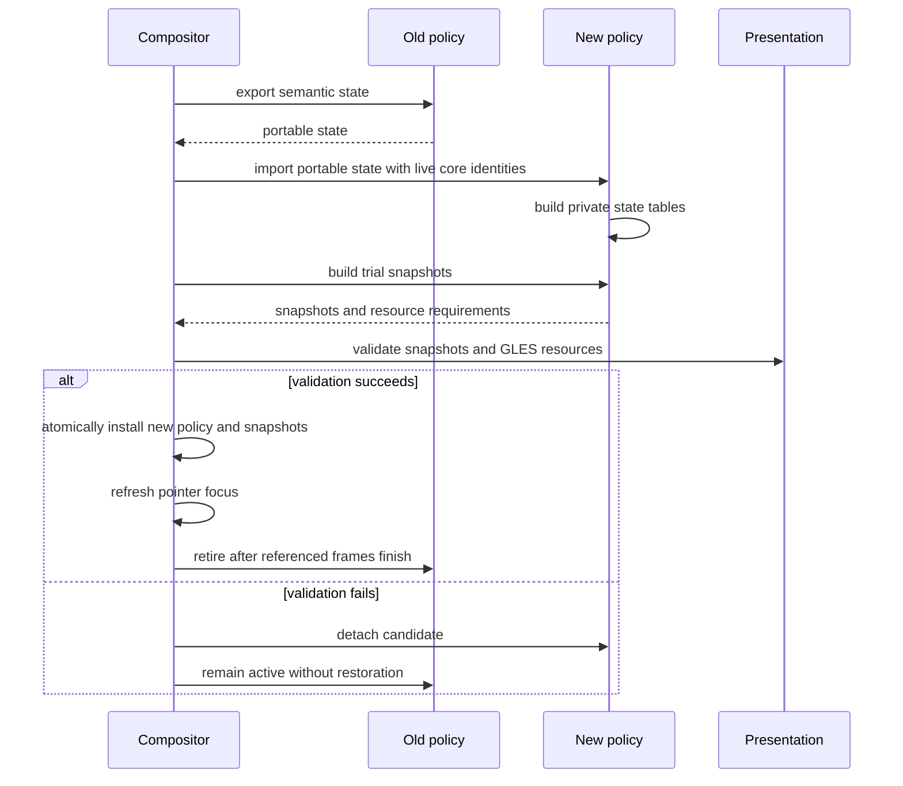

# Embedded Compositor Policy Design

## 1. Decision

Ataxia has one compositor architecture, not a compositor layer followed by a
behavior layer. The running `compositor` remains the aggregate root and owns one
replaceable `compositor-policy` object.

The policy is an in-process strategy used by the compositor. It is not another
runtime, service graph, actor, event bus, or owner of Wayland objects. It exists
to isolate the parts of the compositor that may legitimately change when the
workspace model changes.



The distinction is therefore:

- **Compositor mechanisms** preserve Wayland, wlroots, DRM, input, buffer,
  rendering, and security invariants.
- **Compositor policy** defines the world model and the user-visible meaning of
  those mechanisms.

The policy remains in Common Lisp, runs synchronously on the compositor owner
thread, and communicates with the compositor through ordinary CLOS calls. There
is no internal mailbox and no serialization between the compositor and policy.

## 2. Why the Policy Exists

Without a policy boundary, planar assumptions spread into view state, input,
damage, picking, animations, and rendering. Replacing an infinite plane with a
sphere would then require coordinated changes throughout the compositor.

The policy provides one replacement boundary for:

- fixed, tiled, infinite-planar, spherical, or task-oriented worlds;
- output cameras and projections;
- view placement and spatial indexing;
- the meaning of pointer gestures, movement, resizing, and camera navigation;
- decorations, panels, backgrounds, shadows, and other scene elements;
- per-view and global visual effects;
- animation selection;
- policy-specific agent commands and observations.

The policy does **not** exist to abstract every compositor operation. Creating a
seat, importing a client buffer, validating an XDG serial, scheduling a DRM
frame, or sending keyboard focus has only one correct mechanism and remains in
the compositor.

## 3. The Ownership Rule

Use this rule for every piece of state:

> If the state must remain meaningful when the active policy is removed, the
> compositor owns it. If its meaning changes with the world model, the policy
> owns it.

A second rule governs side effects:

> The behavior may mutate only behavior-owned state. It invokes compositor
> mechanisms synchronously through CLOS when it needs protocol mutation,
> damage, presentation, animation execution, or renderer resource registration.

The compositor validates and performs those effects. Behavior never calls
Runtime bindings and never executes GLES directly.

## 4. Ownership Matrix

| State or operation | Owner | Reason |
|---|---|---|
| Runtime, display, backend, event loop, EGL context | Compositor | Must survive policy changes and follows native lifetime rules |
| Native outputs, modes, scale, transform, swapchains | Compositor | Hardware and Wayland state |
| Surface trees, commits, buffers, textures, damage revisions | Compositor | Client-owned content and release ordering |
| Applications, XDG roles, titles, app IDs, map state | Compositor | Protocol identity independent of workspace geometry |
| Client logical width and height | Compositor | Authoritative XDG configuration and committed size |
| Maximize, minimize, fullscreen, activation request state | Compositor | Wayland-visible state, even when its presentation varies |
| Native seats, devices, capabilities, pressed keys/buttons | Compositor | Required for correct protocol delivery and serial validation |
| Keyboard and pointer focus | Compositor | Drives Wayland enter, leave, activation, and delivery |
| Client cursor surface, hotspot, and cursor role | Compositor | Wayland cursor protocol state |
| Device/output-space pointer position | Behavior controller | Cursor meaning and viewport interaction change with the world model; neutral coordinates migrate during replacement |
| Pointer constraints and relative-pointer delivery | Compositor | Protocol enforcement cannot be delegated |
| View placement in a world | Policy | Coordinates and dimensions are model-specific |
| Output camera or viewport | Policy | Meaning differs between plane, sphere, and other worlds |
| World-space pointer point, ray, or selection | Policy | Derived from the active projection |
| Active move, resize, gesture, or camera operation | Policy | Its state and mathematics depend on policy semantics |
| Stacking interpretation and spatial index | Policy | May be depth, layers, angular order, graph relations, or absent |
| Scene composition and decorations | Policy | User-visible choice, not a rendering invariant |
| Immutable presentation item types | Compositor | Shared render, damage, and hit-test contract |
| Scene items and mappings for a frame | Policy | Produced from the active world and style |
| Damage accumulation, frame pacing, and submission | Compositor | Correctness and DRM lifecycle mechanism |
| Animation clock, instances, sampling, cancellation | Compositor | Stable execution mechanism |
| Animation definitions and property selection | Policy | User-visible behavior that may vary per view |
| Shader compilation, GL object lifetime, render execution | Compositor | EGL/GLES resource ownership |
| Shader source and effect selection | Policy | Visual choice scoped to the policy |
| Authorization and external command transport | Compositor | Trust boundary and owner-thread crossing |
| Policy-specific command semantics | Policy | Changes the policy-owned world |

## 5. Compositor Object Graph

The compositor continues to own cohesive mechanism components. The policy is
one additional slot, not an independent system beside the compositor.



The behavior may be implemented across several files, but each concrete world
is one installed controller and one replacement unit.

## 6. Policy CLOS Shape

### 6.1 Base policy

The base object carries only lifecycle and revision state. Concrete controllers
own their seat tables and visual configuration. Core view and output identities
provide opaque behavior-state attachment slots that core never interprets.

```lisp
(defclass behavior-policy (compositor-component)
  ((active-p :initform nil :accessor behavior-policy-active-p)
   (revision :initform 0 :accessor behavior-policy-revision)))
```

Keeping the meaning of attached state inside the policy has three important
properties:

1. Portable migration contains no planar or spherical concrete type.
2. Candidate state can be validated before its attachments are installed.
3. Core code cannot inspect a planar or spherical state object.

Behavior state may reference stable core identity objects. It must not retain
transient Runtime callback objects or unowned native pointers.

### 6.2 Concrete controllers

Planar and spherical behaviors are independent monolithic controllers:

```lisp
(defclass planar-behavior-policy (behavior-policy)
  (...))

(defclass spherical-behavior-policy (behavior-policy)
  (...))
```

Both controllers own their complete world, viewport, cursor, operation, and
visual state. They may share fully contained stateless functions and macros,
but not stateful CLOS mixins or shared controller objects. Private caches remain
part of the owning concrete controller and have no independent lifecycle.

### 6.3 Method families

The policy protocol is divided into method families for auditability. These are
not separate runtime interfaces or independently installed services.

```text
policy lifecycle
policy world model
policy interaction meaning
policy scene composition
policy animation and effects
policy agent control
```

One concrete policy class implements all families. Stateless helper functions
may be shared when they do not impose state layout or world semantics.

## 7. Behavior-Owned Cursor State

The logical seat owns Wayland seat state, devices, pressed buttons, client
cursor surfaces, cursor hotspots, and focus. The active behavior owns the
cursor's current layout coordinates, output, and active operation:

```lisp
(defclass planar-seat-state ()
  ((cursor-x :accessor behavior-cursor-x)
   (cursor-y :accessor behavior-cursor-y)
   (cursor-output :accessor behavior-state-cursor-output)
   (operation :accessor behavior-seat-operation)))
```

Each concrete behavior has its own seat-state and operation classes. The table
is keyed by the stable core `logical-seat` identity.

The compositor owns:

- pointer confinement and locking;
- client surface-local coordinates derived from the rendered snapshot;
- enter, leave, motion, button, axis, and relative-pointer delivery;
- validation helpers for output bounds and pointer constraints;
- hit testing against the last rendered snapshot.

The behavior applies relative or absolute motion, uses compositor helpers to
enforce constraints, updates its state, drives its own operation mathematics,
requests client focus or resize, and schedules old/new cursor damage. Neutral
cursor coordinates and output identity migrate through `portable-seat-state`
when the controller is replaced.

No object allocation is required on the pointer-motion hot path. Multiple
values or a reusable per-seat result object are sufficient.

## 8. Policy Responsibilities

### 8.1 World model

The world family owns:

- placement types;
- camera and viewport types;
- spatial indexes;
- projection from policy coordinates to presentation geometry;
- inverse projection from output points to policy coordinates;
- movement, resizing, and restoration mathematics;
- policy-specific maximize and fullscreen geometry.

Projection and inverse projection are deliberately not core protocol methods.
Each concrete behavior keeps those algorithms private and returns compositor
presentation items, mappings, and client configure requests.

### 8.2 Interaction meaning

The interaction family decides:

- whether titlebar, frame, surface, background, or custom policy geometry
  consumes a button press;
- whether an input begins view movement, resizing, camera motion, selection, or
  another policy operation;
- how an active operation changes policy state;
- whether focus or stacking should change;
- which keyboard and pointer gestures are compositor commands;
- which inputs continue to the client.

The compositor still validates seats, object lifetime, focus relationships,
serials, session-lock state, input inhibition, and pointer constraints.

Interactive operations live in the policy because their state is world-model
specific:

```lisp
(defclass policy-operation ()
  ((seat :initarg :seat :reader operation-seat)
   (subject :initarg :subject :reader operation-subject)
   (button :initarg :button :reader operation-button)
   (started-at :initarg :started-at :reader operation-started-at)))
```

Planar and spherical subclasses may store completely different original
placements and update data.

### 8.3 Scene composition

The policy owns everything that determines what the desktop looks like:

- backgrounds and grids;
- view placement and geometry;
- decorations and resize frames;
- panels and overlays;
- shadows and elevation response;
- cursors and policy-specific indicators;
- per-view effects;
- full-output post-processing passes.

The compositor owns stable presentation types such as materials, meshes,
surface mappings, render passes, frame plans, and immutable snapshots. The
policy constructs instances of those types.

The same presentation item and mapping must be used for:

- GLES rendering;
- surface-local pointer mapping;
- hit testing;
- surface enter and leave calculation;
- projected surface damage.

This is required for curved or shader-transformed windows. A second independent
hit-test geometry is forbidden.

### 8.4 Animation and effects

The compositor animation engine owns only generic time and execution:

- active instance lifetime;
- sampling and easing;
- conflict resolution;
- cancellation;
- presentation scheduling while tracks are active;
- calling behavior methods with opaque bindings and sampled values.

The policy owns all animation meaning:

- default animation definitions;
- per-view overrides;
- interaction transitions;
- effect parameter bindings;
- reveal or disappearance styles;
- output-wide transition choices.
- binding preparation, application, conflict identity, and finalization.

Shader sources may be supplied by policy code or changed from the local Lisp
shell. Compilation and GL resource ownership remain compositor mechanisms. Programs
are scoped to the policy so failed compilation or replacement cannot corrupt
the renderer registry.

### 8.5 Agentic control

The control plane authenticates and authorizes every command before it reaches
the policy. Policy-specific commands then run synchronously at an owner-thread
safe point.

The policy may expose:

- semantic observations of world state;
- typed placement and camera commands;
- selection and focus recommendations;
- effect, shader, and animation configuration;
- policy replacement and migration options.

The policy may not expose native pointers or bypass core focus, configure,
rendering, or security mechanisms. An agent can replace a shader or world model
without gaining an accidental path around Wayland invariants.

## 9. Compositor-to-Policy Calls

The compositor invokes policy methods only after converting transient Runtime
callbacks into stable core objects or copied value inputs.

| Call family | Compositor supplies | Policy responsibility |
|---|---|---|
| Attach and activate | Compositor reference, existing objects, capability set | Initialize tables and resources |
| View created | Stable core view | Create policy view state and initial placement intent |
| View committed | Stable view and copied commit summary | Update world extent or constraints |
| View mapped or unmapped | Stable view and reason | Update visibility state and animation choice |
| View destroying | Stable view before core removal | Remove policy state and operations |
| Output added or changed | Stable output and copied geometry facts | Create or update camera state |
| Output removing | Stable output | Migrate or remove policy output state |
| Seat added or removing | Stable logical seat | Create or remove policy-only seat state |
| Validated XDG request | Stable view, seat, serial result, request values | Accept, ignore, or reinterpret geometry semantics |
| Pointer motion | Seat and copied motion input | Update behavior cursor state, operation, focus, and damage |
| Pointer action | Seat, immutable presentation hit, button or axis input | Consume, deliver, focus, or begin an operation |
| Keyboard action | Seat, modifiers, copied key input | Consume, deliver, or perform a policy command |
| Active operation update | Seat, behavior-owned operation, timestamp | Mutate private placement and request core effects |
| Scene build | Output, timestamp, immutable core model queries | Produce ordered presentation items |
| Frame composition | Snapshot, damage summary, timestamp | Produce a render-pass plan |
| Animation resolution | Subject and typed transition | Select a definition or no animation |
| Observation | Authorized request and core observation | Add policy-owned state |
| State export | Replacement context | Produce portable semantic state |
| State import | Portable state and live core identities | Construct candidate policy tables |

These calls are typed generics grouped by purpose. There is no single generic
event envelope containing arbitrary keywords.

## 10. Behavior-to-Compositor Calls

Behavior invokes compositor mechanisms directly through synchronous CLOS calls
on the owner thread. These calls are the architectural boundary; there is no
mailbox or separate Layer 3 runtime.

| Call | Effect owned by compositor |
|---|---|
| `focus-view` | Validate target, update logical focus, send Wayland focus and activation |
| `configure-view-size` | Validate size and send XDG configure |
| `set-view-resizing` | Send the XDG resizing state |
| `schedule-presentation` | Accumulate output, rectangular, or full damage and schedule a frame |
| `schedule-presentation-subject` | Damage retained and next coverage for a changed subject |
| `start-transition` | Start opaque tracks through the core animation executor |
| `cancel-animations-for-subject` | Cancel core-owned animation instances for a subject |
| `run-hook` | Invoke a typed extension point with compositor ordering |
| `replace-shader-program` | Compile and register a behavior-scoped GLES program |
| `release-shader-program-owner` | Retire programs owned by the behavior |

These are ordinary functions or generic functions. They do not enqueue work on
the owner thread. Core validates inputs, performs the effect where safe, and
returns the applied result.

The policy must not call Runtime bindings, bind EGL state, or issue GLES draws.

## 11. Representative Flows

### 11.1 New XDG toplevel



The core view exists without placement. The policy creates placement only after
it receives the stable core identity.

### 11.2 Pointer motion without an operation



### 11.3 Interactive move or resize

1. The compositor validates the XDG request or server-decoration hit.
2. The policy creates a policy-owned operation using its current world placement
   and cursor state.
3. The policy requests focus, resizing state, animation, and presentation
   through compositor calls.
4. Pointer motion updates behavior-owned cursor state after using core
   constraint helpers.
5. The behavior directly updates its active operation.
6. The policy mutates placement. For resize, it requests a client logical size
   through `configure-view-size`.
7. The compositor damages the subject's old snapshot bounds and new scene bounds.
8. Button release or cancellation ends the policy operation and clears the core
   resizing state through `set-view-resizing`.

The compositor never performs planar or spherical move mathematics. The policy
never sends an XDG configure directly.

### 11.4 Output frame



The policy may request an output-wide shader pass. The renderer validates the
program, target, texture, uniforms, and damage mode before execution.

## 12. Damage Contract

The compositor owns all damage history and frame scheduling. The policy provides
semantic invalidation, never backend frame state.

Supported invalidation forms are:

- a changed subject, causing the compositor to damage its bounds in the last
  snapshot and its bounds in the next snapshot;
- explicit output-local rectangles;
- full damage for one output;
- full damage for all outputs;
- continued presentation only while the core animation executor has active
  tracks requiring another sample.

Behavior never owns a continuous redraw loop. It requests discrete damage or
presentation when behavior-owned state changes and may add items or passes when
the compositor asks it to build a frame.

Surface commit damage is projected through the same presentation mapping used
for rendering and hit testing. If a mapping cannot provide conservative damage,
the compositor escalates to the containing item or output rather than accepting
missing pixels.

A policy operation that moves a view does not calculate exposed-region damage
itself. It identifies the changed subject; the compositor compares retained old
coverage against newly built coverage.

## 13. Direct GLES Contract

Ataxia targets a direct GLES renderer. The policy does not render by calling GL
inside arbitrary callbacks. It constructs renderer-neutral presentation items,
materials, meshes, and pass descriptions backed by compositor-managed GLES
programs.

The compositor renderer owns:

- EGL context binding;
- shader compilation and logs;
- program, texture, framebuffer, and buffer lifetimes;
- uniform validation;
- clipping and damage scissoring;
- output target acquisition and presentation;
- cleanup after failed policy replacement.

The policy owns:

- shader source and declared uniform interface;
- which views or outputs use a program;
- parameter values and animation bindings;
- ordering of allowed scene and post-processing passes.

This allows local agents to edit shaders freely while keeping the EGL and DRM
lifetime rules centralized.

## 14. Live Policy Replacement

Policy replacement is a compositor transaction performed at an owner-thread
safe point.



### 14.1 Portable state

Portable state contains semantic intent rather than native wrappers or concrete
placement instances. Examples include:

- view identity and visibility;
- normalized output anchor;
- preferred output;
- relative ordering or grouping;
- camera intent;
- normalized cursor position and output identity;
- per-view animation and effect configuration;
- agent metadata.

There is no universally correct plane-to-sphere placement conversion. Each
controller independently exports and imports neutral portable state; neither
concrete controller references the other's classes.

### 14.2 State that does not migrate through policy

The compositor retains these directly:

- native views, surfaces, outputs, seats, and devices;
- client committed size and XDG state;
- keyboard and pointer focus, subject to recalculation after the trial snapshot;
- retained buffers and textures;
- pending protocol obligations.

Active policy operations cancel by default. A pair of policies may explicitly
migrate an operation only when they agree on its meaning.

### 14.3 Frame retirement

Snapshots, animation bindings, and shader programs may reference the old policy.
They cannot be destroyed until all submitted frames that reference them have
retired. Policy resource ownership therefore uses a generation or reference
count tied to presentation completion.

## 15. Security and Failure Rules

The compositor may reject any policy request that violates:

- native object lifetime;
- seat or serial ownership;
- session lock;
- input inhibition;
- exclusive focus;
- protocol sequencing;
- output availability;
- renderer resource validity;
- finite coordinate and size requirements;
- configured capability limits.

Policy code runs locally and may be modified from the Lisp shell, but local trust
does not remove the need to contain mistakes. A policy error during a Runtime
callback must be caught at the compositor callback barrier. The compositor may
cancel the active operation, damage affected outputs, and preserve protocol
state rather than leaving a half-applied native mutation.

Trial policy activation fails atomically. An error in the candidate does not
mutate active policy tables or core objects.

## 16. Performance Rules

The policy boundary is not expected to be a measurable rendering bottleneck if
the following rules hold:

1. All calls remain direct and synchronous on one owner thread.
2. No mailbox, serialization, futures, or generic event envelopes exist between
   compositor and policy.
3. Pointer motion uses multiple values or reusable state rather than allocating
   CLOS decision objects per event.
4. CLOS dispatch occurs per view, input event, operation, scene item group, or
   render pass, never per pixel or mesh vertex.
5. Projection meshes, spatial indexes, shader programs, and scene fragments are
   cached by explicit revisions.
6. Input picks from the last immutable rendered snapshot.
7. Frame compilation produces compact arrays and render commands before GLES
   execution.
8. Policy tables use `eq` identity keys for live core objects.
9. External agent requests remain the only normal cross-thread queue.

The main cost is architectural complexity, not runtime dispatch. Keeping the
protocol small and authority-based is therefore more important than removing a
few generic-function calls.

## 17. Package and File Boundary

The protocol is owned by the compositor because it defines what policies may ask
the compositor to do. Implementations remain under `src/behavior`.

Recommended structure:

```text
src/compositor/
  behavior-protocol.lisp     typed behavior generics and portable value types
  compositor.lisp            lifecycle, callbacks, and policy replacement
  interaction.lisp           core devices, focus, constraints, input delivery
  presentation.lisp          snapshots, damage, frame scheduling
  graphics.lisp              direct GLES execution
  animation.lisp             opaque timing and track execution
  control.lisp               authorization and core actions

src/behavior/
  planar-policy.lisp         planar controller state and lifecycle
  planar.lisp                planar projection, input, scene, and operations
  spherical.lisp             complete spherical controller implementation
  interaction.lisp           stateless reusable algorithms only
  scene.lisp                 stateless scene construction helpers
  animation-bindings.lisp    behavior-owned binding types
  animation.lisp             concrete animation meaning and definitions
  control.lisp               behavior-specific command decoding and execution
  effects.lisp               policy-selected shader descriptions
  reveal.lisp                application reveal effect
```

The current implementation uses one Lisp package, so the boundary is enforced
by dependency direction and symbol review rather than package visibility.

## 18. Boundary Tests for New Features

Before assigning a feature to the compositor or policy, ask:

1. Does Wayland or DRM require this state even with no workspace policy?
   If yes, it belongs to the compositor.
2. Would planar and spherical implementations store different values or use
   different mathematics?
   If yes, it belongs to the policy.
3. Does the operation send protocol events, mutate native objects, configure a
   client, or touch GLES resources?
   If yes, the compositor performs it through a synchronous CLOS mechanism.
4. Is it a visual choice such as a shadow, bar, grid, transition, or shader?
   If yes, the policy selects it.
5. Must the state survive policy replacement unchanged?
   If yes, it belongs to the compositor.
6. Can it be rebuilt from stable core facts after replacement?
   If yes, it may remain policy state.

Examples:

| Feature | Placement |
|---|---|
| Fractional-scale protocol state | Compositor |
| How scale changes the spherical camera | Policy |
| Client cursor surface request | Compositor |
| Cursor trail or custom cursor shader | Policy scene choice |
| Pointer screen coordinates | Behavior controller |
| Pointer ray through a curved workspace | Policy |
| XDG resize configure | Compositor mechanism |
| Resize mathematics and visual pickup | Policy |
| Surface damage import | Compositor |
| Projection of damage through curved geometry | Shared presentation mapping produced by policy, executed by compositor |
| Output-wide motion corruption effect | Policy frame plan using compositor GLES resources |

## 19. Implemented Shape

The implementation now has one active behavior controller, direct owner-thread
CLOS dispatch, behavior-owned cursor and viewport state, independent planar and
spherical controllers, opaque core animation execution, immutable scene items,
behavior-specific control dispatch, direct GLES, discrete behavior redraw
requests, and transactional portable-state replacement.

## 20. Completion Criteria

The embedded policy boundary is complete when:

- the project describes one compositor with one policy, not two compositor
  layers;
- core files contain no planar or spherical coordinate assumptions;
- policy implementation files contain no direct Runtime or native calls;
- behavior never calls Runtime bindings or executes GLES;
- pointer state survives policy replacement through neutral portable state;
- active move and resize mathematics remain entirely policy-owned;
- replacement state uses neutral portable values and candidate installation
  maps;
- scene composition controls all optional chrome, shadows, backgrounds, and
  output effects;
- rendering, hit testing, and damage share one presentation mapping;
- direct GLES resource lifetime remains compositor-owned;
- live policy replacement can validate and fail without restoring mutated core
  objects;
- planar and spherical policies use the same compositor mechanisms and differ
  only in policy code.

This design preserves the reason for separation—replaceable world semantics—
without pretending that policy is an independent compositor layer.
