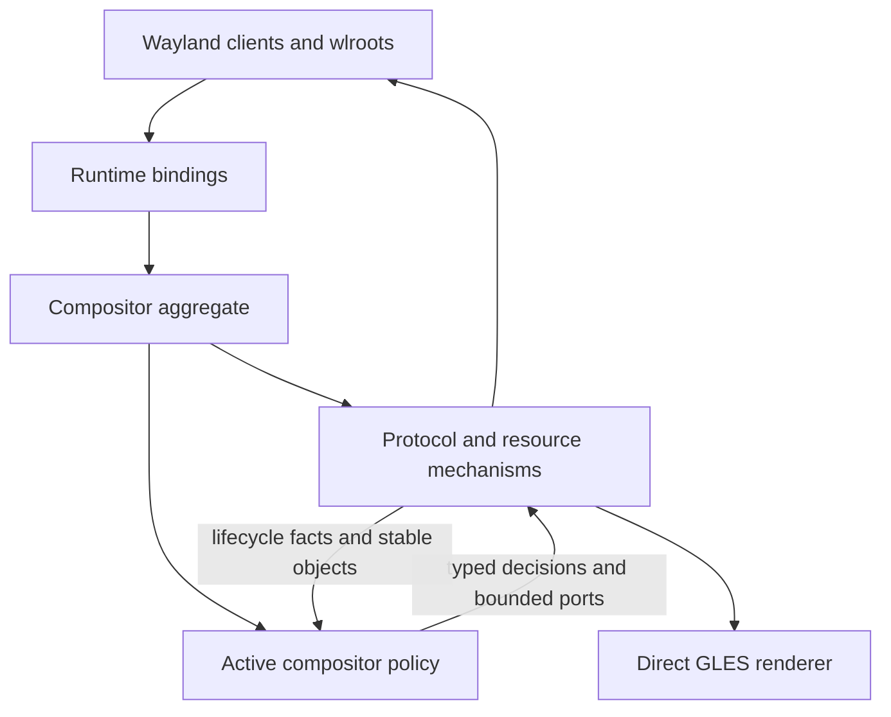
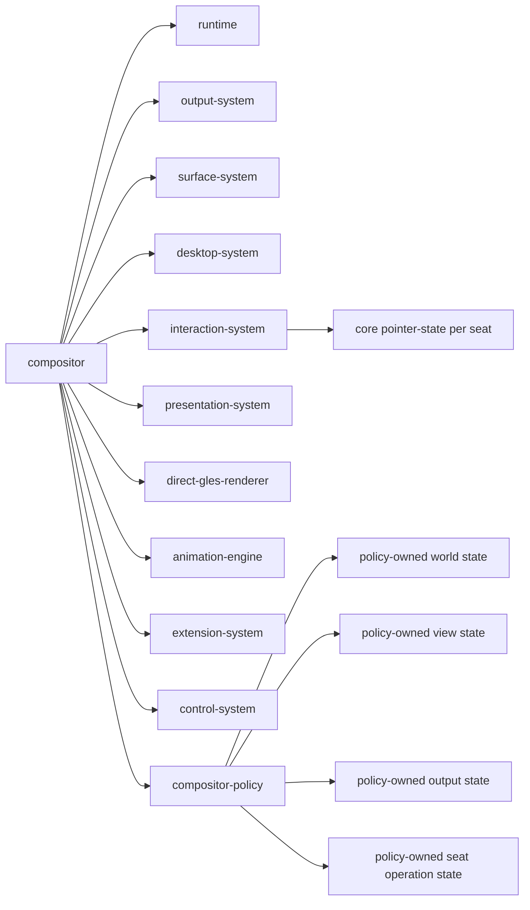
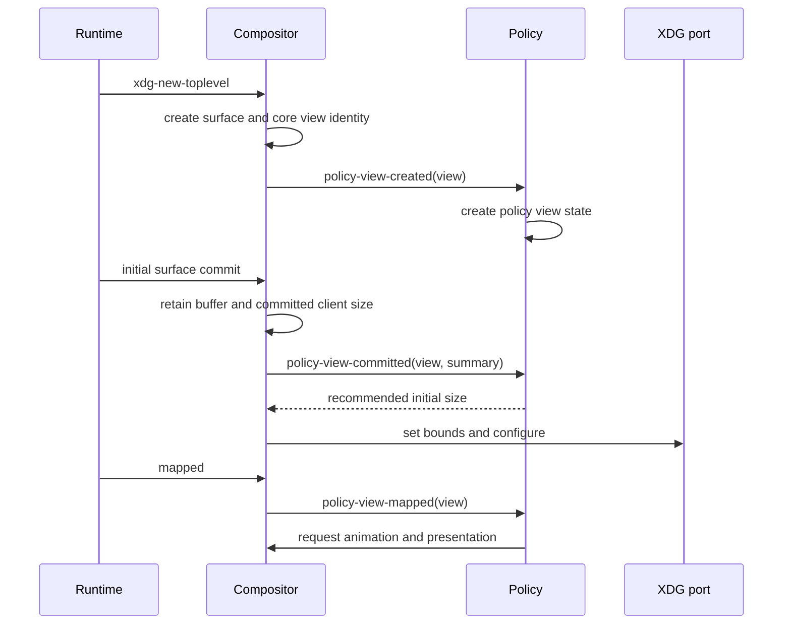
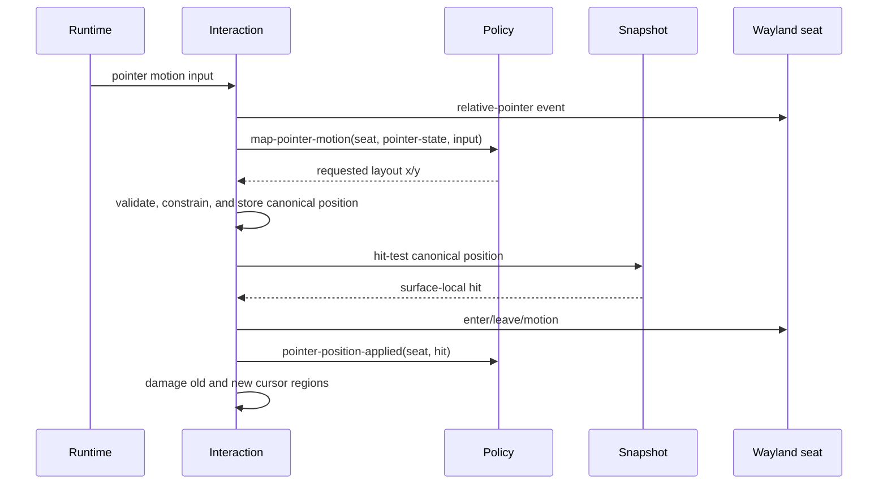
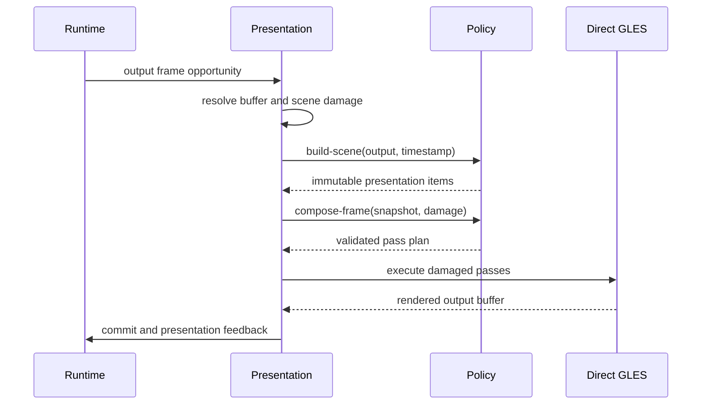
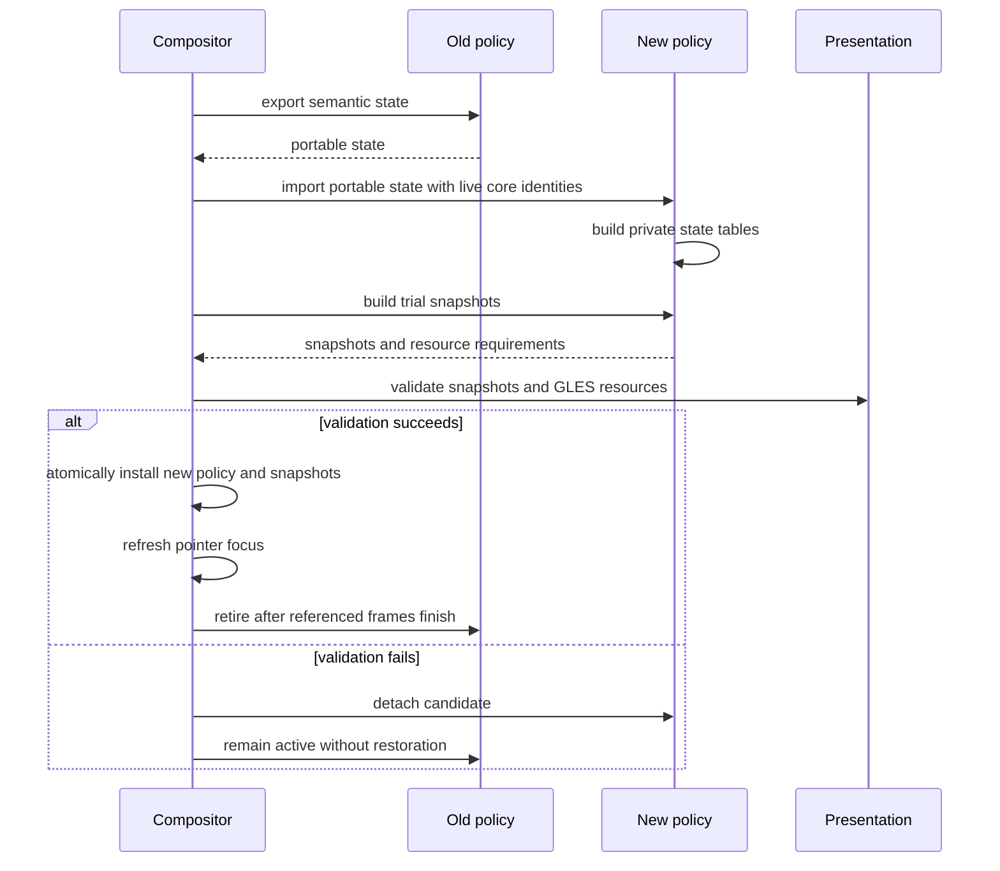

# Embedded Compositor Policy Design

## 1. Decision

Ataxia has one compositor architecture, not a compositor layer followed by a
behavior layer. The running `compositor` remains the aggregate root and owns one
replaceable `compositor-policy` object.

The policy is an in-process strategy used by the compositor. It is not another
runtime, service graph, actor, event bus, or owner of Wayland objects. It exists
to isolate the parts of the compositor that may legitimately change when the
workspace model changes.



The distinction is therefore:

- **Compositor mechanisms** preserve Wayland, wlroots, DRM, input, buffer,
  rendering, and security invariants.
- **Compositor policy** defines the world model and the user-visible meaning of
  those mechanisms.

The policy remains in Common Lisp, runs synchronously on the compositor owner
thread, and communicates with the compositor through ordinary CLOS calls. There
is no internal mailbox and no serialization between the compositor and policy.

## 2. Why the Policy Exists

Without a policy boundary, planar assumptions spread into view state, input,
damage, picking, animations, and rendering. Replacing an infinite plane with a
sphere would then require coordinated changes throughout the compositor.

The policy provides one replacement boundary for:

- fixed, tiled, infinite-planar, spherical, or task-oriented worlds;
- output cameras and projections;
- view placement and spatial indexing;
- the meaning of pointer gestures, movement, resizing, and camera navigation;
- decorations, panels, backgrounds, shadows, and other scene elements;
- per-view and global visual effects;
- animation selection;
- policy-specific agent commands and observations.

The policy does **not** exist to abstract every compositor operation. Creating a
seat, importing a client buffer, validating an XDG serial, scheduling a DRM
frame, or sending keyboard focus has only one correct mechanism and remains in
the compositor.

## 3. The Ownership Rule

Use this rule for every piece of state:

> If the state must remain meaningful when the active policy is removed, the
> compositor owns it. If its meaning changes with the world model, the policy
> owns it.

A second rule governs side effects:

> The policy may mutate only policy-owned state. The compositor is the sole
> writer of protocol state, native resources, client configuration, focus,
> damage queues, frame state, and renderer resources.

The policy can request those effects through explicit synchronous ports. The
port implementation performs validation and owns the mutation.

## 4. Ownership Matrix

| State or operation | Owner | Reason |
|---|---|---|
| Runtime, display, backend, event loop, EGL context | Compositor | Must survive policy changes and follows native lifetime rules |
| Native outputs, modes, scale, transform, swapchains | Compositor | Hardware and Wayland state |
| Surface trees, commits, buffers, textures, damage revisions | Compositor | Client-owned content and release ordering |
| Applications, XDG roles, titles, app IDs, map state | Compositor | Protocol identity independent of workspace geometry |
| Client logical width and height | Compositor | Authoritative XDG configuration and committed size |
| Maximize, minimize, fullscreen, activation request state | Compositor | Wayland-visible state, even when its presentation varies |
| Native seats, devices, capabilities, pressed keys/buttons | Compositor | Required for correct protocol delivery and serial validation |
| Keyboard and pointer focus | Compositor | Drives Wayland enter, leave, activation, and delivery |
| Client cursor surface, hotspot, and cursor role | Compositor | Wayland cursor protocol state |
| Device/output-space pointer position | Compositor interaction system | Persists across policy replacement and is required for client input |
| Pointer constraints and relative-pointer delivery | Compositor | Protocol enforcement cannot be delegated |
| View placement in a world | Policy | Coordinates and dimensions are model-specific |
| Output camera or viewport | Policy | Meaning differs between plane, sphere, and other worlds |
| World-space pointer point, ray, or selection | Policy | Derived from the active projection |
| Active move, resize, gesture, or camera operation | Policy | Its state and mathematics depend on policy semantics |
| Stacking interpretation and spatial index | Policy | May be depth, layers, angular order, graph relations, or absent |
| Scene composition and decorations | Policy | User-visible choice, not a rendering invariant |
| Immutable presentation item types | Compositor | Shared render, damage, and hit-test contract |
| Scene items and mappings for a frame | Policy | Produced from the active world and style |
| Damage accumulation, frame pacing, and submission | Compositor | Correctness and DRM lifecycle mechanism |
| Animation clock, instances, sampling, cancellation | Compositor | Stable execution mechanism |
| Animation definitions and property selection | Policy | User-visible behavior that may vary per view |
| Shader compilation, GL object lifetime, render execution | Compositor | EGL/GLES resource ownership |
| Shader source and effect selection | Policy | Visual choice scoped to the policy |
| Authorization and external command transport | Compositor | Trust boundary and owner-thread crossing |
| Policy-specific command semantics | Policy | Changes the policy-owned world |

## 5. Compositor Object Graph

The compositor continues to own cohesive mechanism components. The policy is
one additional slot, not an independent system beside the compositor.



The policy may be implemented across several files or through CLOS mixins. It
is still one installed object and one replacement unit.

## 6. Policy CLOS Shape

### 6.1 Base policy

The base object owns all replaceable state. Core view, output, and seat objects
do not contain active-policy payload slots.

```lisp
(defclass compositor-policy (compositor-component)
  ((view-states
    :initform (make-hash-table :test #'eq)
    :reader policy-view-states)
   (output-states
    :initform (make-hash-table :test #'eq)
    :reader policy-output-states)
   (seat-states
    :initform (make-hash-table :test #'eq)
    :reader policy-seat-states)
   (revision
    :initform 0
    :accessor policy-revision)
   (state
    :initform :detached
    :accessor policy-state)))
```

Keeping state inside the policy has three important properties:

1. A candidate policy can construct its complete state beside the active
   policy without mutating live core objects.
2. Failed migration can be discarded without restoring `view` or `output`
   slots one by one.
3. Core code cannot accidentally inspect a planar or spherical state object.

The policy tables may contain direct references to stable core identity objects.
They must not retain transient Runtime callback objects or unowned native
pointers.

### 6.2 Policy composition

Policies should normally use CLOS mixins rather than separately replaceable
components:

```lisp
(defclass standard-policy-mixin () (...))
(defclass planar-world-mixin () (...))
(defclass spherical-world-mixin () (...))
(defclass desktop-scene-mixin () (...))
(defclass direct-manipulation-mixin () (...))

(defclass planar-compositor-policy
    (standard-policy-mixin
     planar-world-mixin
     desktop-scene-mixin
     direct-manipulation-mixin
     compositor-policy)
  (...))

(defclass spherical-compositor-policy
    (standard-policy-mixin
     spherical-world-mixin
     desktop-scene-mixin
     direct-manipulation-mixin
     compositor-policy)
  (...))
```

This keeps method implementations in focused files while retaining one object,
one owner thread, direct calls, and atomic replacement. A policy may use private
helper objects for caches or algorithms, but they are not compositor components
and have no independent lifecycle.

### 6.3 Method families

The policy protocol is divided into method families for auditability. These are
not separate runtime interfaces or independently installed services.

```text
policy lifecycle
policy world model
policy interaction meaning
policy scene composition
policy animation and effects
policy agent control
```

One policy class may implement all families directly. Mixins may share default
implementations between policies.

## 7. Core Pointer State and Policy Pointer Meaning

Screen-space pointer state and policy-space pointer state have different
lifetimes and must not be combined.

### 7.1 Core pointer state

The interaction system owns one `pointer-state` per logical seat:

```lisp
(defclass pointer-state ()
  ((layout-x :accessor pointer-layout-x)
   (layout-y :accessor pointer-layout-y)
   (output :accessor pointer-output)
   (focused-surface :accessor pointer-focused-surface)
   (surface-x :accessor pointer-surface-x)
   (surface-y :accessor pointer-surface-y)
   (cursor-record :accessor pointer-cursor-record)
   (cursor-hotspot-x :accessor pointer-cursor-hotspot-x)
   (cursor-hotspot-y :accessor pointer-cursor-hotspot-y)))
```

This state may be stored in an `eq` table keyed by `logical-seat`; it does not
need to make `logical-seat` itself a large state object.

The compositor owns:

- output-layout coordinates;
- pointer confinement and locking;
- client surface-local coordinates derived from the rendered snapshot;
- enter, leave, motion, button, axis, and relative-pointer delivery;
- damage for the visible cursor image.

### 7.2 Policy pointer state

The policy may associate additional state with the same seat:

- a point on an infinite plane;
- a ray and sphere intersection;
- a selected task node;
- a camera-manipulation gesture;
- an active move or resize operation;
- snapping, inertia, or gesture recognizer state.

This state may be discarded or migrated when the policy changes. The physical
screen pointer remains where it was.

### 7.3 Pointer motion customization

The policy can still customize pointer movement without owning the canonical
coordinates. The compositor asks it to map raw device motion to a requested
layout position:

```lisp
(defgeneric policy-map-pointer-motion
    (policy seat pointer-state input))
```

The method returns requested `x` and `y` values as multiple values. It may apply
acceleration, nonlinear movement, camera-relative movement, or policy-specific
warping. The compositor then:

1. validates that the values are finite reals;
2. applies output-layout bounds;
3. enforces active pointer constraints;
4. stores the resulting canonical coordinates;
5. hit-tests the last rendered snapshot;
6. updates client focus and surface-local coordinates;
7. asks the policy to update any active policy operation;
8. damages the old and new cursor regions.

No object allocation is required on the pointer-motion hot path. Multiple
values or a reusable per-seat result object are sufficient.

## 8. Policy Responsibilities

### 8.1 World model

The world family owns:

- placement types;
- camera and viewport types;
- spatial indexes;
- projection from policy coordinates to presentation geometry;
- inverse projection from output points to policy coordinates;
- movement, resizing, and restoration mathematics;
- policy-specific maximize and fullscreen geometry.

Representative generics:

```lisp
(defgeneric policy-create-view-state (policy view))
(defgeneric policy-create-output-state (policy output))
(defgeneric policy-place-view (policy view request))
(defgeneric policy-project-view (policy output view timestamp))
(defgeneric policy-unproject-point (policy output x y))
(defgeneric policy-update-placement (policy view operation input))
(defgeneric policy-configure-view-for-output
    (policy view output mode))
```

The compositor never reads policy placement slots. It handles the resulting
presentation items and client configure requests.

### 8.2 Interaction meaning

The interaction family decides:

- whether titlebar, frame, surface, background, or custom policy geometry
  consumes a button press;
- whether an input begins view movement, resizing, camera motion, selection, or
  another policy operation;
- how an active operation changes policy state;
- whether focus or stacking should change;
- which keyboard and pointer gestures are compositor commands;
- which inputs continue to the client.

The compositor still validates seats, object lifetime, focus relationships,
serials, session-lock state, input inhibition, and pointer constraints.

Interactive operations live in the policy because their state is world-model
specific:

```lisp
(defclass policy-operation ()
  ((seat :initarg :seat :reader operation-seat)
   (subject :initarg :subject :reader operation-subject)
   (button :initarg :button :reader operation-button)
   (started-at :initarg :started-at :reader operation-started-at)))
```

Planar and spherical subclasses may store completely different original
placements and update data.

### 8.3 Scene composition

The policy owns everything that determines what the desktop looks like:

- backgrounds and grids;
- view placement and geometry;
- decorations and resize frames;
- panels and overlays;
- shadows and elevation response;
- cursors and policy-specific indicators;
- per-view effects;
- full-output post-processing passes.

The compositor owns stable presentation types such as materials, meshes,
surface mappings, render passes, frame plans, and immutable snapshots. The
policy constructs instances of those types.

The same presentation item and mapping must be used for:

- GLES rendering;
- surface-local pointer mapping;
- hit testing;
- surface enter and leave calculation;
- projected surface damage.

This is required for curved or shader-transformed windows. A second independent
hit-test geometry is forbidden.

### 8.4 Animation and effects

The compositor animation engine owns time and execution:

- active instance lifetime;
- sampling and easing;
- conflict resolution;
- cancellation;
- presentation scheduling while tracks are active;
- applying validated values to supported bindings.

The policy owns selection:

- default animation definitions;
- per-view overrides;
- interaction transitions;
- effect parameter bindings;
- reveal or disappearance styles;
- output-wide transition choices.

Shader sources may be supplied by policy code or changed from the local Lisp
shell. Compilation and GL resource ownership remain compositor ports. Programs
are scoped to the policy so failed compilation or replacement cannot corrupt
the renderer registry.

### 8.5 Agentic control

The control plane authenticates and authorizes every command before it reaches
the policy. Policy-specific commands then run synchronously at an owner-thread
safe point.

The policy may expose:

- semantic observations of world state;
- typed placement and camera commands;
- selection and focus recommendations;
- effect, shader, and animation configuration;
- policy replacement and migration options.

The policy may not expose native pointers or bypass core focus, configure,
rendering, or security ports. An agent can replace a shader or world model
without gaining an accidental path around Wayland invariants.

## 9. Compositor-to-Policy Calls

The compositor invokes policy methods only after converting transient Runtime
callbacks into stable core objects or copied value inputs.

| Call family | Compositor supplies | Policy responsibility |
|---|---|---|
| Attach and activate | Compositor reference, existing objects, capability set | Initialize tables and resources |
| View created | Stable core view | Create policy view state and initial placement intent |
| View committed | Stable view and copied commit summary | Update world extent or constraints |
| View mapped or unmapped | Stable view and reason | Update visibility state and animation choice |
| View destroying | Stable view before core removal | Remove policy state and operations |
| Output added or changed | Stable output and copied geometry facts | Create or update camera state |
| Output removing | Stable output | Migrate or remove policy output state |
| Seat added or removing | Stable logical seat | Create or remove policy-only seat state |
| Validated XDG request | Stable view, seat, serial result, request values | Accept, ignore, or reinterpret geometry semantics |
| Pointer mapping | Seat, core pointer state, copied motion input | Return requested output-layout position |
| Pointer action | Seat, immutable presentation hit, button or axis input | Consume, deliver, focus, or begin an operation |
| Keyboard action | Seat, modifiers, copied key input | Consume, deliver, or perform a policy command |
| Active operation update | Operation, canonical pointer state, timestamp | Mutate policy placement and request core effects |
| Scene build | Output, timestamp, immutable core model queries | Produce ordered presentation items |
| Frame composition | Snapshot, damage summary, timestamp | Produce a render-pass plan |
| Animation resolution | Subject and typed transition | Select a definition or no animation |
| Observation | Authorized request and core observation | Add policy-owned state |
| State export | Replacement context | Produce portable semantic state |
| State import | Portable state and live core identities | Construct candidate policy tables |

These calls are typed generics grouped by purpose. There is no single generic
event envelope containing arbitrary keywords.

## 10. Policy-to-Compositor Ports

The policy may perform compositor effects only through this bounded set of
synchronous ports.

| Port | Effect owned by compositor |
|---|---|
| `policy-request-focus` | Validate target, update logical focus, send Wayland focus and activation |
| `policy-request-raise-view` | Update canonical desktop ordering when the policy uses it |
| `policy-request-view-size` | Validate size, update authoritative client size, send XDG configure |
| `policy-request-resizing-state` | Send the XDG resizing state |
| `policy-request-toplevel-state` | Apply maximize, fullscreen, minimize, or activation protocol state |
| `policy-request-presentation` | Accumulate subject, output, rectangular, or full damage and schedule a frame |
| `policy-request-animation` | Start a typed transition through the core animation engine |
| `policy-cancel-animations` | Cancel core-owned animation instances for a subject |
| `policy-run-hook` | Invoke an allowed typed extension point with compositor ordering |
| `policy-install-shader` | Compile and register a policy-scoped GLES program |
| `policy-release-shaders` | Retire programs owned by the policy after frame safety checks |
| `policy-query-snapshot` | Obtain the immutable snapshot used for input and damage reasoning |

Ports are ordinary functions or generic functions. They do not enqueue work
when called on the owner thread. Each port asserts ownership, validates inputs,
performs the effect immediately where safe, and returns the applied result.

The policy must not call Runtime bindings, mutate core slots, or call renderer
implementation functions directly.

## 11. Representative Flows

### 11.1 New XDG toplevel



The core view exists without placement. The policy creates placement only after
it receives the stable core identity.

### 11.2 Pointer motion without an operation



### 11.3 Interactive move or resize

1. The compositor validates the XDG request or server-decoration hit.
2. The policy creates a policy-owned operation using the current world placement
   and canonical core pointer state.
3. The policy requests focus, resizing state, animation, and presentation
   through ports.
4. Pointer motion updates the core pointer first.
5. The compositor calls the policy operation update with the applied pointer
   state.
6. The policy mutates placement. For resize, it requests a client logical size
   through the configure port.
7. The compositor damages the subject's old snapshot bounds and new scene bounds.
8. Button release or cancellation ends the policy operation and clears the core
   resizing state through a port.

The compositor never performs planar or spherical move mathematics. The policy
never sends an XDG configure directly.

### 11.4 Output frame



The policy may request an output-wide shader pass. The renderer validates the
program, target, texture, uniforms, and damage mode before execution.

## 12. Damage Contract

The compositor owns all damage history and frame scheduling. The policy provides
semantic invalidation, never backend frame state.

Supported invalidation forms are:

- a changed subject, causing the compositor to damage its bounds in the last
  snapshot and its bounds in the next snapshot;
- explicit output-local rectangles;
- full damage for one output;
- full damage for all outputs;
- continuous presentation while a policy or animation requires another sample.

Surface commit damage is projected through the same presentation mapping used
for rendering and hit testing. If a mapping cannot provide conservative damage,
the compositor escalates to the containing item or output rather than accepting
missing pixels.

A policy operation that moves a view does not calculate exposed-region damage
itself. It identifies the changed subject; the compositor compares retained old
coverage against newly built coverage.

## 13. Direct GLES Contract

Ataxia targets a direct GLES renderer. The policy does not render by calling GL
inside arbitrary callbacks. It constructs renderer-neutral presentation items,
materials, meshes, and pass descriptions backed by compositor-managed GLES
programs.

The compositor renderer owns:

- EGL context binding;
- shader compilation and logs;
- program, texture, framebuffer, and buffer lifetimes;
- uniform validation;
- clipping and damage scissoring;
- output target acquisition and presentation;
- cleanup after failed policy replacement.

The policy owns:

- shader source and declared uniform interface;
- which views or outputs use a program;
- parameter values and animation bindings;
- ordering of allowed scene and post-processing passes.

This allows local agents to edit shaders freely while keeping the EGL and DRM
lifetime rules centralized.

## 14. Live Policy Replacement

Policy replacement is a compositor transaction performed at an owner-thread
safe point.



### 14.1 Portable state

Portable state contains semantic intent rather than native wrappers or concrete
placement instances. Examples include:

- view identity and visibility;
- normalized output anchor;
- preferred output;
- relative ordering or grouping;
- camera intent;
- per-view animation and effect configuration;
- agent metadata.

There is no universally correct plane-to-sphere placement conversion. Migration
dispatch may specialize on both source and destination policy classes. It may
require explicit options or reject a migration before activation.

### 14.2 State that does not migrate through policy

The compositor retains these directly:

- native views, surfaces, outputs, seats, and devices;
- client committed size and XDG state;
- device/output-space pointer positions;
- keyboard and pointer focus, subject to recalculation after the trial snapshot;
- retained buffers and textures;
- pending protocol obligations.

Active policy operations cancel by default. A pair of policies may explicitly
migrate an operation only when they agree on its meaning.

### 14.3 Frame retirement

Snapshots, animation bindings, and shader programs may reference the old policy.
They cannot be destroyed until all submitted frames that reference them have
retired. Policy resource ownership therefore uses a generation or reference
count tied to presentation completion.

## 15. Security and Failure Rules

The compositor may reject any policy request that violates:

- native object lifetime;
- seat or serial ownership;
- session lock;
- input inhibition;
- exclusive focus;
- protocol sequencing;
- output availability;
- renderer resource validity;
- finite coordinate and size requirements;
- configured capability limits.

Policy code runs locally and may be modified from the Lisp shell, but local trust
does not remove the need to contain mistakes. A policy error during a Runtime
callback must be caught at the compositor callback barrier. The compositor may
cancel the active operation, damage affected outputs, and preserve protocol
state rather than leaving a half-applied native mutation.

Trial policy activation fails atomically. An error in the candidate does not
mutate active policy tables or core objects.

## 16. Performance Rules

The policy boundary is not expected to be a measurable rendering bottleneck if
the following rules hold:

1. All calls remain direct and synchronous on one owner thread.
2. No mailbox, serialization, futures, or generic event envelopes exist between
   compositor and policy.
3. Pointer motion uses multiple values or reusable state rather than allocating
   CLOS decision objects per event.
4. CLOS dispatch occurs per view, input event, operation, scene item group, or
   render pass, never per pixel or mesh vertex.
5. Projection meshes, spatial indexes, shader programs, and scene fragments are
   cached by explicit revisions.
6. Input picks from the last immutable rendered snapshot.
7. Frame compilation produces compact arrays and render commands before GLES
   execution.
8. Policy tables use `eq` identity keys for live core objects.
9. External agent requests remain the only normal cross-thread queue.

The main cost is architectural complexity, not runtime dispatch. Keeping the
protocol small and authority-based is therefore more important than removing a
few generic-function calls.

## 17. Package and File Boundary

The protocol is owned by the compositor because it defines what policies may ask
the compositor to do. Implementations remain under `src/behavior`.

Recommended structure:

```text
src/compositor/
  policy-protocol.lisp       typed policy generics and value types
  policy-ports.lisp          validated compositor side-effect ports
  policy-replacement.lisp    migration, trial snapshots, atomic installation
  interaction.lisp           core devices, focus, constraints, pointer state
  presentation.lisp          snapshots, damage, frame scheduling
  graphics.lisp              direct GLES execution

src/behavior/
  base-policy.lisp           shared policy tables and lifecycle defaults
  standard-scene.lisp        background, chrome, cursor, and default composition
  standard-interaction.lisp  shared input meanings and operation lifecycle
  standard-animation.lisp    shared animation choices
  planar.lisp                planar world, camera, projection, and operations
  spherical.lisp             spherical world, camera, projection, and operations
  effects/                   policy-selected effects and shader descriptions
```

A small `ataxia.compositor.policy-api` package may expose the policy protocol and
ports to implementation packages. The package is owned by `src/compositor`; it
does not imply another runtime layer. Core implementation symbols remain
unexported so behavior code cannot accidentally depend on them.

If the project retains one Lisp package temporarily, the same dependency rule
must be enforced by file-level symbol review until the policy API package is
introduced.

## 18. Boundary Tests for New Features

Before assigning a feature to the compositor or policy, ask:

1. Does Wayland or DRM require this state even with no workspace policy?
   If yes, it belongs to the compositor.
2. Would planar and spherical implementations store different values or use
   different mathematics?
   If yes, it belongs to the policy.
3. Does the operation send protocol events, mutate native objects, configure a
   client, or touch GLES resources?
   If yes, the compositor performs it through a port.
4. Is it a visual choice such as a shadow, bar, grid, transition, or shader?
   If yes, the policy selects it.
5. Must the state survive policy replacement unchanged?
   If yes, it belongs to the compositor.
6. Can it be rebuilt from stable core facts after replacement?
   If yes, it may remain policy state.

Examples:

| Feature | Placement |
|---|---|
| Fractional-scale protocol state | Compositor |
| How scale changes the spherical camera | Policy |
| Client cursor surface request | Compositor |
| Cursor trail or custom cursor shader | Policy scene choice |
| Pointer screen coordinates | Compositor interaction system |
| Pointer ray through a curved workspace | Policy |
| XDG resize configure | Compositor port |
| Resize mathematics and visual pickup | Policy |
| Surface damage import | Compositor |
| Projection of damage through curved geometry | Shared presentation mapping produced by policy, executed by compositor |
| Output-wide motion corruption effect | Policy frame plan using compositor GLES resources |

## 19. Migration from the Current Design

The current implementation already has the essential pieces: one active policy,
direct CLOS dispatch, policy-owned world implementations, immutable scene items,
direct GLES, and transactional replacement. The required correction is a
boundary tightening rather than another rewrite.

Recommended order:

1. Rename the concept from `behavior-policy` to `compositor-policy` without
   changing runtime behavior.
2. Define and audit the allowed policy-to-compositor ports.
3. Move canonical pointer coordinates and cursor damage ownership into a core
   per-seat `pointer-state`; leave policy operations in policy state.
4. Move view, output, and seat policy payloads into tables owned by the policy.
5. Remove direct Runtime, renderer implementation, focus, hook, and native
   configure calls from behavior implementation files; route them through ports.
6. Move panel and titlebar dimensions into standard scene policy state.
7. Separate authoritative client size from policy presentation extent so each
   has one writer.
8. Group the policy protocol by authority and remove generics that merely expose
   core internals.
9. Change replacement to build candidate policy state entirely side by side.
10. Introduce the policy API package after the call graph matches the intended
    boundary.

Each step can be committed and validated independently. The compositor remains
usable throughout the migration.

## 20. Completion Criteria

The embedded policy boundary is complete when:

- the project describes one compositor with one policy, not two compositor
  layers;
- core files contain no planar or spherical coordinate assumptions;
- policy implementation files contain no direct Runtime or native calls;
- the policy cannot mutate core slots or renderer resources outside ports;
- screen pointer state survives policy replacement without policy migration;
- active move and resize mathematics remain entirely policy-owned;
- view, output, and seat policy state can be constructed beside the active
  policy;
- scene composition controls all optional chrome, shadows, backgrounds, and
  output effects;
- rendering, hit testing, and damage share one presentation mapping;
- direct GLES resource lifetime remains compositor-owned;
- live policy replacement can validate and fail without restoring mutated core
  objects;
- planar and spherical policies use the same compositor mechanisms and differ
  only in policy code.

This design preserves the reason for separation—replaceable world semantics—
without pretending that policy is an independent compositor layer.
