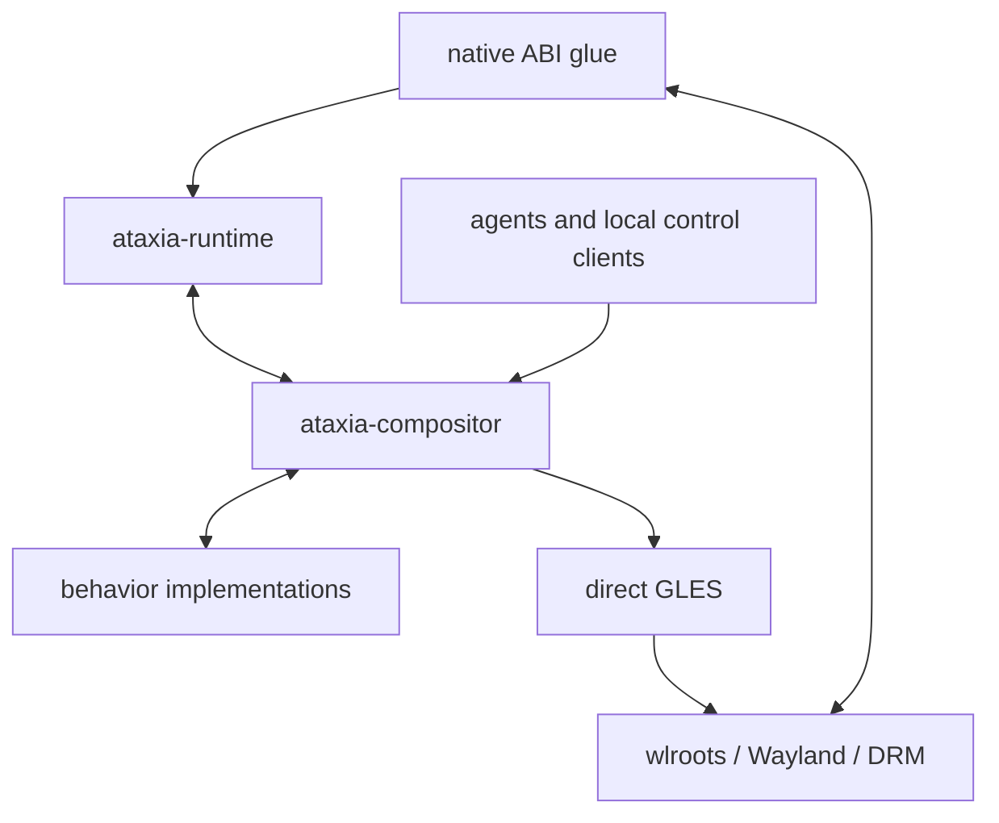

# Current Codebase Status

Implementation baseline reviewed: `f9d3c56`.

This document describes the code as it exists. It is not the target policy
design in `COMPOSITOR-POLICY-DESIGN.md`.

## 1. Executive Status

- The project is a bootable Common Lisp Wayland compositor using wlroots 0.20.2.
- Native C is limited to ABI accessors and listener glue.
- Runtime owns wlroots objects, callbacks, event-loop integration, and exact
  Wayland operations.
- The compositor owns surfaces, applications, outputs, seats, focus, damage,
  direct GLES rendering, animation execution, and external control.
- One replaceable behavior policy owns planar or spherical workspace semantics.
- Planar and spherical policies render through the same immutable presentation
  items used for hit testing and damage projection.
- Pointer, keyboard, XDG toplevel, popup, multiple-seat, move, resize, animation,
  shader, and control paths are implemented.
- The policy boundary remains transitional: behavior code is not yet the strict
  black box described in the current policy design.
- Protocol coverage is sufficient for common native clients such as Foot and
  Firefox, but many desktop protocols are not implemented.
- Validation is manual in the UTM guest; the repository has no automated test
  suite.

## 2. System Dependency Graph

All Runtime and compositor mutation occurs on the Wayland owner thread. Only
external control submissions use a queue.

## 3. Build and System Modules

| Module | Obligation | Interactions | Status |
|---|---|---|---|
| `ataxia.asd` | Stable aggregate system | Depends on `ataxia-compositor` | Complete |
| `ataxia-runtime.asd` | Load Runtime in dependency order | Depends only on CFFI | Complete |
| `ataxia-compositor.asd` | Load compositor foundation, policy, rendering, interaction, services | Depends on Runtime and CFFI | Complete; load order reflects current cross-module dependencies |
| `Makefile` | Build `libataxia-wlr-glue.so` against pinned wlroots | Used by both run scripts | Complete for Linux/wlroots 0.20 |
| `scripts/run-runtime` | Configure library paths, build glue, launch Runtime | Calls `launch-runtime.lisp` | Complete |
| `scripts/run-compositor` | Configure direct GLES environment, build glue, launch compositor | Calls `launch-compositor.lisp` | Complete |
| `scripts/launch-runtime.lisp` | Register ASDF trees and invoke Runtime CLI | Loads `ataxia-runtime` | Complete |
| `scripts/launch-compositor.lisp` | Register ASDF trees and invoke compositor CLI | Loads `ataxia-compositor` | Complete; comments retain old “Layer 2” terminology |

## 4. Native ABI Glue

| Module | Obligation | Interactions | Status |
|---|---|---|---|
| `native/ataxia-wlr-glue.h` | Declare version-pinned signal accessors, field readers, event readers, and listener cells | Consumed through CFFI raw bindings | Complete for implemented wlroots objects |
| `native/ataxia-wlr-glue.c` | Perform direct public-structure access that CFFI cannot express safely | Reads wlroots/libwayland fields; calls one Lisp listener trampoline | Complete; contains no compositor policy |

The glue ABI is versioned as `7`; Runtime rejects an incompatible shared object.
The expected wlroots version is `0.20.2`.

## 5. Runtime Modules

Runtime is the native mechanism boundary. It exposes typed wrappers and exact
protocol-specific sink generics; it does not define workspace behavior.

### `src/runtime/packages.lisp`

- Defines private `ataxia.runtime.raw` and public `ataxia.runtime` packages.
- Exports typed native objects, copied event values, lifecycle callbacks, and
  exact outbound protocol operations.
- Keeps raw CFFI symbols out of compositor code.

### `src/runtime/conditions.lisp`

- Defines native-call, ownership, dead-object, callback, and lifecycle failures.
- Used by every Runtime module and reported by both CLIs.

### `src/runtime/raw.lisp`

- Loads libwayland-server, wlroots, and the native glue library.
- Verifies glue ABI and wlroots version.
- Declares direct C functions shared by Runtime modules.
- Has no object ownership or listener policy.

### `src/runtime/objects.lisp`

- Defines typed wrappers for display, event loop, backend, renderer, EGL,
  allocator, outputs, devices, surfaces, seats, and compositor globals.
- Defines copied pointer, keyboard, cursor, surface-commit, and damage values.
- Defines `runtime-sink` generics used by `compositor`.
- Converts transient wlroots callback data into Lisp values before dispatch.
- Owns native wrapper liveness and pointer invalidation.

### `src/runtime/listeners.lisp`

- Maps one native listener cell to one Lisp dispatcher.
- Tracks listener ownership and deferred destruction.
- Enters and leaves the Runtime callback barrier around every callback.
- Records callback faults and requests orderly Runtime shutdown rather than
  unwinding through C.

### `src/runtime/runtime.lisp`

- Owns the display, backend, renderer, EGL context, allocator, globals, native
  wrapper tables, event sources, retained buffers, subscriptions, and safe
  points.
- Creates auto or headless backends and an optional Wayland socket.
- Adopts new outputs, inputs, surfaces, and seats.
- Dispatches the libwayland event loop on the owner thread.
- Exposes the currently published protocol capability list.
- Coordinates construction and reverse-order destruction.

### `src/runtime/event-loop.lisp`

- Wraps Wayland FD, timer, signal, and idle event sources.
- Runs callbacks inside the Runtime callback barrier.
- Used by compositor control wakeups, output pacing timers, and deferred frame
  presentation.

### `src/runtime/subsurface.lisp`

- Discovers `wlr_subsurface` objects below adopted surfaces.
- Tracks parent, child, applied offsets, synchronization, and destruction.
- Reports exact lifecycle changes to the compositor.
- Does not assign world-space coordinates.

### `src/runtime/input.lisp`

- Creates XKB contexts and keymaps from names.
- Installs keyboard keymaps and repeat information.
- Used by compositor logical-seat device assignment.
- Does not implement bindings, shortcuts, or focus policy.

### `src/runtime/render.lisp`

- Retains committed client buffers and exposes wlroots textures.
- Extracts GLES target, texture name, size, and alpha information.
- Sends surface enter, leave, and frame-done events.
- Provides scoped access to the wlroots-owned EGL context.
- Used by compositor surface retention and direct GLES rendering.

### `src/runtime/output.lisp`

- Initializes output rendering against Runtime renderer and allocator.
- Wraps output modes, temporary output states, swapchains, buffer acquisition,
  framebuffer lookup, test, commit, and frame scheduling.
- Copies output damage and presentation events before sink dispatch.
- Leaves layout, damage policy, pacing policy, and scene rendering to the
  compositor.

### `src/runtime/presentation-protocols.lisp`

- Publishes viewporter, fractional-scale, and presentation-time globals.
- Sends preferred fractional scale and attaches presentation feedback.
- Used by surface-output membership and output commit paths.

### `src/runtime/xdg-shell.lisp`

- Publishes XDG shell.
- Wraps toplevels and popups with exact commit, map, unmap, destroy, identity,
  move, resize, maximize, minimize, fullscreen, and reposition callbacks.
- Exposes configure, bounds, capabilities, activation, resizing, and popup
  operations.
- Delegates all placement and focus decisions to the compositor sink.

### `src/runtime/desktop-shell-protocols.lisp`

- Publishes XDG decoration and activation globals.
- Wraps decoration objects and copies activation requests.
- Compositor selects decoration mode and activation target behavior.

### `src/runtime/pointer-protocols.lisp`

- Publishes relative-pointer and pointer-constraints globals.
- Wraps constraint lifetime, region changes, confinement, locked state, and
  cursor-position hints.
- Compositor interaction owns focus matching and presentation-coordinate
  mapping.

### `src/runtime/main.lisp`

- Provides a diagnostic Runtime-only executable.
- Creates the baseline protocol globals and an empty default seat.
- Does not render a desktop or implement policy.

## 6. Compositor Foundation Modules

### `src/compositor/packages.lisp`

- Defines one `ataxia.compositor` package for core and behavior code.
- Exports compositor, policy, scene, animation, interaction, and control APIs.
- Raw GLES entrypoints remain private.
- Current single-package design does not enforce the intended policy boundary.

### `src/compositor/conditions.lisp`

- Defines compositor state, graphics, hook, and control failures.
- Keeps Runtime foreign-pointer details below the compositor boundary.

### `src/compositor/core.lisp`

- Defines the component base class and aggregate readers.
- Enforces the compositor owner-thread invariant.
- Defines damage boxes, typed transition descriptors, operation contexts, input
  values, and decision values.
- Owns the client-size and XDG resizing primitives used by policy code.
- Supplies shared types to hooks, animation, control, interaction, and policy.

### `src/compositor/hooks.lisp`

- Implements ordered synchronous hook points with priority and limits.
- Provides component-replacement, interaction, and animation observations.
- Required compositor communication does not depend on hooks.

### `src/compositor/model.lisp`

- `surface-system` owns retained buffers, textures, subsurface indexes, and
  effective commit state.
- `desktop-system` owns applications, views, popups, and stacking order.
- `view` owns XDG identity, authoritative logical size, lifecycle flags, and a
  behavior-state slot.
- Refreshes buffer source rectangles and transforms for presentation materials.
- Sends surface enter/leave through presentation membership reconciliation.

### `src/compositor/behavior-protocol.lisp`

- Defines the current replaceable behavior-policy contract.
- Defines behavior view, placement, presentation, portable, and installation
  state objects.
- Declares 53 generics covering lifecycle, cursor, interaction, world geometry,
  scene construction, animation, observation, and migration.
- Connects every compositor mechanism to the active policy.
- Current interface is broader and more reentrant than the target black-box
  policy design.

## 7. Compositor Mechanism Modules

### `src/compositor/animation.lisp`

- Owns animation definitions, tracks, instances, timing, sampling, conflicts,
  cancellation, and completion.
- Supports opacity, scale, offsets, shader uniforms, and behavior-defined
  property bindings.
- Delegates definition resolution to the active behavior policy.
- Schedules presentation while active instances remain.

### `src/compositor/graphics.lisp`

- Owns direct GLES initialization and GL object lifetime.
- Compiles solid, texture, external-texture, and generic shader programs.
- Registers policy-scoped shader variants and per-view shader selection.
- Draws rectangle and mesh presentation geometry.
- Maintains retained per-output scene targets for partial repaint.
- Executes scene and present passes; never uses `wlr_scene`.
- All normal output frames are composited; direct scanout is not implemented.

### `src/compositor/presentation.lisp`

- Owns compositor outputs, horizontal output layout, swapchains, pacing timers,
  pending-frame state, snapshots, frame plans, materials, mappings, and hits.
- Builds each snapshot by asking the behavior policy for scene items.
- Uses the same immutable items for GLES rendering, hit testing, surface-local
  coordinate mapping, output membership, and projected damage.
- Coalesces damage boxes; escalates to full output after 64 boxes.
- Tracks subject damage so moves repaint old and new coverage.
- Defers actual rendering to an event-loop idle source and refresh timer.
- Acquires a scanout-compatible buffer, executes direct GLES, tests and commits
  output state, sends feedback and frame-done, then retires damage.
- Provides a damage-debug mode that marks regions not submitted for repaint.

### `src/compositor/interaction.lisp`

- Owns logical seats, native seats, device assignment, keyboard state, pressed
  buttons, client cursor surfaces, focus, and pointer constraints.
- Supports multiple logical seats and reassignment of live devices.
- Sends keyboard, pointer, axis, frame, relative-pointer, and focus events.
- Uses the last presentation snapshot for pointer hit and surface coordinates.
- Delegates cursor position, move/resize operations, and input meaning to the
  active behavior policy.
- Enforces pointer grab serials and pointer constraints through presentation
  mappings.

## 8. Behavior Implementation Modules

All behavior files currently use `ataxia.compositor` and can access compositor
internals directly.

### `src/behavior/standard-policy.lisp`

- Defines shared policy lifecycle and default pass-through input behavior.
- Defines planar placement, viewport, view state, and default planar policy.
- Owns policy seat-state tables and policy revision.
- Handles initial placement, size recommendation, pan, zoom, and state copying.
- Exports and imports view, output, and seat state for live policy replacement.
- Stores behavior view/output payloads back into core view/output slots.

### `src/behavior/effects.lisp`

- Defines soft-shadow shader source, style parameters, and material generation.
- Supports per-view animated effect parameters such as elevation.
- Registers its shader through compositor graphics.
- Used by planar and spherical view scene builders.

### `src/behavior/reveal.lisp`

- Defines the codec-corruption/datamosh-inspired application reveal shader.
- Provides sampler-2D and external-texture variants.
- Generates per-view random corruption parameters and animation tracks.
- Restores the previous view shader after reveal completion or cancellation.

### `src/behavior/animation.lisp`

- Selects default appearance, disappearance, pickup, resize, and settle
  animations.
- Resolves per-window overrides before shared defaults.
- Maps interaction state to scale and shadow-elevation tracks.
- Leaves clocks and sampling in the core animation engine.

### `src/behavior/interaction.lisp`

- Owns current per-seat cursor coordinates, cursor output, and active operation.
- Converts relative and absolute device motion into layout coordinates.
- Confines pointer coordinates through compositor output and constraint helpers.
- Defines move/resize begin, update, cancel, focus, hooks, animation, and damage
  behavior.
- Calls compositor focus, XDG resizing, client-size, presentation, hook, and
  animation mechanisms directly.
- This is the largest current mismatch with the target black-box policy model.

### `src/behavior/scene.lisp`

- Assembles shared surface trees, subsurfaces, popups, background, panel, and
  all logical-seat cursor items.
- Freezes shader uniform values into frame items.
- Supplies the default two-pass scene/present frame plan.
- Reads titlebar and panel dimensions from `presentation-system`.

### `src/behavior/planar.lisp`

- Projects planar placement through a per-output camera and scale.
- Builds decorated root surfaces, child surfaces, popups, shadows, and resize
  hit frames.
- Implements planar move and resize mathematics.
- Implements maximize/fullscreen placement, restore, explicit move, focus raise,
  and policy observations.

### `src/behavior/spherical.lisp`

- Defines angular placement and a per-output spherical camera.
- Projects views onto curved triangle meshes and maps output points back to
  surface coordinates.
- Builds curved root surfaces, subsurfaces, popups, shadows, and mappings.
- Implements spherical move, resize, pan, zoom, maximize/fullscreen, restore,
  observations, and mesh caching.
- Implements bidirectional planar/spherical state migration.
- Serves as the proof that presentation and input do not require planar geometry.

## 9. Compositor Service Modules

### `src/compositor/control.lisp`

- Defines principals, capabilities, typed actions, completion state, and the
  bounded cross-thread queue.
- Uses `eventfd` to wake the Wayland event loop.
- Executes actions only on the compositor owner thread.
- Supports observe, focus, move, place, seat create/destroy, device assignment,
  policy replacement, pan, zoom, launch, animation, shader, and damage-debug
  actions.
- Exposes core and behavior observations without evaluating arbitrary code.

### `src/compositor/control-transport.lisp`

- Publishes a mode-0600 Unix-domain socket.
- Accepts bounded newline-delimited Lisp data with `*read-eval*` disabled.
- Derives peer PID/UID/GID and maps requests to typed control actions.
- Sends structured success or failure responses with request IDs.
- Extends action and placement decoding through generics.

### `src/compositor/compositor.lisp`

- Defines the aggregate root and constructs every component.
- Implements the complete Runtime sink for output, input, surface, subsurface,
  XDG, decoration, activation, and pointer-constraint callbacks.
- Creates XDG, desktop-shell, pointer, data-device, and presentation globals.
- Coordinates cross-component lifecycle and shutdown ordering.
- Applies XDG initial configure, maximize, minimize, fullscreen, popup, and
  decoration operations.
- Starts visibility animations and presentation invalidation.
- Implements live behavior-policy replacement with state migration, trial
  snapshots, resource validation, focus refresh, hooks, and rollback.
- Launches applications with the compositor Wayland socket environment.

### `src/compositor/main.lisp`

- Parses backend, headless size, duration, launch, socket, wlroots debug, and
  damage-debug options.
- Creates, starts, runs, and destroys the compositor.
- Prints `WAYLAND_DISPLAY` and `CONTROL_SOCKET` for clients and agents.

## 10. Principal Runtime Flows

### Construction

1. Launcher builds native glue and loads the ASDF system.
2. `create-compositor` creates Runtime with the compositor as sink.
3. The compositor constructs and attaches policy, renderer, output, surface,
   desktop, extensions, presentation, interaction, and control components.
4. Runtime protocol globals are created.
5. The default logical seat `seat0` is created.
6. Runtime starts the backend and dispatches the Wayland event loop.

### Surface and View Lifecycle

1. Runtime adopts a `wlr_surface` and copies commit state and effective damage.
2. `surface-system` retains the latest client buffer and texture metadata.
3. XDG toplevel creation creates a core application/view and policy view state.
4. Policy recommends initial size and placement; compositor sends XDG configure.
5. Map/unmap updates core lifecycle, policy lifecycle, focus, animations, and
   presentation damage.
6. Destruction cancels animations and operations, removes desktop identity, and
   releases retained content.

### Pointer Motion and Interaction

1. Runtime copies the native motion event.
2. Interaction resolves the logical seat and sends relative-pointer motion.
3. Behavior updates policy-owned cursor coordinates.
4. Compositor helpers enforce output bounds and pointer constraints.
5. Without an active operation, interaction hit-tests the last snapshot and
   sends Wayland pointer focus/motion.
6. With an active operation, planar or spherical behavior updates placement and
   may request client resize.
7. Old/new cursor and subject coverage are scheduled for presentation.

### Output Frame and Damage

1. Runtime reports output damage, needs-frame, frame, and present events.
2. Presentation merges surface, subject, cursor, animation, and explicit damage.
3. Policy builds a new immutable scene snapshot and frame plan.
4. Graphics updates damaged scene regions and presents the retained scene.
5. Runtime attaches the buffer and damage to a temporary output state.
6. Output state is tested and committed.
7. Presentation feedback, enter/leave, frame-done, revision, and pacing state are
   updated.

### Live Policy Replacement

1. Active move/resize operations are cancelled.
2. Old policy exports view, output, and seat state.
3. Candidate policy imports and migrates that state.
4. Core temporarily installs candidate state into live objects.
5. Candidate snapshots and GLES resources are validated.
6. On success, pointer focus is refreshed and the old policy detaches.
7. On failure, old state, snapshots, and policy are restored.

### External Control

1. A thread submission or socket request creates a typed action.
2. Capability checks run before state mutation.
3. `eventfd` or the socket source wakes the owner thread.
4. The action calls the same compositor and policy methods used by local input.
5. Results or failures return through completion state or socket response.

## 11. Implemented Protocol and Feature Coverage

### Published protocol families

- `wl_compositor` and `wl_subcompositor`;
- renderer buffer factories;
- XDG shell toplevels and popups;
- basic data-device manager;
- viewporter;
- fractional scale;
- presentation time;
- XDG decoration;
- XDG activation;
- relative pointer;
- pointer constraints;
- dynamically created `wl_seat` globals;
- native output globals.

### Implemented compositor features

- auto and headless backends;
- multiple horizontally arranged outputs;
- direct GLES composition;
- retained client buffers and transformed/cropped sampling;
- partial surface and scene damage;
- planar and spherical worlds;
- multiple logical seats and multiple rendered cursors;
- keyboard and pointer focus;
- client cursor surfaces;
- XDG move, resize, maximize, minimize, fullscreen, decorations, and activation;
- nested subsurfaces and XDG popups;
- pointer locking and confinement over affine or mesh mappings;
- per-window animations, shaders, uniforms, and behavior effect parameters;
- behavior-owned shadows, panel, background, and reveal effect;
- live planar/spherical replacement;
- local agent control and observation;
- damage visualization.

## 12. Current Limitations

### Policy boundary

- The active object is still named `behavior-policy`, not `compositor-policy`.
- Core and behavior share one package.
- Behavior receives raw Runtime event objects in several methods.
- Behavior directly calls focus, configure, renderer, hook, animation, and
  presentation mechanisms.
- View and output policy payloads are stored in core objects.
- Cursor layout position is policy-owned even though it survives policy changes.
- The interface is a large family of generics rather than a strict facts-in,
  intentions-out black box.

### Protocol coverage

The source does not currently implement:

- layer shell;
- session lock;
- idle inhibit;
- screencopy or output capture;
- foreign toplevel management;
- output management or XDG output;
- text input or input method;
- primary selection or data control;
- tablet, touch, switch, or gesture routing beyond device recognition;
- gamma control, color management, HDR, or explicit synchronization;
- DRM leasing;
- Xwayland.

### Rendering and output

- All frames use compositing; direct scanout is absent.
- Output layout is a simple horizontal arrangement.
- Scene composition still receives panel and titlebar sizes from core
  presentation state.
- No general render-graph resource dependency model exists beyond current scene
  and present passes.
- Damage correctness has conservative full-output fallbacks.

### Desktop behavior

- Only planar and spherical policies exist.
- No tiling policy, fixed-workspace policy, or task/graph policy exists.
- Default keyboard and axis behavior is pass-through; no compositor shortcut
  binding system is implemented.
- The panel is visual only; it has no task controls or text rendering.
- Clipboard manager policy is absent beyond publishing the data-device global.

### Project quality

- No automated tests are present by explicit project decision.
- Current validation is compilation plus manual UTM execution.
- Several older design documents describe removed `world` components or old
  “Layer 2” ownership and should not be treated as implementation truth.
- The codebase has no generated API reference; this document and source headers
  are the current status map.

## 13. Documentation Authority

Use documents in this order:

1. Source code and ASDF load order: implementation truth.
2. `CURRENT-CODEBASE-STATUS.md`: concise current implementation map.
3. `COMPOSITOR-POLICY-DESIGN.md`: intended policy-boundary direction.
4. `WLROOTS-COMPOSITOR-INTERFACE.md`: Runtime/compositor boundary design.
5. Older compositor plans: historical rationale; some object names are stale.
