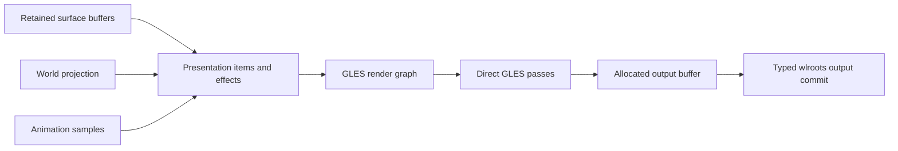

# Direct GLES and Shader Animation Design

Status: planning only. Direct EGL/GLES rendering is the implementation target.

## 1. Decision

Ataxia targets a renderer implemented in Common Lisp with direct EGL/GLES calls
and wlroots interoperability. wlroots continues to own backend discovery,
allocator/output integration, buffer lifetime, DRM/KMS, and presentation facts.
Ataxia owns shader programs, render graphs, geometry, effects, animation
parameters, offscreen targets, damage expansion, and draw submission.

The wlroots render-pass API may be used by diagnostics or a fallback profile,
but it is not the target renderer and does not define the common graphics
contract.

Shader animation is first-class. A view, cursor, overlay, world projection, or
transition may attach arbitrary trusted shader effects and animate their
parameters. Local agents and the trusted Lisp shell may create, edit, compile,
activate, replace, and remove shader programs and animation definitions.

## 2. Responsibility Boundary

The animation engine owns:

- transition resolution;
- clocks, timelines, springs, curves, and interruption;
- per-subject animation definitions;
- typed parameter tracks;
- effect activation and blending weights;
- presentation invalidation.

The presentation engine owns:

- selecting visible compositor objects;
- world/camera projection;
- frame-local geometry and hit mappings;
- ordered effect stacks;
- conservative damage;
- old/new content relationships required by transitions.

The GLES renderer owns:

- EGL context and current-target dynamic extent;
- shader compilation/linking and program caches;
- buffer/texture import interoperability;
- framebuffer and offscreen target pools;
- uniform, vertex, index, and instance buffers;
- render-graph lowering and pass execution;
- GPU fences and resource retirement;
- renderer capability and failure reporting.

No animation object issues raw GLES calls. No shader determines compositor
focus, placement, security policy, or native object lifetime.

## 3. CLOS Effect Model

```lisp
(defclass shader-program-descriptor ()
  ((vertex-source :initarg :vertex-source :reader program-vertex-source)
   (fragment-source :initarg :fragment-source :reader program-fragment-source)
   (defines :initarg :defines :reader program-defines)
   (required-capabilities :initarg :required-capabilities
                          :reader program-required-capabilities)))

(defclass shader-program ()
  ((descriptor :initarg :descriptor :reader shader-program-descriptor)
   (native-program :initarg :native-program :reader shader-native-program)
   (uniform-layout :initarg :uniform-layout :reader shader-uniform-layout)
   (state :initform :live :accessor shader-program-state)))

(defclass render-effect () ())

(defclass shader-effect (render-effect)
  ((program :initarg :program :reader effect-program)
   (uniform-bindings :initarg :uniform-bindings
                     :reader effect-uniform-bindings)
   (texture-inputs :initarg :texture-inputs :reader effect-texture-inputs)
   (geometry-policy :initarg :geometry-policy :reader effect-geometry-policy)
   (damage-policy :initarg :damage-policy :reader effect-damage-policy)
   (hit-policy :initarg :hit-policy :reader effect-hit-policy)
   (passes :initarg :passes :reader effect-passes)))
```

The core does not enumerate allowed shader effects or uniforms. Plugins may
define additional `render-effect`, binding, pass, mesh, and texture-input
classes.

## 4. Animation Bindings

An animation definition may drive ordinary presentation state and arbitrary
effect parameters:

```lisp
(defclass shader-uniform-binding ()
  ((effect :initarg :effect :reader binding-effect)
   (uniform :initarg :uniform :reader binding-uniform)
   (value-type :initarg :value-type :reader binding-value-type)))

(defgeneric apply-animation-sample
    (binding subject sample presentation-item))
```

Examples include:

- opacity, scale, elevation, blur radius, and shadow parameters;
- wobble amplitude/frequency and grabbed-point anchor;
- page-curl progress and fold geometry;
- dissolve threshold and procedural seed;
- old/new texture blend progress;
- mesh spring positions;
- spherical/world projection parameters;
- particle emission and simulation parameters;
- color, mask, displacement, and chromatic effects.

Two views may resolve different programs and bindings for the same typed
operation transition. A view may replace its animation policy from the Lisp
shell without changing the animation engine.

## 5. New View Presentation

A raw `wlr_surface` creation does not start a visual animation. Animation begins
only after the shell has a view with a valid role, placement, logical size, and
renderable committed buffer.

```text
surface/role creation
    -> first renderable commit
    -> view becomes presentable
    -> shell supplies typed presentation-state transition
    -> per-view animation resolution
    -> effect stack and animation instance
    -> first GLES frame
```

The view is placed at its authoritative final world placement. Creation effects
normally animate presentation-only state such as opacity, scale, transform,
mask, distortion, elevation, or particles. They do not send XDG configure events
on each visual frame.

## 6. Interactive Pickup and Release

Pickup is not a hard-coded animation keyword. The shell creates an
`interactive-operation` containing the seat, view, initiating serial, grabbed
surface-local point, starting placement, and current placement. It passes the
typed operation-state transition to animation resolution.

The resolved definition may attach a perspective, deformation, shadow, or
multi-pass effect. Authoritative placement follows pointer/world input directly;
the effect animates presentation state around it.

Scaling or deformation must preserve the grabbed anchor under the pointer. The
presentation item therefore carries the grabbed surface-local point into the
geometry/effect bindings. Operation completion resolves another typed state
transition; policy may settle, reverse, blend, or replace the active effect.

## 7. Frame and Render Graph



A frame may contain direct draws and multi-pass subgraphs. Example:

```text
surface texture
    -> horizontal blur target
    -> vertical blur target
    -> displacement/mesh pass
    -> color/composite pass
    -> output target
```

The renderer compiles effect/pass descriptors into a reusable execution plan.
Frame sampling updates uniform/instance data and submits passes; it does not
compile programs or discover uniform locations.

## 8. Buffer and Texture Lifetime

An effect using current client content retains the exact surface buffer snapshot
for the frame. A transition requiring old content has two options:

1. retain the old buffer while its native lifetime permits; or
2. copy it once into a compositor-owned GLES texture and release the client
   buffer.

Closing animations use compositor-owned textures when the client/surface may be
destroyed before the animation completes. Old/new-content transitions explicitly
retain both inputs until the final submitted frame releases them.

Texture, framebuffer, and program destruction occurs on the GLES context-owning
thread at an outermost safe point after every frame/fence reference is released.

## 9. Geometry and Hit Testing

Every shader effect declares one hit-mapping mode:

- `input-transform-preserving`: color/opacity/mask effect does not change
  interactive geometry;
- `shared-mesh`: CPU presentation and GLES use the same deformed mesh;
- `inverse-mapping`: the effect supplies output-to-surface mapping;
- `non-interactive`: the item cannot receive pointer input during the effect.

An arbitrary vertex shader may not secretly move pixels while input continues
to use an unrelated rectangle. Wobbly, curled, spherical, or otherwise deformed
interactive content uses shared mesh data or an explicit inverse mapping in the
frame-local presentation snapshot.

## 10. Damage Contract

Every effect supplies conservative output-local damage:

```lisp
(defgeneric effect-damage
    (effect previous-sample current-sample projected-bounds output))
```

- blur/shadow expands by sampling radius;
- displacement expands by maximum displacement;
- old/new transitions union both projected bounds;
- particles report a bounded emission/simulation region;
- unknown or unbounded effects damage the full output;
- temporal effects remain dirty while active.

Geometry animation damages previous and current bounds. Damage is clipped and
coalesced by the output manager, then combined with per-output-buffer history.
Shader effects normally veto direct scanout unless a concrete hardware path can
produce the same result.

## 11. Trusted Agent and Lisp-Shell Control

Local agents and the trusted Lisp shell may:

- create and edit vertex/fragment shader source;
- define program descriptors, passes, effects, tracks, and policies;
- compile/link candidate programs;
- inspect compiler/linker logs;
- attach effects to individual views or profiles;
- replace live shader programs and animation definitions;
- edit uniform values and timelines while animations run;
- remove effects and restore renderer defaults.

Shader access is intentionally trusted and unrestricted by a remote-style shader
sandbox. Operational containment still applies so a syntax/link error does not
destroy compositor state:

1. create a candidate descriptor;
2. compile and link with the GLES context current;
3. validate required attributes, uniforms, framebuffer formats, and capabilities;
4. retain the old live program if candidate preparation fails;
5. swap the effect/program reference at an owner-thread safe point;
6. retire the old program after in-flight frames release it.

The initial implementation compiles/links on the owner thread at a safe point.
A later shared EGL compilation context may move compilation to a worker, but a
worker without a current compatible context cannot compile GLES programs.

## 12. GLES Interoperability Target

The direct renderer uses wlroots mechanisms without adopting the wlroots
render-pass policy surface:

- allocator/backend APIs provide scanout-compatible output buffers;
- the pinned wlroots/EGL APIs provide or interoperate with the EGL display and
  context;
- client SHM/DMA-BUF buffers are imported into GLES-compatible images/textures;
- Ataxia binds output buffers as GLES render targets;
- Ataxia executes its own shaders, meshes, passes, and compositing;
- the completed buffer is placed into an exact `wlr_output_state`;
- wlroots tests/commits it and reports presentation/release facts.

The exact GLES version, EGL extensions, DMA-BUF import path, and synchronization
extensions are selected after capability probing against the pinned wlroots
release. This does not reopen the renderer choice: direct GLES remains the
target.

## 13. Failure and Recovery

- compilation/link failure leaves the previous program active;
- missing capability selects an explicitly configured fallback definition or
  reports the effect unavailable;
- framebuffer/pass failure aborts the frame before output commit;
- output commit failure retains damage and schedules recovery;
- context loss invalidates GLES resources and enters renderer recovery/shutdown;
- surface destruction cancels or snapshots effects that retain its content;
- shader/effect replacement never mutates an in-flight frame plan.

Because shader authors and agents are trusted local principals, GPU resets or
resource exhaustion caused by arbitrary shader code are accepted local risks.
The compositor still records diagnostics and attempts controlled renderer
recovery where the driver permits it.

## 14. Performance Rules

1. Compile/link outside the frame path.
2. Cache programs and compiled effect graphs by descriptors.
3. Resolve uniform layouts before activation.
4. Reuse uniform, vertex, index, framebuffer, and texture storage.
5. Batch compatible presentation items and effect passes.
6. Bound active effects, intermediate targets, pass count, and retained textures
   for stability rather than remote-code isolation.
7. Track CPU preparation, GPU pass time, target allocation, damaged area, and
   animation sample cost.
8. Fall back to full-output damage when effect bounds are uncertain.

## 15. Package Additions

- `ataxia.gles`: EGL/GLES typed bindings and context discipline;
- `ataxia.render.gles`: renderer, resources, render graph, execution;
- `ataxia.render.effects`: effect/pass/geometry/damage protocols;
- `ataxia.animation.bindings`: typed model/presentation/uniform bindings;
- `ataxia.shader-control`: trusted agent and Lisp-shell shader operations.

These packages call direct binding APIs and are wired into the compositor's
renderer, presentation, animation, and control components. They do not introduce
an internal message bus or a second graphics host abstraction.

## 16. Invariants

1. Direct GLES is the target renderer.
2. wlroots retains backend/allocator/output/DRM ownership.
3. Animation samples parameters; the renderer owns GPU execution.
4. Shader effects are selectable per view and per typed operation transition.
5. Geometry deformation supplies matching hit-test information or is explicitly
   non-interactive.
6. Effects provide conservative damage or force full-output damage.
7. Old/new textures have explicit retained lifetimes.
8. Program replacement prepares a candidate before safe-point activation.
9. Local trusted agents and the trusted Lisp shell may modify shader code and
   definitions.
10. No program compilation or resource discovery occurs in the frame inner loop.
