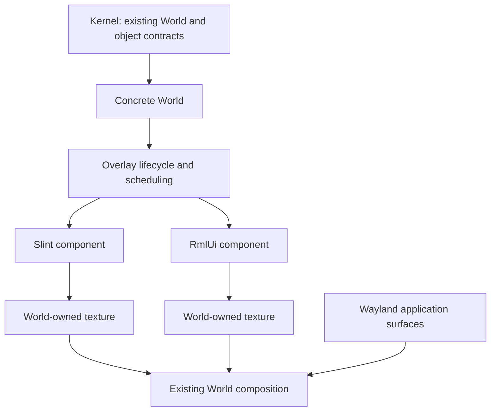

# HTML/CSS UI alongside Slint

RmlUi is an optional World-owned UI backend. Slint and RmlUi components can be
used simultaneously in the same World. Kernel contracts and dependencies are
unchanged; the shared lifecycle, sizing, and scheduling operations live in
`ataxia-world`.

## Build and load

The native adapter requires a C++17 compiler, CMake 3.19+, Python 3, pkg-config,
FreeType, libpng, xkbcommon, and GLES development libraries. Its effects renderer
requires an **OpenGL ES 3.0 or newer current context**, checked when graphics are
attached. Ataxia still requests its existing GLES2-compatible context; drivers
that only provide ES2 cannot use this optional backend. The Intel/Mesa setup used
for validation provides ES3.2.

```sh
make rmlui
make test-rmlui
```

CMake downloads RmlUi 6.3 at commit
`ba95ffe8bfb6370efb2cdcca927eaad4710c5413` and verifies its archive SHA-256.
The backend is deliberately separate from `make all`. The library is
`build/libataxia-rmlui-native.so`; `ATAXIA_RMLUI_NATIVE` can override that path.

```lisp
(asdf:load-system "ataxia-rmlui")

;; Run creation and all later component operations on the World owner thread.
(ataxia.sly-control:agent-apply
 (lambda (kernel world)
   (declare (ignore kernel))
   (ataxia.world.rmlui:make-rmlui-widget
    world
    "<rml><head><style>
       body { margin:0; font-family:DejaVu Sans; font-size:16dp; }
       button { padding:12dp; background:#85e6bd; color:#132820; }
     </style></head><body><button id='apply'>Apply</button></body></rml>"
    :x 64d0 :y 100d0 :width 320d0 :height 180d0
    :callbacks '("apply")))
 :refresh :world-managed)
```

An RmlUi widget uses the same `ataxia.world:agent-widget` class as Slint, so
lookup, configuration, removal, event history, and event-stream functions work
through `ataxia.world`. `ataxia.world.slint:make-agent-widget` creates Slint
components. Both engines work with any World implementing the shared UI host
protocol; see [World services](WORLD-SERVICES.md).

## Example

[The example panel](../examples/rmlui-panel.rml) uses flexbox, custom properties,
a gradient, rounded corners, shadows, hover transitions, and a finite animation.
[Its Lisp behavior](../examples/rmlui-panel.lisp) binds theme, animation, and close
buttons without JavaScript.

```lisp
(asdf:load-system "ataxia-rmlui")
(load (asdf:system-relative-pathname "ataxia-rmlui" "examples/rmlui-panel.lisp"))
(ataxia.sly-control:agent-apply
 (lambda (kernel world)
   (declare (ignore kernel))
   (ataxia.world.rmlui::show-rmlui-demo world))
 :refresh :world-managed)
```

When loading code into an already running compositor, perform the system load
on its owner thread as well. If that process predates the new ASD file, first
register it with `(asdf:load-asd (asdf:system-relative-pathname "ataxia-world"
"ataxia-rmlui.asd"))`. This refreshes ASDF discovery without touching the World.

## Authoring and Lisp API

RML/RCSS is an HTML/CSS subset, not a browser engine. Flexbox, custom properties,
selectors, transitions, transforms, and keyframe animations are available.
There is no CSS Grid, JavaScript runtime, or compatibility promise for React or
arbitrary web UI packages. See [RmlUi's conformance description](https://github.com/mikke89/RmlUi).

Use `dp` for dimensions that should scale with the widget, and percentages for
responsive layout. RmlUi `px` denotes physical document pixels. The adapter sets
RmlUi's pixel ratio to the World-selected raster scale and translates input into
the same coordinates. RmlUi does not install browser default tag styles: declare
`div, h1, p { display: block; }` where wanted, as the example does. Some property
syntaxes differ from CSS; refer to the
[RCSS property index](https://mikke89.github.io/RmlUiDoc/pages/rcss/property_index.html).

| Operation | Behavior |
| --- | --- |
| `make-rmlui-component` | Create a drawable/interactable from `:source`, `:source-path`, logical size, and scale |
| `make-rmlui-widget` | Attach it to a World implementing the UI host protocol; accepts the usual widget geometry/options |
| `set-rmlui-property component id value` | Set escaped text, or the value of a form control, by element ID; strings, numbers, and booleans are accepted |
| `set-rmlui-model component name value` | Set a string, number, or boolean in the component's `state` data model |
| `rmlui-model-value component name` | Read its current string representation, including form edits |
| `set-rmlui-class component id class enabled` | Toggle a class and invalidate the component |
| `set-rmlui-style component id property value` | Set an inline RCSS property; empty ID selects the body, including its `--theme-variables` |
| `set-rmlui-callback component name function` | Bind `id:event`; a bare ID means `id:click`; the Lisp handler receives component and string value |
| `bind-agent-widget-event widget name handler` | Record the same event in widget history, optionally invoking a widget handler |
| `reload-rmlui-component component source :source-path path` | Parse a replacement and check existing callback IDs before replacing the document |
| `load-rmlui-font path` | Load an additional font face into this engine |

Use `data-model="state"` on the body, `{{ title }}` in text, and
`data-value="title"` on an input. Set `title` with `set-rmlui-model` before the
first frame. A callback named `model:title` receives user edits to that scalar;
this prefix is reserved for model events. Typed scalar values support RmlUi
expressions and conditional views, without placing DOM concepts in Kernel.

Reload keeps the scalar model and named callback bindings, and rejects a
replacement missing bound element IDs. It clears stale queued events. Direct
DOM text/form updates and focus should be reapplied deliberately after successful
reload. This is not a browser-style DOM diff; arrays and structured data models
are not exposed yet.

The default font is DejaVu Sans if installed at the conventional system path.
Load another font explicitly if needed. The image loader currently accepts PNG.
Documents and stylesheets can reference local assets relative to `source-path`.

## Architecture and ownership



`src/world/ui.lisp` defines small optional operations for raster scale, resize,
destruction, invalidation, properties, callbacks, and engine deadlines. Both
adapters implement them. Toolkit-specific document operations remain in their
own packages. `src/world/overlays.lisp` and `widgets.lisp` define shared overlay
and widget ownership. Each World implements hosting, compositing, and resolution
policy; Metaworld also owns its spatial widget sizing.

Each RmlUi component owns a context, document, queued events, and render
interface. The C++ bridge exports a versioned C ABI. Lisp resolves symbols through
an explicit library handle, and C++ exceptions become native error results.
The engine runs synchronously on the owner thread, without a background ticker.
Its initialization and shared fonts live for the process lifetime; destroying
one component does not shut down other components or Worlds.

RmlUi renders directly into the component's texture/FBO during World graphics
scopes. A generated adaptation of the pinned upstream GL3 renderer selects GLES
shaders and resolves into that FBO instead of framebuffer zero. It retains the
upstream effects implementation. A surrounding guard preserves GL bindings,
viewport, textures/samplers, pixel upload state, blend, depth/stencil, and scissor
state. GPU geometry/texture deletion caused by DOM changes is deferred to a
valid graphics scope. Detaching releases the GPU caches while retaining the
CPU document for later attachment.

The compositor receives the same immutable textured quad and local damage
records used by Slint. Premultiplied alpha and texture orientation match World
composition. Existing supersampling buckets, allocation hysteresis, and texture
size limits apply to both engines.

## Scheduling and idle behavior

`ui-next-update-delay` returns milliseconds until work is due, or NIL. RmlUi's
relative next-update delay is converted to an absolute monotonic deadline after
an update, avoiding repeated postponement. Slint's global timers are serviced
once per World scheduling pass, followed by `ui-dispatch-callbacks` for each
visible component. Callback delivery does not require a rendered frame. The
Slint adapter exposes each component's redraw request so a global timer only
wakes outputs whose UI changed. A timer deadline is serviced before requesting
frames; a zero component delay means that component needs rendering now.
Property mutations and input first advance Slint's clock so an animation starts
at the new event even after a long idle period.

Visible continuous animations are paced by output frames. The existing event
loop timer tracks the earliest finite deadline across components, and disarms
when nothing is due. Hidden/offscreen visual components do not schedule repeated
frames. Returning them to view allows their animations to catch up. Changed
components initially report their full local rectangle as damage; the adapter
does not claim pixel-level dirty-region tracking inside the document.

The native render call also caches settled content, so unrelated compositor
frames do not continually rerender a static RML document. Input, text/style
changes, resize, reload, and due deadlines invalidate that cache.

## Input and current limits

Pointer motion/buttons, wheel input, copied keysyms/modifiers, ordinary text
entry, and focus changes use the existing World input contracts. Keyboard
symbols come from the actual input event rather than a second assumed keyboard
layout. Native events are copied and cleared before Lisp handlers run, allowing
handlers to remove their widget. Event queues are bounded to 64 entries.

The clipboard currently belongs to the RmlUi engine; it is not connected to the
Wayland clipboard. Full IME composition, accessibility, and structured data
models are not implemented. They require additional World-side integration.

Filters operate on the component's own layers. A backdrop filter cannot sample
Wayland windows behind the component; desktop backdrop blur remains a separate
World composition feature. In the current renderer, a zero-offset, zero-spread
outer shadow did not produce the expected glow in pixel testing; the example
uses an explicit positive spread. Do not assume every browser shadow case is
identical.

## Validation

- `make test`: existing Metaworld, Slint, native input, and shader regressions.
- `make test-rmlui`: native Lisp lifecycle/property/event checks plus surfaceless
  GLES pixel tests for transparency, rounded geometry, gradients/shadows, GL
  state isolation, callbacks, finite animation returning to idle, reload failure,
  and detach/reattach.
- `tests/rmlui-world.lisp`: real headless World with both engines. It verifies
  rendering, button delivery, animation settling, zero continuing redraws,
  resize/removal, and survival of the Slint widget. Run with access to a render
  device and the normal Ataxia native library environment.

The mixed World test passed on Intel Iris Xe / Mesa ES3.2 and observed zero
redraws during its 400 ms settled interval. CPU samples over such a short
interval are illustrative; the zero-frame assertion is the regression check.
