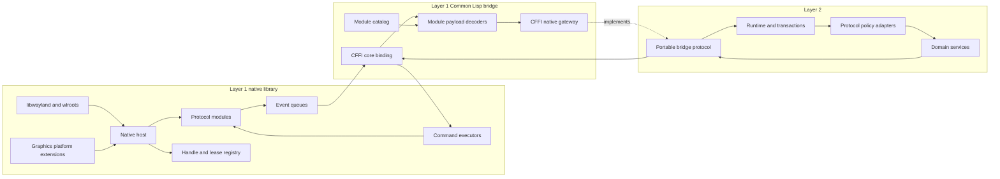
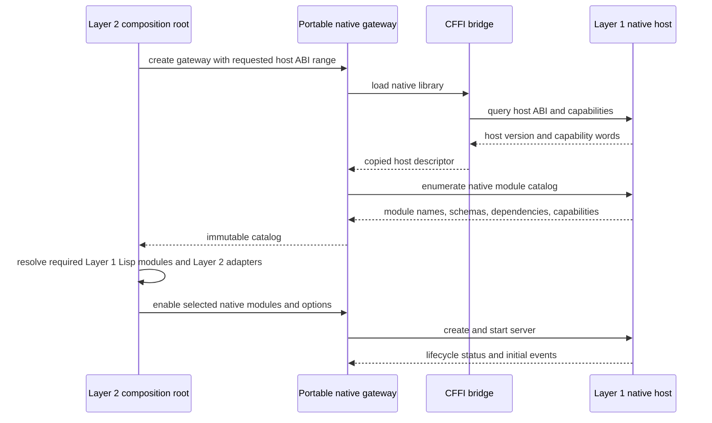
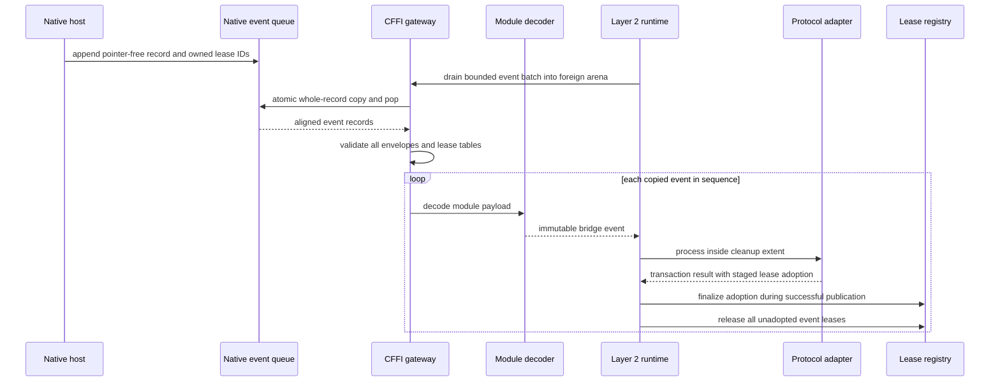
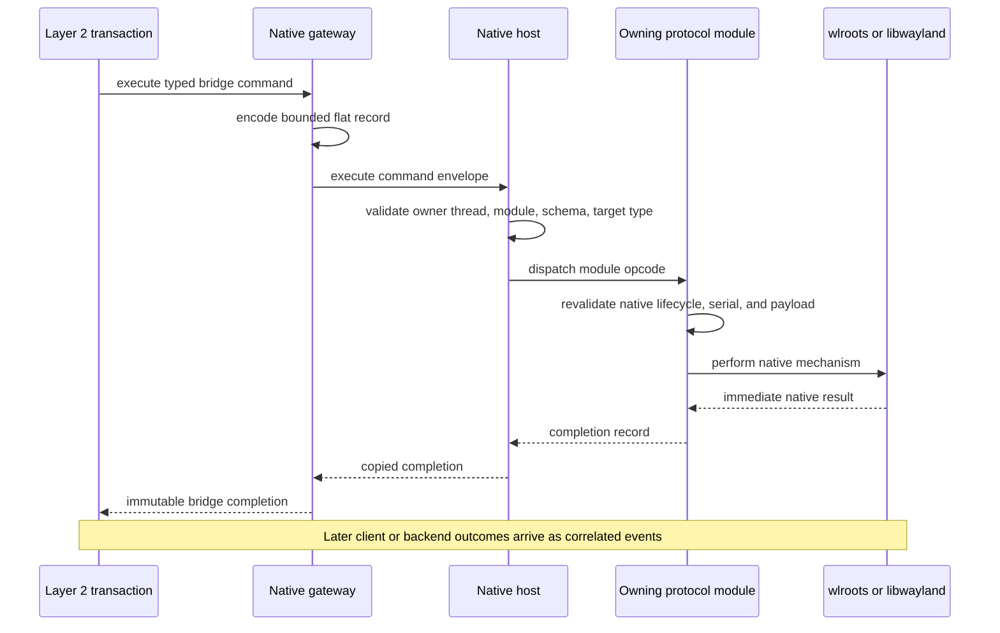
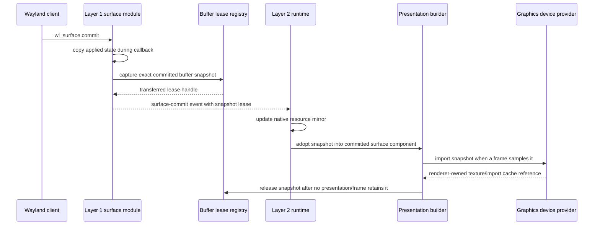
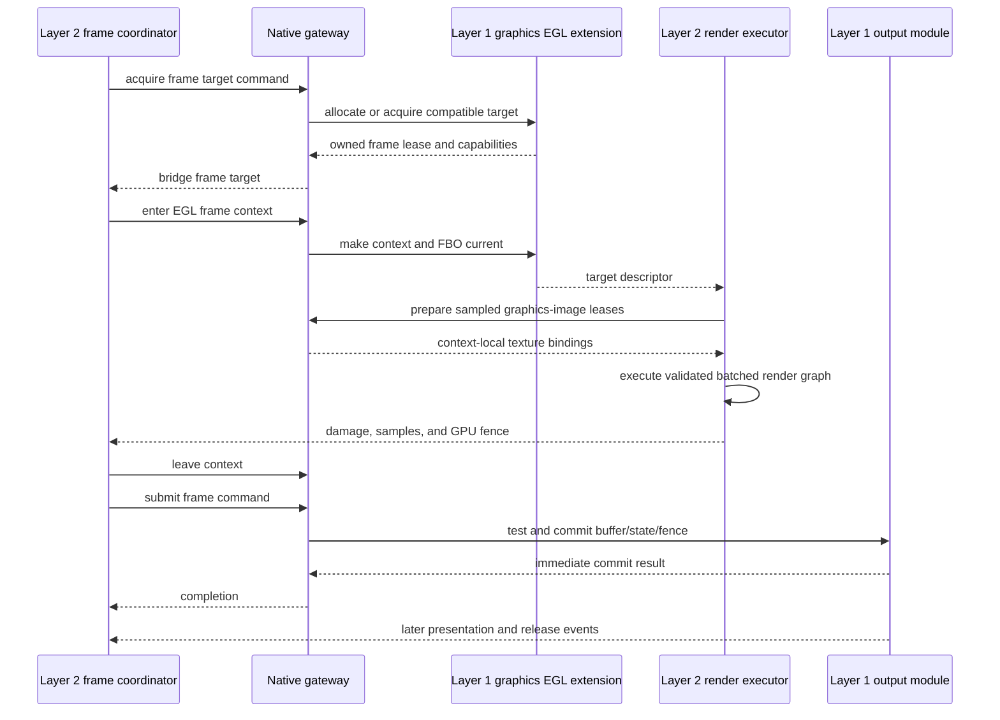
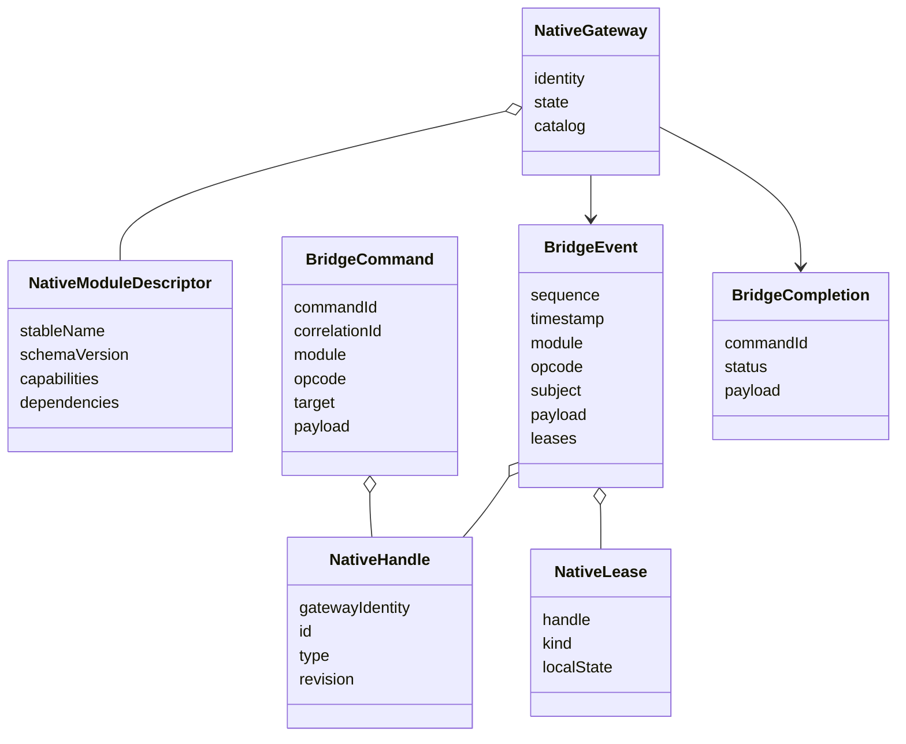
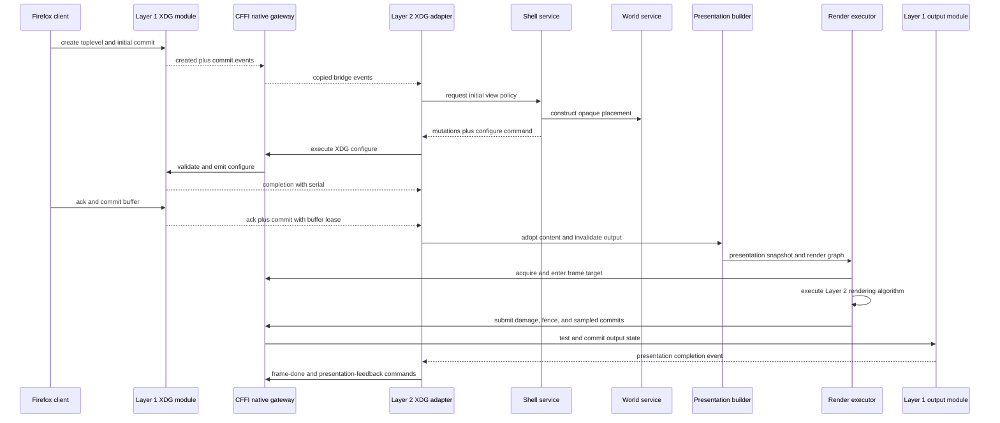

# Layer 1–Layer 2 Interface Contract

Status: architecture planning only. The declarations in this document are the
proposed interface, not checked-in C or Common Lisp implementation.

## 1. Purpose

This document defines the only supported connection between:

- **Layer 1**, the native Wayland/wlroots/DRM/EGL substrate and its thin CFFI
  decoding modules; and
- **Layer 2**, the Common Lisp compositor framework, domain services, plugins,
  hooks, rendering algorithms, animation, and agent control.

The boundary must remain stable while both sides expand horizontally. Adding a
Wayland protocol must add a module, not add protocol-specific slots and foreign
functions throughout the compositor runtime.

## 2. Interface Principles

1. Layer 1 never calls arbitrary Lisp from a Wayland or wlroots callback.
2. Layer 2 never receives a wlroots, Wayland, GBM, EGL, DRM, or Pixman pointer.
3. Layer 1 reports facts and policy requests; Layer 2 decides policy.
4. Layer 2 submits commands; Layer 1 validates and serializes native effects.
5. Native handles are opaque, typed, monotonic, and never reused per server.
6. Every variable-sized value is bounded and has explicit ownership.
7. Every native lease has explicit retain, adopt, and release semantics.
8. Events and commands use fixed envelopes plus module-specific payload records.
9. Protocol schemas are negotiated independently from the host ABI.
10. The hot path uses flat binary records and batches, not JSON, property lists,
    foreign callbacks, or one FFI call per vertex.
11. Layer 2 state is event-sourced from Layer 1 and does not inspect native
    structures to discover hidden state.
12. Native effects return honest completion; enqueueing does not imply success.

## 3. Boundary Overview



Layer 2 depends on the portable bridge protocol, not on CFFI. The concrete CFFI
gateway is replaceable by a trace-replay gateway or deterministic development
gateway without changing domain services.

## 4. Version Model

Four version domains remain separate:

| Version | Scope | Compatibility rule |
|---|---|---|
| host ABI | fixed C entry points and common envelopes | major breaks; minor is additive |
| native module schema | module event/command/object payloads | module-specific major/minor |
| Wayland interface version | client-visible protocol XML version | negotiated per client binding |
| Layer 2 service protocol | CLOS domain contract | service-specific compatibility |

The host ABI uses a 32-bit `major:minor` value. Size-prefixed structs allow new
tail fields in a minor release. No module may treat the host ABI minor version as
its protocol schema version.

### 4.1 Startup negotiation



The server does not advertise a client protocol global until its native module
and required policy adapter are ready, except mandatory core globals explicitly
owned by the startup profile.

## 5. Minimal Public C ABI

The public header includes only fixed-width C types. It contains no wlroots,
Wayland, EGL, GBM, DRM, Pixman, or OpenGL declarations.

### 5.1 Opaque and scalar types

Proposed conceptual declarations:

```c
struct atx_server;

typedef uint64_t atx_handle;
typedef uint64_t atx_sequence;
typedef uint64_t atx_command_id;
typedef uint64_t atx_correlation_id;
typedef uint64_t atx_time_ns;
typedef int32_t atx_status;
```

`atx_handle` value zero is always null. Nonzero handle values are monotonic and
never reused during one `atx_server` lifetime.

### 5.2 Status values

The common status domain is:

| Status | Meaning |
|---|---|
| `OK` | operation completed successfully |
| `INVALID_ARGUMENT` | malformed size, field, enum, bounds, or payload |
| `WRONG_THREAD` | owner-thread-only operation called elsewhere |
| `INVALID_STATE` | legal object, illegal lifecycle phase |
| `STALE_HANDLE` | handle was retired or never existed |
| `WRONG_KIND` | handle exists but expected type differs |
| `NOT_FOUND` | requested catalog or optional object absent |
| `UNSUPPORTED` | capability or operation unavailable |
| `AGAIN` | operation is legal but cannot complete yet |
| `BUFFER_TOO_SMALL` | caller buffer is too small; required size returned |
| `QUOTA_EXCEEDED` | bounded resource or queue limit reached |
| `PROTOCOL_REJECTED` | request conflicts with protocol state/serial |
| `NATIVE_FAILURE` | wlroots, EGL, DRM, or system operation failed |
| `FAULTED` | server/module can no longer preserve invariants |

The C API returns no borrowed error string. A separate structured error-copy
operation returns bounded subsystem, operation, native code, and UTF-8 message.

### 5.3 Lifecycle entry points

The core ABI contains a small stable set of operations equivalent to:

```c
uint32_t atx_host_abi_version(void);
uint32_t atx_host_capability_word_count(void);
uint64_t atx_host_capabilities(uint32_t word_index);

atx_status atx_server_options_init(void *options, uint32_t options_size);
atx_status atx_server_create(
    const void *options, uint32_t options_size,
    struct atx_server **server_out);
atx_status atx_server_enable_module(
    struct atx_server *server,
    const char *module_name, uint32_t name_size,
    const void *options, uint32_t options_size);
atx_status atx_server_add_socket_auto(
    struct atx_server *server,
    char *name, uint32_t capacity, uint32_t *needed);
atx_status atx_server_start(struct atx_server *server);
atx_status atx_server_dispatch(struct atx_server *server, int32_t timeout_ms);
atx_status atx_server_stop(struct atx_server *server);
atx_status atx_server_destroy(struct atx_server **server_io);
```

The exact names may change before ABI freeze, but the surface area should remain
this small. Protocol modules do not add one public C function for every request.

`destroy` is owner-thread-only, idempotent for a null pointer, and nulls the
caller’s pointer only after successful destruction. It can therefore report
wrong-thread or invalid-state errors instead of silently leaking or partially
destroying the server.

The size-prefixed server options record contains bounded startup mechanisms, not
desktop policy:

- requested backend classes and preference order: DRM, nested Wayland, headless,
  or automatic discovery;
- critical, discrete-input, coalescible, and diagnostic queue capacities;
- total native event-payload byte capacity;
- live-handle, tombstone, lease, and in-flight command limits;
- dispatch and structured-diagnostic flags;
- optional render-device selector passed to graphics-platform modules;
- feature flags required before native object creation.

Output arrangement, workspace/profile, cursor, focus, and rendering policy are
not server options.

Modules may be enabled and configured after `create` but before `start`.
Enablement after `start` returns `INVALID_STATE` in the first ABI. Future native
hot loading requires a separate quiesce/activation transaction and is not
silently implied by this interface.

`dispatch` semantics are:

- nonnegative timeout is milliseconds; `-1` means indefinite only for dedicated
  tools, while the Layer 2 runtime always uses a bounded timeout;
- if copied events are already pending, dispatch returns without blocking;
- native callbacks only enqueue records;
- client output is flushed before the call returns;
- return status reports backend/display failure separately from event presence;
- Layer 2 drains events only after `dispatch` has returned.

### 5.4 Module catalog entry points

The host exposes catalog enumeration through bounded copy operations:

```c
atx_status atx_server_module_count(
    struct atx_server *server, uint32_t *count);
atx_status atx_server_module_info(
    struct atx_server *server, uint32_t index,
    void *record, uint32_t capacity, uint32_t *needed);
```

A module-info record contains:

- runtime module ID;
- stable UTF-8 module name;
- schema major/minor;
- enabled/started state;
- capability words;
- dependency descriptors;
- event, command, object-kind, and lease-kind schema summaries;
- maximum payload and quota information.

Module IDs are assigned per server startup and are not persisted. Stable module
names and schema versions are authoritative. This avoids a global numeric-ID
allocation bottleneck for horizontally added modules.

### 5.5 Event and command entry points

The hot-path core ABI is:

```c
atx_status atx_server_next_event(
    struct atx_server *server,
    void *record, uint32_t capacity, uint32_t *needed);

atx_status atx_server_drain_events(
    struct atx_server *server,
    void *records, uint32_t capacity, uint32_t maximum_events,
    uint32_t *bytes_written, uint32_t *events_written,
    uint32_t *next_event_needed);

atx_status atx_server_execute(
    struct atx_server *server,
    const void *command, uint32_t command_size,
    void *completion, uint32_t completion_capacity,
    uint32_t *completion_needed);

atx_status atx_server_execute_batch(
    struct atx_server *server,
    const void *batch, uint32_t batch_size,
    void *completions, uint32_t completion_capacity,
    uint32_t *completion_needed);
```

`next_event` uses the standard two-call bounded-copy pattern:

1. call with no buffer to obtain the exact required size;
2. allocate from the current Lisp foreign arena;
3. call again to copy and remove the event atomically.

If the second call fails, the event remains at the queue head. The caller never
receives a pointer into native queue storage.

The Layer 2 runtime normally uses `drain_events`. It copies and removes as many
whole aligned event records as fit, up to `maximum_events`, and never splits a
record. If the first record does not fit, it returns `BUFFER_TOO_SMALL` with zero
events written and reports `next_event_needed`. Lease ownership transfers only
for records actually copied. This permits one FFI crossing for an event batch
while retaining exact bounded behavior for an oversized record.

`execute` runs on the owner thread after native dispatch has returned. It never
invokes Lisp recursively. The returned completion reports immediate native
execution. Later client/backend results arrive as correlated events.

Every command schema declares its maximum completion-record size. `execute`
checks the supplied completion capacity against that maximum before performing
any side effect. `BUFFER_TOO_SMALL` therefore guarantees that the command did not
execute and may be safely retried with the required capacity. A successfully
executed command is never repeated merely to retrieve its completion.

Batch execution computes the maximum completion aggregate for every command and
validates output capacity before executing the first command. Capacity failure
therefore has zero native effects for the entire batch.

### 5.6 Error and statistics entry points

```c
atx_status atx_server_copy_error(
    struct atx_server *server,
    void *record, uint32_t capacity, uint32_t *needed);

atx_status atx_server_statistics(
    struct atx_server *server,
    void *record, uint32_t capacity, uint32_t *needed);
```

Statistics include queue depth, high-water marks, coalesced/dropped diagnostics,
live wrappers, tombstones, active leases, retained bytes, in-flight frames, and
per-module quota usage.

## 6. Flat Record Rules

### 6.1 Common representation

Every record crossing CFFI uses:

- fixed-width integer and IEEE float fields;
- no C `bool`, `enum`, `long`, `size_t`, or pointer fields;
- explicit byte size and schema version;
- explicit `fields` bitset for optional tail semantics;
- reserved fields required to be zero on input;
- relative offset/length pairs for embedded strings and arrays;
- eight-byte record alignment;
- UTF-8 strings without required trailing NUL;
- finite numeric validation where the domain requires it.

All offsets are relative to the start of the enclosing record. The decoder
validates overflow, alignment, overlap rules, and bounds before constructing Lisp
values.

These are in-process native-endian ABI records. They are not written directly to
disk or sent over a socket. Trace/replay tooling serializes decoded bridge values
into a separate canonical versioned format so native padding, endianness, and
module runtime IDs never become persistent data contracts.

### 6.2 Common record prefix

```c
struct atx_record_prefix {
    uint32_t record_size;
    uint16_t schema_major;
    uint16_t schema_minor;
    uint64_t fields;
    uint64_t flags;
};
```

Additive minor versions append fields. A reader accepts a larger record when all
required prefix fields are understood. A major mismatch is rejected.

### 6.3 Slice descriptor

```c
struct atx_slice {
    uint32_t offset;
    uint32_t length;
};
```

Slices contain bytes. Typed arrays additionally declare element size/count in
their module record. No record contains a native pointer, even temporarily.

## 7. Event Interface

### 7.1 Event envelope

```c
struct atx_event_envelope {
    struct atx_record_prefix record;
    uint32_t module_id;
    uint16_t module_schema_major;
    uint16_t module_schema_minor;
    uint32_t opcode;
    uint32_t event_class;
    uint64_t sequence;
    uint64_t first_sequence;
    uint64_t monotonic_time_ns;
    uint64_t subject;
    uint64_t subject_type;
    uint64_t related;
    uint64_t parent;
    uint64_t correlation_id;
    uint32_t lease_count;
    uint32_t reserved;
    struct atx_slice leases;
    struct atx_slice payload;
};
```

`subject_type` is a server-local composite of module ID and module-local object
kind. Layer 2 resolves it through the catalog to stable names.

`first_sequence` differs from `sequence` when coalescible events represent a
range. Payload metadata includes the original sample count where relevant.

Event sequences are global, nonzero, monotonic for one server, and may wrap only
after the full 64-bit domain. Object-native revisions are independent per object.
All event timestamps use the host monotonic clock in nanoseconds; protocol
timestamps with different units are preserved separately inside module payloads.

The common lease table is decoded before the module payload. Each entry contains
the lease handle, stable lease kind, and transfer disposition. This lets the
gateway release transferred resources even when a module decoder rejects a
malformed or unsupported payload.

### 7.2 Event classes

| Class | Meaning | Loss behavior |
|---|---|---|
| lifecycle | create, retire, map, unmap | never dropped/coalesced |
| state transaction | surface commit, configure ack, selection | never dropped |
| policy request | move, resize, lock, capture, activation | never dropped |
| discrete input | key/button/touch transitions | never dropped |
| continuous input | pointer/tablet motion, axes | coalescible within protocol frame |
| frame deadline | output ready/requested frame | latest pending per output |
| native completion | asynchronous result/presentation/release | never dropped |
| diagnostic | trace/counters/warnings | bounded and droppable |

### 7.3 Event ownership

Copying an event transfers ownership of every lease explicitly marked as
`transferred` in its payload to the Layer 1 Lisp bridge. The bridge wraps the
event in a dynamic cleanup extent:

```text
decode event
  -> process event transaction
  -> stage lease adoptions for components/snapshots
  -> finalize staged adoptions only while publishing the transaction
  -> release every unadopted event lease in unwind-protect cleanup
```

Garbage-collector finalizers are diagnostic fallbacks only. Correctness never
depends on them.

For a drained batch, the gateway validates every common envelope and constructs
cleanup ownership for every transferred lease before invoking any module payload
decoder. A decoder failure therefore cannot orphan leases belonging to later
records already removed from the native queue.

### 7.4 Event processing sequence



If the transaction aborts, its staged adoptions are discarded and the event
cleanup releases those leases normally.

## 8. Command and Completion Interface

### 8.1 Command envelope

```c
struct atx_command_envelope {
    struct atx_record_prefix record;
    uint32_t module_id;
    uint16_t module_schema_major;
    uint16_t module_schema_minor;
    uint32_t opcode;
    uint32_t command_flags;
    uint64_t command_id;
    uint64_t correlation_id;
    uint64_t target;
    uint64_t expected_type;
    uint64_t expected_native_revision;
    uint32_t lease_count;
    uint32_t reserved;
    struct atx_slice leases;
    struct atx_slice payload;
};
```

`expected_native_revision` is optional. It lets Layer 2 reject stale decisions
when a newer native commit has already changed the target.

Command IDs are nonzero and unique per gateway session. Layer 2 allocates them.
A correlation ID groups a command with a pending semantic operation and later
events; it is not a native object identity and may span multiple commands.

### 8.2 Completion envelope

```c
struct atx_completion_envelope {
    struct atx_record_prefix record;
    uint32_t module_id;
    uint32_t opcode;
    uint64_t command_id;
    uint64_t correlation_id;
    int32_t status;
    uint32_t native_error_domain;
    int64_t native_error_code;
    uint64_t resulting_native_revision;
    uint32_t lease_count;
    uint32_t reserved;
    struct atx_slice leases;
    struct atx_slice payload;
};
```

The module-specific completion payload may contain a configure serial, created
handle, tested output capability, accepted action, or another bounded result.
Transferred completion leases use the common lease table and the same explicit
cleanup/adoption rules as event leases.

### 8.3 Command execution sequence



### 8.4 Batch execution

A batch record contains an array of aligned command records plus batch flags.

Initial batch modes:

- `ordered`: execute in order; report every completion;
- `stop-on-failure`: stop before the first unexecuted command after failure;
- `validate-only`: perform all native/module validation without effects where the
  module advertises support;
- `module-atomic`: allowed only when one module explicitly guarantees native
  atomicity, such as a tested multi-output state transaction.

The bridge does not label an arbitrary cross-module batch atomic.

## 9. Handle and Object Interface

### 9.1 Handle rules

- zero means no object;
- nonzero values are unique for the server lifetime;
- public operations always include expected type when practical;
- retirement makes later commands return `STALE_HANDLE`;
- destroy commands are explicitly marked idempotent or non-idempotent per schema;
- related handles in an event are snapshots, not implicit retained references;
- retaining a native object beyond its protocol lifetime is permitted only for
  an explicit lease kind, never by retaining its ordinary handle.

### 9.2 Layer 2 native resource mirror

The Lisp bridge converts native handles into immutable values:

| Field | Meaning |
|---|---|
| server identity | prevents handle use against another gateway |
| handle ID | native opaque identity |
| stable module name | resolved from runtime module ID |
| stable object-kind name | resolved from module schema |
| native revision | last reported native state revision |

Layer 2’s `native-resource` entity owns this mirror. Domain entities relate to it
but do not use its numeric handle as their semantic identity.

### 9.3 Information queries

Normal operation uses events to maintain Layer 2 mirrors. Protocol modules may
provide snapshot commands for:

- startup diagnostics;
- explicit agent inspection;
- recovery assertions;
- details too large or rare for every event.

Queries return immutable snapshots with native revision. Layer 2 must not poll
queries each frame or use them as hidden mutable state access.

## 10. Lease Interface

### 10.1 Lease kinds

Host-level lease mechanisms include:

- surface-buffer snapshot;
- graphics image/import resource;
- output frame target;
- file descriptor;
- synchronization timeline/point;
- capture destination/source;
- DRM lease;
- native string/blob only when too large for an event record.

Module-specific lease kinds may build on these mechanisms but follow the same
ownership protocol.

### 10.2 Common lease binding

```c
struct atx_lease_binding {
    uint64_t handle;
    uint64_t lease_type;
    uint32_t disposition;
    uint32_t reserved;
};
```

Event/completion dispositions include `transferred` and `borrowed-for-extent`.
Command dispositions include `borrowed`, `consume-on-success`, and
`consume-always`. The host validates that the disposition is legal for the
command schema before executing it.

### 10.3 Common lease operations

The core ABI exposes equivalent operations:

```c
atx_status atx_lease_retain(
    struct atx_server *server, atx_handle lease);
atx_status atx_lease_release(
    struct atx_server *server, atx_handle lease);
atx_status atx_lease_info(
    struct atx_server *server, atx_handle lease,
    void *record, uint32_t capacity, uint32_t *needed);
```

Release is idempotent for a lease identity owned by the caller. Retain fails on a
retired lease or an object that cannot legally be retained.

### 10.4 Lisp lease states

The portable bridge represents a lease with explicit local state:

- `borrowed`: valid only inside an event/command cleanup extent;
- `owned`: Layer 2 must release it;
- `adopted`: ownership moved into a committed component/snapshot;
- `released`: no further access permitted.

The Lisp API signals a local condition before crossing CFFI when code uses a
released or non-owned lease incorrectly.

Adoption is not an immediate adapter operation. The transaction manager stages
the adoption and finalizes it only in the non-failing publication phase after
all validators, hooks, and required native effects have succeeded.

### 10.5 FD transfer

File descriptors never appear as plain integers in event payloads. An FD lease
supports explicit operations:

- duplicate with `CLOEXEC`, leaving the lease owned;
- take ownership once, retiring the lease;
- close/release without extracting it.

Every command schema states whether an FD lease is borrowed, consumed on success,
or consumed regardless of status.

## 11. Surface Commit and Buffer Snapshot Interface

### 11.1 Surface commit payload

A committed-surface event contains stable protocol state:

- surface handle and commit/native revision;
- mapped and role state;
- logical and buffer dimensions;
- buffer scale and transform;
- viewport source/destination;
- damage regions;
- opaque and input regions;
- frame-callback presence/count;
- synchronized-subsurface relationship metadata;
- optional transferred buffer-snapshot lease;
- explicit-sync acquire point when present.

The exact client buffer is captured and locked during the native commit callback
when necessary. Layer 2 never queries `wlr_surface.current.buffer` afterward.

### 11.2 Snapshot lease

A surface-buffer snapshot lease guarantees:

- immutable identity for one committed buffer state;
- exact width, height, format, modifier, planes, transform, and opacity metadata;
- a native buffer reference or an owned SHM upload snapshot;
- acquire synchronization metadata;
- validity until explicit release;
- copy-on-write behavior when later commits replace the current buffer.

The snapshot does not contain a wlroots texture. Import into a graphics device is
the responsibility of the active Layer 2 renderer’s device provider.

### 11.3 Commit flow



## 12. Graphics Platform Extension

The core bridge remains renderer-neutral. The initial native catalog includes an
`graphics.egl` host extension that provides an EGL/GLES frame-target mechanism to
a Layer 2 render executor.

### 12.1 Responsibility split

Layer 1 graphics platform owns:

- DRM/GBM device and borrowed file-descriptor lifetime;
- EGL display/context/config creation and destruction;
- owner-thread current-context binding;
- low-level DMA-BUF/SHM import into context-owned image resources;
- output-compatible buffer allocation and swapchains;
- framebuffer/EGLImage lifetime attached to frame targets;
- synchronization import/export required by output commit;
- output state test and commit;
- release and presentation completion.

Layer 2 graphics device provider owns:

- device selection among advertised candidates;
- shaders and programs;
- texture import requests, sampling policy, and image caches;
- render graph execution;
- clipping, blending, effects, color transforms, and readback algorithms;
- damage and sampled-surface reporting.

### 12.2 Frame acquisition command

`graphics.egl` exposes a command equivalent to `acquire-frame-target` with:

Input:

- output handle and expected output revision;
- desired logical/buffer dimensions;
- desired color/format capability constraints;
- preservation/damage-history requirements;
- optional desired output state transaction identity.

Completion:

- frame-target lease;
- graphics-device identity;
- width, height, DRM format, modifier, and color description;
- buffer age and required repaint region;
- top-left logical origin contract;
- supported synchronization path;
- whether direct readback is available.

### 12.3 Graphics-image lease

Layer 2 cannot dereference a surface-buffer snapshot and must not receive a
`wlr_buffer` or `EGLImage`. The `graphics.egl` extension therefore provides an
`import-surface-snapshot` command.

Input:

- surface-buffer snapshot lease;
- target graphics-device identity;
- intended sampling/color usage;
- optional cache identity from the Layer 2 graphics provider.

Completion:

- owned graphics-image lease;
- matching graphics-device identity;
- width, height, format, opacity, and color description;
- sampling target kind such as 2D or external image;
- declared texture origin and UV transform;
- synchronization state.

Layer 1 performs the low-level DMA-BUF EGLImage import or bounded SHM upload
because it owns the native buffer/context lifetimes. This is resource import, not
scene composition. Layer 2 still decides whether to import, cache, sample,
transform, blend, filter, or ignore the image.

Inside a matching frame-context extent, a `prepare-image-for-frame` command
returns a short-lived binding descriptor containing the numeric GLES texture
name/target and ensures the buffer acquire synchronization is satisfied. The
descriptor is valid only for that graphics device and context extent. It contains
no EGL or wlroots pointer.

The graphics-image lease retains or copies everything needed from the underlying
surface snapshot. Releasing the source snapshot before the image is safe only if
the completion explicitly reports independent ownership. Otherwise the Layer 2
image cache retains both leases.

Releasing a graphics-image lease retires its public handle immediately. If the
underlying GL/EGL object requires a current context for destruction, Layer 1
queues bounded internal destruction and performs it at the next graphics safe
point or during ordered shutdown with the owning context current.

### 12.4 Context enter/leave

The EGL extension exposes balanced owner-thread operations encoded through the
generic command envelope. Its module-local commands are:

```text
graphics.egl / enter-frame-context
graphics.egl / leave-frame-context
```

Layer 1 Lisp wrappers encode these commands and call `atx_server_execute`; the
module adds no EGL-specific public C symbol.

Entering makes the correct EGL context and target current. Target info contains
graphics-API values required by the executor, such as framebuffer identity and
declared origin, but never a wlroots pointer.

The Layer 2 renderer invokes OpenGL/GLES only inside this dynamic extent. Leaving
restores or clears current context according to the extension contract. Errors
force the frame into cancel-only state.

### 12.5 Frame submit/cancel

Submit command input includes:

- frame target lease;
- complete damage region;
- GPU completion fence/timeline point or correctness-first finish status;
- sampled surface commit identities;
- optional output state changes;
- presentation mode/tearing hint selected by Layer 2 policy.

Layer 1 tests and commits output state. Submit consumes the frame lease on both
success and terminal failure. Cancel is idempotent and valid before submission.

### 12.6 Rendering sequence



### 12.7 Future graphics APIs

A Vulkan or CPU executor adds another graphics-platform extension with the same
Layer 2 frame-target protocol. It does not change protocol adapters, scene,
projection, animation, or render-planner contracts.

## 13. Output Transactions

### 13.1 Output event state

Layer 1 reports:

- stable output handle and connector identity;
- modes and current mode identities;
- physical and effective dimensions;
- scale, transform, subpixel, refresh, VRR, color, and timeline capabilities;
- frame deadlines, damage requests, commit, presentation, and destruction;
- native revision for state conflict detection.

Layer 1 reports capabilities, not desktop placement. Layer 2 owns viewports and
output arrangement metadata.

### 13.2 Test and commit

Output module commands support:

- test one output state;
- commit one output state;
- test a multi-output state set;
- commit a previously tested compatible state set;
- schedule a frame;
- attach a rendered frame target to an output transaction.

Multi-output atomicity is advertised precisely. Layer 2 must not infer atomicity
when the backend cannot guarantee it.

## 14. Input and Seat Delivery Interface

### 14.1 Incoming events

Input module payloads remain device-specific and preserve raw values:

- device add/remove and capability changes;
- pointer motion absolute/relative, button, axis, frame;
- keyboard key, modifiers, keymap, repeat information;
- touch down/up/motion/cancel/frame;
- tablet proximity, tip, axes, buttons, pad rings/strips/modes;
- switches and other backend devices;
- client cursor, constraints, gestures, and shortcut-inhibit requests.

Layer 1 does not map them to outputs, choose focus, move a cursor, or execute a
window operation.

### 14.2 Outgoing seat command batches

Layer 2 submits one ordered seat-delivery batch per logical protocol frame:

- pointer enter/leave/motion/button/axis/frame;
- keyboard enter/leave/key/modifiers/repeat/keymap;
- touch focus/down/up/motion/cancel/frame;
- tablet delivery;
- cursor-surface acceptance or rejection;
- LED updates.

The seat module validates surface, client, serial, and logical-seat state before
calling wlroots. A batch completion reports exactly which commands executed if
the batch cannot be atomic.

### 14.3 Serial-bearing requests

Events containing move, resize, set-cursor, selection, DND, constraint, or other
serial-bearing requests include:

- original serial;
- originating seat and client handles;
- native validation state captured at request time;
- correlation identity.

Layer 1 revalidates the serial when executing the response command. Layer 2 must
handle `PROTOCOL_REJECTED` instead of assuming a once-valid serial remains valid.

## 15. Data Transfer and FD Interface

Selection and drag modules report source, offer, request, seat, MIME, action, and
serial state through normal event records. Data FDs use leases.

Policy sequence:

1. Layer 1 reports source/offer/request lifecycle.
2. Layer 2 transfer policy authorizes and stages a portable session.
3. Layer 2 submits accept/reject/action commands.
4. Layer 1 revalidates serial and native resource state.
5. FD send/receive events transfer an FD lease.
6. Layer 2 transport consumes or duplicates the lease explicitly.
7. Terminal success/cancel/failure events reconcile portable state.

The interface must not claim successful DND data transfer when the underlying
protocol module cannot observe MIME receive/completion semantics. Such a module
reports an explicit capability limitation.

## 16. Security and Session Lock Interface

Session locking uses the same event/command contract plus a host emergency state.

```mermaid
sequenceDiagram
    participant CL as Lock client
    participant SL as Layer 1 lock module
    participant EH as Native emergency shield
    participant L2 as Layer 2 security policy
    participant OUT as Output module

    CL->>SL: request session lock
    SL->>EH: enter protected pending state
    EH->>OUT: prevent another unlocked frame and blank as required
    SL-->>L2: lock policy request event
    L2->>SL: accept or reject command
    alt accepted
        SL->>OUT: confirm protected frame on every output
        SL-->>CL: locked event
    else rejected
        SL->>EH: leave pending state if safe
        SL-->>CL: finished event
    end

    Note over SL,L2: Layer 2 owns authorization; Layer 1 remains fail-closed
```

The emergency shield is a generic host capability used only for security
invariants. It does not lay out or render lock-client surfaces beyond opaque
blanking needed before Layer 2 can respond.

## 17. Per-Client Global Access Interface

Layer 2 publishes an immutable native-matchable access snapshot containing:

- client security labels assigned during connection setup;
- stable module/global access classes;
- allow/deny decisions;
- snapshot generation.

Layer 1 uses this snapshot synchronously from the Wayland global filter. It never
calls Lisp from the filter. Sensitive globals default to deny before a snapshot
permits them.

Changing the policy affects future advertisements/binds as defined by Wayland;
it does not pretend existing bound resources can always be revoked.

## 18. Portable Common Lisp Bridge Protocol

Layer 2 imports a portable package containing no CFFI definitions.

### 18.1 Core classes



### 18.2 Gateway generics

The portable protocol defines conceptual generic functions:

| Generic | Responsibility |
|---|---|
| gateway identity/state/catalog | immutable inspection |
| configure gateway | select native modules before start |
| start gateway | create socket/start backend |
| dispatch gateway | bounded native event-loop dispatch |
| drain native events | return a bounded vector of copied immutable events |
| next gateway event | convenience operation for one copied event or no event |
| execute bridge command | return immediate bridge completion |
| execute bridge batch | return ordered completion vector |
| retain/release native lease | explicit native lifetime |
| gateway statistics | copied bounded counters |
| stop gateway | owner-thread quiesce and stop |
| destroy gateway | final idempotent cleanup |

The CFFI gateway implements these generics. A replay gateway can implement them
from a recorded event/command trace.

### 18.3 Module decoders

Each Layer 1 Lisp module registers:

- stable native module name and supported schema range;
- payload decoder per event opcode;
- command encoder per command class;
- completion decoder per command opcode;
- stable object/lease kind names;
- payload validators and bounds;
- lease-transfer field declarations.

Decoders copy strings, arrays, boxes, regions, and metadata into detached Lisp
values. No foreign pointer survives `next-gateway-event`.

### 18.4 Protocol adapters

Layer 2 protocol adapters dispatch on the active adapter service and decoded
payload class:

```text
(adapt-bridge-event adapter bridge-event payload transaction)
(reconcile-bridge-completion adapter pending-operation completion transaction)
```

Domain services never call module encoders directly. Adapters construct typed
bridge-command objects through the public bridge protocol.

### 18.5 Proposed portable generic-function surface

The boundary package exposes a deliberately small CLOS protocol equivalent to:

```lisp
(defgeneric configure-native-gateway (gateway configuration))
(defgeneric start-native-gateway (gateway))
(defgeneric dispatch-native-gateway (gateway timeout))
(defgeneric drain-native-events (gateway maximum-events maximum-bytes))
(defgeneric next-native-event (gateway))
(defgeneric execute-native-command (gateway command))
(defgeneric execute-native-command-batch (gateway commands mode))
(defgeneric native-gateway-statistics (gateway))
(defgeneric retain-native-lease (gateway lease))
(defgeneric release-native-lease (gateway lease))
(defgeneric stage-native-event-lease-adoption
    (transaction event lease owner))
(defgeneric dispose-native-event (event))
(defgeneric stop-native-gateway (gateway))
(defgeneric destroy-native-gateway (gateway))
```

`next-native-event` returns an owned `bridge-event`. The runtime always processes
it through a cleanup abstraction equivalent to:

```lisp
(call-with-native-event gateway
  (lambda (event)
    (process-native-event runtime event)))
```

`call-with-native-event` guarantees `dispose-native-event` in an unwind cleanup.
Successfully committed staged leases are removed from the event cleanup set and
attached to the declared committed owner. Aborted adoptions remain in the event
cleanup set.

The graphics extension adds a portable protocol equivalent to:

```lisp
(defgeneric acquire-frame-target (gateway output request))
(defgeneric call-with-frame-context (gateway frame-target function))
(defgeneric submit-frame-target (gateway frame-target submission))
(defgeneric cancel-frame-target (gateway frame-target))
```

`call-with-frame-context` enters the native EGL context, invokes the supplied
Layer 2 renderer function on the owner thread, and guarantees leave/cancel
cleanup. It is not a native-to-Lisp callback: Lisp initiates the call after
native event dispatch has returned.

Conditions corresponding to common statuses are portable subclasses of a
`native-gateway-error` condition. Ordinary protocol rejection and `AGAIN` may be
returned as completion values when expected by the command contract; programmer
errors such as wrong gateway identity or locally released leases signal before
CFFI.

## 19. Threading and Reentrancy

### 19.1 Owner-thread operations

The following are owner-thread-only:

- create/start/dispatch/stop server;
- module enablement after creation;
- event drain;
- command execution;
- lease retain/release;
- EGL context enter/leave;
- frame acquisition/submission/cancellation;
- native object queries.

The gateway records its owner thread at server creation or start and rejects
wrong-thread operations before touching native state.

### 19.2 Cross-thread wakeup

Layer 2 worker/control threads write only to the Layer 2 mailbox and wake the
runtime through a small thread-safe wakeup primitive. They do not submit Layer 1
commands directly.

### 19.3 No callback reentrancy

`dispatch-gateway` may invoke native callbacks internally, but those callbacks
only append native records. It returns before Layer 2 decodes events or submits
commands. A command executor never calls back into Lisp.

The only recursive activity permitted is native library implementation detail
that does not cross the CFFI boundary.

## 20. Backpressure and Fault Semantics

### 20.1 Queue partitioning

Layer 1 maintains capacity classes:

- reserved critical lifecycle/transaction queue;
- discrete input queue;
- coalescible continuous-input slots keyed by device/protocol frame;
- frame-deadline slots keyed by output;
- bounded diagnostic queue;
- per-module payload byte quotas.

### 20.2 Exhaustion behavior

- diagnostic overflow drops diagnostics and increments counters;
- continuous input coalesces only within legal boundaries;
- a client causing protocol-resource/event exhaustion is disconnected or its
  request is failed without poisoning unrelated clients;
- backend-critical state that cannot be recorded transitions the affected module
  or server to `FAULTED` rather than silently continuing with divergent state;
- Layer 2 stops normal policy processing after a fatal bridge fault and performs
  ordered shutdown or an explicitly designed recovery path.

### 20.3 Dispatch budgets

Layer 2 selects a bounded native dispatch timeout and drains critical events
before mailbox/animation/frame work. The runtime turn enforces fairness so a
flooding client or input device cannot permanently starve output deadlines.

## 21. Schema Generation

Event/command payload definitions must have one authoritative machine-readable
source that generates:

- C constants and flat record declarations;
- Common Lisp CFFI layout metadata;
- Lisp payload classes/constructors where appropriate;
- bounds/field tables;
- module catalog tables;
- interface documentation;
- ABI layout probes.

Wayland XML remains authoritative for the client protocol, but it does not
describe Ataxia’s bridge payload ownership or policy boundary. The bridge schema
is separate and maps generated Wayland callbacks into Ataxia records.

The schema-source format remains a decision point. Hand-maintaining duplicate C
and Lisp offsets is rejected.

## 22. Example Protocol Records

### 22.1 XDG move request

Conceptual payload:

```c
struct atx_xdg_request_move {
    struct atx_record_prefix record;
    uint64_t toplevel;
    uint64_t surface;
    uint64_t seat;
    uint64_t client;
    uint32_t serial;
    uint32_t reserved;
    uint64_t native_revision;
};
```

Layer 1 validates and copies the request. Layer 2 decides whether to create an
interactive move operation. No native move behavior exists.

### 22.2 XDG configure command

Conceptual payload:

```c
struct atx_xdg_configure_toplevel {
    struct atx_record_prefix record;
    uint64_t configure_fields;
    int32_t width;
    int32_t height;
    uint32_t state_count;
    uint32_t state_offset;
    uint64_t policy_transaction_id;
};
```

Completion returns the configure serial. Later ack and surface commit events
carry that serial/revision relationship.

### 22.3 Pointer motion event

Conceptual payload preserves raw device-space data:

```c
struct atx_pointer_motion {
    struct atx_record_prefix record;
    uint64_t device;
    uint64_t seat_hint;
    uint64_t time_usec;
    double delta_x;
    double delta_y;
    double unaccelerated_x;
    double unaccelerated_y;
    uint32_t sample_count;
    uint32_t frame_flags;
};
```

There is no output position, focused surface, cursor position, or window location
in this Layer 1 event.

## 23. End-to-End Interface Example



This sequence exercises both directions without exposing native pointers or
putting shell/render policy in Layer 1.

## 24. Package Boundary

Proposed systems:

| System | Layer | May depend on |
|---|---|---|
| `ataxia.bridge` | boundary protocol | portable CL utilities only |
| `ataxia.native.abi` | Layer 1 Lisp | CFFI and generated ABI layouts |
| `ataxia.native.gateway` | Layer 1 Lisp | bridge protocol, native ABI |
| `ataxia.native.modules.*` | Layer 1 Lisp | gateway, generated module schemas |
| `ataxia.kernel.runtime` | Layer 2 kernel | bridge protocol, kernel systems |
| `ataxia.protocol-adapters.*` | Layer 2 domain | bridge values, domain protocols |
| `ataxia.render.*` | Layer 2 domain | render/presentation/bridge frame protocols |

`ataxia.kernel.runtime` must not depend on `ataxia.native.abi`. The executable
composition root supplies a concrete `cffi-native-gateway` to the runtime.

## 25. Explicitly Rejected Boundary Designs

- one public C function per Wayland request/event;
- one ever-growing event union containing every protocol payload;
- string event names and property lists in the native hot path;
- raw wlroots pointers or C struct slot access from Lisp;
- Lisp callbacks invoked by `wl_signal`;
- raw file-descriptor integers with undocumented close ownership;
- raw EGL/GBM/wlr buffer pointers stored in Layer 2 objects;
- native surface textures as the renderer abstraction;
- Layer 2 polling native structs to discover changes omitted from events;
- assuming a submitted native command succeeded before reading completion;
- pretending arbitrary command batches are atomic;
- relying on finalizers to release buffers, frames, or FDs;
- unbounded event payloads or module-private queues;
- calling Layer 1 from control/worker threads;
- advertising privileged protocol globals without a synchronous native access
  snapshot;
- making renderer-specific frame-target fields part of the host core ABI.

## 26. Interface Invariants

1. The host ABI remains small when a protocol module is added.
2. Every protocol event/command is attributable to one module/schema/opcode.
3. Every event is copied before Layer 2 can inspect it.
4. Every retained native resource uses a lease.
5. Every lease has exactly one explicit ownership path at a time.
6. Every command is revalidated against current native state.
7. Every immediate command has a completion.
8. Every later native outcome carries a correlation identity when applicable.
9. No unknown critical event is silently skipped.
10. No graphics context is used outside an owner-thread frame extent.
11. No surface buffer is accessed after its snapshot lease is released.
12. No output frame is committed after renderer failure or incomplete target
    initialization.
13. Layer 2 controls policy event emission; Layer 1 controls protocol-valid
    serialization and mandatory housekeeping.
14. Native queue pressure is observable and class-aware.
15. Layer 2 can run against a replay gateway without loading wlroots.

## 27. Decisions Required Before Interface Freeze

1. Approve the generic envelope API instead of per-protocol public C functions.
2. Approve runtime-assigned module IDs with stable module names.
3. Choose the machine-readable bridge-schema source format.
4. Set initial host ABI compatibility policy before the first usable milestone.
5. Approve explicit event-lease adoption and cleanup-extent semantics.
6. Approve the `graphics.egl` extension rather than baking EGL fields into the
   core host envelope.
7. Decide whether Layer 2 restart while preserving one Layer 1 server is a
   requirement; the initial design assumes they restart together.
8. Choose initial critical/discrete/coalescible queue and payload capacities.
9. Define the first per-client native access-policy label set.
10. Confirm whether a replay gateway must reproduce command completions exactly
    or may operate as a validation-only simulation in the first milestone.

No interface implementation should begin until these decisions are approved.
