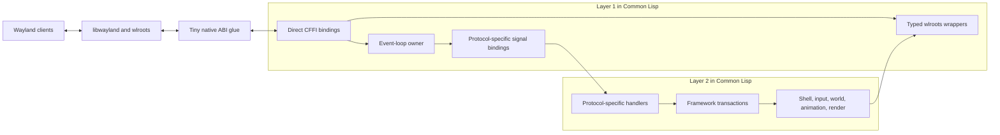
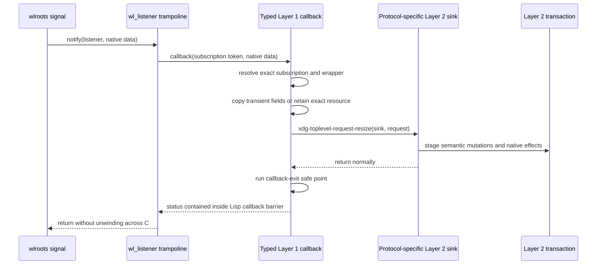
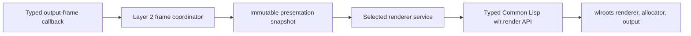
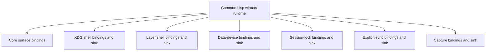
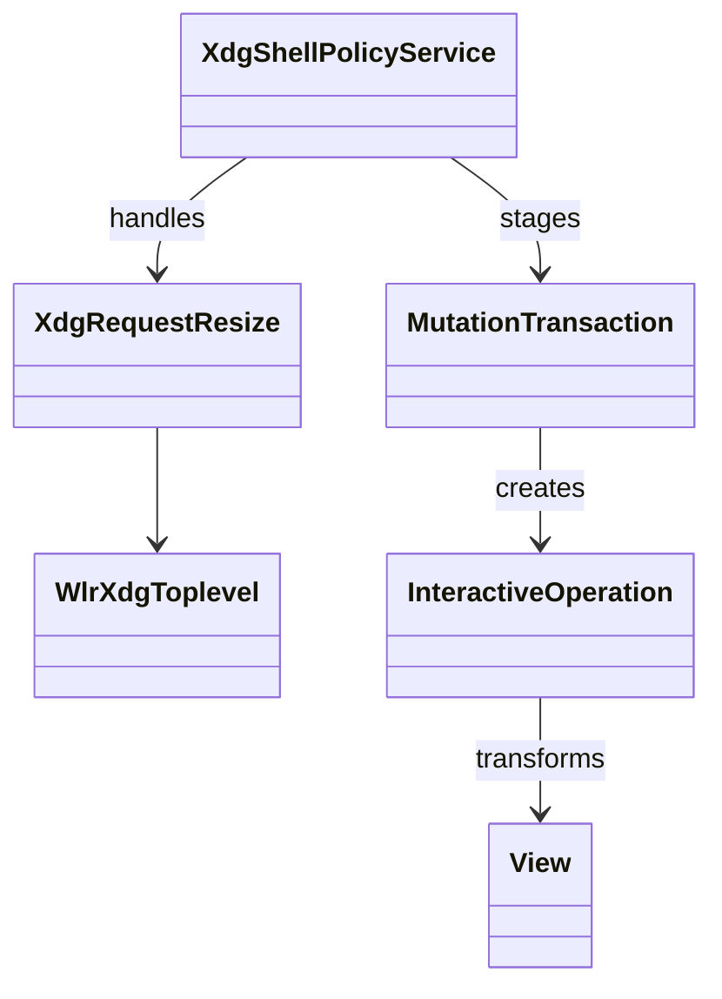
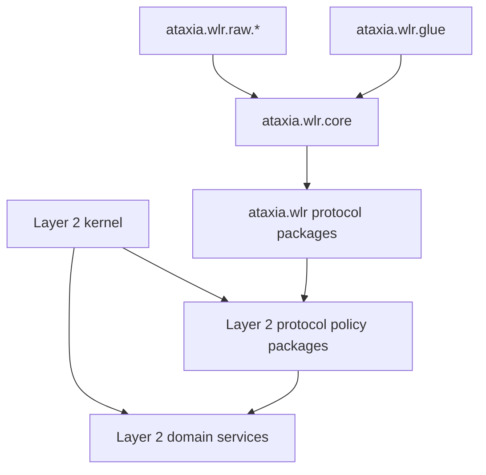

# wlroots–Common Lisp Boundary and Layer 1–Layer 2 Interface

Status: planning only. This document replaces the rejected generic bridge ABI.

## 1. Decision

Layer 1 is not a generic native host and Layer 2 does not communicate with it
through an invented event protocol.

The new boundary is:

- wlroots and libwayland remain the native implementation;
- Ataxia-authored C contains only unavoidable wlroots/libwayland ABI glue;
- Common Lisp owns server construction, event-loop control, object wrappers,
  signal conversion, lifetime bookkeeping, protocol composition, and errors;
- Layer 1 and Layer 2 communicate through protocol-specific Common Lisp
  generic functions and ordinary typed return values;
- incoming names and values preserve the exact wlroots signal or Wayland
  protocol meaning;
- outgoing operations are typed Lisp wrappers around concrete `wlr_*` or
  `wl_*` calls;
- there is no module catalog, event envelope, command envelope, opcode router,
  native handle registry, completion protocol, or universal lease system.

This is a deliberate in-process design. It favors directness, Lisp
replaceability, and debuggability over a stable language-neutral ABI between
the two layers.

## 2. Corrected Boundary



There are two different boundaries and they must not be conflated:

1. **Native-to-Lisp boundary:** CFFI calls and callback trampolines whose types
   follow the wlroots/libwayland ABI.
2. **Layer 1-to-Layer 2 boundary:** Common Lisp protocol packages whose methods
   follow concrete wlroots signals and concrete compositor actions.

The second boundary has no C ABI at all.

## 3. What Ataxia-Authored C May Contain

The native shim is allowed only where CFFI cannot safely or conveniently express
the public native ABI.

### 3.1 Allowed native glue

The initial shim may contain:

- a compile-time wlroots/libwayland version fingerprint;
- wrappers for required C macros or `static inline` functions;
- allocation and destruction of a `wl_listener` holder;
- the `wl_listener.notify` trampoline into one registered Lisp callback;
- exact adaptors for callbacks whose native signature cannot be represented by
  the chosen Lisp implementation;
- a logging callback adaptor if direct CFFI callbacks are insufficient;
- generated Wayland protocol descriptor data when a protocol is not supplied by
  wlroots.

A representative listener helper is intentionally mechanical:

```c
typedef void (*atx_wl_notify_fn)(uintptr_t token, void *data);

struct atx_wl_listener {
    struct wl_listener listener;
    atx_wl_notify_fn notify;
    uintptr_t token;
};

struct atx_wl_listener *atx_wl_listener_create(
    atx_wl_notify_fn notify,
    uintptr_t token);
void atx_wl_listener_attach(
    struct atx_wl_listener *listener,
    struct wl_signal *signal);
void atx_wl_listener_detach(struct atx_wl_listener *listener);
void atx_wl_listener_destroy(struct atx_wl_listener *listener);
```

This helper does not identify event kinds, copy payloads, queue events, own
wlroots objects, or route policy. The Lisp subscription represented by `token`
already knows the exact signal type and exact `data` layout.

### 3.2 Forbidden native infrastructure

Ataxia-authored C must not contain:

- a compositor server abstraction above wlroots;
- protocol module descriptors or a module loader;
- arbitrary event or command records;
- numeric object handles or tombstone registries;
- a native event queue;
- a policy-request state machine;
- generic buffer/FD/fence/frame leases;
- scene, placement, focus, cursor, animation, or agent state;
- a renderer abstraction or command-buffer format;
- protocol-independent validation already performed by typed Lisp wrappers;
- a second lifecycle model for objects already owned by wlroots.

If new C starts accumulating switches over protocol names or compositor policy,
the boundary has failed.

## 4. Layer 1 Common Lisp Responsibilities

Layer 1 is mostly Common Lisp. It contains the direct bindings and the smallest
safe wrapper around wlroots.

### 4.1 Server and event loop

Common Lisp directly creates and controls:

- `wl_display` and its `wl_event_loop`;
- the selected `wlr_backend`;
- `wlr_renderer` and `wlr_allocator` when used;
- `wlr_compositor`, `wlr_subcompositor`, `wlr_data_device_manager`, and other
  selected globals;
- outputs, seats, input devices, protocol managers, and their listeners;
- the Wayland socket and backend startup/shutdown sequence.

The Lisp runtime calls `wl_event_loop_dispatch` itself instead of hiding the
loop in a C `server_run` function. This makes native events, Lisp timers, agent
mailboxes, and safe points visible in one place.

### 4.2 Typed native wrappers

Each public wlroots type used above the raw bindings has a Lisp wrapper class:

```lisp
(defclass wlr-object ()
  ((pointer :initarg :pointer :reader %wlr-pointer)
   (alive-p :initform t :reader wlr-object-alive-p)
   (generation :initarg :generation :reader wlr-object-generation)
   (destroy-listener :initform nil)))

(defclass wlr-surface (wlr-object) ())
(defclass wlr-xdg-toplevel (wlr-object) ())
(defclass wlr-output (wlr-object) ())
(defclass wlr-seat (wlr-object) ())
```

The raw foreign pointer is private to Layer 1 packages. Layer 2 receives the
typed wrapper, not an opaque integer and not a naked CFFI pointer.

Layer 1 maintains a weak pointer-to-wrapper table only to preserve Lisp identity
while a wlroots object is alive. This is not an independent native handle
registry. The wlroots destroy signal is authoritative.

### 4.3 Object invalidation

For an object destroy signal:

1. Layer 1 enters the Lisp callback barrier.
2. It delivers the exact typed `...-destroying` callback while the pointer is
   still valid for documented inspection.
3. Layer 2 detaches semantic objects and stages any effects.
4. Layer 1 marks the wrapper dead, removes it from the identity table, clears
   its foreign pointer, and detaches remaining listeners.
5. Any later typed operation on the wrapper signals `dead-wlr-object` in Lisp
   before entering C.

The wrapper generation prevents an accidentally reused native address from
being confused with the old object.

### 4.4 Protocol packages

Layer 1 is horizontally split into packages that mirror real wlroots areas:

- `ataxia.wlr.core` — display, event loop, clients, surfaces, subsurfaces;
- `ataxia.wlr.backend` — backend, outputs, input-device discovery;
- `ataxia.wlr.render` — renderer, allocator, buffers, textures, render passes;
- `ataxia.wlr.seat` — seats and input delivery;
- `ataxia.wlr.xdg-shell` — XDG surfaces, toplevels, popups, positioners;
- `ataxia.wlr.layer-shell` — layer surfaces;
- `ataxia.wlr.data-device` — selections and drag-and-drop;
- one package per optional wlroots protocol implementation;
- `ataxia.wlr.raw.*` — generated/private CFFI declarations.

No central package needs to know every protocol event.

## 5. The Layer 1–Layer 2 Common Lisp Interface

Every protocol family defines its own event sink protocol and typed outbound
functions. There is no universal `bridge-event` or `execute-command` function.

### 5.1 Protocol-specific sinks

The XDG shell package can define:

```lisp
(defgeneric xdg-new-toplevel (sink toplevel))
(defgeneric xdg-new-popup (sink popup))
(defgeneric xdg-surface-map (sink xdg-surface))
(defgeneric xdg-surface-unmap (sink xdg-surface))
(defgeneric xdg-surface-commit (sink commit))
(defgeneric xdg-toplevel-request-move (sink request))
(defgeneric xdg-toplevel-request-resize (sink request))
(defgeneric xdg-toplevel-request-maximize (sink request))
(defgeneric xdg-toplevel-request-fullscreen (sink request))
(defgeneric xdg-toplevel-destroying (sink toplevel))
```

The seat and input packages define different, equally concrete functions:

```lisp
(defgeneric pointer-motion (sink event))
(defgeneric pointer-motion-absolute (sink event))
(defgeneric pointer-button (sink event))
(defgeneric pointer-axis (sink event))
(defgeneric pointer-frame (sink pointer))
(defgeneric keyboard-key (sink event))
(defgeneric keyboard-modifiers (sink event))
(defgeneric touch-down (sink event))
(defgeneric touch-motion (sink event))
(defgeneric touch-up (sink event))
```

The output package defines:

```lisp
(defgeneric backend-new-output (sink output))
(defgeneric output-frame (sink output))
(defgeneric output-needs-frame (sink output))
(defgeneric output-request-state (sink request))
(defgeneric output-present (sink presentation))
(defgeneric output-destroying (sink output))
```

These names are intentionally specific. A new protocol adds new generic
functions in its own package; it does not add an opcode to the kernel.

### 5.2 Exact typed values

Event values are protocol-specific structs or classes with named fields:

```lisp
(defstruct xdg-request-move
  toplevel
  seat
  serial)

(defstruct xdg-request-resize
  toplevel
  seat
  serial
  edges)

(defstruct pointer-motion-event
  device
  time-msec
  delta-x
  delta-y
  unaccel-delta-x
  unaccel-delta-y)

(defstruct output-present-event
  output
  commit-sequence
  presented-p
  refresh-nsec
  when
  flags)
```

Fields correspond to the wlroots signal data for the pinned wlroots version.
There are no generic `subject`, `related`, `class`, `flags`, `payload`, or
`correlation` fields unless that concrete native event actually defines them.

Shared Lisp mixins may be used internally for logging or timestamps, but they
are not part of the Layer 1–Layer 2 contract.

### 5.3 Handler installation

Each protocol manager has a typed handler slot installed at a runtime safe
point:

```lisp
(install-xdg-shell-sink xdg-shell xdg-policy-service)
(install-input-sink input-runtime input-service)
(install-output-sink backend output-service)
```

Replacing a Layer 2 service swaps the corresponding Lisp sink. Native listeners
remain attached and do not need to be recreated. Existing callback dispatch
pins the current sink for the callback extent; the replacement is visible to
the next callback.

This provides hot-replaceable policy without a generic event router.

### 5.4 Outgoing operations

Layer 2 invokes concrete typed Layer 1 functions:

```lisp
(xdg-toplevel-set-size toplevel width height)
(xdg-toplevel-set-maximized toplevel maximized-p)
(xdg-toplevel-set-fullscreen toplevel fullscreen-p)
(xdg-surface-schedule-configure xdg-surface)

(seat-pointer-notify-enter seat surface sx sy)
(seat-pointer-notify-motion seat time-msec sx sy)
(seat-pointer-notify-button seat time-msec button state)
(seat-keyboard-notify-enter seat surface pressed-keycodes modifiers)
(seat-keyboard-notify-key seat time-msec keycode state)

(surface-send-frame-done surface monotonic-time)
(output-test-state output output-state)
(output-commit-state output output-state)
```

Each wrapper:

1. checks the concrete wrapper type and liveness in Lisp;
2. checks owner-thread and callback-safety rules;
3. converts exact arguments to the pinned wlroots ABI;
4. calls the concrete native function;
5. returns its concrete value or signals a typed Lisp condition.

There is no encoded command and no generic completion. A configure function
returns its serial. An output test/commit returns its native success value.
Later acknowledgements, presentation reports, and buffer releases arrive through
their real protocol-specific signals.

## 6. Incoming Callback Flow



Dispatch is synchronous on the compositor owner thread. That is also how a
normal C wlroots compositor handles signals. Ataxia does not add a native queue
or duplicate wlroots ordering.

Layer 2 may stage work in its own transaction and effect queue. It must never
retain the native callback-data pointer. Any value that must survive is copied
or explicitly retained by a concrete Layer 1 operation before the callback
returns.

## 7. Callback Lifetime and Error Rules

### 7.1 Callback barrier

Every C-to-Lisp entry executes inside a callback barrier that:

- records callback depth and the exact active signal;
- prevents a Lisp condition from unwinding through C;
- pins the current protocol sink generation;
- records a structured fault on failure;
- runs deferred destruction and safe-point effects at outermost exit;
- requests controlled compositor shutdown if a critical callback cannot be
  completed safely.

Nested wlroots signals are legal. The callback-depth counter makes outermost
exit explicit and prevents listener memory from being freed while a nested
callback still uses it.

### 7.2 Direct versus deferred native effects

Typed wrapper operations declare one of three call modes in Lisp metadata:

- **callback-safe** — may be called during its documented wlroots callback;
- **outermost-safe-point** — staged until callback depth returns to zero;
- **event-loop-only** — callable only from the top-level runtime turn.

This metadata is attached to concrete functions, not encoded in a command
envelope. Destructive operations default to deferred.

### 7.3 No native event queue

Because events are dispatched synchronously:

- lifecycle and input events cannot be silently dropped by a bridge queue;
- ordering is the wlroots signal order;
- backpressure is simply time spent in the compositor callback;
- latency is measurable without a hidden producer/consumer boundary;
- coalescing, if desired, happens explicitly in the Layer 2 input or frame
  service after receipt.

The agent/control mailbox is unrelated. It is a Lisp mailbox awakened through
an event-loop FD and drained by the owner thread.

## 8. Specialized Lifetime Objects

Removing generic leases does not remove native lifetime obligations. It replaces
them with concrete Lisp types whose operations match the underlying API.

### 8.1 Surface buffer snapshot

A surface commit that must outlive the callback creates a
`surface-buffer-snapshot` in Lisp:

```lisp
(defclass surface-buffer-snapshot ()
  ((surface :initarg :surface :reader snapshot-surface)
   (buffer :initarg :buffer :reader snapshot-buffer)
   (commit-sequence :initarg :commit-sequence :reader snapshot-sequence)
   (width :initarg :width :reader snapshot-width)
   (height :initarg :height :reader snapshot-height)
   (transform :initarg :transform :reader snapshot-transform)
   (scale :initarg :scale :reader snapshot-scale)
   (damage :initarg :damage :reader snapshot-damage)
   (released-p :initform nil :reader snapshot-released-p)))
```

Layer 1 calls the exact wlroots buffer-retention primitive during the surface
commit callback, copies commit state into Lisp values, and returns the snapshot.
`release-surface-buffer-snapshot` performs the matching wlroots release exactly
once. `unwind-protect` provides semantic cleanup; a finalizer is only a leak
safety net.

There is no numeric lease ID or native lease table.

### 8.2 File descriptors

`owned-fd` records one concrete ownership mode:

- borrowed for callback extent;
- duplicated and owned by Lisp;
- transferred to a wlroots/libwayland call;
- closed.

Protocol-specific functions state their FD rule in their Lisp signature and
documentation. A data-transfer call that consumes an FD marks that `owned-fd`
closed only after the native call has taken ownership.

### 8.3 Output state and render resources

`wlr-output-state`, `wlr-buffer`, `wlr-texture`, and `wlr-render-pass` wrappers
each have their own initialization, finish, lock, unlock, submit, or destroy
operations. They are not forced through a shared lease lifecycle.

## 9. Surface Commit Contract

`wlr_surface.events.commit` is handled directly and specifically.

Layer 1 copies the applied state needed by Layer 2:

- commit sequence;
- current surface size;
- buffer size and transform;
- scale and viewport source/destination;
- surface and buffer damage;
- opaque and input regions;
- subsurface synchronization state where applicable;
- the exact retained buffer snapshot when sampling is required.

The Layer 2 callback is:

```lisp
(surface-commit surface-policy surface-commit-event)
```

Layer 2 decides whether this commit changes a view, invalidates presentation,
starts an animation, supplies frame callbacks, or is never shown. Layer 1 does
not translate it into a generic mutation.

The protocol adapter handling XDG semantics may observe the same committed
surface through an explicit relationship to its `wlr-xdg-surface` wrapper. The
core-surface package does not invent an application or window identity.

## 10. Rendering and DRM Practicality

The revised design keeps more graphics work in Common Lisp without pretending
that DRM/KMS can be bypassed.

### 10.1 Native mechanisms

wlroots continues to own the selected backend and its DRM/KMS implementation.
Common Lisp directly calls the public wlroots APIs for:

- backend and renderer creation;
- allocator and swapchain setup;
- buffer lock/unlock and texture import;
- output-state initialization and mutation;
- render-pass creation and submission;
- output-state test and commit;
- presentation and buffer-release signals.

There is no Ataxia C frame-target abstraction. The concrete Layer 2 renderer
receives typed Lisp wrappers for the actual wlroots renderer, output, buffers,
textures, and render passes.

### 10.2 Replaceable renderer services

Layer 2 retains its renderer service protocol:



Possible renderer services include:

- a default wlroots render-pass renderer;
- a GLES renderer using Lisp EGL/GLES bindings and wlroots interop;
- a software/headless renderer;
- a capture renderer;
- a future Vulkan renderer if the selected wlroots version exposes the needed
  interop.

World coordinates, projections, hit testing, scene construction, effects, and
animation sampling remain entirely Layer 2 concerns. A spherical world changes
the presentation snapshot and renderer math, not the wlroots bindings.

### 10.3 Performance implication

CFFI calls per output-state operation or render-pass item are practical at
ordinary compositor scale. The hot geometry, animation, culling, damage, and
draw-list construction remain Lisp computations. A renderer should amortize FFI
crossings by using wlroots render passes or GPU buffer uploads rather than
placing policy in C.

If profiling later proves that one exact wlroots call pattern needs a native
helper, that helper may batch only that concrete wlroots operation. It must not
become a protocol-independent render command language.

### 10.4 Direct scanout

Layer 2 may propose a concrete client `wlr_buffer` for direct scanout after its
renderer and policy services verify eligibility. It then builds a typed
`wlr-output-state` and calls the direct output test/commit wrappers. wlroots and
the backend decide whether KMS accepts it. Failure returns to Layer 2, which
renders a composed frame instead.

## 11. Event Loop and Threading

The compositor owner thread executes a Lisp-controlled loop:

```lisp
(loop while (runtime-running-p runtime)
      do (drain-agent-mailbox runtime)
         (run-due-lisp-timers runtime)
         (wl-event-loop-dispatch event-loop (next-timeout runtime))
         (run-outermost-safe-point-effects runtime)
         (schedule-requested-frames runtime)
         (wl-display-flush-clients display)))
```

Exact ordering remains subject to wlroots event-loop requirements, but ownership
does not move into C.

Rules:

- all wlroots object mutation occurs on the compositor owner thread;
- C callbacks always re-enter the same Lisp thread;
- agent and shell threads submit Lisp commands through a mailbox;
- an `eventfd` or pipe wakes the `wl_event_loop`;
- worker results are immutable Lisp values until adopted on the owner thread;
- workers never hold or call raw wlroots pointers;
- callbacks never perform blocking agent, network, or disk operations.

## 12. Horizontal Protocol Expansion

Protocols expand horizontally as Lisp packages around actual wlroots protocol
implementations.



### 12.1 Protocol already implemented by wlroots

Adding such a protocol requires:

1. raw CFFI declarations for the pinned wlroots header;
2. typed Lisp wrappers for its objects and functions;
3. `wl_listener` subscriptions for its exact signals;
4. concrete Lisp event structs where signal data must be copied;
5. protocol-specific sink generic functions;
6. a Layer 2 policy service if any behavior is optional.

It does not require native host registration or changes to a central router.

### 12.2 Protocol not implemented by wlroots

If only Wayland XML exists:

- `wayland-scanner` generated interface descriptors may be compiled as inert
  ABI data;
- Common Lisp binds the corresponding `wl_global`, `wl_resource`, dispatcher,
  and generated interface symbols;
- request callbacks are concrete to that protocol;
- all protocol state and policy stay in Lisp;
- any reusable native mechanism should preferably be added to wlroots rather
  than hidden in an Ataxia-specific host framework.

This tier is more work because wlroots no longer supplies validation and state
tracking. It is still horizontally additive, but it must implement the actual
Wayland state machine faithfully.

### 12.3 Loading and replacement limits

Lisp policy handlers, hooks, renderers, worlds, and animation services can be
replaced at runtime.

An advertised Wayland global and already-bound client resources cannot always
be safely unloaded. A protocol implementation may be quiesced for new clients,
but its old resource handlers must remain until all resources are destroyed.
This is a Wayland lifetime constraint, not a reason to add a native module ABI.

## 13. Protocol Coverage Model

The boundary uses three families of exact callbacks:

| Family | Examples | Meaning |
|---|---|---|
| Wayland/wlroots object lifecycle | surface commit/destroy, XDG map/unmap, popup creation | exact object or role transition |
| Wayland policy request | request move/resize, set selection, activation, session lock | client request requiring Layer 2 policy |
| wlroots backend/device signal | new output, output frame/present, pointer motion, key | compositor hardware/backend fact |

Backend and device signals are not mislabeled as Wayland wire events. They keep
their wlroots-specific names.

wlroots internally consumes some wire-level requests and emits only the policy
signals its API exposes. Ataxia can expose every relevant wlroots signal, but it
cannot observe a request that wlroots deliberately handles internally without
patching wlroots or implementing that protocol directly. This is the principal
tradeoff of direct wlroots integration.

## 14. Security-Sensitive Synchronous Paths

### 14.1 Global filter

The Wayland global filter is synchronous. It may call a bounded Lisp predicate
that consults a precomputed immutable client-policy snapshot. It must not invoke
agents, hooks with unknown runtime, or blocking code.

Sensitive globals default to hidden if the callback encounters an error.

### 14.2 Session lock

Session lock remains in Common Lisp. Correct sequencing provides fail-closed
behavior without a native lock state machine:

1. receive the concrete lock request;
2. stop scheduling ordinary content for affected outputs;
3. commit blank or valid lock frames;
4. redirect/suppress ordinary input in the Layer 2 seat policy;
5. only then call the typed wlroots function that reports the session locked.

If Lisp fails before step 5, the lock was never acknowledged. If it fails after
step 5, the last committed output remains blank or locked. The implementation
must never acknowledge first and hope to hide content later.

### 14.3 Serial validation

Move, resize, popup, selection, drag-and-drop, and activation requests retain
their concrete Wayland serials. The protocol-specific Layer 2 handler authorizes
the request, and the typed Layer 1 operation performs any wlroots validation
required at the time of use. Serial handling is never reduced to a generic
precondition field.

## 15. Performance Assessment

This design is practical if the following disciplines are observed.

### 15.1 Callback cost

Pointer, tablet, and touch signals may arrive at high frequency, but a direct
CFFI callback plus a specialized Lisp struct is not inherently expensive enough
to justify a native event protocol. Layer 1 should:

- avoid string conversion and hash-table discovery on the hot path;
- resolve the subscription directly from the listener token;
- use specialized numeric slot types where the Lisp implementation benefits;
- avoid copying regions unless the signal requires persistence;
- permit protocol-local object pools only after measurement;
- measure callback, input-to-presentation, and GC pause time.

### 15.2 Rendering cost

The dominant work is normally buffer import, GPU submission, effects, and KMS
commit, not the Lisp-to-C call itself. Scene traversal, animation, spatial math,
damage, and batching stay in Lisp. The concrete renderer minimizes native calls
without moving policy into C.

### 15.3 Garbage collection

Native callbacks may allocate Lisp values, so the implementation must use a Lisp
runtime configuration suitable for a compositor and keep event objects short
lived. Long-lived native resources use explicit cleanup; finalizers are never
the primary release mechanism.

An incremental or generational GC pause is a runtime concern to benchmark, not a
reason to duplicate all events in a C queue. If a particular Lisp implementation
cannot meet latency targets, the fallback is a protocol-specific optimization,
not restoration of the rejected generic ABI.

## 16. Versioning Strategy

wlroots does not promise a stable ABI across arbitrary releases. Ataxia therefore:

- pins one wlroots release line;
- compiles raw bindings and the tiny C shim against the same headers;
- checks a build/runtime version fingerprint at startup;
- treats a wlroots upgrade as an explicit binding migration;
- names event structs and wrapper functions after the pinned API;
- keeps Wayland advertised protocol versions separate from the wlroots library
  version.

There is no Layer 1–Layer 2 schema negotiation because both are Common Lisp
systems loaded into one image. ASDF dependency versions and package contracts
provide the normal Lisp compatibility boundary.

## 17. Layer 2 Integration

Layer 2 no longer has a `native gateway`, native event router, native completion
reconciler, or numeric native-resource handle.

Instead:

- protocol policy services specialize the protocol-specific sink generics;
- semantic entities may reference typed Layer 1 wrapper objects as provenance;
- a callback opens or joins the current Layer 2 transaction;
- protocol-specific methods stage semantic mutations and exact native effects;
- native effects are ordinary typed function calls executed at their declared
  safe point;
- domain events are created only after protocol facts enter Layer 2;
- animations and hooks react to semantic mutations, not raw wlroots opcodes.



The Layer 2 kernel remains independent of XDG shell because the XDG generic
functions live in the XDG package. Loading a new protocol adds methods and
services, not kernel cases.

## 18. Representative End-to-End Flows

### 18.1 XDG move request

1. `wlr_xdg_toplevel.events.request_move` fires.
2. The listener trampoline calls the exact Layer 1 Lisp subscription.
3. Layer 1 copies the toplevel, seat, and serial into `xdg-request-move`.
4. It calls `xdg-toplevel-request-move` on the current XDG policy service.
5. Layer 2 validates focus, grab ownership, and policy.
6. Layer 2 creates an `interactive-operation` mutation.
7. Subsequent concrete pointer-motion callbacks update that operation.
8. The world and presentation services compute view geometry and animation.
9. XDG configure functions are called directly when client size must change.

### 18.2 Firefox pointer interaction

1. A concrete pointer-motion or button signal enters Lisp.
2. The input service maps device coordinates through the active world and
   presentation snapshot.
3. Hit testing returns a surface and exact surface-local coordinates.
4. Layer 2 calls `seat-pointer-notify-enter`, motion, button, axis, and frame
   functions directly and in protocol order.
5. Pointer focus is changed only when the hit target changes.
6. Resize cursors and resize operations exist only while a concrete decorated
   edge or authorized XDG resize request is active.

No generic event translation can lose the seat, serial, coordinate, or frame
semantics in this path.

### 18.3 Output frame

1. `wlr_output.events.frame` calls `output-frame` on the output service.
2. The frame coordinator samples the Layer 2 clock and animation state.
3. Presentation builds one immutable scene/hit-test snapshot.
4. The chosen renderer uses typed wlroots render and buffer wrappers.
5. Layer 2 builds and tests a concrete output state.
6. It commits that output state directly.
7. `output-present` later supplies the actual presentation facts.

## 19. Package Dependency Rule



Rules:

- raw CFFI packages are private to Layer 1;
- Layer 2 protocol packages may depend on public typed Layer 1 protocol APIs;
- the Layer 2 kernel does not depend on XDG, layer shell, or optional protocols;
- renderer implementations may depend on `ataxia.wlr.render`;
- world, animation, hook, and agent packages never depend on raw bindings;
- no package uses a generic bridge envelope.

## 20. Explicitly Removed Design Elements

The following parts of the previous contract are removed rather than renamed:

1. public server C ABI;
2. runtime native module catalog;
3. host/module/schema negotiation;
4. runtime-assigned module IDs;
5. event envelopes and event opcodes;
6. command envelopes and command opcodes;
7. completion envelopes and correlation IDs;
8. native event/command batching;
9. numeric object handles;
10. generic native object queries;
11. common lease tables and lease dispositions;
12. generic graphics-image and frame-target leases;
13. `ataxia.native.gateway`;
14. generic protocol adapters selected by namespace/opcode;
15. Layer 2 restart while retaining an independent native server.

The last removal is an accepted tradeoff. A Lisp image failure restarts the
compositor. Supporting independent Layer 2 process restart would require the
kind of serialization boundary the user has rejected.

## 21. Interface Invariants

1. Every inbound call names one exact wlroots/libwayland signal in its defining
   package.
2. Every outbound call names one exact compositor action and ultimately calls a
   concrete public native API.
3. No raw callback-data pointer survives callback extent.
4. No Lisp condition unwinds across a C callback frame.
5. No wlroots call occurs from a non-owner thread.
6. No Ataxia-authored C object duplicates the wlroots object graph.
7. No central router changes when an optional protocol is added.
8. No C component knows about views, worlds, focus, animations, hooks, or agents.
9. Surface buffers, FDs, output states, and render resources use their own exact
   lifetime types.
10. Protocol versions and wlroots library versions are not conflated.
11. Render and hit testing consume the same Layer 2 presentation snapshot.
12. Layer 2 policy is replaceable without rebuilding or relinking native code.
13. Active Wayland resources remain serviced until native destruction even if a
    protocol is quiesced.
14. Session lock is acknowledged only after ordinary content is no longer
    presentable.
15. Agent actions enter through the Lisp owner-thread mailbox, never through C.

## 22. Remaining Decisions Before Implementation

Only implementation-specific choices remain:

1. Choose the exact pinned wlroots release.
2. Choose whether the first Lisp runtime is SBCL-only or whether raw bindings
   must support another implementation immediately.
3. Decide whether direct CFFI `wl_listener` allocation is reliable enough or the
   four-function native listener helper is required.
4. Select the first concrete renderer: wlroots render pass or direct GLES.
5. Select the event-loop wake primitive for agent/control mailboxes.
6. Define the callback-safe versus safe-point function table for the pinned
   wlroots API.
7. Define the first protocol coverage set and advertised versions.

These decisions do not reopen the boundary. They fill in concrete choices under
the direct wlroots/Common Lisp design.
