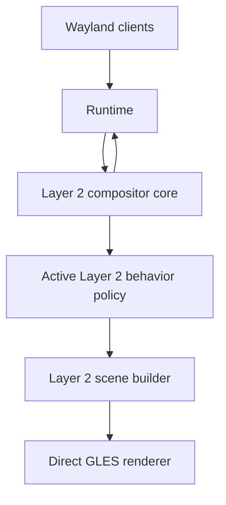
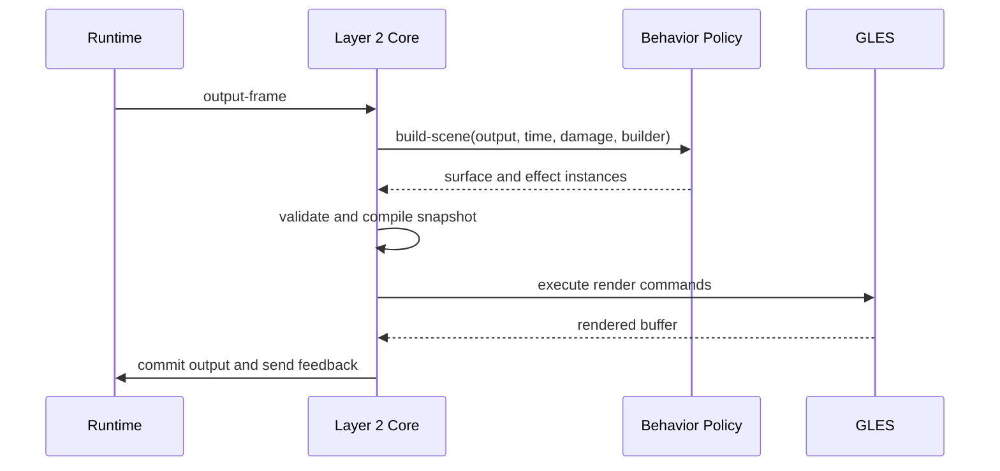
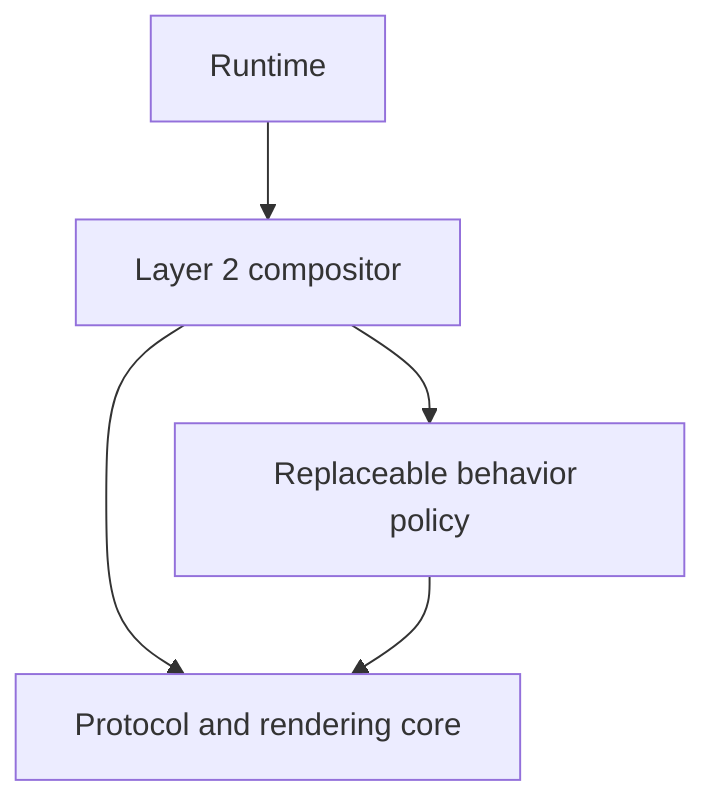

# Layer 2 Behavior Policy Plan

## Goal

Add a replaceable behavior policy inside Layer 2 so that changing the workspace
model does not require rewriting input, presentation, focus, and animation code.

Layer 2 remains one Common Lisp package and one direct object graph. Its core
provides a correct, efficient Wayland compositor, while its behavior policy
defines what that compositor feels and behaves like.

## Final Decisions

- Keep the core and behavior policy in `ataxia.compositor`.
- Use one process, one Lisp image, and one compositor owner thread.
- Use direct synchronous CLOS calls; add no internal mailbox.
- Make one behavior-policy aggregate the unit of live replacement.
- Keep Wayland correctness, native lifetimes, buffers, seats, outputs, damage,
  frame scheduling, and GLES execution in the core.
- Move placement, camera, layout, interaction meaning, scene composition,
  effects, decorations, and animation selection behind the behavior policy.
- Preserve current behavior through a `planar-behavior-policy` before adding
  alternative policies.
- Use a spherical policy as proof that the core contains no planar assumptions.

## Why a Separate Internal Boundary Is Still Required

What will not work is keeping the current Layer 2 structure and only adding
more methods to `world`. Placement assumptions already exist in view state,
move and resize operations, maximization, presentation, hit testing, damage,
animation, and control actions. Extending each of those components separately
would make a new workspace model depend on coordinated subclasses throughout
the compositor. The behavior policy provides the required ownership boundary
without creating another package or runtime layer.

## Layer Boundaries

| Layer | Responsibility |
|---|---|
| Runtime | Direct wlroots and Wayland integration |
| Layer 2 Core | Surfaces, views, outputs, seats, protocol state, buffers, frame scheduling, damage, and GLES execution |
| Layer 2 Behavior Policy | Workspace model, placement, camera, picking, interaction meaning, composition, effects, and animation policy |

Layer 2 must not assume that windows live on a flat plane. It should know that
a view and its surfaces exist, but not where they are or how they are drawn.



## Behavior Policy

installed or replaced at runtime.
The compositor owns one active `behavior-policy`. The policy is the unit that
can be installed or replaced at runtime.
installed or replaced at runtime.

A policy may be implemented as one CLOS object or as several private objects.
The core should not prescribe its internal structure. Components inside a
policy communicate directly through the policy rather than through mailboxes.

Example policies include:

- A fixed desktop with tiling and floating windows.
- An infinite planar canvas with movable cameras.
- A spherical workspace using angular placement and ray-based picking.
- An agent-oriented workspace organized by tasks instead of coordinates.

## Core Objects and Behavior State

Layer 2 views retain protocol information such as the native XDG toplevel,
surface tree, application identity, configure state, and mapped state.

World-specific state moves into an opaque policy-owned object. For example, a
planar policy may store `x`, `y`, `width`, and `height`, while a spherical
policy stores longitude, latitude, angular size, and orientation.

Layer 2 must never inspect this state.

## Object Ownership

Objects must have one clear owner. Shared mutable ownership would recreate the
same coupling under different names.

| Object | Owner | Notes |
|---|---|---|
| Native Runtime wrappers | Runtime | Exact wlroots identity and lifetime |
| Surface and retained buffer records | Layer 2 | Buffer import, release, commit sequence, and surface tree |
| Core view and popup roles | Layer 2 | XDG identity, configure state, map state, title, and application identity |
| Output, seat, and input-device objects | Layer 2 | Native capabilities and protocol delivery state |
| Behavior view/output/seat state | Behavior policy | Placement, camera, layout membership, selection, and policy metadata |
| Interactive operation | Behavior policy | Meaning of move, resize, camera motion, or policy-specific gestures |
| Scene builder and immutable snapshot | Layer 2 | Stable frame and hit-test representation |
| Geometry and surface mapping objects | Behavior policy | Projection and inverse projection used by the snapshot |
| GLES resources and compiled programs | Layer 2 | Context ownership, compilation, binding, and destruction |
| Effect and animation selection | Behavior policy | Decides what should run; the core executes it |
| External control queue and authorization | Layer 2 | Owner-thread entry and capability enforcement |
| Policy-specific commands | Behavior policy | Behavior semantics executed after core authorization |

## Core–Policy Interface

Communication is synchronous and remains on the compositor owner thread. The
interface is a set of direct generic-function calls. Requests and results use
typed CLOS objects, not arbitrary property lists.

The core always validates native object lifetime, Wayland serials, protocol
ordering, security state, and ownership before invoking the policy. The policy
never calls wlroots bindings directly. It returns decisions that the core
validates and executes through typed operations.

### Exact Connection Points

| Connection | Direction | Core provides | Behavior policy returns or performs |
|---|---|---|---|
| Policy attach | Core → Policy | Compositor reference and core capability description | Initializes private state and declares required capabilities |
| Policy activation | Core → Policy | Existing core views, outputs, seats, and current time | Creates behavior state and becomes ready to build scenes |
| Policy quiesce | Core → Policy | Replacement or shutdown reason | Stops creating operations and exports pending state |
| Policy detach | Core → Policy | Final reason after old frames retire | Releases policy-owned state and references |
| Output added | Core → Policy | Stable core output, dimensions, scale, transform, refresh data | Creates camera, workspace, or output behavior state |
| Output changed | Core → Policy | Typed mode, scale, transform, color, or availability change | Updates layout policy and returns invalidation |
| Output removed | Core → Policy | Core output being retired | Migrates or removes its behavior state |
| View created | Core → Policy | Core view with XDG identity and root surface | Creates opaque behavior view state |
| View identity changed | Core → Policy | Typed title or application-ID change | Updates matching, rules, decorations, or agent metadata |
| View committed | Core → Policy | Commit summary, logical size, state changes, and damage revision | Updates constraints and returns scene invalidation |
| View mapped | Core → Policy | Mapped core view and initial size hints | Chooses initial placement, visibility, focus policy, and animation |
| View unmapped | Core → Policy | Core view and reason | Removes it from presentation and cancels related operations |
| View destroyed | Core → Policy | Core view before behavior state is discarded | Releases policy state and spatial-index entries |
| Popup changed | Core → Policy | Parent role and client-supplied local popup geometry | May select popup effects or visibility policy |
| XDG request | Core → Policy | Validated move, resize, maximize, minimize, fullscreen, activation, or decoration request | Returns an accept, ignore, configure, or begin-operation decision |
| Pointer input | Core → Policy | Seat, current snapshot hit, buttons, axes, time, and constraints | Returns deliver, consume, focus, begin/update operation, or camera action |
| Keyboard input | Core → Policy | Seat, key state, modifiers, focused view, and time | Returns compositor command, consume, or deliver-to-client decision |
| Focus decision | Policy → Core | Desired core view or surface target | Core validates mapping and sends Wayland focus/activation calls |
| Cursor decision | Policy → Core | Cursor role, shape, visibility, or policy geometry | Core applies cursor protocol and scene changes |
| Configure decision | Policy → Core | Desired logical size and XDG state | Core sends configure and tracks acknowledgement |
| Scene build | Core → Policy | Output, timestamp, damage context, scene builder, and prior revisions | Emits ordered surface, decoration, cursor, mesh, and effect instances |
| Surface picking | Core → Policy mapping object | Output point and instance-local geometry | Converts the point into surface-local coordinates or reports a miss |
| Scene invalidation | Policy → Core | Changed behavior entity and old/new coverage when known | Core merges scene and surface-buffer damage and schedules frames |
| Animation resolution | Core → Policy | Subject, typed transition, cause, and presentation time | Chooses tracks, easing, shader bindings, or no animation |
| Effect selection | Policy → Core | Effect-chain description attached to a scene instance | Core resolves programs, resources, and GLES execution |
| Agent observation | Core → Policy | Authorized observation request and core snapshot | Adds policy-specific state in a serializable form |
| Agent command | Core → Policy | Authorized typed command at an owner-thread safe point | Executes behavior change and returns result plus invalidation |
| State export | Core → old Policy | Replacement context and destination policy identity | Returns portable semantic state without native wrappers |
| State import | Core → new Policy | Portable state and live core objects | Creates new policy state or rejects the migration before activation |

### Proposed CLOS Boundary

The first interface should remain small enough to audit while allowing typed
request subclasses to expand horizontally.

```lisp
(defgeneric behavior-attach (policy compositor capabilities))
(defgeneric behavior-activate (policy core-state))
(defgeneric behavior-quiesce (policy reason))
(defgeneric behavior-detach (policy reason))

(defgeneric behavior-output-event (policy output event))
(defgeneric behavior-view-event (policy view event))
(defgeneric behavior-popup-event (policy popup event))

(defgeneric behavior-handle-request (policy request context))
(defgeneric behavior-handle-input (policy input context))

(defgeneric behavior-build-scene
    (policy output timestamp damage-context scene-builder))
(defgeneric map-instance-point (surface-map output-x output-y))
(defgeneric map-instance-damage (surface-map surface-damage))

(defgeneric behavior-resolve-animation
    (policy subject transition context))
(defgeneric behavior-execute-command (policy command context))

(defgeneric behavior-export-state (policy replacement-context))
(defgeneric behavior-import-state
    (policy portable-state replacement-context))
```

`behavior-view-event` and related entry points dispatch on typed event classes,
such as `view-mapped`, `view-committed`, or `view-identity-changed`. This avoids
growing a single function with keyword-based branching while keeping the public
boundary explicit.

### Decision Objects

The behavior policy does not mutate protocol state directly. It returns typed decisions such
as:

- `configure-view-decision`
- `focus-target-decision`
- `deliver-input-decision`
- `consume-input-decision`
- `begin-operation-decision`
- `set-camera-decision`
- `scene-invalidation-decision`
- `ignore-request-decision`

Layer 2 validates each decision against current object lifetime and security
state before applying it. Session lock, input inhibition, exclusive focus, and
other security protocols may override any ordinary behavior decision.

## Core Execution Sequences

### Mapping a New Toplevel

1. Runtime reports the XDG toplevel and surface lifecycle to Layer 2.
2. Layer 2 creates the core view and tracks configure/commit state.
3. Layer 2 calls `behavior-view-event` with `view-created`.
4. The policy creates opaque behavior state for the view.
5. Once the initial commit is valid, Layer 2 sends `view-mapped`.
6. The policy returns placement, visibility, initial configure, focus, and
   animation decisions.
7. Layer 2 validates and applies the configure and focus decisions.
8. Layer 2 records invalidation and schedules the relevant outputs.

The behavior policy never retains a transient Runtime callback payload. It
receives stable core objects and copied value objects only.

### Pointer Motion

1. Runtime sends exact pointer motion to Layer 2.
2. Layer 2 updates the logical seat and applies protocol pointer constraints.
3. Layer 2 hit-tests the last rendered scene snapshot.
4. The selected surface instance maps the output point to surface coordinates.
5. Layer 2 constructs a typed input context containing the hit and any active
   policy operation.
6. The behavior policy returns an input decision.
7. Layer 2 either delivers motion to the client, updates focus, applies a
   behavior operation, or consumes the event.
8. Any behavior change returns invalidation which Layer 2 schedules.

The client coordinates used for Wayland input are therefore derived from the
same geometry that produced the visible frame.

### Output Frame

1. Runtime reports an output frame opportunity.
2. Layer 2 collects surface-buffer damage and pending scene invalidation.
3. Layer 2 creates a scene builder and calls `behavior-build-scene`.
4. The behavior policy queries its spatial model and emits ordered instances.
5. Layer 2 expands protocol-owned surface trees, validates resources, and
   compiles instances into GLES render commands.
6. Layer 2 renders damaged regions, commits the output, and stores the immutable
   snapshot as the new input authority.
7. Layer 2 sends frame completion and presentation feedback to sampled clients.



### XDG Move or Resize Request

1. Layer 2 validates the requesting seat, serial, focused surface, and role.
2. The core passes a typed request and stable input context to the policy.
3. The policy may reject it, start a policy operation, or reinterpret it according
   to the active workspace model.
4. During later pointer motion, the policy updates its own operation state.
5. The policy returns configure and invalidation decisions when client size or
   presentation changes.
6. Layer 2 sends XDG configures and handles acknowledgements normally.

A spherical policy can rotate or resize an angular surface patch without
introducing spherical concepts into the XDG implementation.

## Presentation and Picking

The behavior policy builds a scene using core rendering primitives. The central
primitive should be a surface instance containing:

- The Wayland surface being sampled.
- Quad, mesh, or procedural geometry.
- A mapping between output pixels and surface coordinates.
- Clip, depth, opacity, and effect information.
- Projected damage coverage.

The same surface instance must drive rendering, damage, and pointer picking.
This prevents the cursor geometry from disagreeing with the rendered geometry.

A planar policy can use an affine mapping. A spherical policy can use a
ray-sphere intersection followed by a conversion to surface-local coordinates.

## Interaction

Layer 2 owns devices, seats, protocol focus delivery, cursor surfaces, keyboard
delivery, pointer constraints, and serial validation.

The behavior policy decides:

- Which view should receive focus.
- What moving or resizing means.
- Whether a gesture moves a view or the camera.
- How view activation affects stacking or visibility.
- Which cursor and animation policy applies.

Interactive operations are policy-owned objects with begin, update, cancel,
and finish operations. This removes planar move and resize calculations from
the compositor core.

## Live Replacement

Replacing a behavior policy must not restart the compositor or reconnect clients.

1. Construct the new policy beside the active policy.
2. Export portable semantic state from the old policy.
3. Import views, outputs, and user intent into the new policy.
4. Cancel or migrate active policy-specific interactions.
5. Build and validate a trial scene snapshot.
6. Atomically switch the compositor's active policy.
7. Recalculate pointer focus using the new snapshot.
8. Retain old snapshots until submitted frames finish.
9. Detach the old policy.

Migration between unrelated coordinate systems must use an explicit policy.
There is no universally correct conversion from an infinite plane to a sphere.

## Performance Rules

- Use direct calls rather than internal message passing.
- Dispatch CLOS methods at view, frame, and interaction boundaries, not per pixel.
- Cache projections, meshes, and spatial indexes by revision.
- Pick from the last rendered immutable snapshot.
- Let policies provide projected damage, with full-output damage as a fallback.
- Compile scene descriptions into compact GLES render commands before drawing.
- Keep external agent requests as the only queued operations.

## Internal Layer 2 Structure

The chosen design uses one replaceable `behavior-policy` inside Layer 2:



The following dependency rules must be enforced:

1. Core view, seat, output, surface, renderer, and protocol files cannot refer
   to planar or spherical placement classes.
2. All behavior-specific state remains behind the policy object.
3. Scene construction and input meaning enter through the same typed interfaces
   described above.
4. Policy replacement swaps one aggregate, not independent world,
   interaction, presentation, and animation objects.
5. Adding a spherical implementation must not require modifying core protocol,
   input-delivery, or renderer-execution code.

The package remains `ataxia.compositor`. File boundaries, exported interfaces,
and code review must therefore enforce the separation that a distinct package
would otherwise make visible.

## Implementation Order

1. Inventory every planar assumption in model, output, presentation,
   interaction, animation, and control code.
2. Define boundary value objects, decisions, events, and capability descriptions.
3. Add the policy lifecycle and one active behavior slot.
4. Separate core view, popup, output, and seat state from behavior state.
5. Introduce surface instances and their shared render, damage, and pick mapping.
6. Move current planar placement, camera, layout, and spatial indexing into a
   `planar-behavior-policy` without changing visible behavior.
7. Move focus, stacking, move, resize, maximize, fullscreen, decorations, and
   animation selection into the planar policy.
8. Route typed agent commands and observations through the policy boundary.
9. Implement transactional policy replacement and portable state migration.
10. Build a spherical policy and its GLES geometry as the boundary proof.

## Completion Criteria

The behavior-policy boundary is complete when:

- Layer 2 contains no planar placement or camera slots.
- Layer 2 does not perform move, resize, maximize, or stacking mathematics.
- Rendering and pointer coordinates come from the same surface instance.
- Fixed, infinite-planar, and spherical policies use the same core view objects.
- Policies can be replaced without disconnecting clients or recreating seats and
  outputs.
- Active frames may retire safely after a policy swap.
- Invalid behavior decisions cannot bypass Layer 2 protocol or security checks.
- Adding the spherical policy changes only behavior and shader modules.

The spherical policy is the architectural proof: it should require new behavior
code and shaders, but no changes to Runtime or the Layer 2 compositor core.
