# Layer 2 CLOS System Design

Status: architecture planning only. Class names and generic-function names are
contract sketches, not implementation authorization.

## 1. Purpose

Layer 2 is the policy and composition framework of Ataxia. It consumes the typed
events produced by Layer 1, constructs semantic compositor state, invokes
replaceable policies, builds presentation snapshots, routes input, schedules
animations, submits native commands, and exposes controlled agent operations.

The design has four goals:

1. no wlroots pointer or layout appears in Layer 2;
2. no central class accumulates every compositor feature;
3. every desktop policy is replaceable through a CLOS protocol or explicit hook;
4. replacement remains performant because services are pinned per transaction,
   not looked up for every vertex, pixel, or list element.

## 2. Core Design Rules

### 2.1 The kernel owns ordering, not meaning

The Layer 2 kernel owns:

- owner-thread enforcement;
- object identity and lifecycle;
- transactions and revisions;
- event ordering;
- service lookup and replacement;
- hook registration and dispatch;
- command mailbox processing;
- observation delivery;
- safe-point and shutdown coordination.

It does not know what a window position, focus target, resize edge, cursor image,
animation property, or renderable surface means.

### 2.2 Services own semantics

Every semantic operation dispatches first on an active service object. This is
important for hot replacement:

```text
(project-world active-world-service world camera entities viewport)
(route-input active-input-router context event)
(resolve-animation active-animation-resolver context transition)
(build-render-graph active-render-planner presentation output)
```

The first dispatch argument pins the implementation. Globally defining methods
only on `view` or `surface` would leave old and new plugin methods simultaneously
applicable and would not define which implementation is active.

### 2.3 Entities compose immutable components

Semantic objects have identity, lifecycle, revision, and a bounded component
collection. Component values are externally immutable and are owned by a service
identified in their schema.

There is no public `(setf component-value)`. Changes go through mutation
transactions so hooks, animation, observations, and agents see one coherent
transition.

### 2.4 Hooks are not the domain model

CLOS generic functions define durable domain contracts. Hooks provide ordered,
dynamic extension points around those contracts. A render backend is a CLOS
service, not a render hook. A hook can observe or amend a render plan at a named
boundary but does not replace the render protocol itself.

### 2.5 Standard CLOS first

The kernel should use portable CLOS generic functions and explicit descriptors.
It should not require a particular Metaobject Protocol implementation. Class
redefinition may remain useful during development, but supported hot replacement
uses service generations and explicit component migration rather than depending
on implementation-specific instance updating.

## 3. System Overview

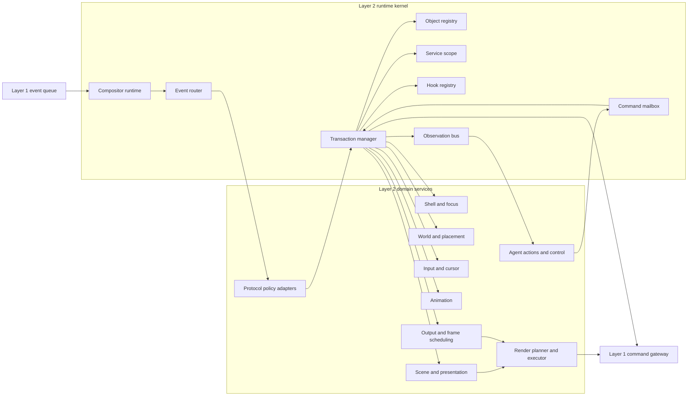

The arrows show permitted collaboration, not inheritance. Domain services do
not reach into runtime slots; they use kernel protocols supplied in a transaction
context.

## 4. Kernel Object Model

### 4.1 Class relationships

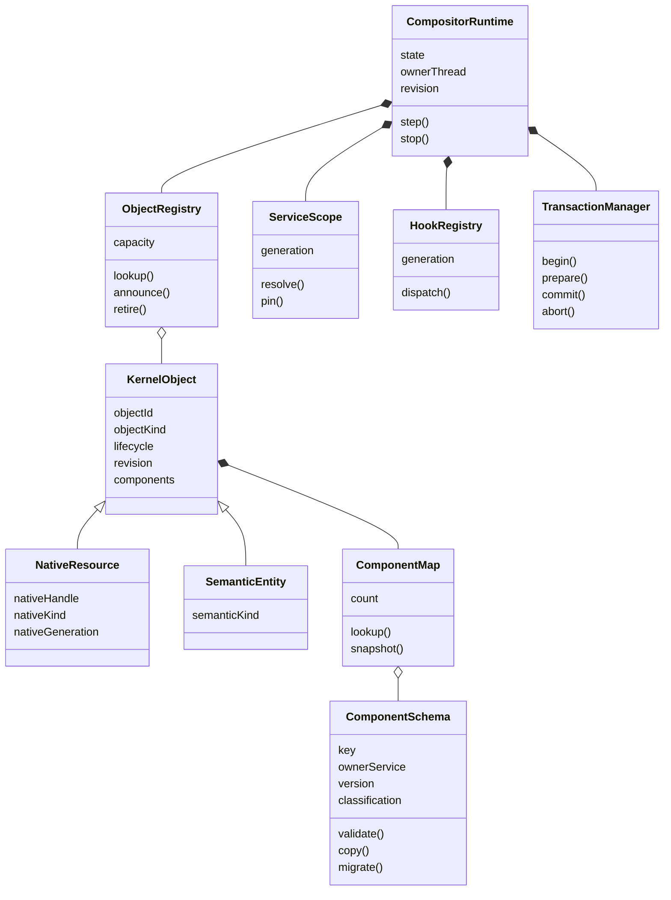

### 4.2 `compositor-runtime`

The runtime is deliberately small. Its conceptual slots are:

| Slot | Responsibility |
|---|---|
| state | `created`, `starting`, `running`, `stopping`, `stopped`, `failed` |
| owner thread | only thread allowed to mutate compositor/native state |
| native gateway | Layer 1 event drain and command submission protocol |
| object registry | all live Layer 2 identities |
| service scope | immutable active service generation |
| hook registry | immutable hook/handler generation |
| transaction manager | revisions, write sets, effects, publication |
| mailbox | cross-thread and agent command ingress |
| observation bus | bounded committed observations |
| frame coordinator | requested outputs, deadlines, active frames |
| clocks | registered monotonic, presentation, and virtual clocks |
| diagnostics | bounded faults, counters, and trace sinks |

The runtime does not store windows, cursors, or animations in dedicated slots.
Those are entities and services in the registry/scope.

### 4.3 `kernel-object`

Every observable Layer 2 object shares:

- stable object identity;
- keyword or descriptor kind;
- lifecycle state;
- monotonically increasing object revision;
- bounded immutable component snapshot;
- creation provenance and timestamp;
- optional semantic classification.

Two subclasses distinguish ownership:

- `native-resource`: mirrors a Layer 1 object and carries an opaque native handle;
- `semantic-entity`: exists only in Layer 2 and may relate multiple resources.

Native retirement and semantic retirement are related but not identical. A view
can outlive one surface commit, while a native surface cannot outlive its handle.

### 4.4 Semantic entity kinds

Initial semantic entity classes should remain shallow:

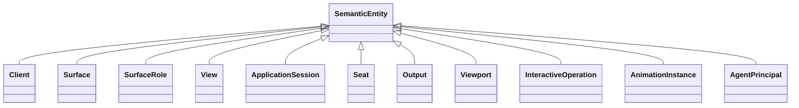

Subclasses express stable identity categories, not behavior matrices. A spherical
view and planar view are both `view`; their placement components and active world
service differ.

### 4.5 Component schema

A component schema is a CLOS object owned by one service family. It defines:

- stable component key and schema version;
- acceptable entity kinds;
- value validation and defensive-copy behavior;
- equality and revision behavior;
- serialization and security classification;
- optional migration between schema versions;
- whether changes require frame, hit-index, focus, or observation invalidation.

The component collection API promises immutable snapshots. The concrete storage
structure remains an implementation choice to benchmark: persistent map,
copy-on-write hash table, or compact sorted vector. That decision must not leak
into domain methods.

### 4.6 Example composition

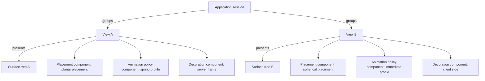

The application session does not own one location. Moving an application as a
group is a grouping-policy operation over its current views.

## 5. CLOS Protocol Conventions

### 5.1 Dispatch convention

Domain generics dispatch on the service first and typed values afterward:

| Generic contract | Primary dispatch |
|---|---|
| adapt native event | protocol adapter, native event |
| validate component | component schema, entity, value |
| project world | world service, world state, camera, entities, viewport |
| place relative entity | world service, parent placement, relation |
| hit test | hit-test service, presentation snapshot, output point |
| route input | input router, route context, input event |
| choose focus | focus policy, focus context, candidates |
| begin interactive operation | shell service, operation request |
| resolve cursor | cursor policy, cursor context |
| resolve animation | animation resolver, animation context, transition |
| sample animation | interpolator, definition, time |
| build scene | scene source, scene context |
| build render graph | render planner, presentation snapshot |
| execute render graph | render executor, frame target, render graph |
| authorize action | action provider, principal, action |

This convention makes the active service generation explicit and prevents
accidental dispatch to a method belonging to an inactive plugin.

### 5.2 Protocol objects versus function slots

Replaceable behavior is represented by CLOS objects with generic functions.
Function values remain appropriate for small pure callbacks such as an easing
curve, but a service is not a property list of closures. CLOS objects provide:

- introspection;
- typed specialization;
- lifecycle methods;
- stable identity and version metadata;
- method combination where it is semantically appropriate;
- coherent replacement as one service instance.

### 5.3 No uncontrolled method combination

Numeric priority, veto, fault containment, and dynamic registration belong to
the hook system. Standard CLOS method combination does not replace hooks because
method order is based on specificity, not arbitrary runtime priority.

Domain generics should normally have one active primary provider. Cooperative
methods are used only where the protocol explicitly defines composition.

## 6. Services and Plugins

### 6.1 Service classes

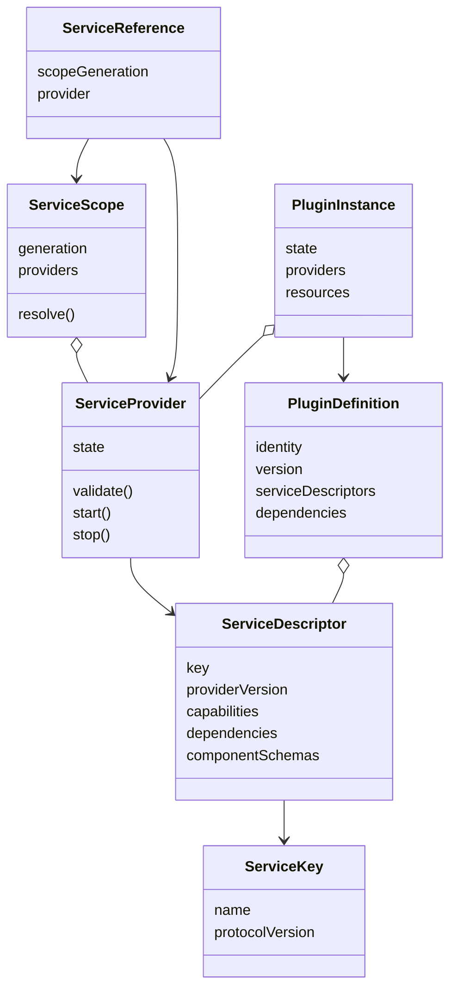

### 6.2 Service scope

A service scope is immutable after publication. It maps service keys to provider
instances and carries a generation. A transaction pins exactly one scope.

Service lookup returns a `service-reference`, not an untracked provider pointer.
The reference keeps the scope generation alive until the transaction/frame ends.

### 6.3 Plugin lifecycle

Plugin activation stages:

1. validate manifest, versions, and dependency graph;
2. construct candidate providers without publishing them;
3. validate component schemas and service collisions;
4. start providers against a private candidate scope;
5. run compatibility/migration preparation;
6. atomically publish the new service scope;
7. let existing pinned transactions finish on the old scope;
8. stop old providers in reverse dependency order.

### 6.4 Atomic replacement diagram

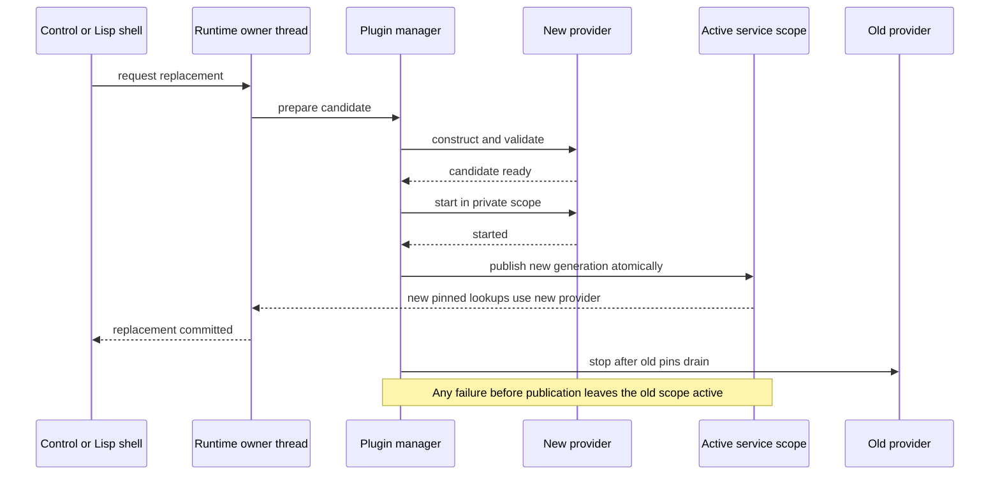

### 6.5 Component migration

Replacing a service does not implicitly reinterpret its old opaque component
values. A provider declares one of:

- values remain compatible;
- migrate values transactionally;
- detach old values and install defaults;
- reject replacement while dependent entities exist.

Migration is bounded and prepared before scope publication. A world-service
replacement may require converting every affected placement; it cannot publish a
half-migrated world.

## 7. Events, Hooks, and Commands

### 7.1 Event classes

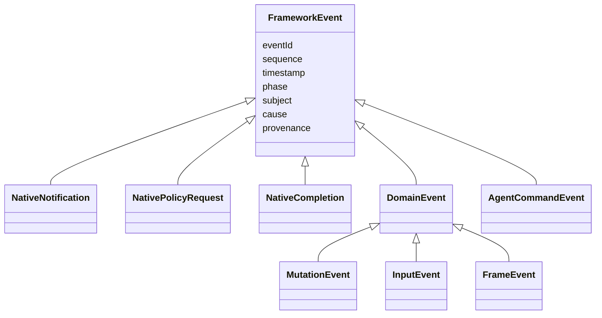

Events are immutable facts or requests. They are not mutable bags that handlers
edit in place.

### 7.2 Protocol adapters

An active protocol adapter translates a Layer 1 event into one of:

- a native-resource lifecycle transition;
- a semantic entity mutation;
- a policy request;
- a native completion reconciliation;
- a domain event.

Adapters do not directly mutate registries. They propose work through the current
transaction.

### 7.3 Event router

The event router selects an adapter using:

- Layer 1 module namespace and schema;
- event opcode;
- subject kind;
- active adapter-service generation.

Routing tables are immutable per service scope. Unknown optional modules can be
ignored only if Layer 1 marked the event optional. Unknown lifecycle or critical
events fail the adapter scope rather than silently desynchronize state.

### 7.4 Hooks

A hook point is an explicitly registered object:

| Property | Meaning |
|---|---|
| identity/version | stable extension contract |
| argument schema | bounded typed arguments |
| reducer | notify, veto, collect, first value, pipeline, or custom reducer |
| failure policy | propagate, disable handler, quarantine plugin, or report |
| criticality | whether failures may be ignored |
| mutation permission | observe only or may propose through transaction writer |
| classification | public, sensitive, secure |

Hook handlers run against a frozen handler list. Adding/removing a handler during
dispatch affects the next invocation.

### 7.5 Events versus hooks versus commands

- **event**: a fact/request routed by the runtime;
- **generic function**: the primary domain contract used to decide behavior;
- **hook**: ordered extension around a named point in that contract;
- **mutation**: proposed framework state transition;
- **effect**: staged external or native side effect;
- **command**: mailbox/RPC request asking the owner thread to run a transaction;
- **native command**: typed outgoing Layer 1 operation.

Conflating these concepts is how a generic framework becomes an untraceable
collection of callbacks.

## 8. Transactions and Mutations

### 8.1 Transaction class

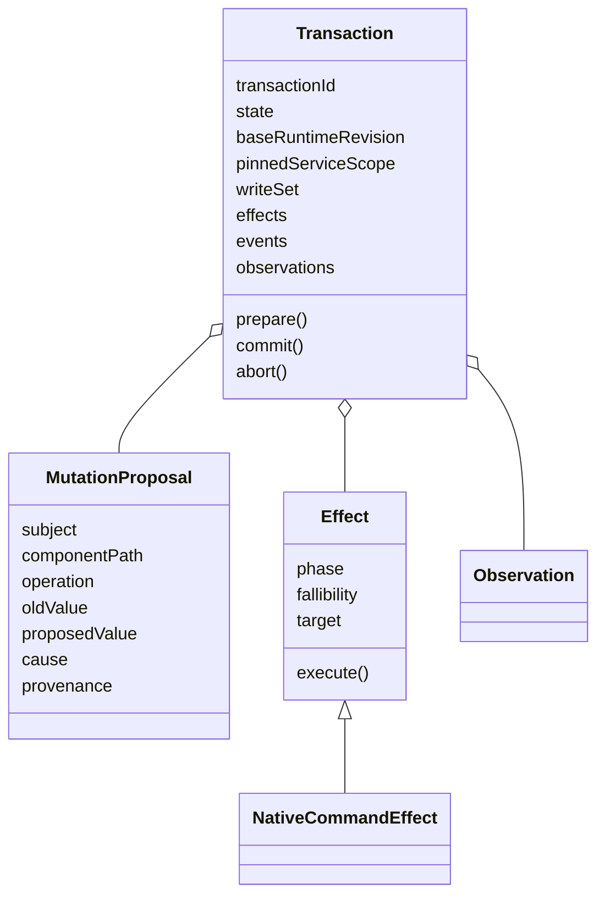

### 8.2 Mutation descriptor

A general mutation proposal contains:

- subject entity;
- component key and optional semantic property path;
- operation descriptor;
- old value/revision;
- proposed value;
- initiating event/cause;
- provenance;
- transaction identity;
- bounded domain metadata.

There is no central enumeration of operations such as `map`, `pickup`, or
`drop`. Domain services define operation descriptors. General animation and
observation services match descriptors without requiring kernel edits.

### 8.3 Transaction stages

1. pin the active service and hook generations;
2. validate initiating event/command;
3. construct bounded mutation proposals;
4. validate component schemas and expected revisions;
5. dispatch authorization/veto hooks;
6. resolve animation and invalidation consequences;
7. prepare fallible native effects and all publication storage;
8. execute required prepublication effects;
9. atomically publish the local write set and runtime revision;
10. execute postpublication notifications/effects;
11. publish domain events and observations;
12. release service pins and temporary values.

### 8.4 Honest native atomicity

Layer 2 transactions are atomic for Layer 2 state. Wayland clients, DRM, and
native commands are external systems and cannot always be rolled back.

Effects declare one of:

- `precondition-only`: no externally visible mutation;
- `required-before-publish`: must succeed before local state publication;
- `post-publish`: failure is reconciled by a completion/fault event;
- `irreversible`: transaction records honest terminal/partial semantics.

The core does not fabricate undo. If a plugin wants history, it observes
committed mutation descriptors and stores inverse domain operations itself.

### 8.5 Native-event transaction sequence

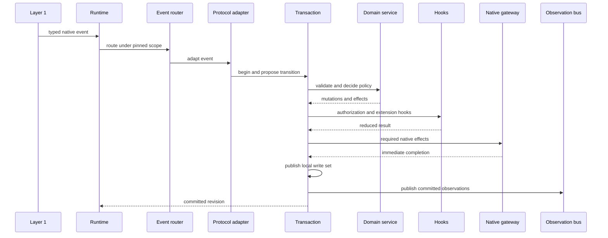

### 8.6 Native asynchronous completion

When a native command completes later, its correlation identity points to a
pending-operation component or entity. The completion is a new event and a new
transaction. The original transaction does not stay open while waiting for a
client or page flip.

## 9. Runtime Turn and Safe Points

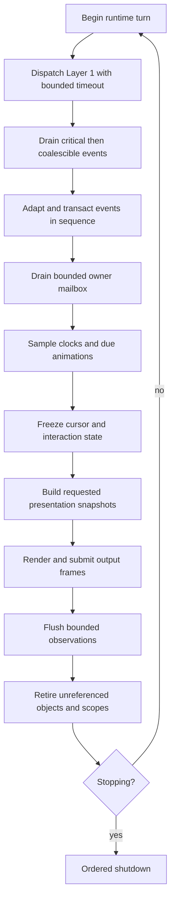

Each stage has a work budget so sustained input or agent traffic cannot starve
frame deadlines. Critical lifecycle ordering is preserved across turns.

## 10. Domain Service Graph

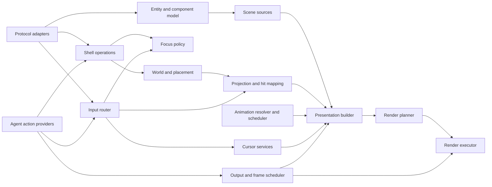

This graph is a dependency graph between service protocols. Providers may be
replaced independently when their declared compatibility requirements hold.

## 11. World, Scene, Presentation, and Rendering

### 11.1 Core value objects

| Value | Owner | Meaning |
|---|---|---|
| world state | world service | opaque spatial universe |
| placement | world service | opaque entity location/orientation/relation |
| camera | world service | opaque projection viewpoint |
| viewport | output policy | output-local logical view definition |
| scene snapshot | scene source | semantic display entities |
| projection snapshot | projection service | frozen render geometry plus inverse mapping |
| animation overlay | animation service | sampled presentation-only changes |
| presentation snapshot | presentation builder | immutable complete output revision |
| hit index | projection/presentation | query structure tied to presentation revision |
| render graph | render planner | validated output-local passes and commands |
| frame target | Layer 1 lease | native target and capability snapshot |

### 11.2 Presentation pipeline

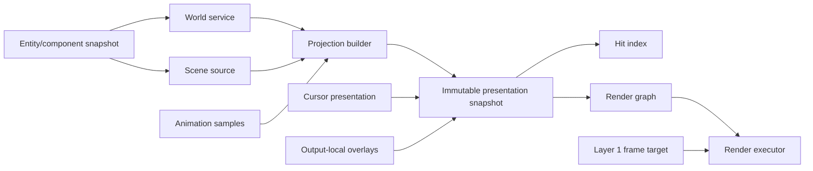

The hit index and render graph share one presentation snapshot. Effects that move
or distort visible content must also supply the corresponding inverse hit map or
declare the content non-interactive.

### 11.3 Service protocols

#### World service

- construct/copy/compare placements;
- compose relative placements;
- apply domain motion operations;
- project entities for a camera/viewport;
- create inverse queries for input;
- serialize bounded semantic placement descriptions;
- migrate placements when supported.

#### Scene source

- enumerate semantic entities for a presentation context;
- provide content, role, overlay, decoration, and cursor lanes;
- declare stable ordering relationships, not final GPU commands.

#### Presentation builder

- pin surface-buffer leases;
- combine scene, projection, animation, cursor, and overlays;
- assign one revision;
- build render and hit inputs from identical geometry;
- retain all service generations required for snapshot lifetime.

#### Render planner

- translate presentation primitives into typed render passes;
- negotiate executor capabilities;
- compute damage, occlusion, batching, and effect dependencies;
- reject unsupported plans before target mutation.

#### Render executor

- acquire/consume Layer 1 frame targets;
- execute validated render graphs;
- import sampled buffers;
- report fences, damage, sampled surfaces, and readback capability;
- cancel safely on any error.

### 11.4 Render graph classes

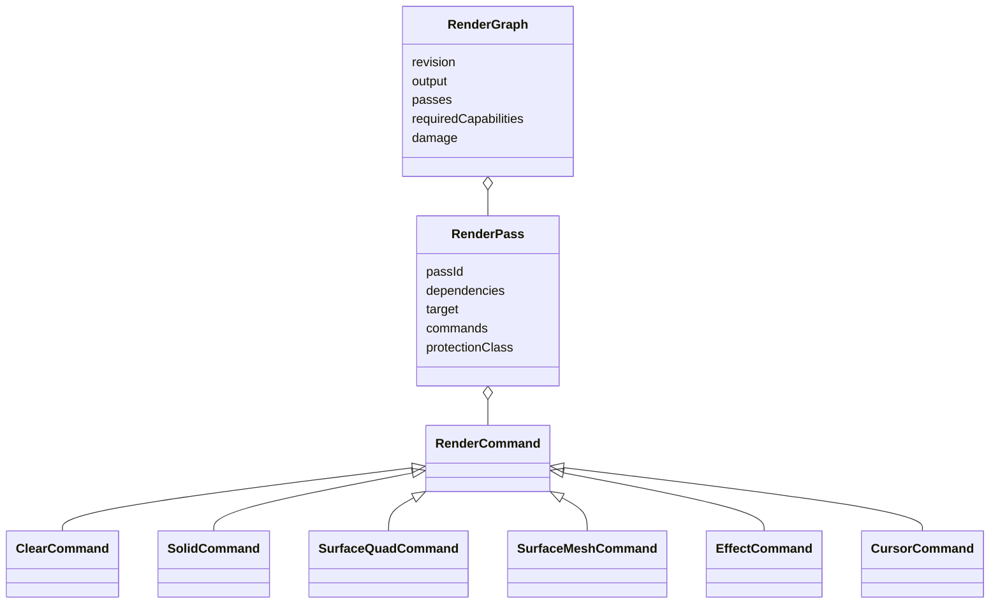

Command subclasses are extensible, but each executor advertises the command and
effect capabilities it accepts. Plugins cannot submit arbitrary foreign calls as
render commands.

## 12. Input, Focus, Cursor, and Interactive Operations

### 12.1 Input service decomposition

- device normalizer;
- seat assignment policy;
- input filter/transform chain;
- grab/interactive-operation router;
- pointer or spatial-navigation motion service;
- presentation hit tester;
- focus policy;
- cursor context and appearance policy;
- protocol seat sink;
- observation sink.

### 12.2 Input route context

One immutable route context contains:

- runtime and pinned service scope;
- seat and device entities;
- provenance;
- current presentation snapshot per relevant output;
- active grab/interactive operation;
- cursor state;
- accumulated route metadata;
- delivery result.

Each stage returns a new context or a bounded stage result. Stages do not mutate
global focus/cursor state behind the transaction.

### 12.3 Pointer interaction sequence

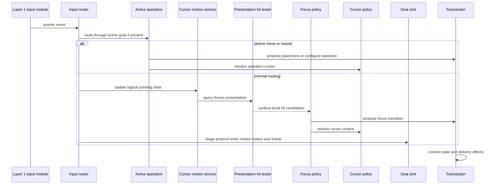

### 12.4 Interactive operation protocol

An interactive operation is an entity with components:

- operation kind descriptor;
- target view;
- initiating seat and validated serial;
- initial placement and configure state;
- input anchor;
- active buttons/touch points;
- cursor context;
- termination conditions;
- operation-specific bounded state.

The shell service supplies generics to begin, update, finish, and cancel an
operation. The runtime guarantees cancellation on target destruction, seat
removal, loss of required grab, shutdown, or explicit policy cancellation.

Move and resize are default operation providers, not hard-coded kernel states.

### 12.5 Cursor state

Cursor state is per logical seat and separates:

- logical position/navigation state;
- current hit/focus context;
- client cursor surface request;
- compositor shape/theme request;
- active operation override;
- animation sample;
- hardware/software rendering decision.

The cursor presentation entity is excluded from hit candidates by schema. A
client cursor surface is content for that entity, not a normal scene view.

## 13. Animation System

### 13.1 Animation classes

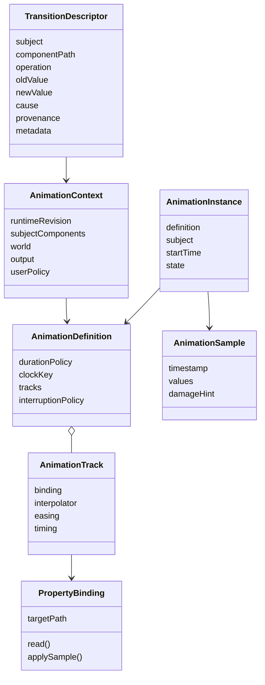

### 13.2 General resolution

Animation resolution is a CLOS service plus a hook point. It receives the full
transition and context. Resolution order is policy-defined but may consult:

1. an explicit per-view animation-policy component;
2. role or application-session policy;
3. current world/profile policy;
4. user/plugin rules;
5. default fallback.

The kernel does not assign special meaning to `map`, `pickup`, or `drop`. A
transition may represent a placement change, focus emphasis, topology change,
surface replacement, opacity policy, spherical geodesic motion, or a plugin’s
new component operation.

### 13.3 Different animations per window

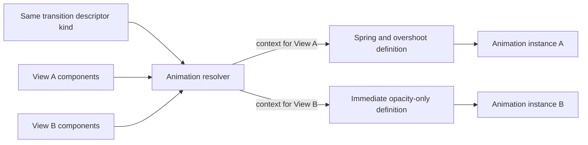

Definitions are resolved when an animation starts and pinned for that instance.
Replacing the global resolver affects new transitions. A separate interruption
policy decides whether existing instances keep, migrate, blend, or terminate.

### 13.4 Model versus presentation animation

#### Model animation

Samples invoke a domain mutation binding, such as a world-service placement
operation. This changes authoritative state and publishes mutations.

Use it when intermediate state must affect semantics, navigation, or persistence.

#### Presentation animation

Samples produce an overlay applied while freezing the presentation snapshot.
Authoritative state may already be at its target.

Use it for visual transitions, shadows, opacity, decoration, or client-buffer
cross-fades. The overlay must update hit geometry if it moves interactive
content.

### 13.5 Scheduler

The scheduler maintains only active instances. Each runtime turn:

1. group due instances by clock;
2. sample each definition into a bounded arena;
3. apply model bindings through one transaction;
4. publish presentation overlays keyed by subject and revision;
5. invalidate affected outputs/regions;
6. retire completed instances;
7. request the next deadline only while active work remains.

CLOS dispatch occurs per animation instance/track, not per mesh vertex or pixel.
Bindings and interpolators may compile optimized samplers for hot paths.

## 14. Output and Frame Coordination

### 14.1 Frame coordinator

The frame coordinator tracks:

- output frame requests and presentation deadlines;
- content/animation/cursor invalidations;
- in-flight frame transactions;
- output configuration generation;
- per-output presentation revision;
- renderer and scheduler service pins.

### 14.2 Frame sequence

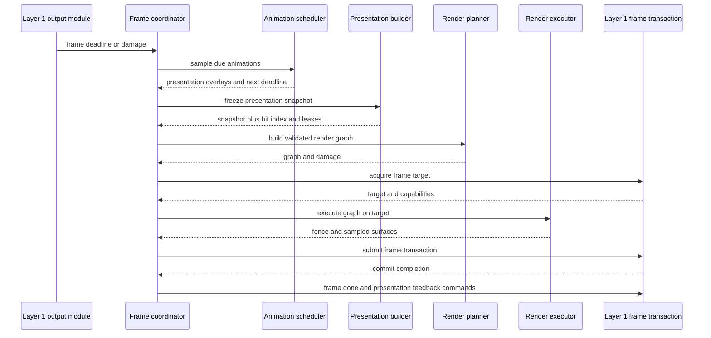

One output frame pins all participating service generations until submission or
cancellation.

## 15. Agentic Control

### 15.1 Control classes

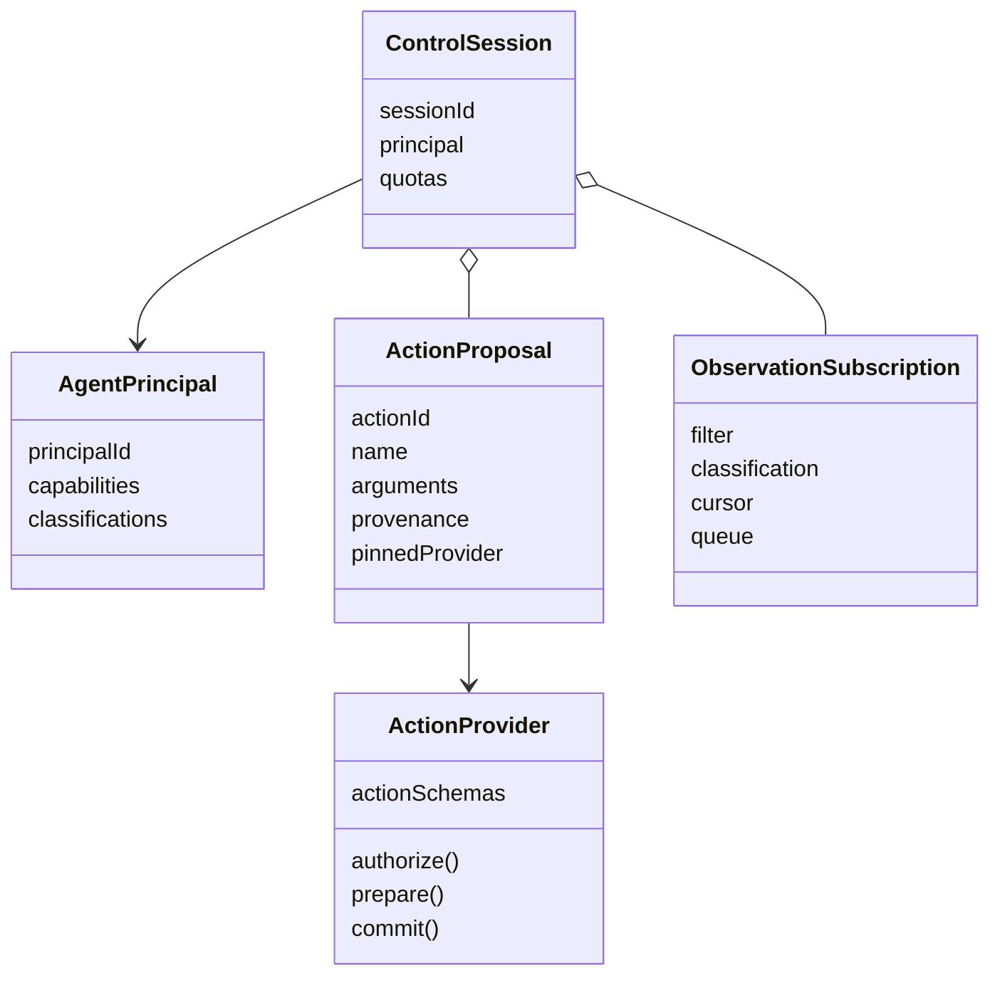

### 15.2 Action flow

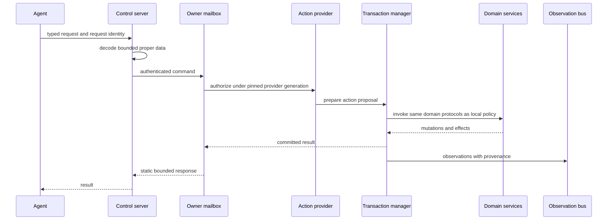

Agent actions do not bypass hooks, animation resolution, focus policy, input
routing, or service replacement rules. Synthetic input enters after native device
normalization but before logical routing, with explicit provenance.

## 16. Package Boundaries

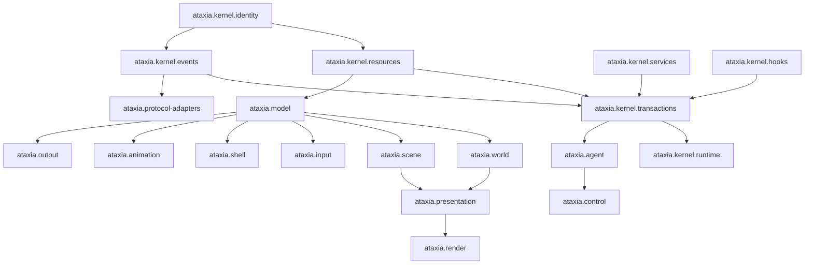

Rules:

- kernel packages never depend on domain packages;
- domain packages depend on kernel protocols, not runtime internals;
- protocol adapters may depend on native public wrappers and domain protocols;
- render, input, shell, and animation do not depend on wlroots/CFFI packages;
- profiles/plugins depend on domain protocols and provide services;
- the executable composition root is the only package allowed to assemble all
  domains and defaults.

## 17. Ownership and Lifecycle Summary

| Object/value | Creator | Mutator | Lifetime owner |
|---|---|---|---|
| native resource mirror | protocol adapter transaction | resource protocol | object registry |
| semantic entity | domain service transaction | owning domain service | object registry |
| component value | component-owning service | replacement transaction only | entity snapshot |
| service provider | plugin manager | provider lifecycle protocol | service scope/plugin instance |
| hook handler | plugin/control transaction | hook registry transaction | hook generation |
| transaction | transaction manager | owner thread | one runtime operation |
| presentation snapshot | presentation builder | immutable | in-flight frame/readers |
| buffer lease | Layer 1 gateway | release only | presentation/frame transaction |
| animation instance | animation scheduler | scheduler transaction | active set/entity registry |
| interactive operation | shell service | shell/input transactions | entity registry |
| agent proposal | action provider | transaction stages | control request |

## 18. Layer 2 Invariants

1. Only the owner thread publishes Layer 2 mutations.
2. Every transaction pins one service scope and one hook generation.
3. No domain service accesses runtime slots directly.
4. No public component value is mutated in place after publication.
5. Every component schema has one owning service identity.
6. No kernel object assumes Euclidean coordinates.
7. Placement belongs to views/entities, not application identity.
8. Render and hit geometry share one presentation revision.
9. Cursor presentation content is never a hit-test candidate.
10. Native effects report honest completion; local atomicity does not imply
    external rollback.
11. Service replacement publishes only a fully validated candidate scope.
12. Old providers remain alive while pinned transactions or frames use them.
13. Animation resolution receives a general transition descriptor and may vary
    per subject.
14. Agent actions use the same domain protocols and hooks as local operations.
15. Every queue, component collection, event payload, render plan, animation set,
    and observation is bounded.
16. The kernel can run with no desktop-profile plugin installed.

## 19. Decisions Still Required

1. Choose the concrete immutable component-map representation after benchmarks.
2. Decide whether semantic entity kinds are shallow subclasses, explicit kind
   descriptors, or a hybrid; behavior remains service-owned either way.
3. Define which native effects qualify as `required-before-publish` for the
   initial protocols.
4. Define whether component migration is mandatory for hot world replacement or
   whether providers may reject replacement with live placements.
5. Approve whether presentation snapshots retain old service providers directly
   or retain a scope-generation lease.
6. Define initial hook catalog and which hooks may veto or propose mutations.
7. Choose observation classifications and default redaction boundaries.
8. Confirm the conventional planar profile as the first end-to-end provider set.

No Layer 2 implementation should begin until these choices and the class/service
boundaries in this document are approved.

