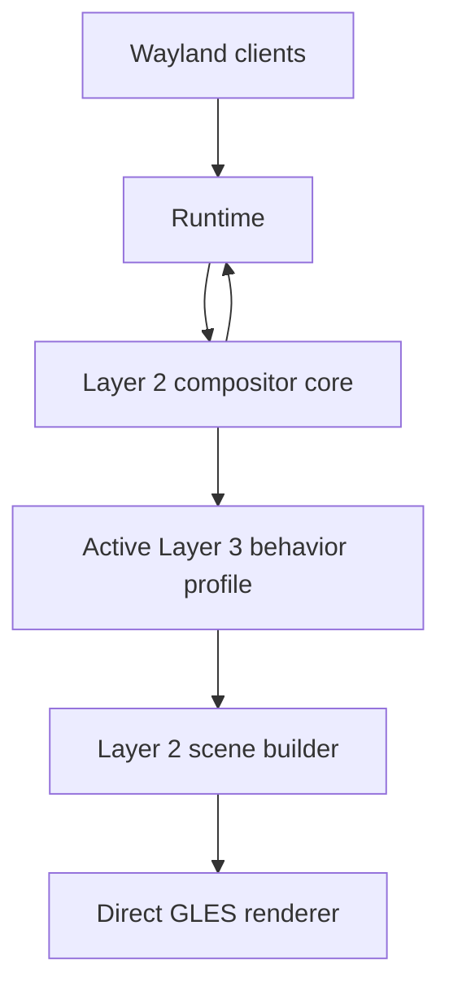

# Layer 3 Behavior Plan

## Goal

Add a behavior layer above the compositor core so that changing the workspace
model does not require rewriting input, presentation, focus, and animation code.

Layer 2 will provide a correct, efficient Wayland compositor. Layer 3 will
define what that compositor feels and behaves like.

## Layer Boundaries

| Layer | Responsibility |
|---|---|
| Runtime | Direct wlroots and Wayland integration |
| Layer 2: Compositor Core | Surfaces, views, outputs, seats, protocol state, buffers, frame scheduling, damage, and GLES execution |
| Layer 3: Behavior | Workspace model, placement, camera, picking, interaction meaning, composition, effects, and animation policy |

Layer 2 must not assume that windows live on a flat plane. It should know that
a view and its surfaces exist, but not where they are or how they are drawn.

## Behavior Profile

Layer 2 owns one active `behavior-profile`. The profile is the unit that can be
installed or replaced at runtime.

A profile may be implemented as one CLOS object or as several private objects.
Layer 2 should not prescribe its internal structure. Components inside a
profile communicate directly through the profile rather than through mailboxes.

Example profiles include:

- A fixed desktop with tiling and floating windows.
- An infinite planar canvas with movable cameras.
- A spherical workspace using angular placement and ray-based picking.
- An agent-oriented workspace organized by tasks instead of coordinates.

## Core Objects and Behavior State

Layer 2 views retain protocol information such as the native XDG toplevel,
surface tree, application identity, configure state, and mapped state.

World-specific state moves into an opaque profile-owned object. For example, a
planar profile may store `x`, `y`, `width`, and `height`, while a spherical
profile stores longitude, latitude, angular size, and orientation.

Layer 2 must never inspect this state.

## Layer 2–3 Interface

Communication is synchronous and remains on the compositor owner thread. The
main interface should cover a small number of explicit decision points:

- Admit, map, unmap, and remove a view.
- Handle typed XDG and input requests after Layer 2 validates them.
- Build the scene for an output and timestamp.
- Pick a target from the last rendered scene snapshot.
- React to output, seat, and application changes.
- Export and import state during profile replacement.
- Expose profile-specific commands to the agent control plane.

Requests must use typed CLOS objects, not arbitrary property lists. Layer 2
continues to enforce Wayland serials, object lifetime, and protocol ordering.

## Presentation and Picking

Layer 3 builds a scene using Layer 2 rendering primitives. The central primitive
should be a surface instance containing:

- The Wayland surface being sampled.
- Quad, mesh, or procedural geometry.
- A mapping between output pixels and surface coordinates.
- Clip, depth, opacity, and effect information.
- Projected damage coverage.

The same surface instance must drive rendering, damage, and pointer picking.
This prevents the cursor geometry from disagreeing with the rendered geometry.

A planar profile can use an affine mapping. A spherical profile can use a
ray-sphere intersection followed by a conversion to surface-local coordinates.

## Interaction

Layer 2 owns devices, seats, protocol focus delivery, cursor surfaces, keyboard
delivery, pointer constraints, and serial validation.

Layer 3 decides:

- Which view should receive focus.
- What moving or resizing means.
- Whether a gesture moves a view or the camera.
- How view activation affects stacking or visibility.
- Which cursor and animation policy applies.

Interactive operations are profile-owned objects with begin, update, cancel,
and finish operations. This removes planar move and resize calculations from
the compositor core.

## Live Replacement

Replacing a profile must not restart the compositor or reconnect clients.

1. Construct the new profile beside the active profile.
2. Export portable semantic state from the old profile.
3. Import views, outputs, and user intent into the new profile.
4. Cancel or migrate active profile-specific interactions.
5. Build and validate a trial scene snapshot.
6. Atomically switch the compositor's active profile.
7. Recalculate pointer focus using the new snapshot.
8. Retain old snapshots until submitted frames finish.
9. Detach the old profile.

Migration between unrelated coordinate systems must use an explicit policy.
There is no universally correct conversion from an infinite plane to a sphere.

## Performance Rules

- Use direct calls rather than internal message passing.
- Dispatch CLOS methods at view, frame, and interaction boundaries, not per pixel.
- Cache projections, meshes, and spatial indexes by revision.
- Pick from the last rendered immutable snapshot.
- Let profiles provide projected damage, with full-output damage as a fallback.
- Compile scene descriptions into compact GLES render commands before drawing.
- Keep external agent requests as the only queued operations.

## Implementation Order

1. Add the behavior profile lifecycle and active profile slot.
2. Separate core view state from profile-owned view state.
3. Introduce surface instances and a shared render/pick mapping.
4. Move planar placement and camera logic into a planar profile.
5. Move interactive move, resize, focus, and stacking policy into the profile.
6. Move decoration, effects, and animation selection into the profile.
7. Implement transactional live profile replacement.
8. Build a spherical reference profile to validate the boundary.

The spherical profile is the architectural proof: it should require new Layer 3
code and shaders, but no changes to Runtime or the Layer 2 compositor core.
