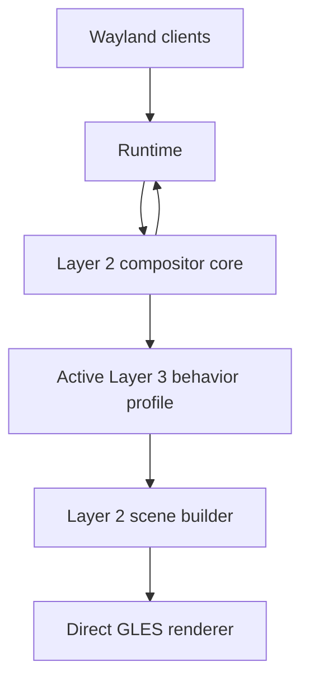
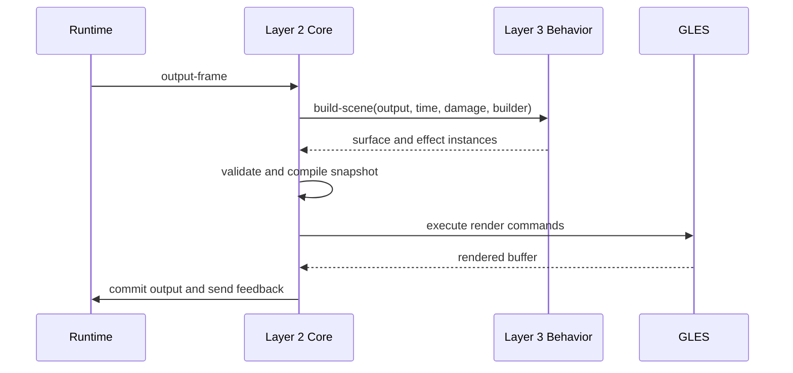
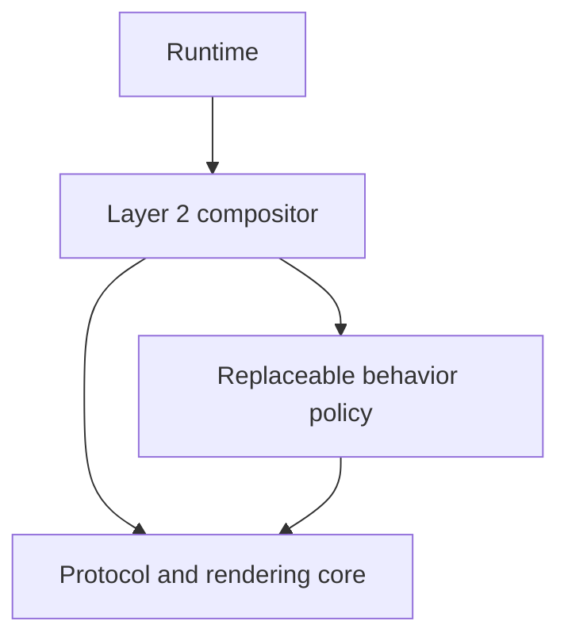

# Layer 3 Behavior Plan

## Goal

Add a behavior layer above the compositor core so that changing the workspace
model does not require rewriting input, presentation, focus, and animation code.

Layer 2 will provide a correct, efficient Wayland compositor. Layer 3 will
define what that compositor feels and behaves like.

## Can This Be Done With Only Layer 2?

Yes, but only as a naming and packaging choice.

The behavior profile could remain inside the Layer 2 ASDF system and be called
a policy subsystem instead of Layer 3. That would have the same runtime cost
and can use the same interfaces described here. A separate process, event loop,
thread, or mailbox is neither required nor desirable.

What will not work is keeping the current Layer 2 structure and only adding
more methods to `world`. Placement assumptions already exist in view state,
move and resize operations, maximization, presentation, hit testing, damage,
animation, and control actions. Extending each of those components separately
would make a new workspace model depend on coordinated subclasses throughout
the compositor.

The practical choices are therefore:

| Choice | Feasible | Assessment |
|---|---:|---|
| Keep the current Layer 2 and expand `world` | No | Spatial behavior remains distributed and replacement stays incomplete |
| Add a behavior profile inside Layer 2 | Yes | Technically identical to this proposal, but the boundary is organizational rather than a named layer |
| Add a named Layer 3 behavior package | Yes | Clearest ownership and easiest enforcement of dependencies |

The recommendation is to use a logical Layer 3 and initially keep it in the
same Lisp image and repository. Whether it becomes a separate ASDF system can
be decided after the interfaces stabilize.

## Layer Boundaries

| Layer | Responsibility |
|---|---|
| Runtime | Direct wlroots and Wayland integration |
| Layer 2: Compositor Core | Surfaces, views, outputs, seats, protocol state, buffers, frame scheduling, damage, and GLES execution |
| Layer 3: Behavior | Workspace model, placement, camera, picking, interaction meaning, composition, effects, and animation policy |

Layer 2 must not assume that windows live on a flat plane. It should know that
a view and its surfaces exist, but not where they are or how they are drawn.



## Behavior Profile

Layer 2 owns one active `behavior-profile`. The profile is the unit that can be
installed or replaced at runtime.

A profile may be implemented as one CLOS object or as several private objects.
Layer 2 should not prescribe its internal structure. Components inside a
profile communicate directly through the profile rather than through mailboxes.

Example profiles include:

- A fixed desktop with tiling and floating windows.
- An infinite planar canvas with movable cameras.
- A spherical workspace using angular placement and ray-based picking.
- An agent-oriented workspace organized by tasks instead of coordinates.

## Core Objects and Behavior State

Layer 2 views retain protocol information such as the native XDG toplevel,
surface tree, application identity, configure state, and mapped state.

World-specific state moves into an opaque profile-owned object. For example, a
planar profile may store `x`, `y`, `width`, and `height`, while a spherical
profile stores longitude, latitude, angular size, and orientation.

Layer 2 must never inspect this state.

## Object Ownership

Objects must have one clear owner. Shared mutable ownership would recreate the
same coupling under different names.

| Object | Owner | Notes |
|---|---|---|
| Native Runtime wrappers | Runtime | Exact wlroots identity and lifetime |
| Surface and retained buffer records | Layer 2 | Buffer import, release, commit sequence, and surface tree |
| Core view and popup roles | Layer 2 | XDG identity, configure state, map state, title, and application identity |
| Output, seat, and input-device objects | Layer 2 | Native capabilities and protocol delivery state |
| Behavior view/output/seat state | Layer 3 | Placement, camera, layout membership, selection, and profile metadata |
| Interactive operation | Layer 3 | Meaning of move, resize, camera motion, or profile-specific gestures |
| Scene builder and immutable snapshot | Layer 2 | Stable frame and hit-test representation |
| Geometry and surface mapping objects | Layer 3 | Projection and inverse projection used by the snapshot |
| GLES resources and compiled programs | Layer 2 | Context ownership, compilation, binding, and destruction |
| Effect and animation selection | Layer 3 | Decides what should run; Layer 2 executes it |
| External control queue and authorization | Layer 2 | Owner-thread entry and capability enforcement |
| Profile-specific commands | Layer 3 | Behavior semantics executed after Layer 2 authorization |

## Layer 2–3 Interface

Communication is synchronous and remains on the compositor owner thread. The
interface is a set of direct generic-function calls. Requests and results use
typed CLOS objects, not arbitrary property lists.

Layer 2 always validates native object lifetime, Wayland serials, protocol
ordering, security state, and ownership before invoking Layer 3. Layer 3 never
calls wlroots bindings directly. It returns decisions that Layer 2 validates and
executes through typed core operations.

### Exact Connection Points

| Connection | Direction | Layer 2 provides | Layer 3 returns or performs |
|---|---|---|---|
| Profile attach | L2 → L3 | Compositor reference and core capability description | Initializes private state and declares required capabilities |
| Profile activation | L2 → L3 | Existing core views, outputs, seats, and current time | Creates behavior state and becomes ready to build scenes |
| Profile quiesce | L2 → L3 | Replacement or shutdown reason | Stops creating operations and exports pending state |
| Profile detach | L2 → L3 | Final reason after old frames retire | Releases profile-owned state and references |
| Output added | L2 → L3 | Stable core output, dimensions, scale, transform, refresh data | Creates camera, workspace, or output behavior state |
| Output changed | L2 → L3 | Typed mode, scale, transform, color, or availability change | Updates layout policy and returns invalidation |
| Output removed | L2 → L3 | Core output being retired | Migrates or removes its behavior state |
| View created | L2 → L3 | Core view with XDG identity and root surface | Creates opaque behavior view state |
| View identity changed | L2 → L3 | Typed title or application-ID change | Updates matching, rules, decorations, or agent metadata |
| View committed | L2 → L3 | Commit summary, logical size, state changes, and damage revision | Updates constraints and returns scene invalidation |
| View mapped | L2 → L3 | Mapped core view and initial size hints | Chooses initial placement, visibility, focus policy, and animation |
| View unmapped | L2 → L3 | Core view and reason | Removes it from presentation and cancels related operations |
| View destroyed | L2 → L3 | Core view before behavior state is discarded | Releases profile state and spatial-index entries |
| Popup changed | L2 → L3 | Parent role and client-supplied local popup geometry | May select popup effects or visibility policy |
| XDG request | L2 → L3 | Validated move, resize, maximize, minimize, fullscreen, activation, or decoration request | Returns an accept, ignore, configure, or begin-operation decision |
| Pointer input | L2 → L3 | Seat, current snapshot hit, buttons, axes, time, and constraints | Returns deliver, consume, focus, begin/update operation, or camera action |
| Keyboard input | L2 → L3 | Seat, key state, modifiers, focused view, and time | Returns compositor command, consume, or deliver-to-client decision |
| Focus decision | L3 → L2 | Desired core view or surface target | Layer 2 validates mapping and sends Wayland focus/activation calls |
| Cursor decision | L3 → L2 | Cursor role, shape, visibility, or profile geometry | Layer 2 applies cursor protocol and scene changes |
| Configure decision | L3 → L2 | Desired logical size and XDG state | Layer 2 sends configure and tracks acknowledgement |
| Scene build | L2 → L3 | Output, timestamp, damage context, scene builder, and prior revisions | Emits ordered surface, decoration, cursor, mesh, and effect instances |
| Surface picking | L2 → L3 mapping object | Output point and instance-local geometry | Converts the point into surface-local coordinates or reports a miss |
| Scene invalidation | L3 → L2 | Changed behavior entity and old/new coverage when known | Layer 2 merges scene and surface-buffer damage and schedules frames |
| Animation resolution | L2 → L3 | Subject, typed transition, cause, and presentation time | Chooses tracks, easing, shader bindings, or no animation |
| Effect selection | L3 → L2 | Effect-chain description attached to a scene instance | Layer 2 resolves programs, resources, and GLES execution |
| Agent observation | L2 → L3 | Authorized observation request and core snapshot | Adds profile-specific state in a serializable form |
| Agent command | L2 → L3 | Authorized typed command at an owner-thread safe point | Executes behavior change and returns result plus invalidation |
| State export | L2 → old L3 | Replacement context and destination profile identity | Returns portable semantic state without native wrappers |
| State import | L2 → new L3 | Portable state and live core objects | Creates new profile state or rejects the migration before activation |

### Proposed CLOS Boundary

The first interface should remain small enough to audit while allowing typed
request subclasses to expand horizontally.

```lisp
(defgeneric behavior-attach (profile compositor capabilities))
(defgeneric behavior-activate (profile core-state))
(defgeneric behavior-quiesce (profile reason))
(defgeneric behavior-detach (profile reason))

(defgeneric behavior-output-event (profile output event))
(defgeneric behavior-view-event (profile view event))
(defgeneric behavior-popup-event (profile popup event))

(defgeneric behavior-handle-request (profile request context))
(defgeneric behavior-handle-input (profile input context))

(defgeneric behavior-build-scene
    (profile output timestamp damage-context scene-builder))
(defgeneric map-instance-point (surface-map output-x output-y))
(defgeneric map-instance-damage (surface-map surface-damage))

(defgeneric behavior-resolve-animation
    (profile subject transition context))
(defgeneric behavior-execute-command (profile command context))

(defgeneric behavior-export-state (profile replacement-context))
(defgeneric behavior-import-state
    (profile portable-state replacement-context))
```

`behavior-view-event` and related entry points dispatch on typed event classes,
such as `view-mapped`, `view-committed`, or `view-identity-changed`. This avoids
growing a single function with keyword-based branching while keeping the public
boundary explicit.

### Decision Objects

Layer 3 does not mutate protocol state directly. It returns typed decisions such
as:

- `configure-view-decision`
- `focus-target-decision`
- `deliver-input-decision`
- `consume-input-decision`
- `begin-operation-decision`
- `set-camera-decision`
- `scene-invalidation-decision`
- `ignore-request-decision`

Layer 2 validates each decision against current object lifetime and security
state before applying it. Session lock, input inhibition, exclusive focus, and
other security protocols may override any ordinary behavior decision.

## Core Execution Sequences

### Mapping a New Toplevel

1. Runtime reports the XDG toplevel and surface lifecycle to Layer 2.
2. Layer 2 creates the core view and tracks configure/commit state.
3. Layer 2 calls `behavior-view-event` with `view-created`.
4. The profile creates opaque behavior state for the view.
5. Once the initial commit is valid, Layer 2 sends `view-mapped`.
6. The profile returns placement, visibility, initial configure, focus, and
   animation decisions.
7. Layer 2 validates and applies the configure and focus decisions.
8. Layer 2 records invalidation and schedules the relevant outputs.

Layer 3 never retains a transient Runtime callback payload. It receives stable
Layer 2 objects and copied value objects only.

### Pointer Motion

1. Runtime sends exact pointer motion to Layer 2.
2. Layer 2 updates the logical seat and applies protocol pointer constraints.
3. Layer 2 hit-tests the last rendered scene snapshot.
4. The selected surface instance maps the output point to surface coordinates.
5. Layer 2 constructs a typed input context containing the hit and any active
   profile operation.
6. Layer 3 returns an input decision.
7. Layer 2 either delivers motion to the client, updates focus, applies a
   behavior operation, or consumes the event.
8. Any behavior change returns invalidation which Layer 2 schedules.

The client coordinates used for Wayland input are therefore derived from the
same geometry that produced the visible frame.

### Output Frame

1. Runtime reports an output frame opportunity.
2. Layer 2 collects surface-buffer damage and pending scene invalidation.
3. Layer 2 creates a scene builder and calls `behavior-build-scene`.
4. Layer 3 queries its spatial model and emits ordered instances.
5. Layer 2 expands protocol-owned surface trees, validates resources, and
   compiles instances into GLES render commands.
6. Layer 2 renders damaged regions, commits the output, and stores the immutable
   snapshot as the new input authority.
7. Layer 2 sends frame completion and presentation feedback to sampled clients.



### XDG Move or Resize Request

1. Layer 2 validates the requesting seat, serial, focused surface, and role.
2. Layer 2 passes a typed request and stable input context to Layer 3.
3. Layer 3 may reject it, start a profile operation, or reinterpret it according
   to the active workspace model.
4. During later pointer motion, Layer 3 updates its own operation state.
5. Layer 3 returns configure and invalidation decisions when client size or
   presentation changes.
6. Layer 2 sends XDG configures and handles acknowledgements normally.

A spherical profile can rotate or resize an angular surface patch without
introducing spherical concepts into the XDG implementation.

## Presentation and Picking

Layer 3 builds a scene using Layer 2 rendering primitives. The central primitive
should be a surface instance containing:

- The Wayland surface being sampled.
- Quad, mesh, or procedural geometry.
- A mapping between output pixels and surface coordinates.
- Clip, depth, opacity, and effect information.
- Projected damage coverage.

The same surface instance must drive rendering, damage, and pointer picking.
This prevents the cursor geometry from disagreeing with the rendered geometry.

A planar profile can use an affine mapping. A spherical profile can use a
ray-sphere intersection followed by a conversion to surface-local coordinates.

## Interaction

Layer 2 owns devices, seats, protocol focus delivery, cursor surfaces, keyboard
delivery, pointer constraints, and serial validation.

Layer 3 decides:

- Which view should receive focus.
- What moving or resizing means.
- Whether a gesture moves a view or the camera.
- How view activation affects stacking or visibility.
- Which cursor and animation policy applies.

Interactive operations are profile-owned objects with begin, update, cancel,
and finish operations. This removes planar move and resize calculations from
the compositor core.

## Live Replacement

Replacing a profile must not restart the compositor or reconnect clients.

1. Construct the new profile beside the active profile.
2. Export portable semantic state from the old profile.
3. Import views, outputs, and user intent into the new profile.
4. Cancel or migrate active profile-specific interactions.
5. Build and validate a trial scene snapshot.
6. Atomically switch the compositor's active profile.
7. Recalculate pointer focus using the new snapshot.
8. Retain old snapshots until submitted frames finish.
9. Detach the old profile.

Migration between unrelated coordinate systems must use an explicit policy.
There is no universally correct conversion from an infinite plane to a sphere.

## Performance Rules

- Use direct calls rather than internal message passing.
- Dispatch CLOS methods at view, frame, and interaction boundaries, not per pixel.
- Cache projections, meshes, and spatial indexes by revision.
- Pick from the last rendered immutable snapshot.
- Let profiles provide projected damage, with full-output damage as a fallback.
- Compile scene descriptions into compact GLES render commands before drawing.
- Keep external agent requests as the only queued operations.

## Layer-2-Only Variant

If a named Layer 3 is undesirable, the same design can be implemented as one
replaceable `behavior-policy` inside Layer 2:



This variant is acceptable only if the following dependency rules are enforced:

1. Core view, seat, output, surface, renderer, and protocol files cannot refer
   to planar or spherical placement classes.
2. All behavior-specific state remains behind the policy object.
3. Scene construction and input meaning enter through the same typed interfaces
   described above.
4. Profile replacement swaps one policy aggregate, not independent world,
   interaction, presentation, and animation objects.
5. Adding a spherical implementation must not require modifying core protocol,
   input-delivery, or renderer-execution code.

The advantage is fewer named layers and packages. The danger is social rather
than technical: because policy code lives beside core code, it is easier for
planar assumptions to leak back into Layer 2. A separate Layer 3 package makes
dependency violations visible to ASDF and package imports.

The preferred compromise is:

- One process and one owner thread.
- Direct CLOS calls with no internal mailbox.
- A separate `ataxia.behavior` package and dependency direction.
- Behavior profiles may remain in the same ASDF distribution initially.

## Implementation Order

1. Inventory every planar assumption in model, output, presentation,
   interaction, animation, and control code.
2. Define boundary value objects, decisions, events, and capability descriptions.
3. Add the profile lifecycle and one active behavior slot.
4. Separate core view, popup, output, and seat state from behavior state.
5. Introduce surface instances and their shared render, damage, and pick mapping.
6. Move current planar placement, camera, layout, and spatial indexing into a
   `planar-behavior-profile` without changing visible behavior.
7. Move focus, stacking, move, resize, maximize, fullscreen, decorations, and
   animation selection into the planar profile.
8. Route typed agent commands and observations through the profile boundary.
9. Implement transactional profile replacement and portable state migration.
10. Build a spherical profile and its GLES geometry as the boundary proof.

## Completion Criteria

The behavior boundary is complete when:

- Layer 2 contains no planar placement or camera slots.
- Layer 2 does not perform move, resize, maximize, or stacking mathematics.
- Rendering and pointer coordinates come from the same surface instance.
- Fixed, infinite-planar, and spherical profiles use the same core view objects.
- Profiles can be replaced without disconnecting clients or recreating seats and
  outputs.
- Active frames may retire safely after a profile swap.
- Invalid behavior decisions cannot bypass Layer 2 protocol or security checks.
- Adding the spherical profile changes only behavior and shader modules.

The spherical profile is the architectural proof: it should require new Layer 3
code and shaders, but no changes to Runtime or the Layer 2 compositor core.
