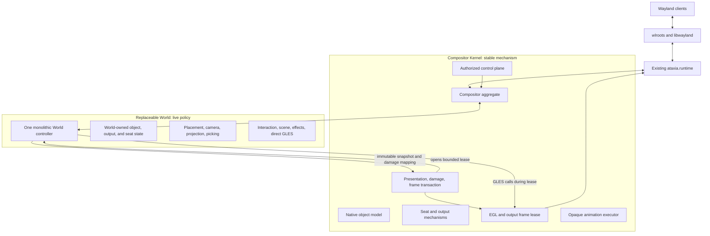
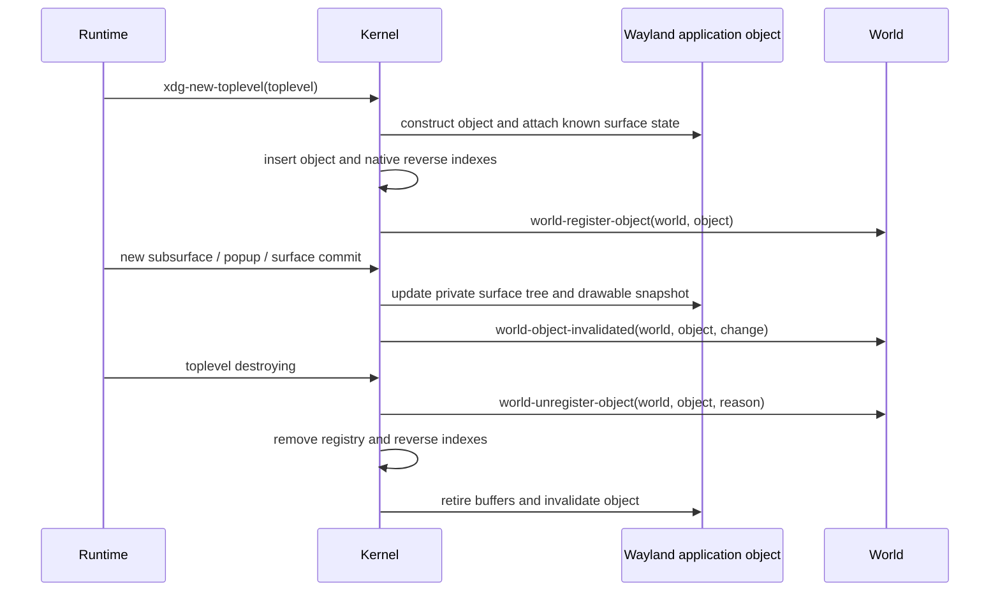
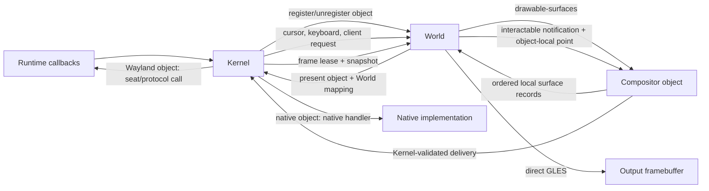
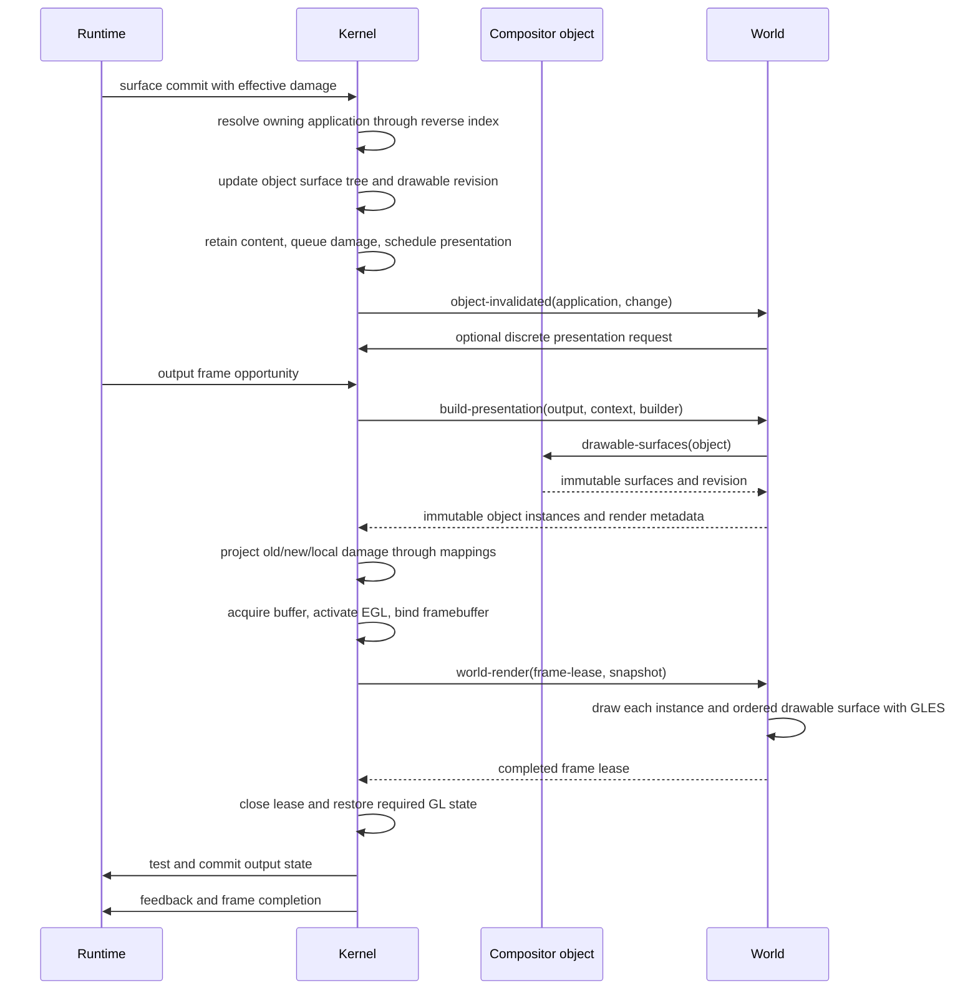

# Post-Runtime Compositor Redesign Plan

Status: proposed architecture; no compositor implementation is retained by this
plan. `ataxia.runtime` is the starting boundary and remains reusable as-is for
the first implementation.

## 1. Feasibility Verdict

The proposal is practical, including infinite planes, spherical presentation,
multiple seats, live Lisp redefinition, custom shaders, and agent control. The
central idea is correct:

> Runtime owns exact wlroots and Wayland mechanisms. A replaceable World owns
> the meaning and presentation of stable compositor objects.

Four parts of the crude proposal need stricter boundaries:

| Proposed idea | Verdict | Required refinement |
|---|---|---|
| World renders objects | Correct with a frame boundary | Kernel opens a bounded frame lease by acquiring the output buffer, activating EGL, and binding the output framebuffer. World executes the actual GLES draw calls only during that lease. |
| World owns damage strategy | Partly correct | World supplies projection and conservative damage mapping. The Kernel owns damage history, surface commit damage, old/new coverage, frame pacing, and output submission. |
| `drawable` and `interactable` object interfaces | Correct | Kernel owns both protocols. Wayland applications and native components implement the same methods, so World renders and targets them without type-specific branches. |
| Application is one world object | Correct | The Kernel must still retain every `wl_surface`, subsurface, popup, buffer, commit, transform, and damage region beneath it. |
| Each seat may have its own camera | Conditional | One physical output has one final image. Different simultaneous cameras require different outputs or explicit split-screen viewports. |
| Runtime never changes again | Only for the baseline | The current Runtime is enough for the initial compositor. New Wayland protocol families must later be added horizontally inside Runtime, not emulated above it. |

## 2. Non-Negotiable Constraints

### 2.1 Wayland surface semantics remain below World

A client submits state by committing a `wl_surface`. Buffer damage, surface
damage, buffer scale, transform, viewport, input region, synchronized
subsurfaces, and role lifecycle are surface-level facts. wlroots exposes the
current surface tree and the source box that must be sampled.

World may place one application as a logical unit, but it cannot flatten the
application into one texture without losing independent subsurface commits,
popup lifecycle, input regions, or buffer release ordering.

### 2.2 Output submission remains one transaction

World may call GLES only inside a bounded frame lease opened by Kernel. It must
not draw from input, lifecycle, timer, control, or arbitrary REPL callbacks and
must never commit the output itself. Kernel owns the full transaction:

1. accumulate pending invalidation;
2. wait for an output frame opportunity;
3. build an immutable presentation snapshot;
4. acquire a scanout-compatible buffer;
5. make Runtime's EGL context current and bind the output framebuffer;
6. establish a known GL baseline and open a dynamically scoped frame lease;
7. call `world-render`, which executes direct GLES;
8. close the lease and restore Kernel-required GL state;
9. test and commit one `wlr_output_state`;
10. send presentation feedback and frame completion;
11. retire frame resources.

If World signals an error or leaves the frame incomplete, Kernel does not commit
that buffer. It restores GL state with `unwind-protect`, preserves or escalates
pending damage, and schedules a safe retry or fallback.

### 2.3 One geometry drives draw, damage, and input

The mapping used to draw a surface must also provide:

- output coverage;
- output-to-object inverse mapping;
- object-local damage projection;
- surface enter/leave membership;
- hit-test coordinates.

Maintaining a separate rectangular hit model is invalid for curved, rotated, or
shader-deformed windows.

### 2.4 Live Lisp changes occur at owner-thread safe points

Method redefinition is useful, but foreign resources and active frames cannot
be mutated concurrently from an arbitrary REPL thread. Live mutations enter the
Wayland owner thread through an idle callback or control inbox. Method-only
changes can affect the installed World immediately; state-layout changes should
replace the World transactionally.

## 3. Refined Architecture

There are three boundaries, not two interchangeable layers:



### 3.1 Existing Runtime

Runtime remains the exact wlroots bridge. The current implementation already
provides the baseline required by the redesign:

- owner-thread Wayland event-loop dispatch and safe points;
- typed output, input, surface, subsurface, XDG, decoration, activation, and
  pointer-constraint callbacks;
- typed `wlr_seat` creation and notification functions;
- retained surface buffers and wlroots GLES texture attributes;
- access to the wlroots-owned EGL context;
- swapchain acquisition, output framebuffer lookup, output state test/commit,
  damage submission, presentation feedback, and frame completion.

No generic event envelope is added around Runtime. The Kernel implements its
protocol-specific sink generics directly.

The current Runtime does not expose complete implementations for layer shell,
session lock, selection and drag handling, text input/input method, touch,
tablet, screencopy, or Xwayland. These are not Kernel or World abstractions. If
required, each must be an additive protocol-specific Runtime module later.

### 3.2 Compositor Kernel

The Kernel is stable Common Lisp mechanism above Runtime. It owns:

- stable identities for applications, surfaces, popups, outputs, seats, and
  input devices;
- the complete Wayland surface tree and committed content state;
- retained buffers, texture views, resource generations, and release ordering;
- actual Wayland keyboard and pointer focus;
- serial validation, pressed input state, constraints, and event delivery;
- output configuration, swapchains, frame pacing, and output commit state;
- authoritative damage history and retained output targets;
- immutable snapshots and their retirement;
- output-buffer acquisition, EGL activation, framebuffer binding, GL baseline,
  frame-lease lifetime, and failed-frame recovery;
- animation clocks, instances, sampling, and lifecycle only;
- authorization, external control transport, and owner-thread ingress;
- installation and replacement of one active World.

Kernel has no planar or spherical coordinates, no default window chrome, no
shadow choice, no camera semantics, and no concrete animation properties.

### 3.3 World

World is one monolithic replaceable CLOS object. It owns:

- application placement and world-specific metadata;
- output cameras, viewports, spatial indexes, and world topology;
- per-seat cursor coordinates, navigation state, and active operations;
- stacking interpretation and focus policy;
- move, resize, maximize, fullscreen, selection, and gesture meaning;
- scene composition, backgrounds, chrome, panels, cursors, and overlays;
- actual direct GLES rendering, shaders, programs, buffers, meshes,
  intermediate targets, and effect execution;
- animation definitions and opaque animation binding meaning;
- policy-specific semantic commands and observations;
- portable export/import of World-owned state.

Planar and spherical Worlds do not inherit a stateful shared controller. They
may share pure functions, macros, numerical algorithms, or immutable data
definitions. Each World owns its entire state and lifecycle.

## 4. Ownership Matrix

| Concern | Runtime | Kernel | World |
|---|---:|---:|---:|
| wlroots wrappers and exact callbacks | Owns | Uses | Never sees raw pointers |
| Wayland protocol globals and native objects | Owns | Selects and operates | May request through Kernel |
| Application and surface identity | Emits native facts | Owns stable objects | References stable objects |
| Surface commits, buffers, transforms, damage | Exposes exact facts | Retains and interprets protocol state | Receives semantic invalidation |
| Application placement | No | Opaque to Kernel | Owns |
| Camera and projection | No | Opaque to Kernel | Owns |
| Actual `wlr_seat` focus and delivery | Executes | Owns and validates | Chooses intended target |
| Cursor world/output position | No | Queries for delivery | Owns per seat |
| Active move/resize/navigation operation | No | Provides validated mechanisms | Owns |
| Scene contents and visible style | No | Retains stable objects and snapshots | Owns |
| Damage history and frame scheduling | Exposes frame events | Owns | Requests discrete invalidation |
| Projection of local damage | No | Invokes mapping and validates | Mapping supplied by World |
| Animation timing and sampling | No | Owns | Defines bindings and effects |
| EGL activation and output submission | Supplies exact access | Owns | Uses only through lease |
| GLES draw calls and World GL resources | Supplies context | Opens and contains lease | Owns |
| External authorization | No | Owns | Handles authorized semantic actions |

## 5. Kernel Object Registry

Kernel owns one registry containing every object exposed to World. Objects have
stable Lisp identity and may implement either or both Kernel-owned interfaces:

```lisp
(defclass compositor-object ()
  ((id         :reader object-id)
   (generation :reader object-generation)
   (state      :reader object-state)))

(defclass drawable () ())
(defclass interactable () ())

(defclass wayland-application
    (compositor-object drawable interactable)
  (...))

(defclass native-component
    (compositor-object drawable interactable)
  (...))
```

`drawable` and `interactable` are protocol marker classes with no required
slots. Their generic functions define the actual interfaces. World receives a
`compositor-object` and calls those interfaces; it does not branch on whether
the object is a Wayland client, RmlUi document, cursor, panel, or other native
component.

Kernel provides `kernel-objects`, `find-kernel-object`, and capability queries.
World does not maintain the authoritative object registry, although it may keep
World-specific metadata keyed by object identity.

### 5.1 Drawable interface

`drawable-surfaces` returns two values: an immutable vector of the object's
ordered local surfaces and one revision covering the entire vector:

```lisp
(defgeneric drawable-surfaces (drawable))
(defgeneric drawable-local-bounds (drawable))
```

The result of `drawable-surfaces` contains zero or more `drawable-surface`
records. Each record exposes only information needed by a World renderer:

```lisp
(defclass drawable-surface ()
  ((id               :reader drawable-surface-id)
   (local-x          :reader drawable-surface-local-x)
   (local-y          :reader drawable-surface-local-y)
   (width            :reader drawable-surface-width)
   (height           :reader drawable-surface-height)
   (order            :reader drawable-surface-order)
   (source-box       :reader drawable-surface-source-box)
   (buffer-transform :reader drawable-surface-buffer-transform)
   (render-source    :reader drawable-surface-render-source)
   (damage           :reader drawable-surface-damage)
   (generation       :reader drawable-surface-generation)))
```

For `wayland-application`, the snapshot contains the root surface and every
mapped subsurface in correct Wayland render order, with each child location
relative to the object-local origin. Kernel computes this protocol-specific
surface tree inside the object. World receives only the resulting ordered
records.

The object-local origin is the current XDG window-geometry origin. Consequently
the root `wl_surface` itself may have a non-zero or negative local offset, and
subsurface offsets are accumulated through their parent chain. This preserves
client-side decorations and other content outside the nominal window geometry.
Before a valid XDG geometry exists, Kernel uses the protocol-defined surface
extents and republishes the vector when the geometry changes.

`drawable-surface-render-source` is a stable render-source value, not a wlroots
object. Every render source exposes the GLES sampling or geometry information
defined by the presentation protocol. A Wayland render source contains a
retained client texture view. A native component may provide a texture view or
retained geometry source. World consumes the common render-source protocol and
does not branch on whether the owning object is Wayland or native.

The vector and revision are captured from one object state. The snapshot is
rebuilt only when the object's surface/content revision changes. Returning a
cached immutable vector avoids allocation and surface-tree traversal on every
frame. Surface records are render primitives; World places and interacts with
the containing object, not individual Wayland subsurfaces.

This keeps the frame hot path practical: CLOS dispatch occurs once when World
requests an object's cached snapshot, then rendering traverses a flat vector.
There is no per-frame wlroots tree walk, foreign callback, mailbox, or
Wayland/native object branch.

### 5.2 Interactable interface

World calls the interactable protocol after it has transformed an output point
into object-local coordinates and chosen the target object:

```lisp
(defgeneric interactable-pointer-motion
    (object kernel seat local-x local-y input))
(defgeneric interactable-pointer-button
    (object kernel seat local-x local-y input))
(defgeneric interactable-pointer-axis
    (object kernel seat local-x local-y input))
(defgeneric interactable-key-event
    (object kernel seat input))
(defgeneric interactable-focus
    (object kernel seat focus-kind))
```

These methods are notification and delivery mechanisms, not World policy.
Kernel validates object lifetime, resolves the stable logical seat to its
Runtime `wlr_seat`, and applies the implementation-specific action. Each method
returns an `interaction-result` describing whether delivery occurred, the
stable object that received it, and whether focus or capture changed. It never
returns a Runtime surface pointer. At minimum, its status is one of
`:delivered`, `:miss`, `:captured`, or `:rejected`.

For `wayland-application`, Kernel uses the application's private surface tree,
subsurface offsets, popup hierarchy, input regions, and current presentation
generation to resolve the leaf `wl_surface` and surface-local coordinates. It
then sends the appropriate Runtime seat enter, leave, motion, button, axis,
keyboard, or focus operation.

For `native-component`, the same generics call its native input handler. World
does not know which delivery path ran. If an object is not interactable, the
capability check fails before delivery.

An object passed by World is an intended target, not authority to violate
protocol state. Kernel exposes the current `seat-interaction-capture` when an
implicit pointer grab, popup grab, drag, lock, or constraint requires a target.
World maps the cursor against that captured object's presented instance instead
of performing a normal pick. Kernel rejects inconsistent delivery and returns
the resolved result. This preserves Wayland grab semantics without moving
cursor policy or geometry into Kernel.

During an uncaptured pick, `:miss` means the object-local point does not land in
any current surface input region. World then tries the next presentation
candidate below it. This is how irregular native widgets and client-defined
surface input-region holes allow pointer input to reach an object behind them
without exposing surface identities to World.

### 5.3 Wayland application ownership

Kernel creates and owns every `wayland-application`. The object encapsulates:

- the Runtime XDG toplevel and root surface wrappers;
- every owned root and subsurface `surface-node`, plus associated popup
  relationships and either their nodes or registered object identities;
- surface ordering, relative locations, map state, and input regions;
- committed sizes, source boxes, transforms, retained buffers, and textures;
- surface and drawable revisions;
- the methods that translate interactable notifications into Runtime seat
  operations;
- stable title, app ID, lifecycle, and capability observations.

It deliberately contains no World placement, camera, z-order, opacity, or
animation state.

Kernel may maintain private reverse indexes from Runtime surface identity to the
owning application so callbacks can be resolved efficiently. Those indexes are
not a second World-visible object model.

### 5.4 Native components

Kernel registers native compositor UI through the same object registry and
notifies World through the same lifecycle endpoint. A native component may
implement one or both interfaces. Typical UI components implement both and
return one or more drawable surfaces plus native interactable methods.

RmlUi requires a C++ adapter implementing its render and system interfaces. It
may retain compiled geometry and textures as native drawable content. World may
consume those resources only while `world-render` holds a live frame lease.

### 5.5 Object lifecycle



A raw `wl_surface` may exist before it receives an XDG role. Kernel tracks that
surface privately and attaches it when the application object is constructed.
World is notified only after the object is internally coherent. On destruction,
World is notified while stable object metadata remains readable but before
Runtime wrappers and retained buffers are released.

Native objects use the same `register-kernel-object` and
`unregister-kernel-object` lifecycle and therefore produce the same World
callbacks.

### 5.6 Interface topology



The interface directions are deliberate:

- Kernel tells World which objects exist and supplies protocol-derived events.
- World decides placement, picking, interaction policy, and which registered
  objects appear in a presentation.
- `drawable` lets World obtain renderable surface information without asking
  what kind of object supplied it.
- `interactable` lets World notify an object of local input without knowing how
  that input becomes a Wayland seat call or native UI callback.
- Kernel remains the only authority that resolves Runtime identities, validates
  seats and serials, mutates Wayland protocol state, and commits outputs.

## 6. CLOS Protocols

### 6.1 Capability and tooling protocol

Capabilities are useful for agents and inspection, but are not the rendering
hot path:

```lisp
(defgeneric object-description (object))
(defgeneric object-capabilities (object))
(defgeneric object-actions (object principal))
(defgeneric observe-object (object context))
```

Capability values describe supported operations; they do not grant authority.
Kernel checks the principal before invoking an action.

`drawable` and `interactable` membership may also be reported through
`object-capabilities` for agents. Generic method dispatch remains authoritative.

### 6.2 Required Kernel-to-World protocol

These are typed generics, not a universal event structure:

```lisp
(defgeneric world-attached (world kernel))
(defgeneric world-quiescing (world reason))

(defgeneric world-register-object (world object))
(defgeneric world-unregister-object (world object reason))
(defgeneric world-object-changed (world object change))
(defgeneric world-object-invalidated (world object invalidation))

(defgeneric world-output-added (world output))
(defgeneric world-output-changed (world output change))
(defgeneric world-output-removing (world output))
(defgeneric world-seat-added (world seat))
(defgeneric world-seat-removing (world seat))

(defgeneric world-cursor-motion (world seat input))
(defgeneric world-cursor-button (world seat input))
(defgeneric world-cursor-axis (world seat input))
(defgeneric world-key-event (world seat input))

(defgeneric world-client-request (world object request))

(defgeneric world-build-presentation (world output frame-context builder))
(defgeneric world-graphics-attached (world graphics-context))
(defgeneric world-render (world frame-lease snapshot))
(defgeneric world-graphics-detaching (world graphics-context reason))

(defgeneric world-resolve-animation (world subject transition context))
(defgeneric world-prepare-binding (world subject binding instance))
(defgeneric world-apply-binding (world subject binding value instance))
(defgeneric world-finalize-binding (world subject binding instance reason))

(defgeneric world-observe (world principal request))
(defgeneric world-control (world principal action))
(defgeneric world-export-state (world context))
(defgeneric world-import-state (world portable-state context))
```

Runtime event values are converted to stable Kernel identities or copied input
values before World sees them. No callback-scoped foreign pointer enters World
state.

`world-register-object`, cursor and keyboard endpoints, client requests,
presentation building, and `world-render` are required World methods. Output,
seat, invalidation, animation, observation, and migration methods are required
when the corresponding capability is enabled. The base World does not silently
invent desktop behavior for missing required methods.

Client requests are typed objects such as `move-client-request`,
`resize-client-request`, `fullscreen-client-request`, or
`show-menu-client-request`. Kernel resolves Runtime surfaces, seats, serials,
edges, and outputs before invoking World. World never receives a raw XDG event.

Only requests requiring compositor policy cross this boundary. Kernel handles
protocol bookkeeping such as configure acknowledgement, surface commits,
window-geometry changes, and role destruction inside the application object.
Fullscreen, maximize, minimize, interactive move/resize, activation, popup
placement policy, and window-menu requests call `world-client-request` with the
owning object and a typed request value.

### 6.3 World-to-Kernel mechanisms

World calls these synchronously on the owner thread:

```text
kernel-objects / find-kernel-object
register-native-object / unregister-native-object
seat-interaction-capture
interactable-focus
clear-interaction-focus
interactable-pointer-motion / button / axis
interactable-key-event
request-object-configuration
request-object-state
schedule-presentation
damage-object / damage-output-region / damage-output
current-presentation-snapshot
pick-presentation-candidates
start-animation / cancel-animations
enqueue-world-graphics-task
create-logical-seat / destroy-logical-seat
run-hook
```

Kernel validates lifetime, seat ownership, serials, finite values, output
availability, resource ownership, and protocol sequencing. Calls do not cross a
mailbox inside the owner thread.

`request-object-configuration` and `request-object-state` dispatch on the
object's supported capabilities. A Wayland implementation converts accepted
requests into XDG configure/state operations; a native implementation may
handle the same semantic request locally or reject an unsupported capability.
World therefore does not need a Wayland/native type branch to resize, activate,
or otherwise operate an object.

World or a trusted native-UI subsystem may construct a native component, but it
becomes visible only after Kernel assigns its identity, registers it, and calls
`world-register-object`. Kernel applies the same ordering on unregistration.

## 7. Presentation Protocol

World first contributes immutable instances to a builder:

```lisp
(present builder
         object
         :mapping mapping
         :layer layer
         :clip clip
         :effects effect-stack
         :interaction-tag tag)
```

`present` accepts any registered object implementing `drawable`. The builder
captures the object's current `drawable-surfaces` vector and revision in the
instance. Kernel does not inspect whether the object is a Wayland application
or native component, and it does not expand a Wayland surface tree at this
stage; the object already performed that work when its drawable snapshot
changed.

Each surface record is combined with the instance mapping, clip, layer, and
effects. The resulting presentation data contains its object-local rectangle,
render source, source box, buffer transform, projected coverage, damage, and
generation. A retained client texture view exposes only the GLES target, texture
name, alpha information, dimensions, and generation. It does not expose the
underlying `wlr_texture`, `wlr_buffer`, or `wl_surface` wrapper to World.

The mapping protocol is the essential geometry boundary:

```lisp
(defgeneric mapping-local-rectangle-geometry (mapping rectangle))
(defgeneric mapping-output-to-local (mapping output-x output-y))
(defgeneric mapping-project-local-damage (mapping rectangles))
(defgeneric mapping-output-coverage (mapping local-bounds))
```

A planar mapping may return quads and affine inverses. A spherical mapping may
return triangle meshes and barycentric inverse mapping. A discontinuous or
non-invertible mapping may split an object into several instances or decline
precise damage, causing Kernel to conservatively damage the item or output.

The immutable `presentation-snapshot` contains ordered object instances,
captured drawable-surface vectors, mappings, output coverage, interaction tags,
opaque World render payloads, and referenced resources. `world-render` iterates
the same object/surface representation for Wayland and native objects and issues
the actual GLES calls. Picking, object-local cursor coordinates, output
membership, and damage consume that exact snapshot and its mappings.

## 8. Direct GLES Rendering

Kernel passes World a dynamically scoped `frame-lease`:

```lisp
(defclass frame-lease ()
  ((output       :reader frame-output)
   (framebuffer  :reader frame-framebuffer)
   (width        :reader frame-width)
   (height       :reader frame-height)
   (scale        :reader frame-scale)
   (transform    :reader frame-transform)
   (damage       :reader frame-damage)
   (timestamp    :reader frame-timestamp)
   (snapshot     :reader frame-snapshot)
   (generation   :reader frame-generation)
   (valid-p      :reader frame-lease-valid-p)))
```

The lease is valid only during the dynamic extent of `world-render`. Kernel has
already made EGL current, acquired and retained the output buffer, bound the
output framebuffer, and established its documented initial state. World may
then issue arbitrary GLES calls, including compiling programs, uploading
buffers, rendering meshes, using intermediate FBOs, sampling client textures,
and running per-window or output-wide effects.

Before `world-render` returns, World must place the final image in the leased
output framebuffer for every damaged region. It may change GL state freely
inside the lease. Kernel re-establishes its required state after the callback;
World must not rely on GL state surviving between leases.

World must not retain the lease, call `eglMakeCurrent`, delete or reconfigure
the Kernel-owned output framebuffer, dispatch the Wayland loop, or invoke output
test/commit functions. Raw GLES is intentionally trusted, so these rules are an
architectural contract rather than a sandbox.

World owns its programs, VAOs, VBOs, intermediate textures, and other GL names.
Those resources are scoped to the World generation. Kernel invokes
`world-graphics-attached` and `world-graphics-detaching` with EGL current so the
World can create and delete them safely. Live shader or resource mutations use
`enqueue-world-graphics-task`, which runs at an owner-thread safe point with a
current graphics context.

Runtime client texture names remain valid only while the corresponding retained
buffer and snapshot resources remain live. World may sample them during the
lease but must not cache a client texture name beyond the resource generation
advertised by Kernel.

The first implementation should continue using Runtime's retained client buffer
and wlroots GLES texture access. Reimplementing DMA-BUF-to-EGLImage and SHM
upload would duplicate synchronization, format, modifier, and lifetime work
already provided by wlroots. This remains a custom compositor renderer because
World executes all composition and shaders as Ataxia GLES code; wlroots only
imports the client buffer and supplies the EGL environment.

Direct scanout, hardware overlay planes, and hardware cursors are optional
Kernel optimizations, not World APIs. Arbitrary transforms, post-processing, or
multiple visible cursors normally require composition and will make a frame
ineligible for direct scanout. Explicit synchronization, advanced color
management, HDR, or new DRM plane controls may require additive Runtime APIs;
they must not be approximated inside World.

Output-wide and history-based effects are possible. Every World render stage
declares a damage rule:

```text
:local       output damage is unchanged
:expanded    output damage grows by a bounded radius
:mapped      pass supplies a conservative mapping
:full        the whole output is required
```

Kernel rejects or escalates to full-output damage when a World render stage
cannot state a safe damage rule.

## 9. Damage and Frame Scheduling

There is one authoritative Kernel damage ledger per output.

### 9.1 Invalidation sources

- Runtime surface commit damage;
- application map, unmap, resize, or destruction;
- old and new coverage after a World placement change;
- cursor old and new coverage;
- explicit World output damage;
- active Kernel animation samples;
- output configuration or resource loss.

### 9.2 Frame algorithm



World does not scan objects for content changes and does not own a continuous
redraw loop. It requests presentation when World-owned state changes. Kernel
continues scheduling only while it owns an active animation/timeline or receives
new client/output invalidation. A surface commit schedules presentation in
Kernel even if World does nothing with its semantic invalidation callback.

## 10. Input, Focus, and Multiple Seats

Kernel maps each Runtime input device to one logical seat. Each logical seat
owns a real Runtime `wlr_seat`, device capabilities, keymap, pressed state,
client cursor surface, and actual Wayland focus. World owns a separate state
entry keyed by the stable seat identity:

```text
seat -> cursor position in World/output coordinates
seat -> cursor output or viewport
seat -> active move/resize/navigation operation
seat -> selection and World-specific gesture state
```

Pointer flow:

1. Runtime emits a typed device event.
2. Kernel resolves the logical seat and calls `world-cursor-motion` with stable,
   copied input data.
3. World updates its cursor state and uses Kernel helpers for output bounds and
   pointer constraints.
4. World queries `seat-interaction-capture`. It uses the captured object's
   presented instance when one exists; otherwise it gets front-to-back
   candidates from the last immutable presentation snapshot.
5. World maps the point into each candidate's object-local coordinates.
6. World decides whether the motion changes World state or should be delivered
   to the object.
7. For object delivery, World calls `interactable-pointer-motion` with the
   object, logical seat, object-local coordinates, and input value. On `:miss`,
   it continues to the next candidate; on delivery or capture, it stops.
8. Kernel validates the object, seat, and active capture. A
   `wayland-application` method resolves its leaf surface and input region and
   sends Runtime `wlr_seat` operations; a `native-component` method invokes its
   native handler.
9. Button, axis, keyboard, and focus delivery follow the same interactable
   path. World consumes the `interaction-result` and requests old/new cursor or
   object damage when its state changes.

Kernel owns actual Wayland focus and serial/grab validation. World owns target
selection, cursor coordinates, gestures, and the decision to invoke an
interactable endpoint. World never calls Runtime seat functions or examines a
`wl_surface`.

Keyboard flow is analogous but has no coordinate mapping. Kernel updates the
logical seat's pressed/modifier state and calls `world-key-event` with stable
key data. World may consume the key as a binding or call
`interactable-key-event` on its selected keyboard-focus object. Kernel verifies
that selection against actual seat focus and emits the Runtime key and modifier
notifications. Clicking background policy may call `clear-interaction-focus`;
it never manufactures a dummy interactable object.

Multiple seats and multiple rendered cursors are fully feasible. A client can
bind each published `wl_seat`, and wlroots maintains focus and grab state per
seat. Different seat cameras on one output are not independently observable
unless World defines separate output ownership or split-screen regions.

## 11. Animation

Kernel's animation executor knows only:

- monotonic time;
- duration and normalized progress;
- samplers/easing functions;
- opaque binding identity and conflict keys;
- instance cancellation and completion;
- scheduling another frame while instances remain active.

World owns all concrete meaning, including opacity, transform, placement,
camera parameters, shader uniforms, shadow parameters, reveal state, or any
future property. Two applications may carry completely different definitions
for the same transition descriptor.

Time-varying shaders use a bounded Kernel animation or timeline. World does not
implement its own perpetual frame callback.

## 12. Agentic Control and Introspection

Human-equivalent input and semantic control remain separate:

```text
agent device input -> logical seat -> normal World input path
semantic action    -> authorized Kernel control -> World command or Kernel mechanism
```

Kernel owns principals, capabilities, limits, owner-thread ingress, and the
read-eval-disabled local transport. World exposes observations and typed
semantic actions. `object-actions` is filtered by the principal; an advertised
action is not permission to invoke it.

The local Lisp image may expose a richer trusted REPL API, but remote control
must not evaluate arbitrary forms. A helper such as `call-in-compositor-thread`
is required for safe live mutation.

## 13. Live World Replacement

World replacement is a transaction:

1. enter an owner-thread safe point;
2. reject or cancel active World operations;
3. ask the old World for neutral portable state;
4. construct a fresh candidate World;
5. import view, output, and seat state without referencing the old class;
6. build trial snapshots for all active outputs;
7. validate finite geometry, inverse mappings, damage coverage, and candidate
   World graphics initialization under a current EGL context;
8. atomically install the candidate and snapshots;
9. recompute actual client focus and surface membership;
10. damage every affected output;
11. retire old snapshots and World resources after submitted frames finish.

Planar and spherical Worlds independently understand the neutral portable
schema. They never contain methods specialized on each other's concrete types.
Migration may reject values it cannot represent safely.

## 14. Reusable Code

The crude proposal lists `DamageManager`, `FocusManager`, `SeatStateManager`,
`AnimationScheduler`, and similar replaceable services. That composition would
recreate the ownership ambiguity this redesign is intended to remove.

Use these rules instead:

- frame scheduler, damage ledger, client-buffer cache, actual focus, and
  protocol seat management are Kernel mechanisms;
- World owns one monolithic state graph;
- reusable World code is a pure function, macro, numerical library, immutable
  definition, or explicitly World-private cache;
- no shared stateful CLOS manager has an independent compositor lifecycle;
- no mailbox exists between Kernel components or between Kernel and World.

Useful libraries still include region math, easing, R-trees, mesh generation,
matrix operations, color transforms, and surface-tree traversal helpers.

## 15. Feasibility by Target

| Target | Feasibility | Main condition |
|---|---|---|
| Conventional desktop | Straightforward | Planar mapping and standard focus policy |
| Infinite 2D canvas | Straightforward | Camera-relative placement and spatial index |
| Spherical world | Feasible | Mesh projection, inverse picking, conservative damage |
| Other non-Euclidean space | Feasible with constraints | Must supply render geometry, inverse mapping, and safe coverage; discontinuities may require item splitting |
| 3D/spatial desktop | Feasible | World owns depth and picking; Wayland client input remains 2D surface-local |
| Multiple physical or virtual seats | Feasible | One Runtime `wlr_seat` per logical seat and per-seat World state |
| Multiple seat-specific cameras | Conditional | Separate outputs or explicit split-screen viewports |
| Per-window shaders and animations | Feasible | World-owned GLES resources and bindings sampled by the Kernel animation clock |
| Output-wide shader effects | Feasible | World executes them during the frame lease and supplies conservative damage rules |
| Temporal/datamosh feedback | Feasible | History textures, explicit lifetime, usually expanded/full damage |
| RmlUi native UI | Feasible, separate integration | C++ adapter renders only while World holds a live frame lease |
| New Wayland protocol families | Not above current Runtime alone | Add exact horizontal Runtime modules first |

## 16. Proposed Source Layout

```text
src/compositor/
  packages.lisp
  conditions.lisp
  kernel.lisp                 aggregate, owner thread, safe points
  objects.lisp                common object identities and registry
  object-protocols.lisp       drawable and interactable contracts
  wayland-application.lisp    surface tree, textures, input translation
  world-protocol.lisp         Kernel-owned typed World API
  presentation-types.lisp     mapping, instances, surface records, snapshots
  presentation.lisp           captures object drawable snapshots
  damage-ledger.lisp          authoritative old/new/local output damage
  output-engine.lisp          output config, pacing, swapchains, commits
  seat-engine.lisp            devices, seats, focus, constraints, delivery
  animation-executor.lisp     opaque timing and lifecycle
  frame-lease.lisp            EGL activation, output FBO, GL containment
  world-host.lisp             install, migrate, validate, retire Worlds
  control.lisp                principals, actions, owner-thread inbox
  control-transport.lisp
  runtime-sink.lisp           exact Runtime callback methods
  main.lisp

src/world/
  common/
    math.lisp                 stateless shared algorithms only
    regions.lisp
    easing.lisp
  planar/
    world.lisp                complete planar controller state
    mapping.lisp
    interaction.lisp
    presentation.lisp
    graphics.lisp             planar GLES resources and draw execution
    animation.lisp
    control.lisp
  spherical/
    world.lisp                complete spherical controller state
    mapping.lisp
    interaction.lisp
    presentation.lisp
    graphics.lisp             spherical GLES resources and draw execution
    animation.lisp
    control.lisp

src/native-ui/
  component.lisp              native drawable/interactable implementation
  rmlui/                      optional later C++ adapter and Lisp wrapper
```

The World protocol stays under `src/compositor` because it defines what the
Kernel calls and what World may ask Kernel to do. Implementations stay under
`src/world`.

## 17. Rebuild Sequence

This is a clean replacement above Runtime, not an incremental refactor of the
current compositor and behavior packages.

### Phase 0: Freeze the Runtime baseline

- Preserve `src/runtime`, native wlroots glue, and `ataxia-runtime.asd`.
- Record the exact Runtime callbacks and outbound functions used by Kernel.
- Keep protocol additions outside the initial redesign.

Exit: Runtime-only launcher still starts and reports outputs and inputs.

### Phase 1: Kernel lifecycle and stable identities

- Create the compositor aggregate and exact Runtime sink.
- Add owner-thread safe points and shutdown ordering.
- Define `compositor-object`, `drawable`, and `interactable` protocols.
- Create the authoritative object registry plus output, input, and seat
  identities.
- Require World registration and unregistration endpoints.

Exit: Wayland and native objects follow one inspectable lifecycle without
placement policy.

### Phase 2: Wayland application objects and resource retention

- Create one Kernel-owned application object when Runtime reports a new XDG
  application and notify World only after registration.
- Retain committed buffers and GLES texture views.
- Store root surfaces, subsurface trees, popup ownership, relative coordinates,
  input regions, source boxes, transforms, revisions, and effective damage
  inside the application object.
- Maintain private Runtime-surface-to-application reverse indexes.
- Produce immutable ordered `drawable-surfaces` snapshots.
- Implement deterministic buffer and object retirement.

Exit: Firefox and Foot each appear as one registered object whose drawable
snapshot and interactable implementation contain all protocol surface state.

### Phase 3: Presentation snapshots and frame leases

- Define immutable mapping, instance, surface-record, snapshot, and World render
  metadata types.
- Capture `drawable-surfaces` without object-type branches and implement bounded
  frame leases.
- Add output swapchain, framebuffer, state test/commit, feedback, and frame done.
- Implement direct GLES drawing in the minimal planar World.
- Begin with full-output redraw only.

Exit: a minimal hard-coded planar World renders Firefox and Foot correctly.

### Phase 4: Damage and frame pacing

- Add retained output targets and per-output damage ledgers.
- Project surface damage through snapshot mappings.
- Repaint old/new object and cursor coverage.
- Add conservative fallback and debug visualization.

Exit: terminal glyph updates and window movement repaint only required regions
without stale pixels.

### Phase 5: Seats and interaction

- Create logical seats and device assignment.
- Route World-selected object-local input through `interactable` methods.
- Implement actual Wayland focus, leaf-surface resolution, keyboard/pointer
  delivery, serial validation, client cursors, relative pointer, and constraints
  inside Kernel-owned object and seat code.
- Move cursor placement and operation mathematics into World.

Exit: Firefox and Foot accept keyboard, pointer, move, resize, popup, and client
cursor interaction; multiple cursors render independently.

### Phase 6: Complete planar World

- Implement finite and infinite planar cameras, placement, picking, stacking,
  chrome, shadows, panels, cursor scene items, maximize, and fullscreen.
- Add semantic control and inspection.

Exit: the conventional and infinite-canvas modes require no Kernel geometry
branch.

### Phase 7: Animation and effects

- Implement opaque Kernel animation execution.
- Add per-application World definitions, shader resources, and bindings.
- Add World-rendered per-window and output-wide stages with damage rules.

Exit: two applications can use different animations; time-varying effects stop
scheduling when their Kernel timeline ends.

### Phase 8: Transactional World replacement

- Define neutral portable state and candidate installation.
- Validate trial snapshots and candidate World graphics initialization.
- Atomically replace, refresh focus, damage outputs, and retire old generations.

Exit: planar-to-planar replacement works without restart or stale resources.

### Phase 9: Independent spherical proof

- Implement spherical state, projection mesh, inverse picking, movement,
  resizing, camera control, and damage mapping without importing planar classes.
- Switch planar to spherical and back while clients remain alive.

Exit: rendering, input, damage, cursors, animations, and popups work through the
same Kernel contracts in both Worlds.

### Phase 10: Native UI and protocol expansion

- Add native objects implementing the same `drawable` and `interactable`
  protocols, then the RmlUi adapter if selected.
- Add missing Wayland protocols horizontally to Runtime based on product needs.

Exit: native UI participates in the same snapshot, mapping, damage, input, and
agent inspection model as applications.

## 18. Completion Criteria

- No file above Runtime contains raw wlroots/libwayland pointers or calls
  Runtime-private bindings; World graphics code may own typed GL handles.
- Runtime callbacks remain exact and Wayland-specific.
- Kernel contains no planar, spherical, chrome, shadow, or concrete animation
  property assumptions.
- World issues GLES only while a valid Kernel frame lease is dynamically active;
  it never activates EGL, acquires output buffers, commits outputs, or owns frame
  pacing.
- World does not maintain authoritative surface or output damage history.
- World implements the required object-registration, cursor, keyboard,
  client-request, presentation, and render endpoints; missing methods fail
  explicitly instead of installing implicit desktop behavior.
- Kernel creates and tracks every Wayland application object, stores its full
  surface/input state, and registers or unregisters it with World.
- Wayland applications and native components implement the same `drawable` and
  `interactable` protocols; World contains no object-type branch for either.
- Every presented object supplies an immutable ordered drawable-surface snapshot
  captured into the presentation snapshot.
- World delivers object-local pointer, keyboard, and focus actions only through
  interactable methods; Kernel resolves Wayland leaf surfaces, seats, serials,
  and Runtime calls.
- Kernel-enforced grabs, locks, drags, and pointer constraints override normal
  World picking through a stable object capture, never through leaked surfaces.
- Every rendered client surface is picked and damaged through its rendered
  mapping.
- Planar and spherical Worlds share no stateful superclass or controller.
- Multiple seats have independent protocol focus, World cursors, and operations.
- Per-application animation definitions and shader parameters are World-owned.
- Behavior-driven redraw requests are discrete; Kernel timelines own continued
  animation scheduling.
- External agents use authenticated typed actions; local live mutation runs at
  an owner-thread safe point.
- A World can be replaced without restarting Runtime or disconnecting clients.

## 19. Decisions Requiring Confirmation

1. Does "reuse Runtime directly" mean freeze it permanently, or may missing
   protocol families be added later as isolated Runtime modules? Recommended:
   freeze it for the initial rebuild, allow additive protocol modules later.
2. Is RmlUi required in the first usable compositor, or should the native
   object implementation land first and RmlUi follow? Recommended: native
   object first, RmlUi after planar and spherical Worlds prove the contract.
3. Must two seats see different cameras simultaneously on the same physical
   output? Recommended: require explicit split-screen regions or assign each
   camera to a separate output.
4. During replacement between unrelated geometries, should unrepresentable
   placement fail the transaction or use a documented default placement?
   Recommended: fail unless the caller supplies an explicit fallback policy.
5. Should structural live changes redefine the installed World class in place,
   or always construct a replacement instance? Recommended: method-only changes
   may apply in place; slot/schema changes use transactional replacement.
6. Should an XDG popup tree remain inside its owning `wayland-application`
   drawable snapshot, or be registered as a separate compositor object?
   Recommended: keep it inside the owning application because popup lifetime,
   input, and placement are protocol-relative to that application; expose a
   separate object only if independent World policy is later required.

## 20. Primary References

- [Wayland protocol documentation](https://wayland.freedesktop.org/docs/html/)
- [wlroots surface and commit semantics](https://wlroots.pages.freedesktop.org/wlroots/wlr/types/wlr_compositor.h.html)
- [wlroots output state and commit API](https://wlroots.pages.freedesktop.org/wlroots/wlr/types/wlr_output.h.html)
- [wlroots seat and per-seat focus API](https://wlroots.pages.freedesktop.org/wlroots/wlr/types/wlr_seat.h.html)
- [RmlUi render interface](https://github.com/mikke89/RmlUi/blob/master/Include/RmlUi/Core/RenderInterface.h)
