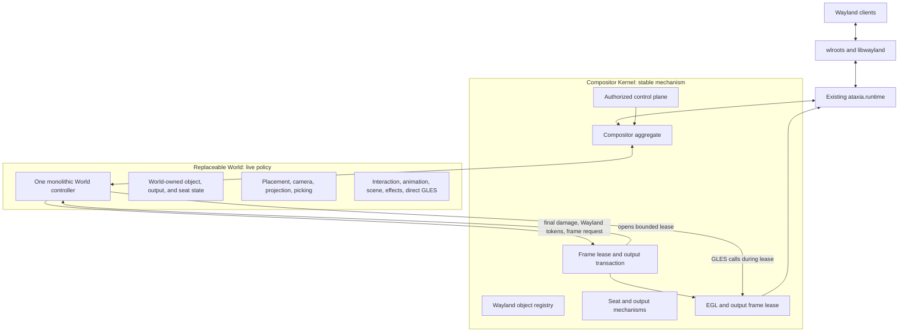
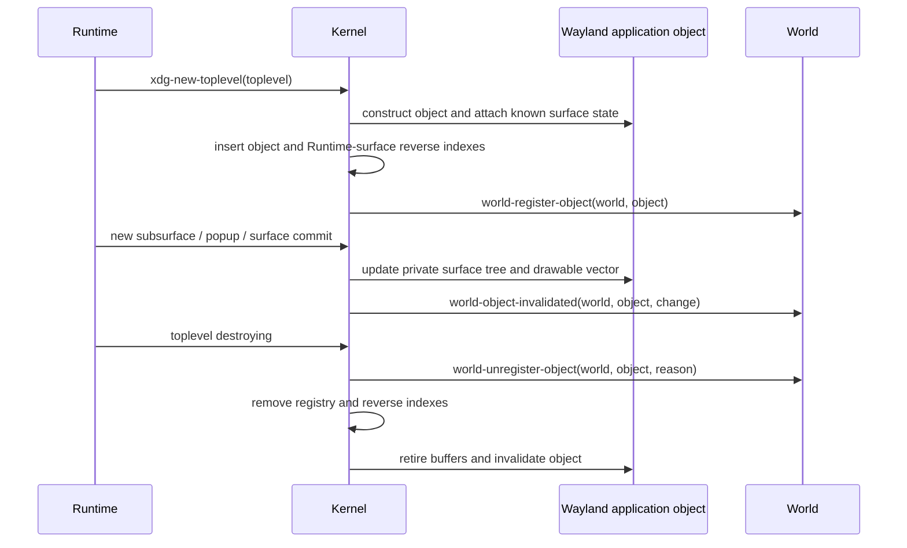
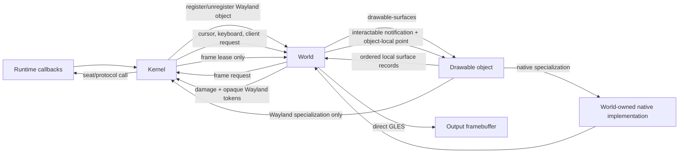
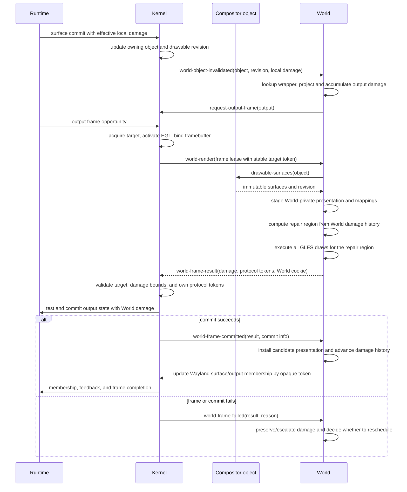

# Post-Runtime Compositor Redesign Plan

Status: proposed architecture; no compositor implementation is retained by this
plan. `ataxia.runtime` is the starting boundary and remains reusable as-is for
the first implementation.

## 1. Feasibility Verdict

The proposal is practical, including infinite planes, spherical presentation,
multiple seats, live Lisp redefinition, custom shaders, and agent control. The
central idea is correct:

> Runtime owns exact wlroots and Wayland mechanisms. A replaceable World owns
> the meaning and presentation of stable compositor objects.

Four parts of the crude proposal need stricter boundaries:

| Proposed idea | Verdict | Required refinement |
|---|---|---|
| World renders objects | Correct with a frame boundary | Kernel opens a bounded frame lease by acquiring the output buffer, activating EGL, and binding the output framebuffer. World executes the actual GLES draw calls only during that lease. |
| World owns damage control | Correct | World owns pending damage, history, local-to-output projection, old/new coverage, buffer repair, and the final output damage region. Kernel only supplies target metadata, validates the returned region, and submits it with the output transaction. |
| `drawable` and `interactable` object interfaces | Correct | They are shared Lisp contracts. Kernel implements them only for Wayland objects; World implements and executes them for native objects without Kernel registration or dispatch. |
| Application is one world object | Correct | Kernel must still retain every `wl_surface`, subsurface, popup, buffer, commit, transform, and committed surface-local damage fact beneath it. |
| Each seat may have its own camera | Conditional | One physical output has one final image. Different simultaneous cameras require different outputs or explicit split-screen viewports. |
| Runtime never changes again | Only for the baseline | The current Runtime is enough for the initial compositor. New Wayland protocol families must later be added horizontally inside Runtime, not emulated above it. |

## 2. Non-Negotiable Constraints

### 2.1 Wayland surface semantics remain below World

A client submits state by committing a `wl_surface`. Buffer damage, surface
damage, buffer scale, transform, viewport, input region, synchronized
subsurfaces, and role lifecycle are surface-level facts. wlroots exposes the
current surface tree and the source box that must be sampled.

World may place one application as a logical unit, but it cannot flatten the
application into one texture without losing independent subsurface commits,
popup lifecycle, input regions, or buffer release ordering.

### 2.2 Output submission remains one transaction

World may call GLES only inside a bounded frame lease opened by Kernel. It must
not draw from input, lifecycle, timer, control, or arbitrary REPL callbacks and
must never commit the output itself. Kernel owns output acquisition and
submission, while World owns the image and damage decision inside the
transaction:

1. World accumulates damage and requests an output frame;
2. Kernel waits for an output frame opportunity;
3. Kernel acquires a scanout-compatible buffer and reports a stable target
   identity;
4. Kernel makes Runtime's EGL context current and binds the output framebuffer;
5. Kernel establishes a known GL baseline and opens a dynamically scoped frame
   lease;
6. `world-render` builds or freezes World-private presentation state, computes
   the target repair region, and executes direct GLES;
7. World returns a completed frame result containing final output damage and
   opaque Kernel tokens for the Wayland surfaces it actually presented;
8. Kernel closes the lease, restores required GL state, validates the frame
   result, and applies its damage to one `wlr_output_state`;
9. Kernel tests and commits the output state, then reports success or failure
    to World;
10. Runtime feedback, frame completion, and resource retirement follow the
    successful commit.

If World signals an error or leaves the frame incomplete, Kernel does not commit
that buffer. It restores GL state with `unwind-protect`, releases the acquired
target, and calls `world-frame-failed`. World retains or escalates its own
pending damage and decides whether to request another frame.

### 2.3 One geometry drives draw, damage, and input

The mapping used to draw a surface must also provide:

- output coverage;
- output-to-object inverse mapping;
- object-local damage projection;
- surface enter/leave membership;
- hit-test coordinates.

Maintaining a separate rectangular hit model is invalid for curved, rotated, or
shader-deformed windows.

### 2.4 Live Lisp changes occur at owner-thread safe points

Method redefinition is useful, but foreign resources and active frames cannot
be mutated concurrently from an arbitrary REPL thread. Live mutations enter the
Wayland owner thread through an idle callback or control inbox. Method-only
changes can affect the installed World immediately; state-layout changes should
replace the World transactionally.

## 3. Refined Architecture

There are three boundaries, not two interchangeable layers:



### 3.1 Existing Runtime

Runtime remains the exact wlroots bridge. The current implementation already
provides the baseline required by the redesign:

- owner-thread Wayland event-loop dispatch and safe points;
- typed output, input, surface, subsurface, XDG, decoration, activation, and
  pointer-constraint callbacks;
- typed `wlr_seat` creation and notification functions;
- retained surface buffers and wlroots GLES texture attributes;
- access to the wlroots-owned EGL context;
- swapchain acquisition, output framebuffer lookup, output state test/commit,
  damage submission, presentation feedback, and frame completion.

No generic event envelope is added around Runtime. The Kernel implements its
protocol-specific sink generics directly.

The current Runtime does not expose complete implementations for layer shell,
session lock, selection and drag handling, text input/input method, touch,
tablet, screencopy, or Xwayland. These are not Kernel or World abstractions. If
required, each must be an additive protocol-specific Runtime module later.

### 3.2 Compositor Kernel

The Kernel is stable Common Lisp mechanism above Runtime. It owns:

- stable identities for applications, surfaces, popups, outputs, seats, and
  input devices;
- the complete Wayland surface tree and committed content state;
- retained buffers, texture views, resource generations, and release ordering;
- actual Wayland keyboard and pointer focus;
- serial validation, pressed input state, constraints, and event delivery;
- output configuration, swapchains, frame pacing, and output commit state;
- output-buffer acquisition, EGL activation, framebuffer binding, GL baseline,
  frame-lease lifetime, and failed-frame recovery;
- authorization, external control transport, and owner-thread ingress;
- installation and replacement of one active World.

Kernel has no planar or spherical coordinates, no default window chrome, no
shadow choice, no camera semantics, and no animation subsystem, state, or
dispatch.

### 3.3 World

World is one monolithic replaceable CLOS object. It owns:

- application placement and world-specific metadata;
- native component identity, lifecycle, drawable content, input handlers,
  focus, capture, and component-local state;
- output cameras, viewports, spatial indexes, and world topology;
- per-seat cursor coordinates, navigation state, and active operations;
- stacking interpretation and focus policy;
- move, resize, maximize, fullscreen, selection, and gesture meaning;
- scene composition, backgrounds, chrome, panels, cursors, and overlays;
- presentation graphs, immutable presentation snapshots, instance mappings,
  clipping, coverage, picking, and snapshot retirement;
- actual direct GLES rendering, shaders, programs, buffers, meshes,
  intermediate targets, and effect execution;
- per-output pending damage, committed damage history, target-history repair,
  local-to-output projection, and final output damage regions;
- animation definitions, clocks, timelines, easing, sampling, bindings,
  conflicts, cancellation, completion, and GPU animation state;
- animation-driven damage and requests for subsequent output frames;
- policy-specific semantic commands and observations;
- portable export/import of World-owned state.

Planar and spherical Worlds do not inherit a stateful shared controller. They
may share pure functions, macros, numerical algorithms, or immutable data
definitions. Each World owns its entire state and lifecycle.

## 4. Ownership Matrix

| Concern | Runtime | Kernel | World |
|---|---:|---:|---:|
| wlroots wrappers and exact callbacks | Owns | Uses | Never sees raw pointers |
| Wayland protocol globals and wlroots objects | Owns | Selects and operates | May request through Kernel |
| Wayland application and surface identity | Emits wlroots facts | Owns stable objects | References stable objects |
| Native compositor component identity/lifecycle | No | No | Owns completely |
| Surface commits, buffers, transforms, local damage | Exposes exact facts | Retains protocol state in objects | Consumes invalidation and maps local damage |
| Application placement | No | Opaque to Kernel | Owns |
| Camera and projection | No | Opaque to Kernel | Owns |
| Actual `wlr_seat` focus and delivery | Executes | Owns and validates | Chooses intended target |
| Cursor world/output position | No | Queries for delivery | Owns per seat |
| Active move/resize/navigation operation | No | Provides validated mechanisms | Owns |
| Scene contents, snapshots, mappings, picking, and visible style | No | No | Owns completely |
| Frame scheduling | Exposes frame events | Owns generic mechanism | Requests every needed frame |
| Damage history and target repair | Exposes buffer acquire/commit API | Supplies stable target token and validates final region | Owns completely |
| Projection of local damage | No | Opaque to Kernel | Owns through World mapping |
| Animation definitions, timing, sampling, and lifecycle | No | No | Owns completely |
| EGL activation and output submission | Supplies exact access | Owns | Uses only through lease |
| GLES draw calls and World GL resources | Supplies context | Opens and contains lease | Owns |
| External authorization | No | Owns | Handles authorized semantic actions |

## 5. Kernel Wayland Object Registry

Kernel owns one registry containing the Wayland/protocol objects it exposes to
World. Native compositor components never enter this registry. The shared
`drawable` and `interactable` protocol classes do not imply Kernel ownership:

```lisp
(defclass kernel-object ()
  ((id         :reader object-id)
   (generation :reader object-generation)
   (state      :reader object-state)))

(defclass drawable () ())
(defclass interactable () ())

(defclass wayland-application
    (kernel-object drawable interactable)
  (...))

(defclass native-component
    (drawable interactable)
  (...))
```

`drawable` and `interactable` are protocol marker classes with no required
slots. Their generic functions define the common interfaces. Kernel constructs
and owns `wayland-application`; World constructs and owns `native-component`.
World calls the same protocols without branching on whether an object is a
Wayland client, RmlUi document, cursor, panel, or other native component.

Kernel provides `kernel-objects`, `find-kernel-object`, and capability queries.
Those functions return only Kernel-owned Wayland/protocol objects. World owns
native-object existence and also maintains the derived wrapper/index structures
described below for every object it presents.

### 5.1 Drawable interface

`drawable-surfaces` returns two values: an immutable vector of the object's
ordered local surfaces and one revision covering the entire vector:

```lisp
(defgeneric drawable-surfaces (drawable))
(defgeneric drawable-local-bounds (drawable))
(defgeneric retain-render-source (render-source))
(defgeneric release-render-source (render-source))
```

The result of `drawable-surfaces` contains zero or more `drawable-surface`
records. Each record exposes only information needed by a World renderer:

```lisp
(defclass drawable-surface ()
  ((id               :reader drawable-surface-id)
   (local-x          :reader drawable-surface-local-x)
   (local-y          :reader drawable-surface-local-y)
   (width            :reader drawable-surface-width)
   (height           :reader drawable-surface-height)
   (order            :reader drawable-surface-order)
   (source-box       :reader drawable-surface-source-box)
   (buffer-transform :reader drawable-surface-buffer-transform)
   (render-source    :reader drawable-surface-render-source)
   (protocol-token   :reader drawable-surface-protocol-token)
   (damage           :reader drawable-surface-damage)
   (generation       :reader drawable-surface-generation)))
```

For `wayland-application`, the vector contains the root surface and every
mapped subsurface in correct Wayland render order, with each child location
relative to the object-local origin. Kernel computes this protocol-specific
surface tree inside the object. World receives only the resulting ordered
records.

The object-local origin is the current XDG window-geometry origin. Consequently
the root `wl_surface` itself may have a non-zero or negative local offset, and
subsurface offsets are accumulated through their parent chain. This preserves
client-side decorations and other content outside the nominal window geometry.
Before a valid XDG geometry exists, Kernel uses the protocol-defined surface
extents and republishes the vector when the geometry changes.

`drawable-surface-render-source` is a stable render-source value, not a wlroots
object. Every render source exposes the GLES sampling or geometry information
defined by the World-side rendering contract. A Wayland render source contains
a retained client texture view. A native component may provide a texture view
or retained geometry source. World consumes the common render-source protocol
and does not branch on whether the owning object is Wayland or native.

Presentation lifetime and Wayland buffer lifetime are separate. When a World
captures a render source into World-private presentation state, it retains that
source through shared `retain-render-source`/`release-render-source` generics.
The Wayland-source specializations adjust Kernel-owned buffer/resource
references; native-source specializations stay inside World. This lets an old
committed World presentation remain renderable across a newer client commit
without making Kernel aware of the presentation that holds it.

`drawable-surface-protocol-token` is an opaque Kernel-owned token for a Wayland
surface generation. World never interprets it. A native surface record has no
token. World returns the tokens participating in the resulting output image in
`world-frame-result`, including visible content preserved by partial repair.
Kernel uses only its own valid tokens for frame callbacks and presentation
feedback. Surface/output membership is updated separately when World commits a
changed presentation. This is protocol bookkeeping, not a Kernel presentation
model.

The vector and revision are captured from one object state. The vector is
rebuilt only when the object's surface/content revision changes. Returning a
cached immutable vector avoids allocation and surface-tree traversal on every
frame. Surface records are render primitives; World places and interacts with
the containing object, not individual Wayland subsurfaces.

`drawable-surface-damage` is only the effective object-local damage associated
with that content revision. Kernel retains it as a Wayland commit fact and
passes it through object invalidation. It is not an output damage accumulator or
history; World consumes it and performs every projection, merge, repair, and
full-redraw decision.

This keeps the frame hot path practical: CLOS dispatch occurs once when World
requests an object's cached vector, then rendering traverses flat records.
There is no per-frame wlroots tree walk, foreign callback, mailbox, or
Wayland/native object branch.

### 5.2 Interactable interface

World calls the interactable protocol after it has transformed an output point
into object-local coordinates and chosen the target object:

```lisp
(defgeneric interactable-pointer-motion
    (object world seat local-x local-y input))
(defgeneric interactable-pointer-button
    (object world seat local-x local-y input))
(defgeneric interactable-pointer-axis
    (object world seat local-x local-y input))
(defgeneric interactable-key-event
    (object world seat input))
(defgeneric interactable-focus
    (object world seat focus-kind))
```

Related non-input operations use the same ownership split:

```lisp
(defgeneric request-object-configuration (object world configuration))
(defgeneric request-object-state (object world state value))
```

These methods are synchronous notification and delivery mechanisms invoked by
World, not a universal Kernel dispatcher. Each returns an `interaction-result`
describing whether delivery occurred, the object that received it, and whether
focus or capture changed. It never returns a Runtime surface pointer. At
minimum, its status is one of `:delivered`, `:miss`, `:captured`, or
`:rejected`.

The `wayland-application` specializations are implemented by the Kernel
integration. They synchronously obtain the attached Kernel from World, validate
the Kernel object and logical seat, resolve the Runtime `wlr_seat`, then use the
application's private surface tree, subsurface offsets, popup hierarchy, input
regions, and presentation generation to resolve the leaf `wl_surface` and
surface-local coordinates. They send the appropriate Runtime seat enter, leave,
motion, button, axis, keyboard, or focus operation before returning.

Every World stores the opaque Kernel handle supplied by `world-attached` and
exposes it through the protocol reader `world-kernel`. Only Wayland object
specializations and explicit World-to-Kernel mechanisms may use that reader.
Native object methods must not call it.

The `native-component` specializations are implemented entirely inside World or
its World-owned native UI package. They update native focus, capture, widget,
and component state directly and never call Kernel or Runtime. CLOS dispatch
selects the path, so World policy does not require a Wayland/native `typecase`.
If an object is not interactable, World skips it before delivery.

For Wayland delivery, an object passed by World is an intended target, not
authority to violate protocol state. Kernel exposes the current
`seat-wayland-capture` when an implicit pointer grab, popup grab, drag, lock, or
constraint requires a Wayland target. A protocol-enforced Wayland capture takes
precedence; only when none exists may World use its own native capture. World
maps the cursor against the selected captured object's presented instance
instead of performing a normal pick. Kernel rejects an inconsistent Wayland
delivery; native capture is validated entirely by World.

During an uncaptured pick, `:miss` means the object-local point does not land in
any current surface input region. World then tries the next presentation
candidate below it. This is how irregular native widgets and client-defined
surface input-region holes allow pointer input to reach an object behind them
without exposing surface identities to World.

### 5.3 Wayland application ownership

Kernel creates and owns every `wayland-application`. The object encapsulates:

- the Runtime XDG toplevel and root surface wrappers;
- every owned root and subsurface `surface-node`, plus associated popup
  relationships and either their nodes or registered object identities;
- surface ordering, relative locations, map state, and input regions;
- committed sizes, source boxes, transforms, retained buffers, and textures;
- surface and drawable revisions;
- the methods that translate interactable notifications into Runtime seat
  operations;
- stable title, app ID, lifecycle, and capability observations.

It deliberately contains no World placement, camera, z-order, opacity, or
animation state.

Kernel may maintain private reverse indexes from Runtime surface identity to the
owning application so callbacks can be resolved efficiently. Those indexes are
not a second World-visible object model.

### 5.4 Native components

World creates, identifies, registers in its own collections, updates, and
destroys every native compositor component. Kernel has no native-component
registry entry, reverse index, lifecycle callback, capability query, input
dispatch, or destruction responsibility. A native component may implement one
or both shared interfaces. Typical UI components implement both and return one
or more drawable surfaces plus World-side interactable methods.

RmlUi requires a C++ adapter implementing its render and system interfaces. It
is constructed and owned by World, may retain compiled geometry and textures as
native drawable content, and processes its input entirely inside World. Its GLES
work still occurs only while `world-render` holds a live frame lease because
Kernel owns EGL activation and output submission, not because Kernel owns the
native component.

### 5.5 Object lifecycle



A raw `wl_surface` may exist before it receives an XDG role. Kernel tracks that
surface privately and attaches it when the application object is constructed.
World is notified only after the object is internally coherent. On destruction,
World is notified while stable object metadata remains readable but before
Runtime wrappers and retained buffers are released.

Native objects do not participate in this sequence. World creates or destroys
them through its own internal methods and updates its wrapper, stacking,
spatial, focus, and damage state directly.

### 5.6 Interface topology



The interface directions are deliberate:

- Kernel tells World which Wayland objects exist and supplies protocol-derived
  events. World independently owns native-object existence.
- World decides placement, picking, interaction policy, and which registered
  objects appear in a presentation.
- `drawable` lets World obtain renderable surface information without asking
  what kind of object supplied it.
- World alone turns drawable records into presentation instances, mappings,
  coverage, picking data, and immutable snapshots. None crosses into Kernel.
- `interactable` lets World notify an object of local input without a type
  branch. Only a Wayland specialization enters Kernel; a native specialization
  remains entirely within World.
- Kernel remains the only authority that resolves Runtime identities, validates
  seats and serials, mutates Wayland protocol state, processes returned Wayland
  tokens, and commits outputs.

### 5.7 World-owned object state

Kernel objects never receive a `world-data` slot. Each concrete World creates a
wrapper for a Kernel object when `world-register-object` runs and creates
wrappers for native objects through its own internal lifecycle. For example,
the planar World may define:

```lisp
(defclass planar-object-state ()
  ((object                 :initarg :object :reader state-object)
   (placement              :accessor state-placement)
   (stack-key              :accessor state-stack-key)
   (visible-p              :accessor state-visible-p)
   (effects                :accessor state-effects)
   (animations             :accessor state-animations)
   (policy-data            :accessor state-policy-data)
   (last-drawable-revision :accessor state-last-drawable-revision)))
```

A spherical World defines an unrelated `spherical-object-state` with spherical
placement and policy slots. The two classes share no stateful superclass. These
wrappers contain all World-owned facts about any presented object: placement,
stacking, visibility, styling, animation, interaction policy, cached spatial
data, and any World-specific extension state.

Each World maintains three complementary structures:

```text
kernel-object-index Kernel object identity -> World wrapper for callbacks
object collections  all World wrappers used for lifecycle and enumeration
spatial/stack data  all World wrappers used directly for picking and rendering
```

The Kernel-object index is an `eq` hash table initially. It is only the bridge
for callbacks such as `world-object-invalidated`; native components never enter
it. Presentation, picking, animation, and damage traversal operate directly on
wrappers already stored in the World's stacking and spatial collections. If
profiling later justifies it, the callback index may become a generation-checked
vector keyed by Kernel-assigned dense IDs without changing the wrapper model.

`world-register-object` constructs the wrapper, inserts it into the
Kernel-object index and World collections, and applies that World's
initial-placement policy.
`world-unregister-object` resolves the wrapper once, damages its last visible
coverage in World state, removes it from every collection, and destroys only
World-owned resources. Kernel remains responsible for the underlying object's
protocol and buffer lifetime.

For a native component, a World-internal creation method constructs both the
component and wrapper and inserts the wrapper directly into World collections.
Its destruction method removes both directly. Neither operation calls a Kernel
registration API or produces a Kernel-to-World lifecycle callback.

A wrapper represents the logical object once. Immutable presentation instances
remain separate because one object may be projected multiple times, through
multiple viewports, or onto multiple outputs. Each instance refers to its World
wrapper and carries only instance-specific mapping, clip, effects, coverage, and
interaction data.

Keeping wrappers inside World is required for transactional replacement. The
active and candidate Worlds can construct different wrappers and spatial
indexes for the same Kernel objects simultaneously. A single slot injected into
the Kernel object could not represent both states safely and would complicate
rollback and retirement.

## 6. CLOS Protocols

### 6.1 Capability and tooling protocol

Capabilities are useful for agents and inspection, but are not the rendering
hot path:

```lisp
(defgeneric object-description (object))
(defgeneric object-capabilities (object))
(defgeneric object-actions (object principal))
(defgeneric observe-object (object context))
```

Capability values describe supported operations; they do not grant authority.
Kernel authenticates and authorizes external principals before forwarding a
semantic request to World. World invokes native actions itself; Kernel invokes
only Wayland/protocol mechanisms for accepted World requests.

`drawable` and `interactable` membership may also be reported through
`object-capabilities` for agents. Generic method dispatch remains authoritative.

### 6.2 Required Kernel-to-World protocol

These are typed generics, not a universal event structure:

```lisp
(defgeneric world-attached (world kernel))
(defgeneric world-kernel (world))
(defgeneric world-quiescing (world reason))

(defgeneric world-register-object (world object))
(defgeneric world-unregister-object (world object reason))
(defgeneric world-object-changed (world object change))
(defgeneric world-object-invalidated (world object invalidation))

(defgeneric world-output-added (world output))
(defgeneric world-output-changed (world output change))
(defgeneric world-output-removing (world output))
(defgeneric world-seat-added (world seat))
(defgeneric world-seat-removing (world seat))

(defgeneric world-cursor-motion (world seat input))
(defgeneric world-cursor-button (world seat input))
(defgeneric world-cursor-axis (world seat input))
(defgeneric world-key-event (world seat input))

(defgeneric world-client-request (world object request))

(defgeneric world-graphics-attached (world graphics-context))
(defgeneric world-render (world frame-lease))
(defgeneric world-frame-committed
    (world output frame-result commit-info))
(defgeneric world-frame-failed
    (world output frame-result-or-nil reason))
(defgeneric world-graphics-detaching (world graphics-context reason))

(defgeneric world-observe (world principal request))
(defgeneric world-control (world principal action))
(defgeneric world-export-state (world context))
(defgeneric world-import-state (world portable-state context))
```

Runtime event values are converted to stable Kernel identities or copied input
values before World sees them. No callback-scoped foreign pointer enters World
state.

`world-register-object`, cursor and keyboard endpoints, client requests,
`world-render`, and the frame commit/failure callbacks are required World
methods. Output, seat, invalidation, observation, and migration methods are required
when the corresponding capability is enabled. The base World does not silently
invent desktop behavior for missing required methods.

Client requests are typed objects such as `move-client-request`,
`resize-client-request`, `fullscreen-client-request`, or
`show-menu-client-request`. Kernel resolves Runtime surfaces, seats, serials,
edges, and outputs before invoking World. World never receives a raw XDG event.

Only requests requiring compositor policy cross this boundary. Kernel handles
protocol bookkeeping such as configure acknowledgement, surface commits,
window-geometry changes, and role destruction inside the application object.
Fullscreen, maximize, minimize, interactive move/resize, activation, popup
placement policy, and window-menu requests call `world-client-request` with the
owning object and a typed request value.

### 6.3 World-to-Kernel mechanisms

World calls these synchronously on the owner thread:

```text
kernel-objects / find-kernel-object
seat-wayland-capture
clear-wayland-focus
request-output-frame
set-wayland-surface-output-membership
schedule-owner-task-at / cancel-owner-task
enqueue-world-graphics-task
create-logical-seat / destroy-logical-seat
run-hook
```

Kernel validates Wayland-object lifetime, seat ownership, serials, finite
values, output availability, resource ownership, and protocol sequencing. It
has no native-object API and no World-facing damage mutation API. Calls do not
cross a mailbox inside the owner thread.

`set-wayland-surface-output-membership` accepts only opaque protocol tokens
originating from Kernel-owned `drawable-surface` records plus stable output
identities. World calls it when its committed presentation changes which
outputs contain a Wayland surface. Kernel validates the tokens and performs
the corresponding Wayland enter/leave bookkeeping. No World mapping, coverage,
instance, native object, or presentation snapshot is passed with the call.

`interactable-*`, `request-object-configuration`, and `request-object-state` are
shared object generics invoked by World rather than entries in the Kernel
mechanism list. Their Wayland specializations synchronously call narrowly scoped
Kernel mechanisms that convert accepted operations into XDG/seat calls. Their
native specializations operate entirely on World-owned state or reject an
unsupported capability. World therefore needs no Wayland/native type branch,
while Kernel never receives a native object.

`retain-render-source` and `release-render-source` follow the same dispatch
rule. Kernel sees only its own Wayland render-source handles; native resource
lifetime never enters Kernel.

World may construct or destroy a native component at an owner-thread safe point
and updates its own wrapper collections, focus, damage, and presentation state
directly. Kernel is neither notified nor involved.

## 7. World-Owned Presentation Model

There is no Kernel presentation engine, presentation builder, scene graph, or
presentation snapshot API. Each concrete World owns its presentation data
structures and algorithms. A planar World may use immutable instances such as:

```lisp
(defclass planar-presentation-instance ()
  ((object-state      :initarg :object-state :reader instance-object-state)
   (surfaces          :initarg :surfaces :reader instance-surfaces)
   (drawable-revision :initarg :drawable-revision
                      :reader instance-drawable-revision)
   (mapping           :initarg :mapping :reader instance-mapping)
   (coverage          :initarg :coverage :reader instance-coverage)
   (layer             :initarg :layer :reader instance-layer)
   (clip              :initarg :clip :reader instance-clip)
   (effects           :initarg :effects :reader instance-effects)
   (interaction-tag   :initarg :interaction-tag
                      :reader instance-interaction-tag)))
```

The spherical World may define an unrelated instance class, storage layout,
and traversal. It does not have to implement a shared stateful presentation
object. Worlds may share immutable drawable records and pure geometry helpers;
they do not share a presentation controller.

During `world-render`, World iterates its wrappers, calls `drawable-surfaces`
on each object, and builds or freezes whatever candidate presentation state its
implementation needs. It combines the returned surface records with its own
mapping, clip, layer, effects, and conservative output coverage. For a Wayland
object, the object already performed protocol-specific surface-tree work when
its drawable revision changed. For a native object, all records and resources
remain World-owned. Kernel receives neither path's wrapper, mapping, coverage,
interaction tag, scene node, or snapshot.

A retained Wayland client texture view exposes only the GLES target, texture
name, alpha information, dimensions, and generation. It does not expose the
underlying `wlr_texture`, `wlr_buffer`, or `wl_surface` wrapper to World.

The mapping protocol is the essential geometry boundary:

```lisp
(defgeneric mapping-local-rectangle-geometry (mapping rectangle))
(defgeneric mapping-output-to-local (mapping output-x output-y))
(defgeneric mapping-project-local-damage (mapping rectangles))
(defgeneric mapping-output-coverage (mapping local-bounds))
```

These mapping methods are entirely World-side geometry operations. World
invokes them for drawing, picking, damage projection, and coverage. Kernel does
not store, validate, or call them.

A planar mapping may return quads and affine inverses. A spherical mapping may
return triangle meshes and barycentric inverse mapping. A discontinuous or
non-invertible mapping may split an object into several instances or decline
precise projection, causing World to conservatively damage the item or output.

Each World output state should keep a candidate presentation and the last
successfully committed presentation. Drawing, picking, object-local cursor
coordinates, output membership, and damage use the same World-owned instance
data and mappings. Input normally picks from the last committed presentation so
its targets match visible pixels.

`world-render` stages a candidate, executes its GLES draws, and returns a
`world-frame-result` whose `world-cookie` identifies that staged World state.
On `world-frame-committed`, World installs the candidate as its committed
presentation and retires superseded World resources when safe. On
`world-frame-failed`, World keeps the prior committed presentation authoritative
for input and preserves or retries the candidate damage. Kernel treats the
cookie as opaque.

Wayland protocol completion still requires Kernel involvement. World includes
only the opaque `drawable-surface-protocol-token` values for Wayland surfaces
participating in the resulting image, whether newly sampled or retained by
partial repair. Kernel validates those tokens against its own objects and
generations, then issues frame callbacks and presentation feedback after
commit. Native records have no protocol token and therefore cannot cross this
boundary. Returning Kernel-owned tokens is protocol acknowledgement metadata;
it does not move presentation state into Kernel.

## 8. Direct GLES Rendering

Kernel passes World a dynamically scoped `frame-lease`:

```lisp
(defclass frame-lease ()
  ((output        :reader frame-output)
   (target-token  :reader frame-target-token)
   (framebuffer   :reader frame-framebuffer)
   (width         :reader frame-width)
   (height        :reader frame-height)
   (scale         :reader frame-scale)
   (transform     :reader frame-transform)
   (timestamp     :reader frame-timestamp)
   (generation    :reader frame-generation)
   (valid-p       :reader frame-lease-valid-p)))

(defclass world-frame-result ()
  ((target-token       :initarg :target-token
                       :reader frame-result-target-token)
   (damage             :initarg :damage :reader frame-result-damage)
   (protocol-tokens    :initarg :protocol-tokens
                       :reader frame-result-protocol-tokens)
   (complete-p         :initarg :complete-p
                       :reader frame-result-complete-p)
   (world-cookie       :initarg :world-cookie
                       :reader frame-result-world-cookie)))
```

The lease is valid only during the dynamic extent of `world-render`. Kernel has
already made EGL current, acquired and retained the output buffer, bound the
output framebuffer, and established its documented initial state. World may
then issue arbitrary GLES calls, including compiling programs, uploading
buffers, rendering meshes, using intermediate FBOs, sampling client textures,
and running per-window or output-wide effects. The lease contains no
presentation snapshot or render list; World obtains all presentation state from
itself.

Kernel performs no compositor drawing, clearing, background rendering, cursor
rendering, or effect pass. It only establishes GL state and the leased target;
all GLES commands that determine visible pixels are issued by World.

`frame-target-token` is a stable opaque identity for the acquired buffer and
generation. World records the output commit sequence for that token in
`world-frame-committed` and therefore derives target age entirely from its own
history. A token unknown to the current World requires a full-output repair.
World combines this target history with its pending logical damage and effect
rules, draws every required repair rectangle, and returns a
`world-frame-result` containing the exact final output damage, its opaque staged
World cookie, and Kernel-owned protocol tokens for Wayland surfaces represented
in the resulting image.

The existing Runtime can support this without modification. Although
`acquire-output-buffer` returns a fresh Lisp wrapper, Runtime publicly exposes
`native-object-address`. Kernel uses that value only inside an output-local
interner keyed by the current swapchain generation and exposes a fresh opaque
Lisp target token to World. Kernel never exposes or dereferences the address as
World data. Swapchain replacement invalidates the entire token generation, so
World treats every new token as requiring full repair.

Before `world-render` returns, World must place the final image in the leased
output framebuffer for every rectangle in `frame-result-damage`. It may change
GL state freely inside the lease. Kernel re-establishes its required state after
the callback; World must not rely on GL state surviving between leases.

Kernel validates only structural facts: the result belongs to the leased target
and generation, is complete, contains finite rectangles inside the output, and
contains only live Kernel-owned Wayland protocol tokens. It does not expand,
project, merge, or choose damage and cannot interpret the World cookie. After a
successful Runtime commit it calls `world-frame-committed`, allowing World to
install its staged presentation and advance pending and per-target damage
history. Kernel then uses the validated protocol tokens for Wayland frame and
presentation notifications. On acquisition, rendering, test, or commit failure
it calls `world-frame-failed`; World keeps the relevant damage and staged state
pending or discards them according to its own policy.

World must not retain the lease, call `eglMakeCurrent`, delete or reconfigure
the Kernel-owned output framebuffer, dispatch the Wayland loop, or invoke output
test/commit functions. Raw GLES is intentionally trusted, so these rules are an
architectural contract rather than a sandbox.

World owns its programs, VAOs, VBOs, intermediate textures, and other GL names.
Those resources are scoped to the World generation. Kernel invokes
`world-graphics-attached` and `world-graphics-detaching` with EGL current so the
World can create and delete them safely. Live shader or resource mutations use
`enqueue-world-graphics-task`, which runs at an owner-thread safe point with a
current graphics context.

Runtime client texture names remain valid only while the corresponding retained
buffer resources remain live. World may sample them during the lease but must
not cache a client texture name beyond the resource generation advertised by
Kernel. World-private snapshots may reference render-source values only for
their advertised generation; Kernel's buffer retention rules remain independent
of World presentation storage.

The first implementation should continue using Runtime's retained client buffer
and wlroots GLES texture access. Reimplementing DMA-BUF-to-EGLImage and SHM
upload would duplicate synchronization, format, modifier, and lifetime work
already provided by wlroots. This remains a custom compositor renderer because
World executes all composition and shaders as Ataxia GLES code; wlroots only
imports the client buffer and supplies the EGL environment.

Kernel must not silently replace World rendering with direct scanout, hardware
overlay planes, or hardware cursors. Those optimizations may be added later only
as explicit World-authored frame-result modes whose exact resources and damage
Kernel validates and submits. Arbitrary transforms, post-processing, or multiple
visible cursors normally require composition. Explicit synchronization,
advanced color management, HDR, or new DRM plane controls may require additive
Runtime APIs; they must not be approximated inside World.

Output-wide and history-based effects are possible. Every World render stage
declares a damage rule:

```text
:local       output damage is unchanged
:expanded    output damage grows by a bounded radius
:mapped      pass supplies a conservative mapping
:full        the whole output is required
```

World composes these rules into its pending and target-repair damage. If a stage
cannot state a conservative rule, World must choose full-output damage. Kernel
only bounds-checks the final region and cannot certify that a World shader's
damage declaration is semantically sufficient.

## 9. World Damage and Kernel Frame Scheduling

Each World owns one authoritative damage state per output. Kernel owns no
pending-damage region, damage history, damage ring, old/new coverage cache, or
fallback policy. Kernel only schedules an output opportunity when requested,
provides acquired-target metadata, validates the final region structurally, and
submits that region to Runtime.

### 9.1 World damage state

A concrete World output state normally contains:

- pending logical output damage not yet committed;
- the last successfully committed World presentation and coverage information;
- per-target damage history keyed by stable target token and generation;
- effect expansion, temporal-history, and full-redraw requirements;
- a staged frame record retained until commit success or failure;
- debug modes for visualizing or comparing damaged and undamaged regions.

For an acquired target, World computes the initial repair region as:

```text
pending logical damage
union every successfully committed output-damage region since this target's
last World commit
```

World then applies any remaining effect or temporal expansion, merges or
simplifies the region as it chooses, and returns the final result. A missing
token history, swapchain-generation change, incompatible temporal effect, or
discarded history forces a World-chosen full-output repair. History may be
bounded because falling off the retained history has the same safe full-repair
result.

The World accumulates damage from:

- object invalidation carrying committed surface-local damage and revision;
- application map, unmap, resize, destruction, placement, or stacking changes;
- old and new World-computed coverage after any mapping change;
- cursor, native UI, background, overlay, shader, and animation changes;
- output configuration, target-history loss, or World replacement.

On a Runtime surface commit, Kernel resolves the owning application, updates its
private surface tree and immutable drawable-surface vector, and calls
`world-object-invalidated` with the stable object, new revision, and effective
object-local damage. World performs the single callback-index lookup, projects
that damage through every visible presentation instance, merges it into its own
output state, and calls `request-output-frame`. Kernel does not automatically
damage or schedule the client commit independently of World.

### 9.2 Frame algorithm



Kernel schedules frames only for Runtime/output requirements or an explicit
World request; it has no damage-driven or animation-driven continuous-redraw
mode. `request-output-frame` is generation-aware: a request made during the
current frame is latched for the next output opportunity. World is responsible
for requesting every frame needed by temporal state or newly accumulated
damage.

Damage state advances only after `world-frame-committed`. A failed acquisition,
draw, test, or commit cannot consume World damage. If World returns malformed or
out-of-bounds damage, Kernel rejects the frame and reports failure rather than
inventing a full-output fallback. A World may deliberately choose full-output
damage whenever its mapping, target history, or effect history cannot support a
safe partial redraw.

## 10. Input, Focus, and Multiple Seats

Kernel maps each Runtime input device to one logical seat. Each logical seat
owns a real Runtime `wlr_seat`, device capabilities, keymap, pressed state,
client cursor surface, and actual Wayland focus. World owns a separate state
entry keyed by the stable seat identity:

```text
seat -> cursor position in World/output coordinates
seat -> cursor output or viewport
seat -> active move/resize/navigation operation
seat -> native pointer/keyboard focus and capture
seat -> selection and World-specific gesture state
```

Pointer flow:

1. Runtime emits a typed device event.
2. Kernel resolves the logical seat and calls `world-cursor-motion` with stable,
   copied input data.
3. World updates its cursor state and uses Kernel helpers for output bounds and
   pointer constraints.
4. World queries `seat-wayland-capture` first. A protocol-enforced Wayland
   capture takes precedence; otherwise World uses its own native capture. It
   uses the captured object's presented instance when one exists, or directly
   traverses front-to-back candidates from its last committed presentation.
5. World maps the point into each candidate's object-local coordinates.
6. World decides whether the motion changes World state or should be delivered
   to the object.
7. For object delivery, World calls `interactable-pointer-motion` with the
   object, logical seat, object-local coordinates, and input value. On `:miss`,
   it continues to the next candidate; on delivery or capture, it stops.
8. CLOS dispatch selects the implementation. A `wayland-application` method
   synchronously enters Kernel, which validates the object, seat, and Wayland
   capture, resolves the leaf surface/input region, and sends Runtime `wlr_seat`
   operations. A `native-component` method updates World-owned native state and
   returns without entering Kernel.
9. Button, axis, keyboard, and focus delivery follow the same interactable
   path. World consumes the `interaction-result` and requests old/new cursor or
   object damage when its state changes.

Kernel owns actual Wayland focus and Wayland serial/grab validation. World owns
target selection, cursor coordinates, gestures, all native focus/capture, and
the decision to invoke an interactable endpoint. World never calls Runtime seat
functions or examines a `wl_surface`; Kernel never receives a native component.

Keyboard flow is analogous but has no coordinate mapping. Kernel updates the
logical seat's pressed/modifier state and calls `world-key-event` with stable
key data. World may consume the key as a binding, deliver it directly to its
native-focus object through `interactable-key-event`, or invoke the Wayland
specialization for its selected Wayland-focus object. Only the Wayland path asks
Kernel to verify actual seat focus and emit Runtime key/modifier notifications.
When focus moves to native UI or background, World may call
`clear-wayland-focus` without passing the native target to Kernel.

Multiple seats and multiple rendered cursors are fully feasible. A client can
bind each published `wl_seat`, and wlroots maintains focus and grab state per
seat. Different seat cameras on one output are not independently observable
unless World defines separate output ownership or split-screen regions.

## 11. Animation

Animation is entirely World-private. Kernel defines no animation class,
protocol method, clock, timeline, easing function, binding, conflict key,
cancellation rule, completion callback, or animation executor.

Each World owns:

- its animation definitions and per-object selection rules;
- start times, durations, delays, normalized progress, easing, and sampling;
- active instances, conflict resolution, cancellation, and completion;
- opacity, transforms, placement, camera values, shader uniforms, shadows,
  reveal state, history buffers, and every other animated property;
- damage requests and conservative effect-damage rules for each sample;
- the decision to request another output frame.

The frame lease supplies a monotonic presentation timestamp because all
rendering needs stable frame time; it has no animation semantics. A World
starts an animation by mutating its own state, damaging affected coverage, and
calling `request-output-frame`. During `world-render`, it samples active
instances at the lease timestamp, stages the resulting World-private
presentation, declares any shader/effect damage required for that sample, and
requests another frame only if its own temporal state remains active. World
projects old/new coverage and merges it into its output damage state. When World
stops requesting frames, Kernel stops without knowing that an animation ended.

`request-output-frame` is generation-aware frame infrastructure: a request made
while rendering the current frame is latched for the following
output opportunity rather than consumed by the current commit. This behavior is
identical for animations, cursor changes, deferred UI work, and any other World
request.

Delayed starts may use the general owner-thread
`schedule-owner-task-at`/`cancel-owner-task` mechanism. Those tasks are ordinary
event-loop callbacks used for any delayed World work; Kernel stores no animation
identity or timing rule. Time-varying shaders follow the same World-owned path.
Two applications may therefore use unrelated animation definitions, clocks,
bindings, and shader programs.

## 12. Agentic Control and Introspection

Human-equivalent input and semantic control remain separate:

```text
agent device input -> logical seat -> normal World input path
semantic action    -> authorized Kernel control -> World command or Kernel mechanism
```

Kernel owns principals, capabilities, limits, owner-thread ingress, and the
read-eval-disabled local transport. World exposes observations and typed
semantic actions. `object-actions` is filtered by the principal; an advertised
action is not permission to invoke it.

The local Lisp image may expose a richer trusted REPL API, but remote control
must not evaluate arbitrary forms. A helper such as `call-in-compositor-thread`
is required for safe live mutation.

## 13. Live World Replacement

World replacement is a transaction:

1. enter an owner-thread safe point;
2. reject or cancel active World operations;
3. ask the old World for neutral portable state;
4. construct a fresh candidate World;
5. import view, output, and seat state and reconstruct candidate-owned native
   components without referencing the old class;
6. construct candidate wrappers for Kernel and native objects plus the
   Kernel-callback index;
7. have the candidate build and validate its own trial presentation state,
   mappings, picking indexes, and full-output damage state for every output;
8. validate finite external values and candidate World graphics initialization
   under a current EGL context; mapping and presentation invariants are the
   candidate World's responsibility;
9. atomically install only the candidate World handle in Kernel; its wrappers,
   indexes, damage, and presentation state move with it as one owned graph;
10. recompute actual client focus and Wayland surface membership through narrow
    Kernel mechanisms;
11. have the new World request a full frame for every affected output;
12. retain the old World generation until submitted frames are resolved, then
    let it retire its own snapshots and graphics resources.

Planar and spherical Worlds independently understand the neutral portable
schema. They never contain methods specialized on each other's concrete types.
Migration may reject values it cannot represent safely.

## 14. Reusable Code

The crude proposal lists `DamageManager`, `FocusManager`, `SeatStateManager`,
`AnimationScheduler`, and similar replaceable services. That composition would
recreate the ownership ambiguity this redesign is intended to remove.

Use these rules instead:

- frame scheduling, output acquisition/commit, client-buffer cache, actual
  Wayland focus, and protocol seat management are Kernel mechanisms;
- World owns one monolithic state graph including object wrappers, spatial
  indexes, presentation policy, native focus/lifecycle, and output damage
  history;
- any animation scheduler or timeline is private state inside that World;
- reusable World code is a pure function, macro, numerical library, immutable
  definition, or explicitly World-private cache;
- no shared stateful CLOS manager has an independent compositor lifecycle;
- no mailbox exists between Kernel components or between Kernel and World.

Useful libraries still include region math, easing, R-trees, mesh generation,
matrix operations, color transforms, and surface-tree traversal helpers.

## 15. Feasibility by Target

| Target | Feasibility | Main condition |
|---|---|---|
| Conventional desktop | Straightforward | Planar mapping and standard focus policy |
| Infinite 2D canvas | Straightforward | Camera-relative placement and spatial index |
| Spherical world | Feasible | Mesh projection, inverse picking, conservative damage |
| Other non-Euclidean space | Feasible with constraints | Must supply render geometry, inverse mapping, and safe coverage; discontinuities may require item splitting |
| 3D/spatial desktop | Feasible | World owns depth and picking; Wayland client input remains 2D surface-local |
| Multiple physical or virtual seats | Feasible | One Runtime `wlr_seat` per logical seat and per-seat World state |
| Multiple seat-specific cameras | Conditional | Separate outputs or explicit split-screen viewports |
| Per-window shaders and animations | Feasible | World owns definitions, timing, sampling, resources, damage, and repeated frame requests |
| Output-wide shader effects | Feasible | World executes them during the frame lease and supplies conservative damage rules |
| Temporal/datamosh feedback | Feasible | History textures, explicit lifetime, usually expanded/full damage |
| RmlUi native UI | Feasible, World-owned integration | World owns lifecycle and input; C++ adapter renders only during a live frame lease |
| New Wayland protocol families | Not above current Runtime alone | Add exact horizontal Runtime modules first |

## 16. Proposed Source Layout

```text
src/compositor/
  packages.lisp
  conditions.lisp
  kernel.lisp                 aggregate, owner thread, safe points
  objects.lisp                common object identities and registry
  object-protocols.lisp       ownership-neutral drawable/interactable contracts
  wayland-application.lisp    Kernel Wayland object and protocol methods
  world-protocol.lisp         Kernel-owned typed World API
  output-engine.lisp          output config, pacing, swapchains, commits
  seat-engine.lisp            devices, seats, focus, constraints, delivery
  frame-lease.lisp            EGL, output FBO, lease and result contracts
  world-host.lisp             install, migrate, validate, retire Worlds
  control.lisp                principals, actions, owner-thread inbox
  control-transport.lisp
  runtime-sink.lisp           exact Runtime callback methods
  main.lisp

src/world/
  common/
    math.lisp                 stateless shared algorithms only
    regions.lisp
    easing.lisp
  planar/
    world.lisp                complete planar controller state
    object-state.lisp         planar wrappers, indexes, stacking/spatial data
    mapping.lisp
    interaction.lisp
    presentation.lisp         planar instances, snapshots, picking, membership
    damage.lisp               planar output and per-target damage history
    graphics.lisp             planar GLES resources and draw execution
    animation.lisp
    control.lisp
  spherical/
    world.lisp                complete spherical controller state
    object-state.lisp         spherical wrappers, indexes, spatial data
    mapping.lisp
    interaction.lisp
    presentation.lisp         spherical instances, snapshots, picking
    damage.lisp               spherical output and target damage history
    graphics.lisp             spherical GLES resources and draw execution
    animation.lisp
    control.lisp
  native-ui/
    component.lisp            World-owned drawable/interactable implementation
    rmlui/                    optional World-owned C++ adapter and Lisp wrapper
```

The World protocol stays under `src/compositor` because it defines what the
Kernel calls and what World may ask Kernel to do. Implementations stay under
`src/world`.

## 17. Rebuild Sequence

This is a clean replacement above Runtime, not an incremental refactor of the
current compositor and behavior packages.

### Phase 0: Freeze the Runtime baseline

- Preserve `src/runtime`, native wlroots glue, and `ataxia-runtime.asd`.
- Record the exact Runtime callbacks and outbound functions used by Kernel.
- Keep protocol additions outside the initial redesign.

Exit: Runtime-only launcher still starts and reports outputs and inputs.

### Phase 1: Kernel lifecycle and stable identities

- Create the compositor aggregate and exact Runtime sink.
- Add owner-thread safe points and shutdown ordering.
- Define `kernel-object`, `drawable`, and `interactable` protocols.
- Create the authoritative Wayland-object registry plus output, input, and seat
  identities; add no native-component registry.
- Require World registration and unregistration endpoints for Kernel-created
  Wayland objects only.

Exit: Kernel-created Wayland objects follow one inspectable lifecycle without
placement policy; Kernel has no native-object API.

### Phase 2: Wayland application objects and resource retention

- Create one Kernel-owned application object when Runtime reports a new XDG
  application and notify World only after registration.
- Retain committed buffers and GLES texture views.
- Store root surfaces, subsurface trees, popup ownership, relative coordinates,
  input regions, source boxes, transforms, revisions, and effective damage
  inside the application object.
- Maintain private Runtime-surface-to-application reverse indexes.
- Produce immutable ordered `drawable-surfaces` vectors.
- Implement deterministic buffer and object retirement.

Exit: Firefox and Foot each appear as one registered object whose drawable
vector and interactable implementation contain all protocol surface state.

### Phase 3: World presentation and frame leases

- Define independent planar object wrappers, the callback identity index, and
  wrapper-based stacking/spatial collections.
- Define planar-World-private mapping, instance, snapshot, picking, coverage,
  and presentation-retirement structures.
- Capture `drawable-surfaces` without object-type branches while keeping all
  presentation construction and retention inside World.
- Implement bounded frame leases and frame results containing only final damage,
  opaque World cookie, and Kernel-owned Wayland protocol tokens.
- Add stable target tokens, output swapchain, framebuffer, state test/commit,
  frame-result callbacks, feedback, and frame done.
- Implement direct GLES drawing and full-output `world-frame-result` generation
  in the minimal planar World.

Exit: a minimal planar World renders Firefox and Foot from its own wrappers and
presentation state; Kernel receives no mappings or snapshots and commits the
exact full-output damage returned by World.

### Phase 4: World damage and frame pacing

- Add World-owned pending output damage and per-target commit history.
- Resolve object invalidation through the World callback index and project
  surface-local damage through visible wrapper instances.
- Compute target repair from stable target tokens, repaint old/new object and
  cursor coverage, and advance history only after `world-frame-committed`.
- Add World-owned conservative full-redraw fallback and damage visualization.
- Keep Kernel limited to target acquisition, result bounds validation, and exact
  Runtime damage submission.

Exit: terminal glyph updates and window movement repaint only required regions
without stale pixels.

### Phase 5: Seats and interaction

- Create logical seats and device assignment.
- Route World-selected object-local input through `interactable` methods.
- Implement actual Wayland focus, leaf-surface resolution, keyboard/pointer
  delivery, serial validation, client cursors, relative pointer, and constraints
  inside Kernel-owned object and seat code.
- Move cursor placement and operation mathematics into World.

Exit: Firefox and Foot accept keyboard, pointer, move, resize, popup, and client
cursor interaction; multiple cursors render independently.

### Phase 6: Complete planar World

- Implement finite and infinite planar cameras, placement, picking, stacking,
  chrome, shadows, panels, cursor scene items, maximize, and fullscreen.
- Add semantic control and inspection.

Exit: the conventional and infinite-canvas modes require no Kernel geometry
branch.

### Phase 7: Animation and effects

- Implement World-private timelines, easing, sampling, bindings, conflicts,
  cancellation, and completion independently in each World.
- Add per-object World definitions, shader resources, and bindings.
- Sample from generic frame timestamps, damage changed coverage, and explicitly
  request each subsequent frame while World temporal state remains active.
- Add World-rendered per-window and output-wide stages with damage rules.

Exit: two applications can use different animations; time-varying effects stop
scheduling when World stops requesting frames. Kernel contains no animation
code or state.

### Phase 8: Transactional World replacement

- Define neutral portable state and candidate installation.
- Have the candidate World construct its wrappers, identity/spatial indexes,
  presentation state, output damage, and graphics resources as one owned graph.
- Atomically replace, refresh focus, have World request full output redraws, and
  retire old generations.

Exit: planar-to-planar replacement works without restart or stale resources.

### Phase 9: Independent spherical proof

- Implement spherical state, projection mesh, inverse picking, movement,
  resizing, camera control, and damage mapping without importing planar classes.
- Switch planar to spherical and back while clients remain alive.

Exit: rendering, input, damage, cursors, animations, and popups work through the
same Kernel contracts in both Worlds.

### Phase 10: Native UI and protocol expansion

- Add World-created native objects implementing the same `drawable` and
  `interactable` protocols, direct World lifecycle/input handling, and wrapper
  insertion without Kernel calls.
- Add the World-owned RmlUi adapter if selected.
- Add missing Wayland protocols horizontally to Runtime based on product needs.

Exit: native UI participates in World-owned presentation, mapping, damage, input, and
agent inspection without any Kernel registration, dispatch, or lifecycle path.

## 18. Completion Criteria

- No file above Runtime contains raw wlroots/libwayland pointers or calls
  Runtime-private bindings; World graphics code may own typed GL handles.
- Runtime callbacks remain exact and Wayland-specific.
- Kernel contains no planar, spherical, chrome, or shadow assumptions and no
  animation classes, protocol methods, clocks, timelines, samplers, bindings,
  lifecycle, executor, or active-animation state.
- World issues GLES only while a valid Kernel frame lease is dynamically active;
  it never activates EGL, acquires output buffers, commits outputs, or owns frame
  pacing.
- Kernel issues no GLES command that determines visible pixels; backgrounds,
  client surfaces, native UI, cursors, effects, clearing, and repair drawing are
  exclusively World responsibilities.
- Kernel contains no presentation engine, builder, scene graph, instance,
  mapping, coverage cache, picking index, or presentation snapshot. Each World
  defines, owns, validates, commits, and retires all of those structures.
- `world-render` receives only a bounded frame lease. Kernel receives only a
  structurally validated frame result containing final damage, an opaque World
  cookie, and Kernel-owned tokens for Wayland surfaces represented in the
  resulting image.
- World owns every per-output pending-damage region, committed damage history,
  target repair calculation, projection, merge, fallback, and final output
  damage result. Kernel has no damage ledger or projection policy.
- Kernel applies exactly the structurally valid World damage region to Runtime;
  it neither expands nor substitutes a full-output region.
- World implements the required object-registration, cursor, keyboard,
  client-request, render, and frame commit/failure endpoints;
  missing methods fail explicitly instead of installing implicit desktop
  behavior.
- Kernel creates and tracks every Wayland application object, stores its full
  surface/input state, and registers or unregisters it with World.
- Wayland applications and native components implement the same `drawable` and
  `interactable` protocols; World contains no object-type branch for either.
- World exclusively creates, identifies, stores, focuses, captures, dispatches,
  observes, and destroys native components. Kernel never receives a native
  object or calls a native method.
- Kernel objects contain no injected World slots. Every World owns independent
  per-object wrappers, a callback identity index, and wrapper-based spatial and
  stacking collections.
- Rendering, picking, animation, and damage iterate World wrappers directly;
  the identity index is used only to resolve Kernel callbacks.
- Every presented object supplies an immutable ordered drawable-surface vector
  captured into a presentation representation owned entirely by its World.
- World delivers object-local pointer, keyboard, and focus actions through
  shared interactable methods. Wayland specializations synchronously enter
  Kernel for leaf surfaces, seats, serials, and Runtime calls; native
  specializations stay entirely inside World.
- Kernel-enforced Wayland grabs, locks, drags, and pointer constraints and
  World-owned native capture override normal picking without leaking surfaces or
  passing native targets to Kernel.
- Every rendered client surface is picked and damaged through its rendered
  mapping.
- Planar and spherical Worlds share no stateful superclass or controller.
- Multiple seats have independent protocol focus, World cursors, and operations.
- Per-application animation definitions, timing, instances, shader parameters,
  damage requests/rules, cancellation, completion, and repeated frame requests
  are World-owned.
- Kernel treats every animation-driven output-frame request as an ordinary
  World request and cannot determine whether any animation exists.
- External agents use authenticated typed actions; local live mutation runs at
  an owner-thread safe point.
- A World can be replaced without restarting Runtime or disconnecting clients.

## 19. Decisions Requiring Confirmation

1. Does "reuse Runtime directly" mean freeze it permanently, or may missing
   protocol families be added later as isolated Runtime modules? Recommended:
   freeze it for the initial rebuild, allow additive protocol modules later.
2. Is RmlUi required in the first usable World, or should the World-owned native
   object implementation land first and RmlUi follow? Recommended: native
   object first, RmlUi after planar and spherical Worlds prove the contract.
3. Must two seats see different cameras simultaneously on the same physical
   output? Recommended: require explicit split-screen regions or assign each
   camera to a separate output.
4. During replacement between unrelated geometries, should unrepresentable
   placement fail the transaction or use a documented default placement?
   Recommended: fail unless the caller supplies an explicit fallback policy.
5. Should structural live changes redefine the installed World class in place,
   or always construct a replacement instance? Recommended: method-only changes
   may apply in place; slot/schema changes use transactional replacement.
6. Should an XDG popup tree remain inside its owning `wayland-application`
   drawable vector, or be registered as a separate compositor object?
   Recommended: keep it inside the owning application because popup lifetime,
   input, and placement are protocol-relative to that application; expose a
   separate object only if independent World policy is later required.

## 20. Primary References

- [Wayland protocol documentation](https://wayland.freedesktop.org/docs/html/)
- [wlroots surface and commit semantics](https://wlroots.pages.freedesktop.org/wlroots/wlr/types/wlr_compositor.h.html)
- [wlroots output state and commit API](https://wlroots.pages.freedesktop.org/wlroots/wlr/types/wlr_output.h.html)
- [wlroots seat and per-seat focus API](https://wlroots.pages.freedesktop.org/wlroots/wlr/types/wlr_seat.h.html)
- [RmlUi render interface](https://github.com/mikke89/RmlUi/blob/master/Include/RmlUi/Core/RenderInterface.h)
