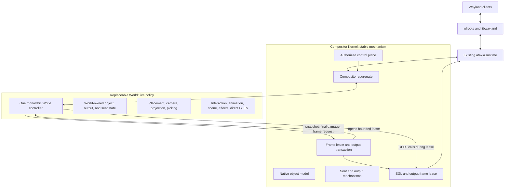
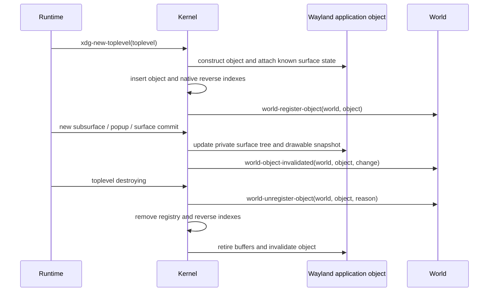
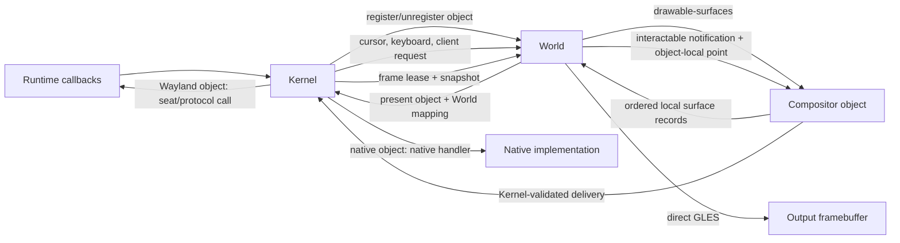
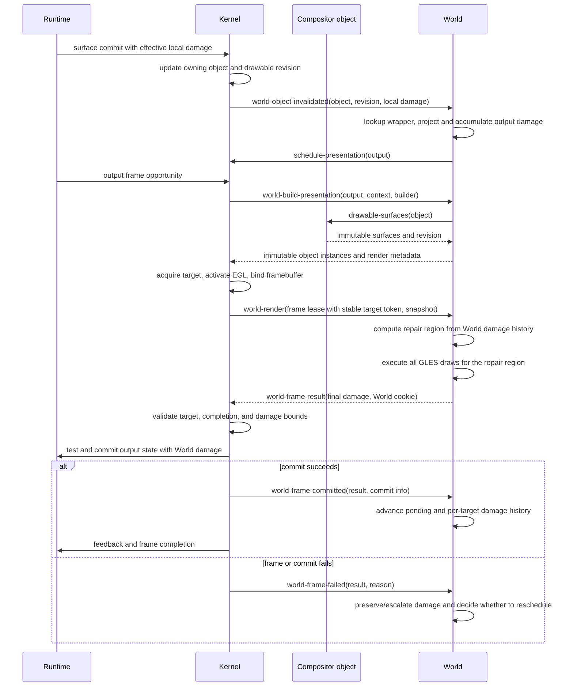

# Post-Runtime Compositor Redesign Plan

Status: proposed architecture; no compositor implementation is retained by this
plan. `ataxia.runtime` is the starting boundary and remains reusable as-is for
the first implementation.

## 1. Feasibility Verdict

The proposal is practical, including infinite planes, spherical presentation,
multiple seats, live Lisp redefinition, custom shaders, and agent control. The
central idea is correct:

> Runtime owns exact wlroots and Wayland mechanisms. A replaceable World owns
> the meaning and presentation of stable compositor objects.

Four parts of the crude proposal need stricter boundaries:

| Proposed idea | Verdict | Required refinement |
|---|---|---|
| World renders objects | Correct with a frame boundary | Kernel opens a bounded frame lease by acquiring the output buffer, activating EGL, and binding the output framebuffer. World executes the actual GLES draw calls only during that lease. |
| World owns damage control | Correct | World owns pending damage, history, local-to-output projection, old/new coverage, buffer repair, and the final output damage region. Kernel only supplies target metadata, validates the returned region, and submits it with the output transaction. |
| `drawable` and `interactable` object interfaces | Correct | Kernel owns both protocols. Wayland applications and native components implement the same methods, so World renders and targets them without type-specific branches. |
| Application is one world object | Correct | Kernel must still retain every `wl_surface`, subsurface, popup, buffer, commit, transform, and committed surface-local damage fact beneath it. |
| Each seat may have its own camera | Conditional | One physical output has one final image. Different simultaneous cameras require different outputs or explicit split-screen viewports. |
| Runtime never changes again | Only for the baseline | The current Runtime is enough for the initial compositor. New Wayland protocol families must later be added horizontally inside Runtime, not emulated above it. |

## 2. Non-Negotiable Constraints

### 2.1 Wayland surface semantics remain below World

A client submits state by committing a `wl_surface`. Buffer damage, surface
damage, buffer scale, transform, viewport, input region, synchronized
subsurfaces, and role lifecycle are surface-level facts. wlroots exposes the
current surface tree and the source box that must be sampled.

World may place one application as a logical unit, but it cannot flatten the
application into one texture without losing independent subsurface commits,
popup lifecycle, input regions, or buffer release ordering.

### 2.2 Output submission remains one transaction

World may call GLES only inside a bounded frame lease opened by Kernel. It must
not draw from input, lifecycle, timer, control, or arbitrary REPL callbacks and
must never commit the output itself. Kernel owns output acquisition and
submission, while World owns the image and damage decision inside the
transaction:

1. World accumulates damage and requests presentation;
2. Kernel waits for an output frame opportunity;
3. World builds an immutable presentation snapshot;
4. Kernel acquires a scanout-compatible buffer and reports a stable target
   identity;
5. Kernel makes Runtime's EGL context current and binds the output framebuffer;
6. Kernel establishes a known GL baseline and opens a dynamically scoped frame
   lease;
7. `world-render` computes the target repair region and executes direct GLES;
8. World returns a completed frame result containing the final output damage;
9. Kernel closes the lease, restores required GL state, validates the frame
   result, and applies its damage to one `wlr_output_state`;
10. Kernel tests and commits the output state, then reports success or failure
    to World;
11. Runtime feedback, frame completion, and resource retirement follow the
    successful commit.

If World signals an error or leaves the frame incomplete, Kernel does not commit
that buffer. It restores GL state with `unwind-protect`, releases the acquired
target, and calls `world-frame-failed`. World retains or escalates its own
pending damage and decides whether to request another frame.

### 2.3 One geometry drives draw, damage, and input

The mapping used to draw a surface must also provide:

- output coverage;
- output-to-object inverse mapping;
- object-local damage projection;
- surface enter/leave membership;
- hit-test coordinates.

Maintaining a separate rectangular hit model is invalid for curved, rotated, or
shader-deformed windows.

### 2.4 Live Lisp changes occur at owner-thread safe points

Method redefinition is useful, but foreign resources and active frames cannot
be mutated concurrently from an arbitrary REPL thread. Live mutations enter the
Wayland owner thread through an idle callback or control inbox. Method-only
changes can affect the installed World immediately; state-layout changes should
replace the World transactionally.

## 3. Refined Architecture

There are three boundaries, not two interchangeable layers:



### 3.1 Existing Runtime

Runtime remains the exact wlroots bridge. The current implementation already
provides the baseline required by the redesign:

- owner-thread Wayland event-loop dispatch and safe points;
- typed output, input, surface, subsurface, XDG, decoration, activation, and
  pointer-constraint callbacks;
- typed `wlr_seat` creation and notification functions;
- retained surface buffers and wlroots GLES texture attributes;
- access to the wlroots-owned EGL context;
- swapchain acquisition, output framebuffer lookup, output state test/commit,
  damage submission, presentation feedback, and frame completion.

No generic event envelope is added around Runtime. The Kernel implements its
protocol-specific sink generics directly.

The current Runtime does not expose complete implementations for layer shell,
session lock, selection and drag handling, text input/input method, touch,
tablet, screencopy, or Xwayland. These are not Kernel or World abstractions. If
required, each must be an additive protocol-specific Runtime module later.

### 3.2 Compositor Kernel

The Kernel is stable Common Lisp mechanism above Runtime. It owns:

- stable identities for applications, surfaces, popups, outputs, seats, and
  input devices;
- the complete Wayland surface tree and committed content state;
- retained buffers, texture views, resource generations, and release ordering;
- actual Wayland keyboard and pointer focus;
- serial validation, pressed input state, constraints, and event delivery;
- output configuration, swapchains, frame pacing, and output commit state;
- immutable snapshots and their retirement;
- output-buffer acquisition, EGL activation, framebuffer binding, GL baseline,
  frame-lease lifetime, and failed-frame recovery;
- authorization, external control transport, and owner-thread ingress;
- installation and replacement of one active World.

Kernel has no planar or spherical coordinates, no default window chrome, no
shadow choice, no camera semantics, and no animation subsystem, state, or
dispatch.

### 3.3 World

World is one monolithic replaceable CLOS object. It owns:

- application placement and world-specific metadata;
- output cameras, viewports, spatial indexes, and world topology;
- per-seat cursor coordinates, navigation state, and active operations;
- stacking interpretation and focus policy;
- move, resize, maximize, fullscreen, selection, and gesture meaning;
- scene composition, backgrounds, chrome, panels, cursors, and overlays;
- actual direct GLES rendering, shaders, programs, buffers, meshes,
  intermediate targets, and effect execution;
- per-output pending damage, committed damage history, target-history repair,
  local-to-output projection, and final output damage regions;
- animation definitions, clocks, timelines, easing, sampling, bindings,
  conflicts, cancellation, completion, and GPU animation state;
- animation-driven damage and requests for subsequent presentation frames;
- policy-specific semantic commands and observations;
- portable export/import of World-owned state.

Planar and spherical Worlds do not inherit a stateful shared controller. They
may share pure functions, macros, numerical algorithms, or immutable data
definitions. Each World owns its entire state and lifecycle.

## 4. Ownership Matrix

| Concern | Runtime | Kernel | World |
|---|---:|---:|---:|
| wlroots wrappers and exact callbacks | Owns | Uses | Never sees raw pointers |
| Wayland protocol globals and native objects | Owns | Selects and operates | May request through Kernel |
| Application and surface identity | Emits native facts | Owns stable objects | References stable objects |
| Surface commits, buffers, transforms, local damage | Exposes exact facts | Retains protocol state in objects | Consumes invalidation and maps local damage |
| Application placement | No | Opaque to Kernel | Owns |
| Camera and projection | No | Opaque to Kernel | Owns |
| Actual `wlr_seat` focus and delivery | Executes | Owns and validates | Chooses intended target |
| Cursor world/output position | No | Queries for delivery | Owns per seat |
| Active move/resize/navigation operation | No | Provides validated mechanisms | Owns |
| Scene contents and visible style | No | Retains stable objects and snapshots | Owns |
| Frame scheduling | Exposes frame events | Owns generic mechanism | Requests every needed frame |
| Damage history and target repair | Exposes buffer acquire/commit API | Supplies stable target token and validates final region | Owns completely |
| Projection of local damage | No | Opaque to Kernel | Owns through World mapping |
| Animation definitions, timing, sampling, and lifecycle | No | No | Owns completely |
| EGL activation and output submission | Supplies exact access | Owns | Uses only through lease |
| GLES draw calls and World GL resources | Supplies context | Opens and contains lease | Owns |
| External authorization | No | Owns | Handles authorized semantic actions |

## 5. Kernel Object Registry

Kernel owns one registry containing every object exposed to World. Objects have
stable Lisp identity and may implement either or both Kernel-owned interfaces:

```lisp
(defclass compositor-object ()
  ((id         :reader object-id)
   (generation :reader object-generation)
   (state      :reader object-state)))

(defclass drawable () ())
(defclass interactable () ())

(defclass wayland-application
    (compositor-object drawable interactable)
  (...))

(defclass native-component
    (compositor-object drawable interactable)
  (...))
```

`drawable` and `interactable` are protocol marker classes with no required
slots. Their generic functions define the actual interfaces. World receives a
`compositor-object` and calls those interfaces; it does not branch on whether
the object is a Wayland client, RmlUi document, cursor, panel, or other native
component.

Kernel provides `kernel-objects`, `find-kernel-object`, and capability queries.
World does not maintain authoritative object existence, but every concrete
World maintains the required derived identity index and World-owned wrappers
described below.

### 5.1 Drawable interface

`drawable-surfaces` returns two values: an immutable vector of the object's
ordered local surfaces and one revision covering the entire vector:

```lisp
(defgeneric drawable-surfaces (drawable))
(defgeneric drawable-local-bounds (drawable))
```

The result of `drawable-surfaces` contains zero or more `drawable-surface`
records. Each record exposes only information needed by a World renderer:

```lisp
(defclass drawable-surface ()
  ((id               :reader drawable-surface-id)
   (local-x          :reader drawable-surface-local-x)
   (local-y          :reader drawable-surface-local-y)
   (width            :reader drawable-surface-width)
   (height           :reader drawable-surface-height)
   (order            :reader drawable-surface-order)
   (source-box       :reader drawable-surface-source-box)
   (buffer-transform :reader drawable-surface-buffer-transform)
   (render-source    :reader drawable-surface-render-source)
   (damage           :reader drawable-surface-damage)
   (generation       :reader drawable-surface-generation)))
```

For `wayland-application`, the snapshot contains the root surface and every
mapped subsurface in correct Wayland render order, with each child location
relative to the object-local origin. Kernel computes this protocol-specific
surface tree inside the object. World receives only the resulting ordered
records.

The object-local origin is the current XDG window-geometry origin. Consequently
the root `wl_surface` itself may have a non-zero or negative local offset, and
subsurface offsets are accumulated through their parent chain. This preserves
client-side decorations and other content outside the nominal window geometry.
Before a valid XDG geometry exists, Kernel uses the protocol-defined surface
extents and republishes the vector when the geometry changes.

`drawable-surface-render-source` is a stable render-source value, not a wlroots
object. Every render source exposes the GLES sampling or geometry information
defined by the presentation protocol. A Wayland render source contains a
retained client texture view. A native component may provide a texture view or
retained geometry source. World consumes the common render-source protocol and
does not branch on whether the owning object is Wayland or native.

The vector and revision are captured from one object state. The snapshot is
rebuilt only when the object's surface/content revision changes. Returning a
cached immutable vector avoids allocation and surface-tree traversal on every
frame. Surface records are render primitives; World places and interacts with
the containing object, not individual Wayland subsurfaces.

`drawable-surface-damage` is only the effective object-local damage associated
with that content revision. Kernel retains it as a Wayland commit fact and
passes it through object invalidation. It is not an output damage accumulator or
history; World consumes it and performs every projection, merge, repair, and
full-redraw decision.

This keeps the frame hot path practical: CLOS dispatch occurs once when World
requests an object's cached snapshot, then rendering traverses a flat vector.
There is no per-frame wlroots tree walk, foreign callback, mailbox, or
Wayland/native object branch.

### 5.2 Interactable interface

World calls the interactable protocol after it has transformed an output point
into object-local coordinates and chosen the target object:

```lisp
(defgeneric interactable-pointer-motion
    (object kernel seat local-x local-y input))
(defgeneric interactable-pointer-button
    (object kernel seat local-x local-y input))
(defgeneric interactable-pointer-axis
    (object kernel seat local-x local-y input))
(defgeneric interactable-key-event
    (object kernel seat input))
(defgeneric interactable-focus
    (object kernel seat focus-kind))
```

These methods are notification and delivery mechanisms, not World policy.
Kernel validates object lifetime, resolves the stable logical seat to its
Runtime `wlr_seat`, and applies the implementation-specific action. Each method
returns an `interaction-result` describing whether delivery occurred, the
stable object that received it, and whether focus or capture changed. It never
returns a Runtime surface pointer. At minimum, its status is one of
`:delivered`, `:miss`, `:captured`, or `:rejected`.

For `wayland-application`, Kernel uses the application's private surface tree,
subsurface offsets, popup hierarchy, input regions, and current presentation
generation to resolve the leaf `wl_surface` and surface-local coordinates. It
then sends the appropriate Runtime seat enter, leave, motion, button, axis,
keyboard, or focus operation.

For `native-component`, the same generics call its native input handler. World
does not know which delivery path ran. If an object is not interactable, the
capability check fails before delivery.

An object passed by World is an intended target, not authority to violate
protocol state. Kernel exposes the current `seat-interaction-capture` when an
implicit pointer grab, popup grab, drag, lock, or constraint requires a target.
World maps the cursor against that captured object's presented instance instead
of performing a normal pick. Kernel rejects inconsistent delivery and returns
the resolved result. This preserves Wayland grab semantics without moving
cursor policy or geometry into Kernel.

During an uncaptured pick, `:miss` means the object-local point does not land in
any current surface input region. World then tries the next presentation
candidate below it. This is how irregular native widgets and client-defined
surface input-region holes allow pointer input to reach an object behind them
without exposing surface identities to World.

### 5.3 Wayland application ownership

Kernel creates and owns every `wayland-application`. The object encapsulates:

- the Runtime XDG toplevel and root surface wrappers;
- every owned root and subsurface `surface-node`, plus associated popup
  relationships and either their nodes or registered object identities;
- surface ordering, relative locations, map state, and input regions;
- committed sizes, source boxes, transforms, retained buffers, and textures;
- surface and drawable revisions;
- the methods that translate interactable notifications into Runtime seat
  operations;
- stable title, app ID, lifecycle, and capability observations.

It deliberately contains no World placement, camera, z-order, opacity, or
animation state.

Kernel may maintain private reverse indexes from Runtime surface identity to the
owning application so callbacks can be resolved efficiently. Those indexes are
not a second World-visible object model.

### 5.4 Native components

Kernel registers native compositor UI through the same object registry and
notifies World through the same lifecycle endpoint. A native component may
implement one or both interfaces. Typical UI components implement both and
return one or more drawable surfaces plus native interactable methods.

RmlUi requires a C++ adapter implementing its render and system interfaces. It
may retain compiled geometry and textures as native drawable content. World may
consume those resources only while `world-render` holds a live frame lease.

### 5.5 Object lifecycle



A raw `wl_surface` may exist before it receives an XDG role. Kernel tracks that
surface privately and attaches it when the application object is constructed.
World is notified only after the object is internally coherent. On destruction,
World is notified while stable object metadata remains readable but before
Runtime wrappers and retained buffers are released.

Native objects use the same `register-kernel-object` and
`unregister-kernel-object` lifecycle and therefore produce the same World
callbacks.

### 5.6 Interface topology



The interface directions are deliberate:

- Kernel tells World which objects exist and supplies protocol-derived events.
- World decides placement, picking, interaction policy, and which registered
  objects appear in a presentation.
- `drawable` lets World obtain renderable surface information without asking
  what kind of object supplied it.
- `interactable` lets World notify an object of local input without knowing how
  that input becomes a Wayland seat call or native UI callback.
- Kernel remains the only authority that resolves Runtime identities, validates
  seats and serials, mutates Wayland protocol state, and commits outputs.

### 5.7 World-owned object state

Kernel objects never receive a `world-data` slot. Each concrete World creates
its own wrapper when `world-register-object` runs. For example, the planar World
may define:

```lisp
(defclass planar-object-state ()
  ((object                 :initarg :object :reader state-kernel-object)
   (placement              :accessor state-placement)
   (stack-key              :accessor state-stack-key)
   (visible-p              :accessor state-visible-p)
   (effects                :accessor state-effects)
   (animations             :accessor state-animations)
   (policy-data            :accessor state-policy-data)
   (last-drawable-revision :accessor state-last-drawable-revision)))
```

A spherical World defines an unrelated `spherical-object-state` with spherical
placement and policy slots. The two classes share no stateful superclass. These
wrappers contain all World-owned facts about a Kernel object: placement,
stacking, visibility, styling, animation, interaction policy, cached spatial
data, and any World-specific extension state.

Each World maintains three complementary structures:

```text
object-index       Kernel object identity -> World wrapper
object collections World wrappers used for lifecycle and enumeration
spatial/stack data World wrappers used directly for picking and rendering
```

The identity index is an `eq` hash table initially. It is only the bridge for
callbacks such as `world-object-invalidated`; it is not the rendering data
structure. Presentation, picking, animation, and damage traversal operate
directly on wrappers already stored in the World's stacking and spatial
collections. If profiling later justifies it, the callback index may become a
generation-checked vector keyed by Kernel-assigned dense IDs without changing
the wrapper model.

`world-register-object` constructs the wrapper, inserts it into the identity
index and World collections, and applies that World's initial-placement policy.
`world-unregister-object` resolves the wrapper once, damages its last visible
coverage in World state, removes it from every collection, and destroys only
World-owned resources. Kernel remains responsible for the underlying object's
protocol and buffer lifetime.

A wrapper represents the logical object once. Immutable presentation instances
remain separate because one object may be projected multiple times, through
multiple viewports, or onto multiple outputs. Each instance refers to its World
wrapper and carries only instance-specific mapping, clip, effects, coverage, and
interaction data.

Keeping wrappers inside World is required for transactional replacement. The
active and candidate Worlds can construct different wrappers and spatial
indexes for the same Kernel objects simultaneously. A single slot injected into
the Kernel object could not represent both states safely and would complicate
rollback and retirement.

## 6. CLOS Protocols

### 6.1 Capability and tooling protocol

Capabilities are useful for agents and inspection, but are not the rendering
hot path:

```lisp
(defgeneric object-description (object))
(defgeneric object-capabilities (object))
(defgeneric object-actions (object principal))
(defgeneric observe-object (object context))
```

Capability values describe supported operations; they do not grant authority.
Kernel checks the principal before invoking an action.

`drawable` and `interactable` membership may also be reported through
`object-capabilities` for agents. Generic method dispatch remains authoritative.

### 6.2 Required Kernel-to-World protocol

These are typed generics, not a universal event structure:

```lisp
(defgeneric world-attached (world kernel))
(defgeneric world-quiescing (world reason))

(defgeneric world-register-object (world object))
(defgeneric world-unregister-object (world object reason))
(defgeneric world-object-changed (world object change))
(defgeneric world-object-invalidated (world object invalidation))

(defgeneric world-output-added (world output))
(defgeneric world-output-changed (world output change))
(defgeneric world-output-removing (world output))
(defgeneric world-seat-added (world seat))
(defgeneric world-seat-removing (world seat))

(defgeneric world-cursor-motion (world seat input))
(defgeneric world-cursor-button (world seat input))
(defgeneric world-cursor-axis (world seat input))
(defgeneric world-key-event (world seat input))

(defgeneric world-client-request (world object request))

(defgeneric world-build-presentation (world output frame-context builder))
(defgeneric world-graphics-attached (world graphics-context))
(defgeneric world-render (world frame-lease snapshot))
(defgeneric world-frame-committed
    (world output frame-result commit-info))
(defgeneric world-frame-failed
    (world output frame-result-or-nil reason))
(defgeneric world-graphics-detaching (world graphics-context reason))

(defgeneric world-observe (world principal request))
(defgeneric world-control (world principal action))
(defgeneric world-export-state (world context))
(defgeneric world-import-state (world portable-state context))
```

Runtime event values are converted to stable Kernel identities or copied input
values before World sees them. No callback-scoped foreign pointer enters World
state.

`world-register-object`, cursor and keyboard endpoints, client requests,
presentation building, `world-render`, and the frame commit/failure callbacks
are required World methods. Output, seat, invalidation, observation, and
migration methods are required
when the corresponding capability is enabled. The base World does not silently
invent desktop behavior for missing required methods.

Client requests are typed objects such as `move-client-request`,
`resize-client-request`, `fullscreen-client-request`, or
`show-menu-client-request`. Kernel resolves Runtime surfaces, seats, serials,
edges, and outputs before invoking World. World never receives a raw XDG event.

Only requests requiring compositor policy cross this boundary. Kernel handles
protocol bookkeeping such as configure acknowledgement, surface commits,
window-geometry changes, and role destruction inside the application object.
Fullscreen, maximize, minimize, interactive move/resize, activation, popup
placement policy, and window-menu requests call `world-client-request` with the
owning object and a typed request value.

### 6.3 World-to-Kernel mechanisms

World calls these synchronously on the owner thread:

```text
kernel-objects / find-kernel-object
register-native-object / unregister-native-object
seat-interaction-capture
interactable-focus
clear-interaction-focus
interactable-pointer-motion / button / axis
interactable-key-event
request-object-configuration
request-object-state
schedule-presentation
current-presentation-snapshot
pick-presentation-candidates
schedule-owner-task-at / cancel-owner-task
enqueue-world-graphics-task
create-logical-seat / destroy-logical-seat
run-hook
```

Kernel validates lifetime, seat ownership, serials, finite values, output
availability, resource ownership, and protocol sequencing. It has no
World-facing damage mutation API because damage state belongs to World. Calls do
not cross a mailbox inside the owner thread.

`request-object-configuration` and `request-object-state` dispatch on the
object's supported capabilities. A Wayland implementation converts accepted
requests into XDG configure/state operations; a native implementation may
handle the same semantic request locally or reject an unsupported capability.
World therefore does not need a Wayland/native type branch to resize, activate,
or otherwise operate an object.

World or a trusted native-UI subsystem may construct a native component, but it
becomes visible only after Kernel assigns its identity, registers it, and calls
`world-register-object`. Kernel applies the same ordering on unregistration.

## 7. Presentation Protocol

World first contributes immutable instances to a builder:

```lisp
(present builder
         world-object-state
         :object object
         :mapping mapping
         :coverage coverage
         :layer layer
         :clip clip
         :effects effect-stack
         :interaction-tag tag)
```

`present` accepts a World wrapper and its registered Kernel object implementing
`drawable`. The wrapper remains an opaque World payload; the builder captures
the object's current `drawable-surfaces` vector and revision in the instance.
Kernel does not inspect whether the object is a Wayland application or native
component, and it does not expand a Wayland surface tree at this stage; the
object already performed that work when its drawable snapshot changed.

World combines each surface record with the instance mapping, clip, layer, and
effects and supplies conservative output coverage to the builder. The resulting
presentation data contains its object-local rectangle, render source, source
box, buffer transform, declared coverage, local damage, and generation. A
retained client texture view exposes only the GLES target, texture name, alpha
information, dimensions, and generation. It does not expose the underlying
`wlr_texture`, `wlr_buffer`, or `wl_surface` wrapper to World.

The mapping protocol is the essential geometry boundary:

```lisp
(defgeneric mapping-local-rectangle-geometry (mapping rectangle))
(defgeneric mapping-output-to-local (mapping output-x output-y))
(defgeneric mapping-project-local-damage (mapping rectangles))
(defgeneric mapping-output-coverage (mapping local-bounds))
```

These mapping methods are World-side geometry operations. World invokes them
for drawing, picking, damage projection, and coverage before contributing an
instance. Kernel stores the mapping and declared coverage as opaque/validated
frame data but does not call the damage projection method.

A planar mapping may return quads and affine inverses. A spherical mapping may
return triangle meshes and barycentric inverse mapping. A discontinuous or
non-invertible mapping may split an object into several instances or decline
precise projection, causing World to conservatively damage the item or output.

The immutable `presentation-snapshot` contains ordered object instances,
captured drawable-surface vectors, mappings, output coverage, interaction tags,
opaque World render payloads, and referenced resources. `world-render` iterates
the same object/surface representation for Wayland and native objects and issues
the actual GLES calls. World picking, object-local cursor coordinates, output
membership, and damage consume that exact snapshot and its mappings. Kernel
retains referenced resources for the frame but never interprets World mappings
to compute damage.

## 8. Direct GLES Rendering

Kernel passes World a dynamically scoped `frame-lease`:

```lisp
(defclass frame-lease ()
  ((output        :reader frame-output)
   (target-token  :reader frame-target-token)
   (framebuffer   :reader frame-framebuffer)
   (width         :reader frame-width)
   (height        :reader frame-height)
   (scale         :reader frame-scale)
   (transform     :reader frame-transform)
   (timestamp     :reader frame-timestamp)
   (snapshot      :reader frame-snapshot)
   (generation    :reader frame-generation)
   (valid-p       :reader frame-lease-valid-p)))

(defclass world-frame-result ()
  ((target-token :initarg :target-token :reader frame-result-target-token)
   (damage       :initarg :damage :reader frame-result-damage)
   (complete-p   :initarg :complete-p :reader frame-result-complete-p)
   (world-cookie :initarg :world-cookie :reader frame-result-world-cookie)))
```

The lease is valid only during the dynamic extent of `world-render`. Kernel has
already made EGL current, acquired and retained the output buffer, bound the
output framebuffer, and established its documented initial state. World may
then issue arbitrary GLES calls, including compiling programs, uploading
buffers, rendering meshes, using intermediate FBOs, sampling client textures,
and running per-window or output-wide effects.

Kernel performs no compositor drawing, clearing, background rendering, cursor
rendering, or effect pass. It only establishes GL state and the leased target;
all GLES commands that determine visible pixels are issued by World.

`frame-target-token` is a stable opaque identity for the acquired buffer and
generation. World records the output commit sequence for that token in
`world-frame-committed` and therefore derives target age entirely from its own
history. A token unknown to the current World requires a full-output repair.
World combines this target history with its pending logical damage and effect
rules, draws every required repair rectangle, and returns a
`world-frame-result` containing the exact final output damage.

The existing Runtime can support this without modification. Although
`acquire-output-buffer` returns a fresh Lisp wrapper, Runtime publicly exposes
`native-object-address`. Kernel uses that value only inside an output-local
interner keyed by the current swapchain generation and exposes a fresh opaque
Lisp target token to World. Kernel never exposes or dereferences the address as
World data. Swapchain replacement invalidates the entire token generation, so
World treats every new token as requiring full repair.

Before `world-render` returns, World must place the final image in the leased
output framebuffer for every rectangle in `frame-result-damage`. It may change
GL state freely inside the lease. Kernel re-establishes its required state after
the callback; World must not rely on GL state surviving between leases.

Kernel validates only structural facts: the result belongs to the leased target
and generation, is complete, contains finite rectangles, and remains inside the
output bounds. It does not expand, project, merge, or choose damage. After a
successful Runtime commit it calls `world-frame-committed`, allowing World to
advance its pending and per-target damage history. On acquisition, rendering,
test, or commit failure it calls `world-frame-failed`; World keeps the relevant
damage pending and decides whether to retry or fall back to a full redraw.

World must not retain the lease, call `eglMakeCurrent`, delete or reconfigure
the Kernel-owned output framebuffer, dispatch the Wayland loop, or invoke output
test/commit functions. Raw GLES is intentionally trusted, so these rules are an
architectural contract rather than a sandbox.

World owns its programs, VAOs, VBOs, intermediate textures, and other GL names.
Those resources are scoped to the World generation. Kernel invokes
`world-graphics-attached` and `world-graphics-detaching` with EGL current so the
World can create and delete them safely. Live shader or resource mutations use
`enqueue-world-graphics-task`, which runs at an owner-thread safe point with a
current graphics context.

Runtime client texture names remain valid only while the corresponding retained
buffer and snapshot resources remain live. World may sample them during the
lease but must not cache a client texture name beyond the resource generation
advertised by Kernel.

The first implementation should continue using Runtime's retained client buffer
and wlroots GLES texture access. Reimplementing DMA-BUF-to-EGLImage and SHM
upload would duplicate synchronization, format, modifier, and lifetime work
already provided by wlroots. This remains a custom compositor renderer because
World executes all composition and shaders as Ataxia GLES code; wlroots only
imports the client buffer and supplies the EGL environment.

Kernel must not silently replace World rendering with direct scanout, hardware
overlay planes, or hardware cursors. Those optimizations may be added later only
as explicit World-authored frame-result modes whose exact resources and damage
Kernel validates and submits. Arbitrary transforms, post-processing, or multiple
visible cursors normally require composition. Explicit synchronization,
advanced color management, HDR, or new DRM plane controls may require additive
Runtime APIs; they must not be approximated inside World.

Output-wide and history-based effects are possible. Every World render stage
declares a damage rule:

```text
:local       output damage is unchanged
:expanded    output damage grows by a bounded radius
:mapped      pass supplies a conservative mapping
:full        the whole output is required
```

World composes these rules into its pending and target-repair damage. If a stage
cannot state a conservative rule, World must choose full-output damage. Kernel
only bounds-checks the final region and cannot certify that a World shader's
damage declaration is semantically sufficient.

## 9. World Damage and Kernel Frame Scheduling

Each World owns one authoritative damage state per output. Kernel owns no
pending-damage region, damage history, damage ring, old/new coverage cache, or
fallback policy. Kernel only schedules an output opportunity when requested,
provides acquired-target metadata, validates the final region structurally, and
submits that region to Runtime.

### 9.1 World damage state

A concrete World output state normally contains:

- pending logical output damage not yet committed;
- the last successfully committed World presentation and coverage information;
- per-target damage history keyed by stable target token and generation;
- effect expansion, temporal-history, and full-redraw requirements;
- a staged frame record retained until commit success or failure;
- debug modes for visualizing or comparing damaged and undamaged regions.

For an acquired target, World computes the initial repair region as:

```text
pending logical damage
union every successfully committed output-damage region since this target's
last World commit
```

World then applies any remaining effect or temporal expansion, merges or
simplifies the region as it chooses, and returns the final result. A missing
token history, swapchain-generation change, incompatible temporal effect, or
discarded history forces a World-chosen full-output repair. History may be
bounded because falling off the retained history has the same safe full-repair
result.

The World accumulates damage from:

- object invalidation carrying committed surface-local damage and revision;
- application map, unmap, resize, destruction, placement, or stacking changes;
- old and new World-computed coverage after any mapping change;
- cursor, native UI, background, overlay, shader, and animation changes;
- output configuration, target-history loss, or World replacement.

On a Runtime surface commit, Kernel resolves the owning application, updates its
private surface tree and immutable drawable snapshot, and calls
`world-object-invalidated` with the stable object, new revision, and effective
object-local damage. World performs the single callback-index lookup, projects
that damage through every visible presentation instance, merges it into its own
output state, and calls `schedule-presentation`. Kernel does not automatically
damage or schedule the client commit independently of World.

### 9.2 Frame algorithm



Kernel schedules frames only for Runtime/output requirements or an explicit
World request; it has no damage-driven or animation-driven continuous-redraw
mode. `schedule-presentation` is generation-aware: a request made during the
current frame is latched for the next output opportunity. World is responsible
for requesting every frame needed by temporal state or newly accumulated
damage.

Damage state advances only after `world-frame-committed`. A failed acquisition,
draw, test, or commit cannot consume World damage. If World returns malformed or
out-of-bounds damage, Kernel rejects the frame and reports failure rather than
inventing a full-output fallback. A World may deliberately choose full-output
damage whenever its mapping, target history, or effect history cannot support a
safe partial redraw.

## 10. Input, Focus, and Multiple Seats

Kernel maps each Runtime input device to one logical seat. Each logical seat
owns a real Runtime `wlr_seat`, device capabilities, keymap, pressed state,
client cursor surface, and actual Wayland focus. World owns a separate state
entry keyed by the stable seat identity:

```text
seat -> cursor position in World/output coordinates
seat -> cursor output or viewport
seat -> active move/resize/navigation operation
seat -> selection and World-specific gesture state
```

Pointer flow:

1. Runtime emits a typed device event.
2. Kernel resolves the logical seat and calls `world-cursor-motion` with stable,
   copied input data.
3. World updates its cursor state and uses Kernel helpers for output bounds and
   pointer constraints.
4. World queries `seat-interaction-capture`. It uses the captured object's
   presented instance when one exists; otherwise it gets front-to-back
   candidates from the last immutable presentation snapshot.
5. World maps the point into each candidate's object-local coordinates.
6. World decides whether the motion changes World state or should be delivered
   to the object.
7. For object delivery, World calls `interactable-pointer-motion` with the
   object, logical seat, object-local coordinates, and input value. On `:miss`,
   it continues to the next candidate; on delivery or capture, it stops.
8. Kernel validates the object, seat, and active capture. A
   `wayland-application` method resolves its leaf surface and input region and
   sends Runtime `wlr_seat` operations; a `native-component` method invokes its
   native handler.
9. Button, axis, keyboard, and focus delivery follow the same interactable
   path. World consumes the `interaction-result` and requests old/new cursor or
   object damage when its state changes.

Kernel owns actual Wayland focus and serial/grab validation. World owns target
selection, cursor coordinates, gestures, and the decision to invoke an
interactable endpoint. World never calls Runtime seat functions or examines a
`wl_surface`.

Keyboard flow is analogous but has no coordinate mapping. Kernel updates the
logical seat's pressed/modifier state and calls `world-key-event` with stable
key data. World may consume the key as a binding or call
`interactable-key-event` on its selected keyboard-focus object. Kernel verifies
that selection against actual seat focus and emits the Runtime key and modifier
notifications. Clicking background policy may call `clear-interaction-focus`;
it never manufactures a dummy interactable object.

Multiple seats and multiple rendered cursors are fully feasible. A client can
bind each published `wl_seat`, and wlroots maintains focus and grab state per
seat. Different seat cameras on one output are not independently observable
unless World defines separate output ownership or split-screen regions.

## 11. Animation

Animation is entirely World-private. Kernel defines no animation class,
protocol method, clock, timeline, easing function, binding, conflict key,
cancellation rule, completion callback, or animation executor.

Each World owns:

- its animation definitions and per-object selection rules;
- start times, durations, delays, normalized progress, easing, and sampling;
- active instances, conflict resolution, cancellation, and completion;
- opacity, transforms, placement, camera values, shader uniforms, shadows,
  reveal state, history buffers, and every other animated property;
- damage requests and conservative effect-damage rules for each sample;
- the decision to request another presentation frame.

The generic frame context supplies a monotonic presentation timestamp because
all rendering needs stable frame time; it has no animation semantics. A World
starts an animation by mutating its own state, damaging affected coverage, and
calling `schedule-presentation`. During `world-build-presentation`, it samples
its own active instances at the frame timestamp, builds the resulting snapshot,
declares any shader/effect damage required for that sample, and requests another
presentation only if its own temporal state remains active. World projects
old/new snapshot coverage and merges it into its own output damage state. When
World stops requesting frames, Kernel stops without knowing that an animation
ended.

`schedule-presentation` is generation-aware frame infrastructure: a request made
while building or rendering the current frame is latched for the following
output opportunity rather than consumed by the current commit. This behavior is
identical for animations, cursor changes, deferred UI work, and any other World
request.

Delayed starts may use the general owner-thread
`schedule-owner-task-at`/`cancel-owner-task` mechanism. Those tasks are ordinary
event-loop callbacks used for any delayed World work; Kernel stores no animation
identity or timing rule. Time-varying shaders follow the same World-owned path.
Two applications may therefore use unrelated animation definitions, clocks,
bindings, and shader programs.

## 12. Agentic Control and Introspection

Human-equivalent input and semantic control remain separate:

```text
agent device input -> logical seat -> normal World input path
semantic action    -> authorized Kernel control -> World command or Kernel mechanism
```

Kernel owns principals, capabilities, limits, owner-thread ingress, and the
read-eval-disabled local transport. World exposes observations and typed
semantic actions. `object-actions` is filtered by the principal; an advertised
action is not permission to invoke it.

The local Lisp image may expose a richer trusted REPL API, but remote control
must not evaluate arbitrary forms. A helper such as `call-in-compositor-thread`
is required for safe live mutation.

## 13. Live World Replacement

World replacement is a transaction:

1. enter an owner-thread safe point;
2. reject or cancel active World operations;
3. ask the old World for neutral portable state;
4. construct a fresh candidate World;
5. import view, output, and seat state without referencing the old class;
6. construct candidate wrappers and indexes for every registered Kernel object;
7. build trial snapshots and candidate-owned full-output damage state for every
   active output;
8. validate finite geometry, inverse mappings, final damage bounds, and
   candidate World graphics initialization under a current EGL context;
9. atomically install the candidate, wrappers, indexes, damage state, and
   snapshots;
10. recompute actual client focus and surface membership;
11. have the new World request a full presentation for every affected output;
12. retire old snapshots and World resources after submitted frames finish.

Planar and spherical Worlds independently understand the neutral portable
schema. They never contain methods specialized on each other's concrete types.
Migration may reject values it cannot represent safely.

## 14. Reusable Code

The crude proposal lists `DamageManager`, `FocusManager`, `SeatStateManager`,
`AnimationScheduler`, and similar replaceable services. That composition would
recreate the ownership ambiguity this redesign is intended to remove.

Use these rules instead:

- frame scheduling, output acquisition/commit, client-buffer cache, actual
  focus, and protocol seat management are Kernel mechanisms;
- World owns one monolithic state graph including object wrappers, spatial
  indexes, presentation policy, and output damage history;
- any animation scheduler or timeline is private state inside that World;
- reusable World code is a pure function, macro, numerical library, immutable
  definition, or explicitly World-private cache;
- no shared stateful CLOS manager has an independent compositor lifecycle;
- no mailbox exists between Kernel components or between Kernel and World.

Useful libraries still include region math, easing, R-trees, mesh generation,
matrix operations, color transforms, and surface-tree traversal helpers.

## 15. Feasibility by Target

| Target | Feasibility | Main condition |
|---|---|---|
| Conventional desktop | Straightforward | Planar mapping and standard focus policy |
| Infinite 2D canvas | Straightforward | Camera-relative placement and spatial index |
| Spherical world | Feasible | Mesh projection, inverse picking, conservative damage |
| Other non-Euclidean space | Feasible with constraints | Must supply render geometry, inverse mapping, and safe coverage; discontinuities may require item splitting |
| 3D/spatial desktop | Feasible | World owns depth and picking; Wayland client input remains 2D surface-local |
| Multiple physical or virtual seats | Feasible | One Runtime `wlr_seat` per logical seat and per-seat World state |
| Multiple seat-specific cameras | Conditional | Separate outputs or explicit split-screen viewports |
| Per-window shaders and animations | Feasible | World owns definitions, timing, sampling, resources, damage, and repeated frame requests |
| Output-wide shader effects | Feasible | World executes them during the frame lease and supplies conservative damage rules |
| Temporal/datamosh feedback | Feasible | History textures, explicit lifetime, usually expanded/full damage |
| RmlUi native UI | Feasible, separate integration | C++ adapter renders only while World holds a live frame lease |
| New Wayland protocol families | Not above current Runtime alone | Add exact horizontal Runtime modules first |

## 16. Proposed Source Layout

```text
src/compositor/
  packages.lisp
  conditions.lisp
  kernel.lisp                 aggregate, owner thread, safe points
  objects.lisp                common object identities and registry
  object-protocols.lisp       drawable and interactable contracts
  wayland-application.lisp    surface tree, textures, input translation
  world-protocol.lisp         Kernel-owned typed World API
  presentation-types.lisp     mapping, instances, surface records, snapshots
  presentation.lisp           captures object drawable snapshots
  output-engine.lisp          output config, pacing, swapchains, commits
  seat-engine.lisp            devices, seats, focus, constraints, delivery
  frame-lease.lisp            EGL activation, output FBO, GL containment
  world-host.lisp             install, migrate, validate, retire Worlds
  control.lisp                principals, actions, owner-thread inbox
  control-transport.lisp
  runtime-sink.lisp           exact Runtime callback methods
  main.lisp

src/world/
  common/
    math.lisp                 stateless shared algorithms only
    regions.lisp
    easing.lisp
  planar/
    world.lisp                complete planar controller state
    object-state.lisp         planar wrappers, indexes, stacking/spatial data
    mapping.lisp
    interaction.lisp
    presentation.lisp
    damage.lisp               planar output and per-target damage history
    graphics.lisp             planar GLES resources and draw execution
    animation.lisp
    control.lisp
  spherical/
    world.lisp                complete spherical controller state
    object-state.lisp         spherical wrappers, indexes, spatial data
    mapping.lisp
    interaction.lisp
    presentation.lisp
    damage.lisp               spherical output and target damage history
    graphics.lisp             spherical GLES resources and draw execution
    animation.lisp
    control.lisp

src/native-ui/
  component.lisp              native drawable/interactable implementation
  rmlui/                      optional later C++ adapter and Lisp wrapper
```

The World protocol stays under `src/compositor` because it defines what the
Kernel calls and what World may ask Kernel to do. Implementations stay under
`src/world`.

## 17. Rebuild Sequence

This is a clean replacement above Runtime, not an incremental refactor of the
current compositor and behavior packages.

### Phase 0: Freeze the Runtime baseline

- Preserve `src/runtime`, native wlroots glue, and `ataxia-runtime.asd`.
- Record the exact Runtime callbacks and outbound functions used by Kernel.
- Keep protocol additions outside the initial redesign.

Exit: Runtime-only launcher still starts and reports outputs and inputs.

### Phase 1: Kernel lifecycle and stable identities

- Create the compositor aggregate and exact Runtime sink.
- Add owner-thread safe points and shutdown ordering.
- Define `compositor-object`, `drawable`, and `interactable` protocols.
- Create the authoritative object registry plus output, input, and seat
  identities.
- Require World registration and unregistration endpoints.

Exit: Wayland and native objects follow one inspectable lifecycle without
placement policy.

### Phase 2: Wayland application objects and resource retention

- Create one Kernel-owned application object when Runtime reports a new XDG
  application and notify World only after registration.
- Retain committed buffers and GLES texture views.
- Store root surfaces, subsurface trees, popup ownership, relative coordinates,
  input regions, source boxes, transforms, revisions, and effective damage
  inside the application object.
- Maintain private Runtime-surface-to-application reverse indexes.
- Produce immutable ordered `drawable-surfaces` snapshots.
- Implement deterministic buffer and object retirement.

Exit: Firefox and Foot each appear as one registered object whose drawable
snapshot and interactable implementation contain all protocol surface state.

### Phase 3: Presentation snapshots and frame leases

- Define independent planar object wrappers, the callback identity index, and
  wrapper-based stacking/spatial collections.
- Define immutable mapping, instance, surface-record, snapshot, and World render
  metadata types.
- Capture `drawable-surfaces` without object-type branches and implement bounded
  frame leases.
- Add stable target tokens, output swapchain, framebuffer, state test/commit,
  frame-result callbacks, feedback, and frame done.
- Implement direct GLES drawing and full-output `world-frame-result` generation
  in the minimal planar World.

Exit: a minimal planar World renders Firefox and Foot from wrapper collections
and Kernel commits the exact full-output damage returned by World.

### Phase 4: World damage and frame pacing

- Add World-owned pending output damage and per-target commit history.
- Resolve object invalidation through the World callback index and project
  surface-local damage through visible wrapper instances.
- Compute target repair from stable target tokens, repaint old/new object and
  cursor coverage, and advance history only after `world-frame-committed`.
- Add World-owned conservative full-redraw fallback and damage visualization.
- Keep Kernel limited to target acquisition, result bounds validation, and exact
  Runtime damage submission.

Exit: terminal glyph updates and window movement repaint only required regions
without stale pixels.

### Phase 5: Seats and interaction

- Create logical seats and device assignment.
- Route World-selected object-local input through `interactable` methods.
- Implement actual Wayland focus, leaf-surface resolution, keyboard/pointer
  delivery, serial validation, client cursors, relative pointer, and constraints
  inside Kernel-owned object and seat code.
- Move cursor placement and operation mathematics into World.

Exit: Firefox and Foot accept keyboard, pointer, move, resize, popup, and client
cursor interaction; multiple cursors render independently.

### Phase 6: Complete planar World

- Implement finite and infinite planar cameras, placement, picking, stacking,
  chrome, shadows, panels, cursor scene items, maximize, and fullscreen.
- Add semantic control and inspection.

Exit: the conventional and infinite-canvas modes require no Kernel geometry
branch.

### Phase 7: Animation and effects

- Implement World-private timelines, easing, sampling, bindings, conflicts,
  cancellation, and completion independently in each World.
- Add per-object World definitions, shader resources, and bindings.
- Sample from generic frame timestamps, damage changed coverage, and explicitly
  request each subsequent frame while World temporal state remains active.
- Add World-rendered per-window and output-wide stages with damage rules.

Exit: two applications can use different animations; time-varying effects stop
scheduling when World stops requesting frames. Kernel contains no animation
code or state.

### Phase 8: Transactional World replacement

- Define neutral portable state and candidate installation.
- Construct candidate wrappers, identity/spatial indexes, output damage state,
  trial snapshots, and candidate World graphics resources.
- Atomically replace, refresh focus, have World request full output redraws, and
  retire old generations.

Exit: planar-to-planar replacement works without restart or stale resources.

### Phase 9: Independent spherical proof

- Implement spherical state, projection mesh, inverse picking, movement,
  resizing, camera control, and damage mapping without importing planar classes.
- Switch planar to spherical and back while clients remain alive.

Exit: rendering, input, damage, cursors, animations, and popups work through the
same Kernel contracts in both Worlds.

### Phase 10: Native UI and protocol expansion

- Add native objects implementing the same `drawable` and `interactable`
  protocols, then the RmlUi adapter if selected.
- Add missing Wayland protocols horizontally to Runtime based on product needs.

Exit: native UI participates in the same snapshot, mapping, damage, input, and
agent inspection model as applications.

## 18. Completion Criteria

- No file above Runtime contains raw wlroots/libwayland pointers or calls
  Runtime-private bindings; World graphics code may own typed GL handles.
- Runtime callbacks remain exact and Wayland-specific.
- Kernel contains no planar, spherical, chrome, or shadow assumptions and no
  animation classes, protocol methods, clocks, timelines, samplers, bindings,
  lifecycle, executor, or active-animation state.
- World issues GLES only while a valid Kernel frame lease is dynamically active;
  it never activates EGL, acquires output buffers, commits outputs, or owns frame
  pacing.
- Kernel issues no GLES command that determines visible pixels; backgrounds,
  client surfaces, native UI, cursors, effects, clearing, and repair drawing are
  exclusively World responsibilities.
- World owns every per-output pending-damage region, committed damage history,
  target repair calculation, projection, merge, fallback, and final output
  damage result. Kernel has no damage ledger or projection policy.
- Kernel applies exactly the structurally valid World damage region to Runtime;
  it neither expands nor substitutes a full-output region.
- World implements the required object-registration, cursor, keyboard,
  client-request, presentation, render, and frame commit/failure endpoints;
  missing methods fail explicitly instead of installing implicit desktop
  behavior.
- Kernel creates and tracks every Wayland application object, stores its full
  surface/input state, and registers or unregisters it with World.
- Wayland applications and native components implement the same `drawable` and
  `interactable` protocols; World contains no object-type branch for either.
- Kernel objects contain no injected World slots. Every World owns independent
  per-object wrappers, a callback identity index, and wrapper-based spatial and
  stacking collections.
- Rendering, picking, animation, and damage iterate World wrappers directly;
  the identity index is used only to resolve Kernel callbacks.
- Every presented object supplies an immutable ordered drawable-surface snapshot
  captured into the presentation snapshot.
- World delivers object-local pointer, keyboard, and focus actions only through
  interactable methods; Kernel resolves Wayland leaf surfaces, seats, serials,
  and Runtime calls.
- Kernel-enforced grabs, locks, drags, and pointer constraints override normal
  World picking through a stable object capture, never through leaked surfaces.
- Every rendered client surface is picked and damaged through its rendered
  mapping.
- Planar and spherical Worlds share no stateful superclass or controller.
- Multiple seats have independent protocol focus, World cursors, and operations.
- Per-application animation definitions, timing, instances, shader parameters,
  damage requests/rules, cancellation, completion, and repeated frame requests
  are World-owned.
- Kernel treats every animation-driven presentation request as an ordinary
  World request and cannot determine whether any animation exists.
- External agents use authenticated typed actions; local live mutation runs at
  an owner-thread safe point.
- A World can be replaced without restarting Runtime or disconnecting clients.

## 19. Decisions Requiring Confirmation

1. Does "reuse Runtime directly" mean freeze it permanently, or may missing
   protocol families be added later as isolated Runtime modules? Recommended:
   freeze it for the initial rebuild, allow additive protocol modules later.
2. Is RmlUi required in the first usable compositor, or should the native
   object implementation land first and RmlUi follow? Recommended: native
   object first, RmlUi after planar and spherical Worlds prove the contract.
3. Must two seats see different cameras simultaneously on the same physical
   output? Recommended: require explicit split-screen regions or assign each
   camera to a separate output.
4. During replacement between unrelated geometries, should unrepresentable
   placement fail the transaction or use a documented default placement?
   Recommended: fail unless the caller supplies an explicit fallback policy.
5. Should structural live changes redefine the installed World class in place,
   or always construct a replacement instance? Recommended: method-only changes
   may apply in place; slot/schema changes use transactional replacement.
6. Should an XDG popup tree remain inside its owning `wayland-application`
   drawable snapshot, or be registered as a separate compositor object?
   Recommended: keep it inside the owning application because popup lifetime,
   input, and placement are protocol-relative to that application; expose a
   separate object only if independent World policy is later required.

## 20. Primary References

- [Wayland protocol documentation](https://wayland.freedesktop.org/docs/html/)
- [wlroots surface and commit semantics](https://wlroots.pages.freedesktop.org/wlroots/wlr/types/wlr_compositor.h.html)
- [wlroots output state and commit API](https://wlroots.pages.freedesktop.org/wlroots/wlr/types/wlr_output.h.html)
- [wlroots seat and per-seat focus API](https://wlroots.pages.freedesktop.org/wlroots/wlr/types/wlr_seat.h.html)
- [RmlUi render interface](https://github.com/mikke89/RmlUi/blob/master/Include/RmlUi/Core/RenderInterface.h)
