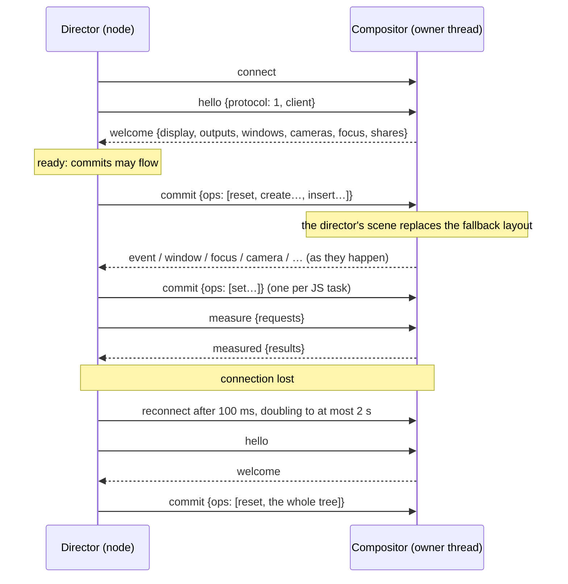

# Stage director protocol

How the TypeScript director (`node`, [`sdk/stage`](../sdk/stage)) and the Stage
World (SBCL, [`src/worlds/stage`](../src/worlds/stage)) talk to each other. This
is protocol version **1**. [STAGE-WORLD.md](STAGE-WORLD.md) describes what the
two ends do with it.

| | Director (TypeScript) | Compositor (Common Lisp) |
| --- | --- | --- |
| Socket and framing | [`connection.ts`](../sdk/stage/src/connection.ts) | [`link.lisp`](../src/worlds/stage/link.lisp) |
| JSON | `JSON.stringify` / `JSON.parse` | [`wire.lisp`](../src/world/wire.lisp) (`ataxia.world.wire`) |
| Message types | [`protocol.ts`](../sdk/stage/src/protocol.ts) | `%dispatch-message`, `%welcome` and the `%send` call sites |
| Session state and requests | [`session.ts`](../sdk/stage/src/session.ts), [`store.ts`](../sdk/stage/src/store.ts) | `world.lisp`, `camera.lisp`, `screencast.lisp`, `capture.lisp` |
| Scene ops | [`host.ts`](../sdk/stage/src/host.ts) | [`scene.lisp`](../src/worlds/stage/scene.lisp) |
| Property values | [`props.ts`](../sdk/stage/src/props.ts), [`motion.ts`](../sdk/stage/src/motion.ts), [`color.ts`](../sdk/stage/src/color.ts) | [`model.lisp`](../src/worlds/stage/model.lisp) |
| Events | [`host.ts`](../sdk/stage/src/host.ts) `dispatch`, [`events.ts`](../sdk/stage/src/events.ts) | `input.lisp`, `manipulation.lisp`, `content.lisp`, `web.lisp`, `desktop.lisp` |
| Text measurement | [`layout.ts`](../sdk/stage/src/layout.ts) | `%measure-texts` in `link.lisp` |
| Animation and effects | [`animation.ts`](../sdk/stage/src/animation.ts), [`motion.ts`](../sdk/stage/src/motion.ts) | `motion.lisp` (curves, keyframe tracks), [`effect.lisp`](../src/worlds/stage/effect.lisp) |

## Transport

**Socket.** The compositor listens on a Unix stream socket, by default
`$XDG_RUNTIME_DIR/ataxia-stage-<compositor pid>.sock`, created with mode `0600`
and a backlog of 4. At startup an existing file at that path is probed: if
nothing accepts on it, the file is deleted; if something does, startup fails
with "Another Stage World is listening".

**Launch.** `run-stage-compositor` starts the director as
`node --enable-source-maps sdk/stage/bin/ataxia-stage.mjs WORLD.tsx` with:

| Variable | Meaning |
| --- | --- |
| `ATAXIA_STAGE_SOCKET` | The socket path (`--socket` overrides it). |
| `ATAXIA_STAGE_PARENT` | The compositor's pid. Before each connection attempt the director exits if this is no longer its parent pid, so an orphaned director never retries forever. |
| `WAYLAND_DISPLAY` | The compositor's display, for clients the director launches. |

**Framing.** Each message is one JSON object encoded as UTF-8 and terminated by
`\n`. The director splits its input on `\n` and skips empty lines. The
compositor scans each byte only once for a newline. A line that is not valid
UTF-8, or more than 8 MiB of input without a newline, ends the session.

**JSON dialect.** The compositor decodes with its own bounded parser, never the
Lisp reader:

- At most 16 levels of nesting, 1,000,000 values per message, and strings up
  to 8 MiB.
- Numbers must lie within ±2^53, with exponents of at most 308.
- Duplicate object keys are rejected.
- `null` and an absent key mean the same thing: both read as "not given", which
  resets a property.
- `false` stays distinct from `null`.

It encodes property lists as objects with lowercase kebab-case keys, so
`:screen-x` becomes `"screen-x"` and `:work-area` becomes `"work-area"`. Floats
are written with six decimals and integers exactly. A Lisp list always encodes
as an object, so the compositor sends every array as a vector.

**I/O.** On the compositor both the listening socket and the connection are
non-blocking file-descriptor sources on the owner thread's event loop, and
every callback runs under the World's guard and watchdog:

- **Reads:** the compositor reads in 64 KiB chunks until the socket would
  block, and handles each complete line as it arrives.
- **Writes:** the compositor queues writes as encoded byte vectors and sends as
  much as the socket takes. It watches for writability only while bytes remain
  queued.
- **Overflow:** a director that lets more than 16 MiB queue up is disconnected,
  with "it stopped reading events" in the log.

The director writes with `socket.write(JSON.stringify(message) + "\n")` and
leaves buffering to Node.

**Coalescing.** Most messages are sent immediately and in order. These are
coalesced instead:

- drag and resize progress (`drag`, `resize`), keyed by node and event;
- camera reports, keyed by output.

A newer coalesced message replaces the pending one with the same key. Pending
messages are flushed at most once every 16 ms: by a timer, or by an idle callback
when that interval has already passed. Any other message flushes them first, so
the order of events is preserved.

## Session lifecycle



1. **Handshake.** The first line must be `hello` with `protocol: 1`; anything
   else ends the session with a fatal error. The compositor answers with
   `welcome` at once. The director treats the connection as ready only once
   `welcome` arrives. Until then, and while disconnected, `Connection.send`
   drops outgoing messages: commits are replayed later (step 4), and
   `screenshot()` rejects immediately.
2. **One director at a time.** A new connection replaces the current one. The
   old director receives
   `{type: "error", message: "Replaced by a newer director.", fatal: true}`
   and is closed. A director that receives a fatal error stops its connection
   instead of reconnecting.
3. **Taking over.** The director's first `commit` marks its scene active, which
   replaces the fallback layout the compositor uses when no director scene
   exists. That commit starts with `reset`, so the old top-level nodes are
   removed within the same transaction. Nodes with the same identity
   (`layoutId`, or `window:<id>` for windows) inherit their on-screen motion, so
   a restarted director takes over without anything jumping.
4. **Disconnect.**
   - *Compositor side:* the director's pointer captures are released. If its
     scene was active, the fallback layout returns, so unplaced windows cascade
     on the first output and stay reachable. Shortcuts and bindings check that a
     director is connected, so they go quiet.
   - *Director side:* the scene is marked for full replay, pending screenshots
     are rejected, and reconnection is retried with backoff.
   - *Reconnect:* after the next `welcome`, the director sends its whole tree
     as one commit beginning with `reset`, and asks for the application catalog
     again if it had asked before.

## Errors

The compositor reports problems with
`{type: "error", message, fatal?: true}`. The director logs non-fatal errors
and keeps running. A fatal error stops its connection and calls `onRejected`,
and the runtime then shuts down.

| Condition | Outcome |
| --- | --- |
| First line is not `hello` for protocol 1 | Fatal; connection closed. |
| Line is not UTF-8, or input grows past 8 MiB without a newline | Fatal. |
| JSON that does not parse, before the handshake | Fatal. |
| JSON that does not parse, after the handshake | Non-fatal `Invalid JSON: …`; the next line is read normally. |
| A JSON value that is not an object | Fatal. |
| Unknown message type, a bad field, an unknown window/output/share | Non-fatal error naming the problem. |
| Rejected ops inside a commit | One non-fatal error per commit: `N ops rejected; first: …`. The other ops still apply. |
| A World bug while handling a message | Non-fatal `Internal error: …`; the scene stays as far as it got. |
| More than 16 MiB of unsent output | Connection closed (nothing can be sent anymore). |
| A newer director connected | Fatal `Replaced by a newer director.` |

## Director → compositor

| Message | Fields | Effect |
| --- | --- | --- |
| `hello` | `protocol: 1`, `client` (the SDK sends `"@ataxia/stage"`) | Handshake; answered by `welcome`. |
| `commit` | `ops`: array of [ops](#scene-transactions) | One scene transaction. |
| `focus` | `window`: id or `null` | Focuses the window on the first seat, or clears focus. |
| `close` | `window`: id | Asks the client to close. |
| `camera` | `output`: name or `null` (every output); optional `x`, `y`, `zoom` (> 0), `rotation` (radians); optional `transition` ([motion](#motions)) | Moves cameras even to where they already are; reports come back as `camera`. |
| `set-clipboard` | `text` | Takes ownership of the first seat's clipboard with the text. |
| `share-accept` | `id`, then `window`, or `output` (default: the first) with optional `region {x, y, width, height}` in output-logical pixels | Starts a screen share. The client must have asked for that kind of source, and the region must lie within the output and be at least 8×8. |
| `share-cancel` | `id` | Declines a pending share or stops a running one. |
| `capture` | `id` (non-negative integer), then a source as in `share-accept` | Takes a screenshot; answered by `captured`. |
| `measure` | `requests: [{key, props}]`, at most 1000 per message | Asks for text sizes; answered by `measured`. |

```json
{"type":"hello","protocol":1,"client":"@ataxia/stage"}
{"type":"camera","output":null,"x":400,"y":300,"zoom":2,"transition":{"type":"spring","stiffness":170,"damping":26,"mass":1}}
{"type":"capture","id":3,"output":"eDP-1","region":{"x":0,"y":0,"width":640,"height":400}}
```

## Scene transactions

A `commit` carries `ops`, applied in order as one transaction. Each op is
decoded and validated before it changes anything, so a rejected op leaves the
scene untouched and the remaining ops still apply. After the last op, the
compositor:

- hands motion over from removed nodes to created nodes with the same identity;
- starts the exit animations;
- re-indexes windows.

The new scene is presented in the next frame.

| Op | Fields | Semantics |
| --- | --- | --- |
| `create` | `id`, `type`, `props` | Creates a detached node. The `id` must be a positive integer that no live node uses. `type` is one of the [node types](#node-types). The `props` are applied as the node's initial declaration, starting from `initial` when it is given. |
| `set` | `id`, `props` | Merges `props` into the node. A key with `null` resets that property to its default; absent keys are left unchanged. |
| `insert` | `parent`, `id`, `before` | Puts the node into `parent` (`0` is the root) before sibling `before`, or last when `before` is `null`. Inserting an attached node moves it. Children paint in order, so later ones are on top. Cycles are rejected. |
| `remove` | `parent`, `id` | Removes the node and its subtree, and frees their ids at once. A removed node with an `exit` keeps painting until its exit values settle, unless a node created in the same commit takes over its identity. |
| `reset` | — | Removes every top-level node without exit animations, because a new director may reuse their ids. Nodes created in the same commit still inherit motion by identity. |

Besides the [properties](#properties), `props` may carry these keys, which
`create` and `set` apply before the values:

| Key | Value |
| --- | --- |
| `transition` | `{default?: motion, <wire property>?: motion, uniforms?: motion, …}`. Replaces every motion of the node; a property without its own motion uses `default`, and with neither it changes instantly. `uniforms` covers every effect uniform. Motions for properties the node type lacks are ignored. Because transitions apply before values, a commit that changes both animates the value with the new transition. |
| `initial` | `{<animated property>: value, uniforms?: {…}}`. Where animated values start on `create`; ignored by `set`. |
| `exit` | `{<animated property>: value, uniforms?: {…}}` or `null`. What a removed node animates to before it disappears. |
| `animate` | Array of up to 32 [animation tracks](#animation-tracks), or `null`. Replaces the node's animations. |
| `uniforms` | On nodes that take effects: `{<name>: number \| [x, y] \| [x, y, z, w]}`, or `null`. At most 16 GLSL identifiers, outside the `gl_`, `u_`, `v_`, `a_` and `stage_` prefixes. Values animate with the `uniforms` transition. |
| `layoutId` | String or `null`. The node's identity for motion hand-over. Window nodes have `window:<id>` implicitly. |
| `handlers` | Array of [event names](#events). The compositor sends an event only for a name listed here, on the node or on an ancestor for bubbling events. Unknown names are ignored. |

While a native drag or resize holds a node's `x`, `y`, `width` or `height`,
declarations for those keys wait until the manipulation ends.

```json
{"type":"commit","ops":[
  {"op":"reset"},
  {"op":"create","id":1,"type":"rect","props":{"x":8,"y":8,"width":300,"height":34,"radius":12,
    "color":[1,1,1,0.78],"blur":22,"handlers":["pointerdown","pointerenter","pointerleave"],
    "transition":{"default":{"type":"spring","stiffness":110.6,"damping":17.7,"mass":1}},
    "initial":{"opacity":0,"y":-10}}},
  {"op":"create","id":2,"type":"text","props":{"text":"Hello <span weight=\"700\">world</span>",
    "markup":true,"fontSize":13,"x":8,"y":8,"width":82}},
  {"op":"insert","parent":1,"id":2,"before":null},
  {"op":"insert","parent":0,"id":1,"before":null}]}
{"type":"commit","ops":[{"op":"set","id":1,"props":{"color":[0.18,0.44,0.93,0.12],"radius":null}}]}
```

### How the SDK produces commits

[`host.ts`](../sdk/stage/src/host.ts) is the React reconciler host.

- **Attachment.** An instance exists from render time, but is first sent when
  React attaches it, so work React abandons is never sent. Attaching a subtree
  emits `create` for each node; each child's `create` is followed by its
  `insert`, and the subtree root's `insert` comes last.
- **One commit per task.** Everything React commits in one JavaScript task,
  including re-renders from `useLayoutEffect` and `onLayout`, is sent as one
  `commit`, from a microtask after React's own commit. A node changed twice in
  that time sends a single merged `set`. Node ids count up from 1 for the life
  of the process.
- **Layout.** `<Box>` layout (Yoga) runs before sending. A `create` already
  carries the node's computed `x`, `y`, `width` and `height`, and later layout
  changes are ordinary `set`s. Text nodes get no computed `height`, since the
  compositor lays out their lines.
- **Waiting for text sizes.** When layout needs text sizes it has not measured
  yet, sending waits for `measured`: at most 200 ms and three rounds, after
  which estimates are used.
- **Restoring dragged nodes.** After `dragend` or `resizeend`, any declared
  position or size the handler did not change is sent again, so the node
  returns to it.
- **Replay.** After a reconnect, the next send is `reset` followed by the whole
  attached tree.

## Node types

The compositor accepts exactly these properties per type, and rejects any
other. The SDK's `<Box>` is sent as `rect`.

| `type` | Properties |
| --- | --- |
| `group` | transform, effect, `width`, `height`, `clip`, `draggable`, `cursor` |
| `rect` | transform, box, effect, `color`, `colorEnd`, `fillAngle`, `clip`, `draggable`, `cursor` |
| `text` | transform, effect, `width`, `text`, `markup`, `font`, `fontSize`, `fontWeight`, `italic`, `color`, `align`, `lineHeight`, `maxLines`, `draggable`, `cursor` |
| `image` | transform, box, effect, `src`, `fit`, `draggable`, `cursor` |
| `web` | transform, box, effect, `src`, `data`, `revision`, `focusable`, `interactive`, `autoFocus`, `cursor` |
| `window` | transform, box, effect, `window`, `fullscreen`, `maximized`, `tiled`, `focusable`, `interactive`, `movable`, `resizable`, `dim` |
| `background` | `x`, `y`, `scale`, `rotation`, `opacity`, `visible`, `color`, `grid`, `gridColor`, `gridSpacing`, `gridSize`, `pan`, `cursor` |
| `camera` | `output`, `x`, `y`, `zoom`, `rotation`, `minZoom`, `maxZoom` |
| `screen` | `output`, `x`, `y`, `scale`, `rotation`, `opacity`, `visible` |
| `reserve` | `output`, `top`, `right`, `bottom`, `left` |
| `shortcut` | `key`, `modifiers`, `repeat` |
| `pointer-binding` | `button`, `modifiers`, `action` |
| `wheel-binding` | `modifiers`, `action` |
| `gesture-binding` | `gesture`, `fingers`, `modifiers`, `action` |

*transform* is `x`, `y`, `scale`, `rotation`, `opacity`, `originX`, `originY`
and `visible`. *box* is `width`, `height`, `radius`, `borderWidth`,
`borderColor`, `borderColorEnd`, `borderAngle`, `shadowColor`, `shadowBlur`,
`shadowSpread`, `shadowX`, `shadowY` and `blur`. *effect* is `shader`,
`amount`, `margin`, `local`, `time`, `backdrop`, `pointer` and `area`, plus the
`uniforms` key.

A node with a `shader` and an `amount` above 0 draws itself and its subtree
into an offscreen target covering its area, then paints its box, grown by `margin` (or the whole
output with `area: "output"`), through a program made of a prelude, a
`uniform` declaration per uniform, and the shader, which must define
`vec4 effect(vec2 position)`. The prelude declares `size`, `time`, `amount`,
`pixel` and `pointer` (the first seat's pointer in local units, far away unless
`pointer` is set and it is on this output) and the functions `content(p)` and
`backdrop(p)`. A shader that does
not compile is reported as the node's `error` event, once per source, with
line numbers counted from its first line; the node then draws unchanged.

## Properties

Every wire value is canonical, so the compositor only checks types and ranges:

- colors are straight-alpha `[r, g, b, a]` in 0..1;
- angles are in radians;
- durations are in seconds;
- sizes are in logical pixels.

| Type | Accepted JSON |
| --- | --- |
| number | A finite number with \|x\| < 10^12; `zoom` must also be > 0. |
| color | `[r, g, b, a]`; each component is clamped to 0..1. |
| boolean | `true` or `false`. |
| string | A string. |
| id | An integer in 0..2^53. |
| choice | One of the listed strings. |
| modifiers | An array of `"shift"`, `"control"`, `"alt"`, `"logo"`. |

Animated properties move through spring or tween channels; zoom animates its
logarithm. Non-animated ones apply at once. Camera nodes animate nothing: they
declare targets for cameras the compositor owns.

| Property | Type | Default | Animated |
| --- | --- | --- | --- |
| `x`, `y` | number | 0 | yes |
| `width`, `height` | number | natural size (none for text) | yes |
| `scale` | number | 1 | yes |
| `rotation` | number (radians) | 0 | yes |
| `opacity` | number | 1 | yes |
| `originX`, `originY` | number (fraction of size) | 0.5 | |
| `visible` | boolean | true | |
| `color` | color (fill, text or plane) | transparent | yes |
| `colorEnd`, `fillAngle` | color, number | none (solid), 0 | yes |
| `radius` | number | 0 | yes |
| `borderWidth`, `borderColor` | number, color | 0, transparent | yes |
| `borderColorEnd`, `borderAngle` | color, number | none, 0 | yes |
| `shadowColor`, `shadowBlur`, `shadowSpread`, `shadowX`, `shadowY` | color, numbers | transparent, 0 | yes |
| `blur` (backdrop) | number | 0 | yes |
| `dim` | number | 0 | yes |
| `clip`, `draggable` | boolean | false | |
| `cursor` | choice: `none`, `default`, `pointer`, `text`, `crosshair`, `move`, `grab`, `grabbing`, `not-allowed`, `help`, `wait`, `progress`, `zoom-in`, `zoom-out`, `ew-resize`, `ns-resize`, `nwse-resize`, `nesw-resize` | inherited | |
| `window` | id | — | |
| `fullscreen`, `maximized`, `tiled`, `movable`, `resizable` | boolean | false | |
| `focusable`, `interactive` | boolean | true | |
| `text`, `font` | string | — | |
| `markup`, `italic` | boolean | false | |
| `fontSize`, `fontWeight` | number | 14, 400 | |
| `align` | choice: `start`, `center`, `end` | `start` | |
| `lineHeight` | number (multiple of the font's) | the font's | |
| `maxLines` | id | unlimited | |
| `src` | string (absolute path, page bundle or URL) | — | |
| `fit` | choice: `fill`, `contain`, `cover` | `fill` | |
| `data` | string (JSON text given to a page as its props) | — | |
| `revision` | number (a change reloads a page) | — | |
| `autoFocus` | boolean | false | |
| `grid` | choice: `none`, `dots`, `lines` | `none` | |
| `gridColor`, `gridSpacing`, `gridSize` | color, number, number | transparent, 32, 1 | yes |
| `pan` | boolean | false | |
| `output` | string | every output | |
| `zoom` | number (> 0) | 1 | yes (log) |
| `minZoom`, `maxZoom` | number | 0.05, 8 | |
| `top`, `right`, `bottom`, `left` | number | 0 | |
| `key` | string (an xkb keysym name) | — | |
| `modifiers` | modifiers | none | |
| `repeat` | boolean | false | |
| `button` | id (a Linux input code) | 272 | |
| `gesture` | choice: `swipe`, `pinch`, `hold` | `swipe` | |
| `fingers` | id | 3 | |
| `action` | choice: `none`, `move`, `resize`, `pan`, `zoom` | `none` | |
| `shader` | string: GLSL ES 1.0 defining `vec4 effect(vec2 position)`, at most 64 KiB | none | |
| `amount` | number | 1 | yes |
| `margin` | number | 0 | |
| `local`, `time`, `backdrop`, `pointer` | boolean | false | |
| `area` | choice: `box`, `output` | `box` | |

### Motions

A motion is one of:

```json
{"type":"spring","stiffness":170,"damping":26,"mass":1,"delay":0}
{"type":"tween","duration":0.25,"ease":[0.25,0.1,0.25,1],"delay":0,"repeat":0}
{"type":"curve","duration":0.5,"points":[0,0.4,1.1,1],"delay":0,"repeat":0}
{"type":"instant"}
```

| Kind | Field rules |
| --- | --- |
| `spring` | `stiffness`, `damping` and `mass` must be positive. |
| `tween` | `duration` must be positive. `ease` is a CSS cubic-bezier with both x values in 0..1, or `null` for linear. `repeat` is 0..10000 extra runs, or `"forever"`. |
| `curve` | Like `tween`, but its progress follows `points` (2 to 1024 numbers), sampled evenly over `duration` and joined linearly; progress may leave 0..1 in between. |
| any | `delay` is at least 0. |

Omitted fields take the defaults shown above. The SDK's
`spring({duration, bounce})` converts to stiffness and damping before sending.
`tween(…, {repeat: Infinity})` becomes `"forever"`, and a `tween` with an
easing function becomes a `curve` with 120 points a second (at least 16, at
most 512).

### Animation tracks

```json
{"id":"nudge/x","property":"x","keyframes":[0,14,-4,0],"duration":0.32,
 "ease":[0,0,0.58,1],"composite":"add"}
```

| Field | Rules |
| --- | --- |
| `id` | String or integer. A track whose id the node already had keeps its start time, so it runs on, or stays finished; others start at the commit. |
| `property` | An animated property of the node's type. |
| `keyframes` | 2 to 1024 values of that property. |
| `offsets` | Optional: as many numbers, rising from 0 to 1; even spacing by default. |
| `duration`, `delay` | Seconds per iteration (positive; 1 by default), and before the first (0). The property keeps its own value during the delay. |
| `ease` | Optional cubic-bezier applied to each iteration's progress; easing past the first or last keyframe extrapolates. |
| `iterations` | 1..1000000, or `"forever"`; 1 by default. |
| `direction` | `normal`, `reverse`, `alternate` or `alternate-reverse`. |
| `composite` | `replace` (default) shows the keyframes; `add` adds them to the property's value. |

Tracks apply in order over the property's value, whether declared or
transitioning. A finished track stops affecting it but stays declared, so
listing it again does not replay it. A removed node drops its endless tracks
and keeps its others while it exits.

### From SDK props to wire props

[`props.ts`](../sdk/stage/src/props.ts) turns each element's ergonomic props
into the flat wire form.

**Geometry and paint**

| SDK prop | Wire |
| --- | --- |
| `rotation` (degrees) | `rotation` (radians) |
| `width`, `height` | The same when numbers. Percentages only affect `<Box>` layout. |
| `fill` (Rect, Box) | A color becomes `color`. `{from, to, angle}` becomes `color`, `colorEnd` and `fillAngle` (radians). |
| `border: {width, color}` | `borderWidth`, `borderColor` (+ `borderColorEnd`, `borderAngle` for a gradient) |
| `shadow: {color, blur, x, y, spread}` | `shadowColor`, `shadowBlur`, `shadowX`, `shadowY`, `shadowSpread` |
| `grid: {kind, color, spacing, size}` | `grid`, `gridColor`, `gridSpacing`, `gridSize` |
| CSS colors (`#rgb[a]`, `#rrggbb[aa]`, `rgb()`, `rgba()`, names) | `[r, g, b, a]` |

**Text**

| SDK prop | Wire |
| --- | --- |
| `size`, `weight` | `fontSize`, `fontWeight` (`normal` 400, `bold` 700) |
| String or number children | `text` |
| Nested `<Text>` children | `text` as escaped Pango markup with `<span>`s, plus `markup: true` |

**Images, pages and other node types**

| SDK prop | Wire |
| --- | --- |
| `Image` `src` | The path, resolved against the world file |
| `Web` `props` | `data` (JSON text) |
| `Shortcut` `keys="Super+Shift+Enter"` | `key: "Return"`, `modifiers: ["logo", "shift"]` (sorted; `super`/`meta` mean `logo`, `ctrl` means `control`) |
| `PointerBinding` `button` | `left`/`right`/`middle` → 272/273/274 |

**Layout and visibility**

| SDK prop | Wire |
| --- | --- |
| `<Box>` | `type: "rect"`. Layout props (`flexDirection`, `padding`, `gap`, …) are never sent; the computed `x`, `y`, `width` and `height` are. |
| `display="none"`, or hidden by Suspense | `visible: false` |

**Events, motion and identity**

| SDK prop | Wire |
| --- | --- |
| `onPointerDown`, `onDragEnd`, … | `handlers: ["dragend", "pointerdown", …]` (sorted) |
| `transition` | One motion becomes `{default}`. Per-prop motions are expanded to the wire properties they cover (`fill` → `color`, `colorEnd`, `fillAngle`). |
| `initial`, `exit` | The same writers as the props, limited to animated values |
| `layoutId` | `layoutId` |
| `animate` | One track per animated prop, with wire properties and units (`rotation` in radians, `fill` → `color`, `effectAmount` → `amount`). Keyframe functions are sampled at 60 a second (8 to 256 samples) and easing functions are baked into the keyframes. The `id` is `<key>/<property>` with a `key`, else a hash of the track. |
| `effect: {shader, uniforms, amount, margin, local, time, backdrop, pointer, area}` | The same flat properties, and the `uniforms` key with colors as vec4s; `transition.effect` covers `amount` and `uniforms` |

A removed prop is sent as `null`, which restores its default.

## Compositor → director

| Message | Fields |
| --- | --- |
| `welcome` | `protocol`, `display` (the Wayland socket name), `outputs`, `windows` (by id), `cameras` (one per output), `focus` (one per seat), `shares` |
| `window` | `window: {id, title, app, mapped, width, height}`. Sent when anything in it changes. `width`/`height` are the client's own size, rounded. |
| `window-removed` | `id` |
| `output` | `output: {name, x, width, height, scale, "work-area": {x, y, width, height}}`. Outputs form one row, and `x` is the offset in it. `work-area` is the output-local area left after reservations such as a bar. |
| `output-removed` | `name` |
| `focus` | `seat`, `window` (id or `null`) |
| `camera` | `output`, `x`, `y`, `zoom`, `rotation` (radians). Where the camera is headed; coalesced per output, and sent only when changed. |
| `clipboard` | `text`, copied by a client. Selections that password managers mark secret are never read. |
| `shares` | `shares: [{id, app, types, source, window, output}]`. `types` lists `"screen"` and/or `"window"`; `source` is `null` while the share waits for an answer. |
| `captured` | `id`, `path`, `width`, `height`, or `id` and `error` |
| `measured` | `results: [{key, width, height}]` |
| `event` | `node`, `name`, plus fields; see [Events](#events) |
| `error` | `message`, `fatal` |

```json
{"type":"welcome","protocol":1,"display":"wayland-1",
 "outputs":[{"name":"eDP-1","x":0,"width":1280,"height":800,"scale":2.000000,
   "work-area":{"x":0,"y":48,"width":1280,"height":752}}],
 "shares":[],"windows":[{"id":3,"title":"Terminal","app":"foot","mapped":true,"width":800,"height":600}],
 "cameras":[{"output":"eDP-1","x":640.000000,"y":400.000000,"zoom":1.000000,"rotation":0.000000}],
 "focus":[{"seat":"seat0","window":3}]}
```

The director mirrors these messages in its `Store`, which the hooks read
(`useWindows`, `useOutputs`, `useFocusedWindow`, `useCamera`, `useShares`, …).
A collection that did not change keeps its identity, so components that read it
skip rendering.

## Events

```json
{"type":"event","node":12,"name":"pointerdown","button":272,"output":"eDP-1",
 "screen-x":512.5,"screen-y":20,"world-x":512.5,"world-y":20,"modifiers":["logo"],
 "x":503.5,"y":11,"local-x":40.5,"local-y":11}
```

`node` is the target node's id and `name` the event. The compositor sends an
event only if the node lists that name in `handlers`. For the bubbling pointer
events (`pointerdown`, `pointermove`, `pointerup`, `pointerenter`,
`pointerleave`, `wheel`), it also sends the event when only an ancestor lists
it, with `node` still being the node under the pointer.

The director then:

- finds the instance by id;
- converts the fields to camelCase (`screen-x` becomes `screenX`);
- adds `target`, `currentTarget` and `stopPropagation()`;
- bubbles the event through the instance's ancestors, as the DOM does.

For `pointerenter` and `pointerleave`, the `from`/`to` fields name the node the
pointer came from or went to. The director turns that into `relatedTarget`, and
calls the handlers of exactly the ancestors whose boxes the pointer entered or
left.

**Pointer fields.** Every pointer event carries:

- `output`;
- `screen-x`, `screen-y`: output-logical pixels;
- `world-x`, `world-y`: through that output's camera;
- `modifiers`.

When the event has a hit node, as presses, moves, wheels and captured pointers
do, it also carries:

- `x`, `y`: in the node's parent space;
- `local-x`, `local-y`: in the node's own space.

| Event | Sent to | Extra fields |
| --- | --- | --- |
| `pointerdown`, `pointerup` | The node under the pointer; `pointerup` goes to the capturing node | `button` (Linux code), pointer fields |
| `pointermove` | The node under the pointer, or the capturing node | Pointer fields |
| `pointerenter`, `pointerleave` | The topmost hit node, as it changes | `from` / `to` (node id or `null`), pointer fields without the hit fields |
| `wheel` | The node under the pointer, or a `wheel-binding` | `orientation` (`vertical`/`horizontal`), `delta`, `discrete`, `source` (`wheel`, `finger`, `continuous`, `wheel-tilt`), pointer fields; a binding also gets `window` |
| `down`, `move`, `up` | `pointer-binding` | Pointer fields; `down` and `up` add `button`, and the first `down` adds `window` (the window under the pointer, or `null`) |
| `begin`, `update`, `end` | `gesture-binding` | `fingers`, `dx`, `dy`, `scale`, `rotation`, `cancelled`; `begin` adds pointer fields |
| `press`, `release` | `shortcut` | — |
| `dragstart`, `drag`, `dragend` | A `draggable` or `movable` node | `x`, `y` (`drag` is coalesced) |
| `resizestart`, `resize`, `resizeend` | A `resizable` window | `x`, `y`, `width`, `height` (`resize` is coalesced) |
| `moverequest`, `resizerequest` | A window whose client asked to move or resize | Pointer fields; `resizerequest` adds `edges` (xdg_toplevel edges). The pointer stays captured by the node until release. |
| `fullscreenrequest`, `maximizerequest`, `minimizerequest` | A window | `value` (boolean) |
| `activaterequest` | A window whose client asked to be shown and focused; unhandled, the window is focused | — |
| `measure` | `text` | `width`, `height` after its layout changed |
| `load` | `image` (with `width`, `height`), `web` | — |
| `error` | `image`, `web`; any node whose effect shader failed | `message` |
| `message` | `web` | `payload`: the JSON text of `{name, value}` from the page's `send()` |

The director runs updates from a press as React DOM runs a click's, before it
handles the next event. Updates from `pointermove`, `wheel`, `drag`, `resize`,
`move` and `update` are batched.

## Request and response pairs

**Text measurement** (`measure` / `measured`). A request is
`{key, props}`, where `props` may hold the text properties `text`, `markup`,
`font`, `fontSize`, `fontWeight`, `italic`, `align`, `width` (the wrap width),
`lineHeight` and `maxLines`, in their wire form. The compositor answers on the
same turn: Pango lays out each text exactly as a text node would, and the
compositor returns its logical `width` and `height`. The SDK:

- numbers keys from 1;
- caches sizes by their props (4,096 entries) and rounds them up to whole
  pixels;
- sends a request only for text whose size it does not know yet.

```json
{"type":"measure","requests":[{"key":7,"props":{"text":"Hello","fontSize":13,"fontWeight":600}}]}
{"type":"measured","results":[{"key":7,"width":33.000000,"height":18.000000}]}
```

**Screenshots** (`capture` / `captured`).
- *Rendering:* the compositor renders the source offscreen, as the outputs show
  it now, at full resolution, scaled down only to fit 8192 pixels per side.
- *Handoff:* it writes the pixels to
  `$XDG_RUNTIME_DIR/ataxia-stage-<compositor pid>-capture-<id>.rgba` as
  `width × height × 4` bytes of RGBA, top row first, then sends the path.
  Encoding stays off the compositor's thread.
- *Cleanup:* from then on the file belongs to the director, which reads it,
  deletes it, and resolves `screenshot()`.
- *Failure:* a failed capture answers `{id, error}`.


## Changing the protocol

A new message or property touches both ends:

1. **Types:** declare it in [`protocol.ts`](../sdk/stage/src/protocol.ts).
2. **Lisp:**
   - handle it in `%dispatch-message` (`link.lisp`), or add a row to
     `+prop-specs+` and the node type's list in `+node-kinds+` (`model.lisp`);
   - add an event name to `+event-names+`.
3. **SDK writer:** for a property, add it to the `fields` table in
   [`props.ts`](../sdk/stage/src/props.ts), and to `animatedWireNames` if it
   animates.
4. **Docs and tests:** document it here, and cover it in
   [`tests/stage-world.lisp`](../tests/stage-world.lisp) or the SDK tests.

Additions that old directors can ignore keep version 1: a new message type, an
optional field, a new event. An incompatible change bumps `+protocol-version+`
in `link.lisp` and `PROTOCOL_VERSION` in `protocol.ts` together, because the
handshake requires them to match exactly.
