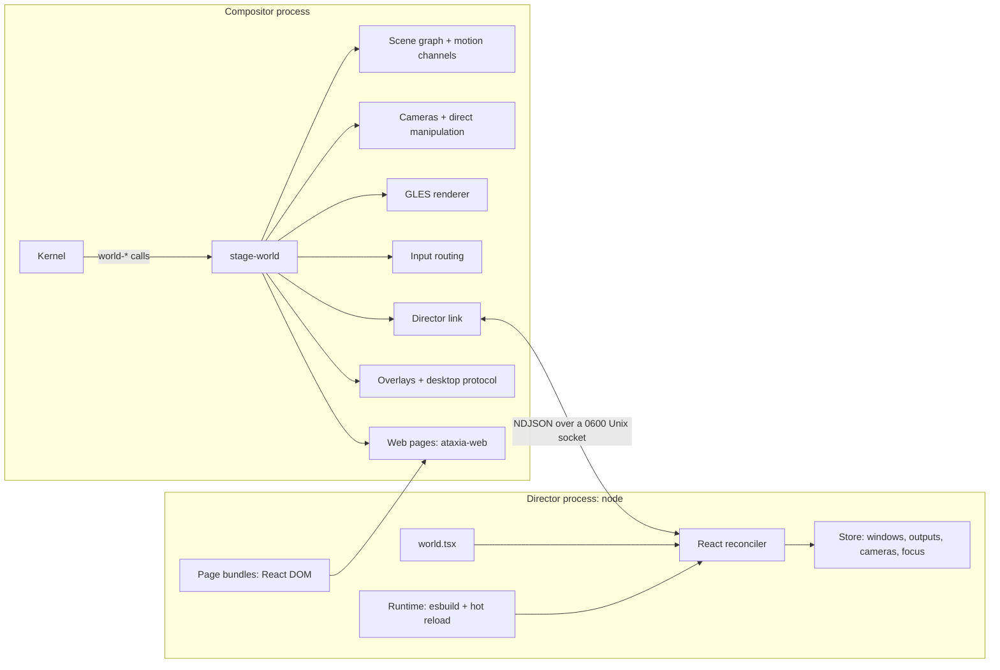

# Stage World

Stage is a World whose scene is written in TypeScript with React. A *director*
process renders components such as `<Camera>`, `<Window>`, `<Text>` and `<Web>`;
the compositor keeps the resulting scene graph, animates it on its own frame
clock, renders it with GLES and routes input. Edit the world file while it runs
and the director reloads it: windows glide from where they are to where the new
code puts them.

It is the same idea as [ink](https://github.com/vadimdemedes/ink): a custom
React renderer whose host elements are not DOM nodes but, here, compositor scene
nodes. React DOM still has a place: a `<Web>` node shows a React DOM page,
rendered by Chromium, inside the scene.

```tsx
import { Background, Camera, Window, spring, useWindows } from "@ataxia/stage";

export default function World() {
  const windows = useWindows();
  return (
    <>
      <Camera x={0} y={0} zoom={1} transition={spring()} />
      <Background fill="#ecebe6" grid={{ kind: "dots", color: "#0003", spacing: 28 }} pan />
      {windows.map((window, index) => (
        <Window key={window.id} window={window.id} x={-600 + index * 640} y={-300}
                width={600} height={420} radius={10} shadow={{ blur: 32, y: 12, color: "#0003" }}
                movable resizable initial={{ opacity: 0, scale: 0.94 }} exit={{ opacity: 0, scale: 0.94 }}
                transition={spring({ duration: 0.4 })} />
      ))}
    </>
  );
}
```

## Run

```sh
make stage                    # npm ci + build sdk/stage (Node 22+)
sbcl --eval '(sb-int:set-floating-point-modes :traps nil)' --script scripts/run-stage-world.lisp
sbcl ... --script scripts/run-stage-world.lisp --script examples/stage/hypr.tsx
```

The launcher starts the compositor, XWayland and the assistant (not on the
headless backend), then the director on `--script`. Worlds draw their own bar
in TSX; the shared web status bar is available with `--status-bar`. Two
examples ship with it, organized as ordinary React apps:

- [`canvas.tsx`](../examples/stage/canvas.tsx): an infinite canvas with
  momentum panning, anchored zoom, native window moves and resizes, keyboard
  fly-to, an overview and a minimap.
- [`hypr.tsx`](../examples/stage/hypr.tsx): a Hyprland-style tiler with nine
  workspaces that slide, dwindle and master layouts with gaps, a spinning
  gradient border on the focused window, dimmed inactive windows, floating,
  fullscreen, a scratchpad, focus-follows-mouse, three-finger workspace swipes,
  windows that burn in and out through a shader, a nudge when a move has nowhere
  to go, and workspaces in the bar. Its state is one reducer
  ([`hypr/state.ts`](../examples/stage/hypr/state.ts)) that
  [`HyprProvider`](../examples/stage/hypr/HyprProvider.tsx) shares through context.

Both are laid out like a small React app, formatted with Prettier:
[`components/`](../examples/stage/components) holds what they share (the bar and
its menus, media keys, screen sharing, screenshots on Print and Shift+Print, the
application launcher), [`hooks/`](../examples/stage/hooks) and
[`lib/`](../examples/stage/lib) the hooks, geometry, theme and settings, and
[`pages/`](../examples/stage/pages) the React DOM pages they show.

`--no-director` starts only the compositor; run a director yourself, e.g. under
a debugger:

```sh
node sdk/stage/bin/ataxia-stage.mjs --socket "$ATAXIA_STAGE_SOCKET" my-world.tsx
```

`--once` loads the world without watching it, and `--dev` selects React's
development build for detailed component errors and connects to React DevTools
(`npx react-devtools`), which shows the world's components, props and hooks live. `--no-xwayland`,
`--status-bar`/`--no-status-bar`, `--assistant`/`--no-assistant` and
`--assistant-project DIR` control the desktop services; the usual backend,
size, `--run-for`, damage-debug and SLY options apply. See `--help`.

## Architecture



**Kernel is unchanged.** Stage is an ordinary `ataxia.kernel:world` (and an
`ataxia.world:ui-host`) and talks to applications only through the existing
contracts: `drawable-surfaces`, `drawable-local-bounds`, `retain-render-source`,
`interactable-*`, `request-object-configuration`, `request-object-state`,
output membership and frame results. The director never sees a Kernel object,
only copied ids and values.

| Module (`src/worlds/stage/`) | Responsibility |
| --- | --- |
| `motion.lisp` | Retargetable channels: closed-form springs, cubic-bezier tweens and sampled curves (delays, repeats, loops), momentum decay, and keyframe tracks. |
| `affine.lisp` | 2D transforms shared by drawing, damage and picking. |
| `model.lisp` | Node kinds and the property schema; decodes canonical wire values. |
| `scene.lisp` | Commits, layout-identity hand-over, exit animations. |
| `world.lisp` | Windows, outputs, focus, configure, last frames for exit animations, Kernel lifecycle. |
| `camera.lisp` | Per-output cameras: anchored zoom, panning, momentum, programmatic moves. |
| `gl.lisp` | Offscreen targets, texture uploads and readback, restoring Kernel GL state. |
| `media.lisp` | Pango text layout and rasterization; gdk-pixbuf decoding on a worker thread. |
| `renderer.lisp` | SDF rectangles with gradient fills and borders, Gaussian shadows, filtered textures, dual Kawase backdrop blur, grids. |
| `display.lisp` | Per-output display lists, damage diffing, frames, hit lists. |
| `effect.lisp` | Effects: subtrees drawn offscreen and through the director's GLSL. |
| `content.lisp` | Text and image nodes: measured layouts, scale-aware rasters, shared images. |
| `web.lisp` | Web nodes: page lifecycle, damage, visibility, raster scale. |
| `link.lisp` | Socket listener, director connection, protocol messages. |
| `clipboard.lisp` | Clipboard text for the director and desktop services: bounded, non-blocking selection reads. |
| `manipulation.lisp` | Native pans, zooms, moves and resizes driven by input in the compositor. |
| `input.lisp` | Pointer/keyboard/gesture routing, capture, bindings, client requests. |
| `cursor.lisp` | Cursor shapes from clients, nodes and manipulations; theme cursors through libXcursor. |
| `desktop.lisp` | Shell overlays and the shared desktop protocol (capture, window queries, viewport navigation). |
| `applications.lisp` | Installed application catalog and launching, for the desktop protocol. |
| `screencast.lisp` | Screen sharing: portal requests for the director, window and region capture into PipeWire. |
| `main.lisp` | Entry point; owns the director process and desktop services. |

The TypeScript SDK lives in [`sdk/stage`](../sdk/stage): `host.ts` (reconciler
host and event dispatch), `props.ts` (prop normalization), `layout.ts` (flexbox
with Yoga, the engine of React Native and Ink), `session.ts`/`connection.ts`/`store.ts`
(compositor state and durable persistence), `hooks.ts`, `components.ts`,
`layouts.ts`, `animation.ts` (keyframes), `web.ts` (page bundling), `page.ts` (the in-page runtime) and
`runtime.ts` (bundling and hot reload).

### Why a separate process

React, npm packages and user code run in Node, never on the compositor owner
thread. A world that throws, loops or is being edited cannot stall frames or
input: clients keep receiving input directly from the compositor, and the scene
stays as last committed. The director reconnects by itself after a World
restart; a director replaced by a newer one exits instead.

### Declare targets, animate in the compositor

React renders *targets*, not frames. A changed `x` or `zoom` is one message; the
compositor animates it at the display's refresh rate with a spring or tween from
the node's `transition`. Retargeting starts from the displayed value and keeps
velocity, so interrupted moves stay continuous. Settled channels schedule
nothing. A window is configured once with its target size, not on every frame;
its content is stretched to the animated box in between.

Direct manipulation never waits for the director either. Panning the canvas,
zooming around the pointer, moving and resizing windows and dragging nodes run
in the compositor in the same frame as the input, then report where things
ended up (`onDragEnd`, `onResizeEnd`, `useCamera()`), so the world can store it.
A position the world does not change in response is declared again, so the
node springs back to it instead of staying where it was dropped.

## Writing a world

The module's default export is the root component. Host components:

| Component | Purpose |
| --- | --- |
| `Camera` | Declares an output's camera: world point at its center, `zoom`, `rotation`, `minZoom`/`maxZoom` and the `transition` of programmatic moves. The camera itself is compositor state; read it with `useCamera()`, move it with `moveCamera()`. No camera means world = output pixels. |
| `Group` | Transform container; with `width`/`height`, `clip` hides children outside it and `draggable` lets it be dragged. |
| `Window` | A client window by id. `width`/`height` configure the client; omit them for its natural size. `radius`, `border`, `shadow`, `blur`, `dim`, `fullscreen`, `maximized`, `tiled`, `focusable`, `interactive`; `movable`/`resizable` allow native moves and resizes. A removed window with an `exit` animates out from its last frame, even after its client is gone. |
| `Rect` | Rounded rectangle: `fill` (color or gradient), `radius`, `border`, `shadow`, `blur` (frosted glass), `clip`, `draggable`; pointer handlers. |
| `Box` | A `Rect` that lays out its children with flexbox; see [Layout](#layout). `Spacer` takes up the free space in a row or column. |
| `Text` | Text laid out by Pango: `<Text size={14} weight="bold">Hello {name}</Text>`. `font`, `color`, `italic`, `markup` (Pango markup), `width` with `align` and `maxLines`, `lineHeight`; `onMeasure` reports its size. A `Text` inside another styles its part, as in React Native: `<Text>Saved <Text weight="bold">3</Text> files</Text>`. |
| `Image` | A decoded image file (PNG, JPEG, WebP, GIF, SVG, ...): `src`, `fit` (`fill`, `contain`, `cover`) plus the `Rect` box props; `onLoad` reports its natural size. `import photo from "./photo.jpg"` gives a `src`. |
| `Web` | A page rendered by Chromium: a React DOM module, an HTML file, a built app directory or a URL. See [Web pages](#web-pages). |
| `Background` | Infinite plane with `fill` and a `dots`/`lines` grid; `pan` makes dragging or scrolling it pan the camera, with momentum. |
| `Screen` | Children in an output's logical pixels, unaffected by the camera: HUDs, bars, launchers. |
| `Reserve` | Screen space the world keeps for UI it draws itself, such as a bar: `top`, `right`, `bottom`, `left`, optionally per `output`. Window work areas (`workArea`) leave it free. |
| `Shortcut` | `keys="Super+Shift+Return"`, `onPress`/`onRelease`; consumed before the focused client. |
| `PointerBinding` | Modifier+button anywhere. `action="move"`/`"resize"`/`"pan"` runs natively; or handle `onDown`/`onMove`/`onUp` (`event.window` is the window under the pointer). |
| `WheelBinding` | Modifier+wheel anywhere; `action="zoom"`/`"pan"` or `onWheel`. |
| `GestureBinding` | Touchpad `swipe`/`pinch`/`hold` with a finger count; `action="zoom"`/`"pan"` or handlers. |

Every visual node accepts `x`, `y`, `scale`, `rotation` (degrees), `opacity`,
`originX`/`originY` (fractions of its size; default center) and `visible`;
compositor-drawn ones also take a `cursor`.
Children paint in order, later on top; reorder windows to raise them. Fills and
border colors take a color or a two-stop gradient
`{ from, to, angle }` (degrees).

Motion props:

- `transition`: `spring({ stiffness, damping, mass, delay })`,
  `spring({ duration, bounce })`, `tween(seconds, easing, { delay, repeat })`
  (`repeat: Infinity` loops) or `instant`; or per prop,
  `{ default: spring(), opacity: tween(0.15), borderAngle: tween(4, "linear", { repeat: Infinity }) }`.
  An easing is a CSS name, a cubic-bezier `[x1, y1, x2, y2]` or any function of
  progress, such as `ease.back()`, `ease.elastic()`, `ease.bounce` or `ease.steps(4)`.
- `initial`: values a new node starts from.
- `exit`: values a removed node animates to before it disappears.
- `animate`: keyframe animations; see [Animation](#animation).
- `layoutId`: nodes sharing it hand over their on-screen state when one replaces
  the other in the same commit. Windows (`window:<id>`) have an identity implicitly.
- `effect`: a GLSL shader the node is drawn through; see [Effects](#effects).

Colors are CSS hex, `rgb()`/`rgba()`, `transparent`, `white`, `black` or
`[r, g, b, a]` in 0..1.

A `ref` on a visual node gives its `id`, `type` and, inside a `Box`, its
`layout`. A `style` prop, an object or an array of them (falsy entries skipped),
is merged under the element's own props, as in React Native:
`<Rect style={[card, selected && raised]} />`.

As a browser paints once per task, everything React commits in one task reaches
the compositor as one transaction, including re-renders from `useLayoutEffect`
and `onLayout`, so a component can measure itself and adjust before anything is
shown.

Hooks and actions:

| API | Description |
| --- | --- |
| `useWindows()` | Mapped windows `{ id, title, appId, mapped, width, height }`, creation order. |
| `useWindow(id)`, `useFocusedWindow(seat?)` | Compositor state; components re-render only when it changes. |
| `useOutputs()` | Outputs with their size, scale and `workArea` (what the status bar leaves). |
| `useCamera(output?)`, `moveCamera(move, options?)` | Where a camera is headed; move it from code. |
| `useClipboard()` | Text copied this session, newest first (memory only), and `copy(text)`. |
| `usePersistentState(key, initial)`, `usePersistentReducer(key, reducer, initial)` | `useState` and `useReducer` that survive hot reloads, remounts and restarts (saved as JSON under `$XDG_STATE_HOME/ataxia/stage/`). |
| `useShares()`, `acceptShare(id, source)`, `cancelShare(id)` | Screen-sharing requests and running shares; see [Screen sharing](#screen-sharing). |
| `screenshot(source?)`, `encodePng(shot)` | Pixels of a window, an output or a region of one, at full resolution; PNG encoding runs on a worker thread. |
| `focus(id \| null)`, `close(id)`, `launch(command)` | Keyboard focus, polite close, start a client on this display. |
| `dwindle`, `masterStack`, `columns`, `grid`, `inset` | Pure tiling layouts from window ids and an area to boxes. |

The SDK knows only the compositor. What a desktop shows about the rest of the
system is world code in TypeScript: the examples'
[`lib/system`](../examples/stage/lib/system) has hooks for the clock, battery,
sound, media players, display brightness, power profile and installed
applications, each following change events while something reads it.

### Animation

`transition` animates a prop from where it is to where it was declared.
`animate` plays keyframes over props, as the Web Animations API does:

```tsx
<Window window={id} animate={{ x: [0, -14, 8, 0], composite: "add", duration: 0.32, key: nudges }} />
<Rect animate={{ scale: [1, 1.06, 1], iterations: Infinity, duration: 1.4, ease: "ease-in-out" }} />
<Text animate={{ opacity: (t) => 0.5 + 0.5 * Math.cos(t * 2 * Math.PI), duration: 2 }} />
```

Keyframes are values at even points of an iteration (or at `offsets`), or any
function of its progress. Timing comes from `duration` (seconds), `delay`,
`ease`, `iterations` (or `Infinity`), `direction` (`alternate`, `reverse`, …)
and `composite`: `"replace"` shows the keyframes instead of the prop's value,
`"add"` adds them to it, so a shake works on a window wherever it is. An
animation keeps running across renders while it stays the same and starts over
when it changes; a new `key` replays it. A finished animation leaves the prop at
its own value.

The compositor plays every animation on its own frame clock, with no messages
while it runs: functions and easing functions are sampled once in the director.
Endless animations wake only the outputs showing them, and stop when their node
is removed.

### Effects

`effect` draws a node and its children through a fragment shader, as a CSS
filter does, with every value animatable:

```tsx
const desaturate = `
vec4 effect(vec2 position) {
  vec4 color = content(position);
  float gray = dot(color.rgb, vec3(0.3, 0.59, 0.11));
  return vec4(mix(color.rgb, vec3(gray), amount), color.a);
}`;

<Window window={id} effect={{ shader: desaturate, local: true, amount: focused ? 0 : 1 }}
        transition={{ effect: tween(0.3) }} />
```

The shader is GLSL ES 1.0 defining `vec4 effect(vec2 position)`, which returns
the premultiplied color at `position`, in the node's local pixels. It can read:

- `content(p)`: the node and its children as drawn;
- `backdrop(p)`: with `backdrop`, what is drawn behind the node;
- `size`, `amount`, and `pixel` (local units per output pixel);
- `time`: seconds since the node appeared, when the effect has `time`;
- `pointer`: where the pointer is, in the same units, when the effect has
  `pointer`; it follows the pointer with no message to the director;
- its own `uniforms`, each a number, a vec2, a vec4 or a color.

Changes to `amount` and the uniforms animate with `transition.effect`, and
`initial` and `exit` take them too. At `amount: 0` the node draws as if it had
no effect, at no cost, so an effect can wait on a window until it opens or
closes: the examples' windows burn in with `initial={{ effect: { amount: 1 } }}`
and away with the same `exit`.

| Option | Meaning |
| --- | --- |
| `margin` | Room around the box the effect may draw into, e.g. for a shadow, a glow or a ripple. |
| `local` | The shader reads `content` only at its own position. A change then repaints only where it happened; otherwise any change repaints the whole effect. |
| `time` | Advance `time` every frame while shown; like an endless animation, it keeps that output repainting. |
| `backdrop` | Provide `backdrop(p)`. |
| `pointer` | Provide `pointer`. An output showing such an effect rebuilds its display as the pointer moves over it. |
| `area: "output"` | Cover the whole output; `position` and `size` are then output pixels. |

A shader that does not compile leaves the node unchanged and reports its log
through `onError`, with line numbers counted in the shader's own source.

The examples' shaders are in [`lib/effects.ts`](../examples/stage/lib/effects.ts):
windows burn in and out, the bar is liquid glass that frosts and refracts what
is behind it, and [`ScreenEffects`](../examples/stage/components/ScreenEffects.tsx)
puts three whole-screen effects on keys: a night light (Super+N), an old CRT
(Super+R) and a magnifying lens that follows the pointer (Super+Z).

### Layout

`<Box>` lays out its children like a `display: flex` div, with the web's
defaults: `flexDirection` (row), `justifyContent`, `alignItems` (stretch),
`alignContent`, `flexWrap`, `gap`/`rowGap`/`columnGap` and `padding` (also
`paddingX`, `paddingTop`, ...). Its children take `flexGrow`, `flexShrink`,
`flexBasis`, `alignSelf`, `margin`, `minWidth`/`maxWidth`, `aspectRatio`,
`width`/`height` (pixels or percentages), `display="none"`, and
`position="absolute"` with `x`/`y`. Every visual node can be a child; only a
`Box` lays out its own children, so a `Rect` or `Group` inside one places its
children by `x`/`y` as usual, and an outermost `Box` is placed by its own `x`/`y`.

```tsx
<Box x={8} y={8} width={output.width - 16} height={34} paddingX={8} alignItems="center"
     radius={12} fill="#ffffffc7" blur={22}>
  <WorkspacePills />
  <Spacer />
  <Image src={volumeIcon} width={16} height={16} />
  <Text size={13} maxLines={1} marginLeft={6}>{`${volume}%`}</Text>
</Box>
```

Layout runs in the director at each commit with
[Yoga](https://www.yogalayout.dev/) and reaches the compositor as plain
`x`/`y`/`width`/`height`, so a node's `transition` animates layout changes like
any other. Text is sized by the compositor's own Pango, at the width it is
given: single-line text ellipsizes, longer text wraps. A commit with text not
measured before waits for the sizes (one round trip, cached afterwards), so
text never jumps into place. `onLayout` reports a node's new box after the commit
that changed it.

### Input

Input is resolved synchronously in the compositor against what was last
presented, so clients never wait for the director:

1. A matching `Shortcut` consumes a key; everything else goes to the focused
   window, or to the focused page or shell overlay. A press on a window focuses
   it (click-to-focus), new windows receive focus when they map, and closing the
   focused window returns focus to the latest one still on screen; `focus()`
   overrides all three. A client asking to be activated is focused, unless its
   window's node handles `onActivateRequest`, e.g. by showing its workspace first.
2. A pointer press first tries `PointerBinding`s (exact modifier match). Then the
   topmost overlay, window, page or node under the pointer receives it. Nodes
   are transparent to input unless they, or an ancestor, have pointer handlers or
   a `cursor`; a `Rect`, `Box` or sized `Group` with them catches the pointer over
   its whole box, like a div.
3. As in the DOM, `onPointerDown`, `onPointerMove`, `onPointerUp` and `onWheel`
   bubble from the node under the pointer through its ancestors, with
   `event.target`, `event.currentTarget` and `event.stopPropagation()`.
   `onPointerEnter` and `onPointerLeave` behave like `mouseenter` and
   `mouseleave`: each node hears them once as the pointer crosses its box,
   whichever of its children the pointer is over, with `relatedTarget`.
4. A node or binding that receives a press captures the pointer until every
   button is released, like DOM pointer capture.
5. Pointer events carry the position in output pixels (`screenX/Y`), world space
   (`worldX/Y`), the target's parent space (`x/y`) and its own space (`localX/Y`).
6. Updates from a press render before the next event is handled, like a click
   in React DOM; updates from moves, wheels and drags are batched.

Shortcuts and bindings are inactive while no director is connected.

Over a client the pointer shows the cursor that client set. Elsewhere it shows
the `cursor` of the node under it, inherited from its parents, as CSS names it
(`"pointer"`, `"text"`, `"grab"`, `"none"`, ...); native moves show a grabbing
hand and resizes the edge's arrow. Shapes come from `XCURSOR_THEME` at
`XCURSOR_SIZE`, rendered at each output's scale.

### Web pages

```tsx
<Web src="./panel.tsx" x={40} y={40} width={360} height={480} radius={14} blur={24}
     props={{ count }} onMessage={(name, value) => name === "increment" && setCount(count + 1)} />
```

```tsx
// panel.tsx: an ordinary React DOM component, bundled for the browser.
import { send } from "@ataxia/stage/page";
export default function Panel({ count }: { count: number }) {
  return <button onClick={() => send("increment")}>Clicked {count} times</button>;
}
```

Relative `src` paths resolve against the world file; a module elsewhere names
its page with `import panel from "./panel.tsx?url"`, which yields the page's
absolute path, as image imports do. A module source is bundled with esbuild and
this SDK's React DOM, then mounted
by the page runtime, which passes the node's `props` (re-rendering in place when
they change) and delivers `send(name, value)` to `onMessage`. Saving the module
reloads only that page. The page is an ordinary scene node: it transforms,
rounds, blurs what is behind it and animates like any other, and receives
pointer and keyboard input like a window; `autoFocus` gives it the keyboard
whenever it appears. Pages share one Chromium helper per World, transfer frames
as dma-bufs, stop painting while no output shows them, and raster at the scale
they are seen at once a zoom settles. A reload of the world hands each page to
its replacement node, so pages keep running.

### Hot reload

The runtime bundles the world with esbuild, sharing one React, one session and
one store across reloads. It watches the bundle's source directories with
inotify (esbuild's own watch mode polls), so an unchanged world costs nothing.
A reload remounts the world in one commit; nodes with the same identity inherit
their displayed state, then animate to their new targets. Use
`usePersistentState` for state the edit should keep. A build error keeps the
running version. A world that throws while rendering falls back to the last
version that rendered, or to a safe mode that keeps every window reachable.

Agents can therefore iterate on a running desktop by editing files. From a
[SLY session](SLY_CONTROL.md), `(ataxia.stage-world:stage-scene-description world)`
returns the director's declared scene as nested plists.

### Bars and other chrome

A bar is ordinary scene nodes in a `<Screen>`, plus a `<Reserve>` so windows
keep clear of it. The examples' [`Bar`](../examples/stage/components/bar/Bar.tsx) is a
liquid-glass `Box`, whose effect frosts and refracts what is behind it, with the
world's controls on the left (workspace pills in `hypr.tsx`), the focused
window's title in the middle, and what is playing,
sound, clipboard, battery and the clock on the right. These open menus (now
playing with playback controls and volume; clipboard history; battery, display
brightness and power mode), rendered by one React DOM page
([`pages/bar-menu`](../examples/stage/pages/bar-menu/index.tsx)) that stays loaded, and costs
nothing, while hidden. The bar also binds the volume, mute, playback and
brightness keys, showing each level change briefly:

```tsx
<Reserve top={44} />
<Screen output={output.name}>
  <Box x={8} y={8} width={output.width - 16} height={32} justifyContent="center" alignItems="center"
       radius={10} fill="#ffffffd9" blur={18}>
    <Text size={13} weight={600} maxLines={1}>{title}</Text>
  </Box>
</Screen>
```

Each of its items is a `Box` that sizes to its content and handles the pointer
for everything in it; the highlight and the menus follow the items' `onLayout`.

Its text is rasterized only when it changes, and its sources are event-driven
(`pw-mon` for sound, `upower --monitor` for the battery, `dbus-monitor` for media
players; see [`lib/system`](../examples/stage/lib/system)), so an idle bar costs
one director wakeup and one small repaint a minute.

## Desktop services

Stage hosts the shared shell overlays (the optional web status bar, the assistant
panel, agent widgets) above the director's scene and below cursors, and implements the
desktop protocol used by computer use and the assistant: window queries and
geometry, `world-target-at`, focus, window capture, viewport navigation of the
cameras and the application catalog. Policy stays with the director: the
status bar's minimize, maximize and fullscreen actions reach a window's node as
the same request events its own client could send, and the status bar's
reservations arrive as each output's `workArea`. Workspaces are the director's
own idea, so the shared status bar shows none; worlds draw their own.

## Screen sharing

Stage serves the desktop portal's ScreenCast backend (`--no-screen-sharing`
turns it off), but what to share is the director's decision. Pending and running
shares arrive through `useShares()`; the director answers each request with
`acceptShare(id, source)` (a window, an output, or a region of one) or
`cancelShare(id)`, and can stop a running share the same way. The examples'
[`ShareChooser`](../examples/stage/components/ShareChooser.tsx) dims the screen under a React DOM
chooser ([`pages/share-picker`](../examples/stage/pages/share-picker/index.tsx)) with an
area selection, and the bar shows a sharing indicator that stops every share.

A shared window is captured from its own surfaces, so it streams while covered,
offscreen or on another workspace; a screen or region is rendered from Stage's
display list as the output presents it. Either way capture happens only after
the source changed, at most 30 times a second, with four frames a second to keep
a still stream alive, and never forces an output frame. With no share running,
sharing costs nothing.

## Protocol

The director and the compositor exchange newline-delimited JSON over
`$XDG_RUNTIME_DIR/ataxia-stage-<pid>.sock` (mode 0600). The director says
`hello`, receives a `welcome` snapshot of outputs, windows, cameras, focus and
shares, then streams scene `commit`s (`create`, `set`, `insert`, `remove`,
`reset`) and a few imperative requests. The compositor streams state changes and
handler events back. Reads and writes never block the owner thread, both
directions are bounded, and high-rate reports such as drag progress and camera
positions are coalesced to about one per frame. Wire values are canonical
(straight-alpha colors in 0..1, radians, seconds, flat properties such as
`shadowBlur`); the SDK translates ergonomic props, and the compositor validates
every value against `+prop-specs+` and never interns remote text.

A newer connection replaces the current director, and its first commit starts
with `reset`, so a restarted runtime takes over without windows jumping. While no
director scene is active, unplaced windows cascade on the first output, so a
missing or crashed director never hides them.

[STAGE-PROTOCOL.md](STAGE-PROTOCOL.md) specifies every message, op, property,
event and error in full.

## Rendering and damage

Every frame flattens the scene into buffer-space draw items for each output.
Comparing their signatures (transform, size, colors) with the previous frame
yields exactly the damage from scene edits, animation and cursor motion; client
and page damage is projected through the same transforms. An item appearing or
leaving damages only itself, and when items change places only the fewest that
moved are damaged (all but a longest run still in the old order). The shared
damage tracker keeps that damage per buffer, so each frame repairs what changed
since that buffer was last drawn.

Each rectangle of the repair is a paint pass: it clears and redraws, bottom
first, the items it touches. A pass costs about as much as 12000 more pixels
(about 18 µs, against 1.5 ns a pixel, measured headless), so nearby rectangles
merge into one pass when that is cheaper, and the whole output is redrawn in a
single pass once that is cheaper than the rectangles.

- Rounded rectangles, gradients and borders are signed-distance fields in node
  space, antialiased at any zoom or rotation. A border alone damages only its
  ring, so a spinning gradient border does not repaint the window inside it.
  Shadows use a Gaussian rounded-box integral.
- Backdrop blur is a dual Kawase blur over the pixels behind a node. It reads
  every pixel of its area, so damage reaching the area repaints all of it in
  one pass (merged with any area it overlaps), and the other passes leave it
  alone; damage elsewhere stays as small as it was.
- A node with an effect draws its subtree into an offscreen target covering
  just its area, through a viewport offset so everything draws as it would on
  the output, then runs its shader over that area.
  What it contains is diffed and damaged as usual; a non-local effect is
  repaired like a backdrop blur, whole. Programs are compiled once per shader.
- Text is laid out once per change and rasterized per output at the scale it is
  seen; while a zoom is under way rasters step in half octaves, and the first
  still frame renders them exactly. Images decode off the owner thread and
  release their textures a while after they were last on screen.
- Minified client textures use a bounded box filter over each output pixel's
  footprint, keeping zoomed-out windows legible.
- Offscreen items are culled; windows join only outputs where they are visible,
  visible clients receive frame callbacks even when their pixels were not
  repainted, and pages nobody sees stop painting.

## Energy

A compositor runs all day, often on battery, so Stage does no work it does not
have to:

- When motion settles and clients are idle, nothing runs: no compositor frames,
  no timers, no director wakeups. `make test-stage` asserts zero frames for a
  settled scene.
- The scene's display list and hit list are cached per output and rebuilt only
  when the scene can present differently: a commit, an animation step, a client
  or page frame. Moving the pointer over a still desktop only redraws and diffs
  the cursor.
- A moving camera wakes only its output, the cursor only the outputs it is on
  or leaves, and endless loops, animations and timed effects only the outputs
  showing them.
- An effect at `amount: 0` is skipped entirely; a `local` one repaints only
  where its content changed.
- Reports to the director (drag progress, camera positions) are coalesced to
  about one per frame.
- The director runs esbuild only while it builds: its service process, which
  keeps waking up even when idle, is stopped a second after the last build.
- Pages no output shows stop painting; text and images keep textures only while
  they are on screen, and decoded pixels nothing draws are released.

Measured headless at 1920x1080 with four clients: idle, the compositor and the
director use no CPU and schedule no frames (with the optional web status bar, its
Chromium helper wakes about twice a second); moving the pointer costs the
compositor about 0.5 ms per frame; a camera animation about 0.9 ms per frame.
An output-wide `local` effect, such as the examples' night light, adds about
0.2 ms to a pointer frame and 0.5 ms to a frame that repaints the whole output.
With the hypr example at 1280x800 and three clients, a frame where focus moves
between windows repaints 58% of the output for 50% of real damage (the windows
it dims or undims and the bar's glass), and every partial frame matches a full
redraw pixel for pixel.
Cursor frames are still composited on the GPU: a Kernel API for hardware cursor
planes would make pointer motion nearly free for every World.

## Limitations

- Group `opacity` multiplies into each child, unless the group has an effect,
  which composites its content as a whole. Clipping is axis-aligned on screen.
- An effect clips what it contains to its box and margin, and pointer input
  ignores how its shader moves pixels.
- Outputs form one horizontal row in arrival order.
- A press on compositor-drawn nodes does not dismiss a client's popup grab;
  clicking another window does.
- Text color animations re-rasterize the text on every frame they run.
- A window declared `tiled` asks its client for tiled edges, which clients bound
  to xdg_wm_base version 1 do not support; the Runtime's xdg adapter should skip
  the hint for them.

## Tests

`make test-stage` runs the SDK tests (reconciler ops, prop normalization,
handler dispatch and bubbling, flexbox layout with measured text, nested text,
keyframes and effects on the wire, replay after reconnect, tiling layouts) and
[`tests/stage-world.lisp`](../tests/stage-world.lisp): motion, keyframe and
scene semantics, then a headless session with a real client covering the
handshake, fallback placement, configure, picking through transforms and
effects, effect pixels, director events, text measurement, reserved work areas
and a settled scene that schedules no frames.
`make test-screencast` also runs [`tests/stage-screencast.lisp`](../tests/stage-screencast.lisp),
which shares a window and a region through the public portal, checks the pixels
PipeWire delivers, refuses a request and asserts that stopped shares leave no
timers behind.
