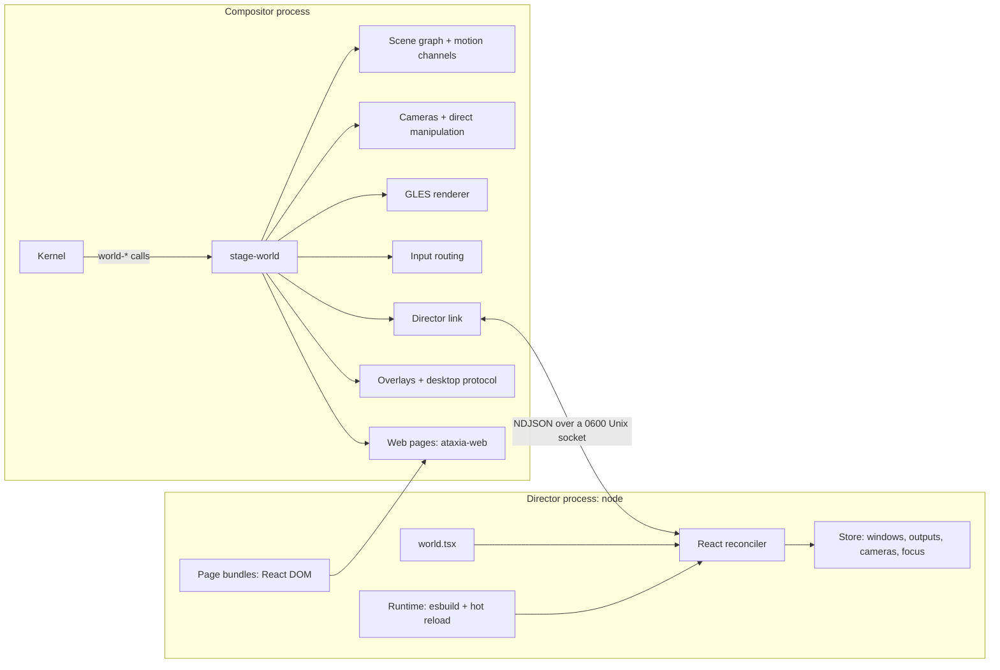

# Stage World

Stage is a World whose scene is written in TypeScript with React. A *director*
process renders components such as `<Camera>`, `<Window>`, `<Text>` and `<Web>`;
the compositor keeps the resulting scene graph, animates it on its own frame
clock, renders it with GLES and routes input. Edit the world file while it runs
and the director reloads it: windows glide from where they are to where the new
code puts them.

It is the same idea as [ink](https://github.com/vadimdemedes/ink): a custom
React renderer whose host elements are not DOM nodes but, here, compositor scene
nodes. React DOM still has a place: a `<Web>` node shows a React DOM page,
rendered by Chromium, inside the scene.

```tsx
import { Background, Camera, Window, spring, useWindows } from "@ataxia/stage";

export default function World() {
  const windows = useWindows();
  return (
    <>
      <Camera x={0} y={0} zoom={1} transition={spring()} />
      <Background fill="#ecebe6" grid={{ kind: "dots", color: "#0003", spacing: 28 }} pan />
      {windows.map((window, index) => (
        <Window key={window.id} window={window.id} x={-600 + index * 640} y={-300}
                width={600} height={420} radius={10} shadow={{ blur: 32, y: 12, color: "#0003" }}
                movable resizable initial={{ opacity: 0, scale: 0.94 }} exit={{ opacity: 0, scale: 0.94 }}
                transition={spring({ duration: 0.4 })} />
      ))}
    </>
  );
}
```

## Run

```sh
make stage                    # npm ci + build sdk/stage (Node 22+)
sbcl --eval '(sb-int:set-floating-point-modes :traps nil)' --script scripts/run-stage-world.lisp
sbcl ... --script scripts/run-stage-world.lisp --script examples/stage/hypr.tsx
```

The launcher starts the compositor, XWayland and the assistant (not on the
headless backend), then the director on `--script`. Worlds draw their own bar
in TSX; the shared web status bar is available with `--status-bar`. Two
examples ship with it, sharing the bar in [`bar.tsx`](../examples/stage/bar.tsx):

- [`canvas.tsx`](../examples/stage/canvas.tsx): an infinite canvas with
  momentum panning, anchored zoom, native window moves and resizes, keyboard
  fly-to, an overview and a minimap.
- [`hypr.tsx`](../examples/stage/hypr.tsx): a Hyprland-style tiler with nine
  workspaces that slide, dwindle and master layouts with gaps, a spinning
  gradient border on the focused window, dimmed inactive windows, floating,
  fullscreen, a scratchpad, focus-follows-mouse, three-finger workspace swipes,
  workspaces in the status bar and a React DOM application launcher
  ([`launcher.tsx`](../examples/stage/launcher.tsx)).

`--no-director` starts only the compositor; run a director yourself, e.g. under
a debugger:

```sh
node sdk/stage/bin/ataxia-stage.mjs --socket "$ATAXIA_STAGE_SOCKET" my-world.tsx
```

`--once` loads the world without watching it, and `--dev` selects React's
development build for detailed component errors. `--no-xwayland`,
`--status-bar`/`--no-status-bar`, `--assistant`/`--no-assistant` and
`--assistant-project DIR` control the desktop services; the usual backend,
size, `--run-for`, damage-debug and SLY options apply. See `--help`.

## Architecture



**Kernel is unchanged.** Stage is an ordinary `ataxia.kernel:world` (and an
`ataxia.world:ui-host`) and talks to applications only through the existing
contracts: `drawable-surfaces`, `drawable-local-bounds`, `retain-render-source`,
`interactable-*`, `request-object-configuration`, `request-object-state`,
output membership and frame results. The director never sees a Kernel object,
only copied ids and values.

| Module (`src/worlds/stage/`) | Responsibility |
| --- | --- |
| `motion.lisp` | Retargetable channels: closed-form springs, cubic-bezier tweens (delays, repeats, loops) and momentum decay. |
| `affine.lisp` | 2D transforms shared by drawing, damage and picking. |
| `model.lisp` | Node kinds and the property schema; decodes canonical wire values. |
| `scene.lisp` | Commits, layout-identity hand-over, exit animations. |
| `world.lisp` | Windows, outputs, focus, configure, last frames for exit animations, Kernel lifecycle. |
| `camera.lisp` | Per-output cameras: anchored zoom, panning, momentum, programmatic moves. |
| `gl.lisp` | Offscreen targets, texture uploads and readback, restoring Kernel GL state. |
| `media.lisp` | Pango text layout and rasterization; gdk-pixbuf decoding on a worker thread. |
| `renderer.lisp` | SDF rectangles with gradient fills and borders, Gaussian shadows, filtered textures, dual Kawase backdrop blur, grids. |
| `display.lisp` | Per-output display lists, damage diffing, frames, hit lists. |
| `content.lisp` | Text and image nodes: measured layouts, scale-aware rasters, shared images. |
| `web.lisp` | Web nodes: page lifecycle, damage, visibility, raster scale. |
| `link.lisp` | Socket listener, director connection, protocol messages. |
| `clipboard.lisp` | Clipboard text for the director and desktop services: bounded, non-blocking selection reads. |
| `manipulation.lisp` | Native pans, zooms, moves and resizes driven by input in the compositor. |
| `input.lisp` | Pointer/keyboard/gesture routing, capture, bindings, client requests. |
| `desktop.lisp` | Shell overlays and the shared desktop protocol (capture, window queries, viewport navigation, workspaces). |
| `applications.lisp` | Installed application catalog and launching. |
| `main.lisp` | Entry point; owns the director process and desktop services. |

The TypeScript SDK lives in [`sdk/stage`](../sdk/stage): `host.ts` (reconciler
host), `props.ts` (prop normalization), `session.ts`/`connection.ts`/`store.ts`
(compositor state and durable persistence), `hooks.ts`, `components.ts`,
`layouts.ts`, `web.ts` (page bundling), `page.ts` (the in-page runtime) and
`runtime.ts` (bundling and hot reload).

### Why a separate process

React, npm packages and user code run in Node, never on the compositor owner
thread. A world that throws, loops or is being edited cannot stall frames or
input: clients keep receiving input directly from the compositor, and the scene
stays as last committed. The director reconnects by itself after a World
restart; a director replaced by a newer one exits instead.

### Declare targets, animate in the compositor

React renders *targets*, not frames. A changed `x` or `zoom` is one message; the
compositor animates it at the display's refresh rate with a spring or tween from
the node's `transition`. Retargeting starts from the displayed value and keeps
velocity, so interrupted moves stay continuous. Settled channels schedule
nothing. A window is configured once with its target size, not on every frame;
its content is stretched to the animated box in between.

Direct manipulation never waits for the director either. Panning the canvas,
zooming around the pointer, moving and resizing windows and dragging nodes run
in the compositor in the same frame as the input, then report where things
ended up (`onDragEnd`, `onResizeEnd`, `useCamera()`), so the world can store it.
A position the world does not change in response is declared again, so the
node springs back to it instead of staying where it was dropped.

## Writing a world

The module's default export is the root component. Host components:

| Component | Purpose |
| --- | --- |
| `Camera` | Declares an output's camera: world point at its center, `zoom`, `rotation`, `minZoom`/`maxZoom` and the `transition` of programmatic moves. The camera itself is compositor state; read it with `useCamera()`, move it with `moveCamera()`. No camera means world = output pixels. |
| `Group` | Transform container; with `width`/`height`, `clip` hides children outside it and `draggable` lets it be dragged. |
| `Window` | A client window by id. `width`/`height` configure the client; omit them for its natural size. `radius`, `border`, `shadow`, `blur`, `dim`, `fullscreen`, `maximized`, `tiled`, `focusable`, `interactive`; `movable`/`resizable` allow native moves and resizes. A removed window with an `exit` animates out from its last frame, even after its client is gone. |
| `Rect` | Rounded rectangle: `fill` (color or gradient), `radius`, `border`, `shadow`, `blur` (frosted glass), `clip`, `draggable`; pointer handlers. |
| `Text` | Text laid out by Pango: `<Text size={14} weight="bold">Hello {name}</Text>`. `font`, `color`, `italic`, `markup` (Pango markup), `width` with `align` and `maxLines`, `lineHeight`; `onMeasure` reports its size. |
| `Image` | A decoded image file (PNG, JPEG, WebP, GIF, SVG, ...): `src`, `fit` (`fill`, `contain`, `cover`) plus the `Rect` box props; `onLoad` reports its natural size. `import photo from "./photo.jpg"` gives a `src`. |
| `Web` | A page rendered by Chromium: a React DOM module, an HTML file, a built app directory or a URL. See [Web pages](#web-pages). |
| `Background` | Infinite plane with `fill` and a `dots`/`lines` grid; `pan` makes dragging or scrolling it pan the camera, with momentum. |
| `Screen` | Children in an output's logical pixels, unaffected by the camera: HUDs, bars, launchers. |
| `Reserve` | Screen space the world keeps for UI it draws itself, such as a bar: `top`, `right`, `bottom`, `left`, optionally per `output`. Window work areas (`workArea`) leave it free. |
| `Shell` | Workspaces for the optional web status bar: `workspaces`, `selected`, `onNavigate`. |
| `Shortcut` | `keys="Super+Shift+Return"`, `onPress`/`onRelease`; consumed before the focused client. |
| `PointerBinding` | Modifier+button anywhere. `action="move"`/`"resize"`/`"pan"` runs natively; or handle `onDown`/`onMove`/`onUp` (`event.window` is the window under the pointer). |
| `WheelBinding` | Modifier+wheel anywhere; `action="zoom"`/`"pan"` or `onWheel`. |
| `GestureBinding` | Touchpad `swipe`/`pinch`/`hold` with a finger count; `action="zoom"`/`"pan"` or handlers. |

Every visual node accepts `x`, `y`, `scale`, `rotation` (degrees), `opacity`,
`originX`/`originY` (fractions of its size; default center) and `visible`.
Children paint in order, later on top; reorder windows to raise them. Fills and
border colors take a color or a two-stop gradient
`{ from, to, angle }` (degrees).

Motion props:

- `transition`: `spring({ stiffness, damping, mass, delay })`,
  `spring({ duration, bounce })`, `tween(seconds, "ease-out" | [x1, y1, x2, y2],
  { delay, repeat })` (`repeat: Infinity` loops) or `instant`; or per prop,
  `{ default: spring(), opacity: tween(0.15), borderAngle: tween(4, "linear", { repeat: Infinity }) }`.
- `initial`: values a new node starts from.
- `exit`: values a removed node animates to before it disappears.
- `layoutId`: nodes sharing it hand over their on-screen state when one replaces
  the other in the same commit. Windows (`window:<id>`) have an identity implicitly.

Colors are CSS hex, `rgb()`/`rgba()`, `transparent`, `white`, `black` or
`[r, g, b, a]` in 0..1.

Hooks and actions:

| API | Description |
| --- | --- |
| `useWindows()` | Mapped windows `{ id, title, appId, mapped, width, height }`, creation order. |
| `useWindow(id)`, `useFocusedWindow(seat?)` | Compositor state; components re-render only when it changes. |
| `useOutputs()` | Outputs with their size, scale and `workArea` (what the status bar leaves). |
| `useCamera(output?)`, `moveCamera(move, options?)` | Where a camera is headed; move it from code. |
| `useApplications()`, `launchApplication(id)` | Installed applications from desktop entries; launch one. |
| `useTime()` | The time, updated by one shared timer at each minute's start while anything reads it. |
| `useBattery()`, `usePowerProfile()`, `setPowerProfile(name)` | Battery charge, state and time remaining (sysfs, refreshed on UPower events); the power-profiles-daemon mode. |
| `useVolume()`, `setVolume(level)`, `changeVolume(delta)`, `toggleMute()` | The default PipeWire output, refreshed on PipeWire change events. |
| `useMedia()`, `mediaCommand(command)` | The playing (or first) MPRIS player's track; `PlayPause`, `Next`, `Previous`, `Stop`. Refreshed on D-Bus signals. |
| `useBrightness()`, `setBrightness(percent)`, `changeBrightness(delta)` | The backlight, set through logind. |
| `useClipboard()` | Text copied this session, newest first (memory only), and `copy(text)`. |
| `usePersistentState(key, initial)` | `useState` that survives hot reloads, remounts and restarts (saved as JSON under `$XDG_STATE_HOME/ataxia/stage/`). |
| `focus(id \| null)`, `close(id)`, `launch(command)` | Keyboard focus, polite close, start a client on this display. |
| `dwindle`, `masterStack`, `columns`, `grid`, `inset` | Pure tiling layouts from window ids and an area to boxes. |

### Input

Input is resolved synchronously in the compositor against what was last
presented, so clients never wait for the director:

1. A matching `Shortcut` consumes a key; everything else goes to the focused
   window, or to the focused page or shell overlay. A press on a window focuses
   it (click-to-focus) and new windows receive focus when they map; `focus()`
   overrides both.
2. A pointer press first tries `PointerBinding`s (exact modifier match). Then the
   topmost overlay, window, page or handler node under the pointer receives it.
   Rects and backgrounds without pointer handlers are transparent to input.
3. A node or binding that receives a press captures the pointer until every
   button is released, like DOM pointer capture.
4. Pointer events carry the position in output pixels (`screenX/Y`), world space
   (`worldX/Y`), the target's parent space (`x/y`) and its own space (`localX/Y`).

Shortcuts and bindings are inactive while no director is connected.

### Web pages

```tsx
<Web src="./panel.tsx" x={40} y={40} width={360} height={480} radius={14} blur={24}
     props={{ count }} onMessage={(name, value) => name === "increment" && setCount(count + 1)} />
```

```tsx
// panel.tsx: an ordinary React DOM component, bundled for the browser.
import { send } from "@ataxia/stage/page";
export default function Panel({ count }: { count: number }) {
  return <button onClick={() => send("increment")}>Clicked {count} times</button>;
}
```

A module source is bundled with esbuild and this SDK's React DOM, then mounted
by the page runtime, which passes the node's `props` (re-rendering in place when
they change) and delivers `send(name, value)` to `onMessage`. Saving the module
reloads only that page. The page is an ordinary scene node: it transforms,
rounds, blurs what is behind it and animates like any other, and receives
pointer and keyboard input like a window; `autoFocus` gives it the keyboard
whenever it appears. Pages share one Chromium helper per World, transfer frames
as dma-bufs, stop painting while no output shows them, and raster at the scale
they are seen at once a zoom settles. A reload of the world hands each page to
its replacement node, so pages keep running.

### Hot reload

The runtime bundles the world with esbuild, sharing one React, one session and
one store across reloads. It watches the bundle's source directories with
inotify (esbuild's own watch mode polls), so an unchanged world costs nothing.
A reload remounts the world in one commit; nodes with the same identity inherit
their displayed state, then animate to their new targets. Use
`usePersistentState` for state the edit should keep. A build error keeps the
running version. A world that throws while rendering falls back to the last
version that rendered, or to a safe mode that keeps every window reachable.

Agents can therefore iterate on a running desktop by editing files. From a
[SLY session](SLY_CONTROL.md), `(ataxia.stage-world:stage-scene-description world)`
returns the director's declared scene as nested plists.

### Bars and other chrome

A bar is ordinary scene nodes in a `<Screen>`, plus a `<Reserve>` so windows
keep clear of it. The examples' [`bar.tsx`](../examples/stage/bar.tsx) is a
frosted card with the world's controls on the left (workspace pills in
`hypr.tsx`), the focused window's title in the middle, and what is playing,
sound, clipboard, battery and the clock on the right. These open menus (now
playing with playback controls and volume; clipboard history; battery, display
brightness and power mode), rendered by one React DOM page
([`bar-menu.tsx`](../examples/stage/bar-menu.tsx)) that stays loaded, and costs
nothing, while hidden. The bar also binds the volume, mute, playback and
brightness keys, showing each level change briefly:

```tsx
<Reserve top={44} />
<Screen output={output.name}>
  <Rect x={8} y={8} width={output.width - 16} height={32} radius={10} fill="#ffffffd9" blur={18} />
  <Text x={8} y={15} width={output.width - 16} align="center" size={13} weight={600}>{title}</Text>
</Screen>
```

Its text is rasterized only when it changes, and its sources are event-driven
(`pw-mon` for sound, `upower --monitor` for the battery, `dbus-monitor` for media
players), so an idle bar costs one director wakeup and one small repaint a minute.

## Desktop services

Stage hosts the shared shell overlays (the optional web status bar, the assistant
panel, agent widgets) above the director's scene and below cursors, and implements the
desktop protocol used by computer use and the assistant: window queries and
geometry, `world-target-at`, focus, window capture, viewport navigation of the
cameras and the application catalog. Policy stays with the director: the
status bar's minimize, maximize and fullscreen actions reach a window's node as
the same request events its own client could send, the status bar's
reservations arrive as each output's `workArea`, and a `<Shell>` node supplies
the workspaces the bar shows and receives its navigation.

## Protocol

Newline-delimited JSON over `$XDG_RUNTIME_DIR/ataxia-stage-<pid>.sock` (mode
0600). Reads and writes never block the owner thread; incoming messages are
limited to 8 MiB, queued output to 16 MiB, and high-rate reports such as drag
progress and camera positions are coalesced. The schema is in
[`sdk/stage/src/protocol.ts`](../sdk/stage/src/protocol.ts).

| Director → compositor | |
| --- | --- |
| `hello {protocol}` | Must be first. |
| `commit {ops}` | One scene transaction: `create {id, type, props}`, `set {id, props}`, `insert {parent, id, before}`, `remove {parent, id}`, `reset`. A `null` prop restores its default. |
| `focus {window}`, `close {window}` | Imperative window actions. |
| `camera {output, x, y, zoom, rotation, transition}` | Move one camera, or every camera. |
| `applications`, `launch-application {id}` | Read the application catalog; launch an entry. |
| `set-clipboard {text}` | Own the clipboard with TEXT. |

| Compositor → director | |
| --- | --- |
| `welcome {display, outputs, windows, cameras, focus}` | Snapshot after `hello`. |
| `window`, `window-removed`, `output`, `output-removed`, `focus`, `camera` | State changes. |
| `applications {applications}` | The catalog, in answer to `applications`. |
| `clipboard {text}` | Text a client copied; selections marked secret by password managers are never read. |
| `event {node, name, ...}` | Handler events, with kebab-case fields. |
| `error {message, fatal}` | A rejected op or message; the rest of a commit still applies. A fatal error, such as being replaced by a newer director, ends the session. |

Wire values are canonical: straight-alpha colors in 0..1, radians, seconds, and
flat properties (`shadowBlur`, `borderColor`, `fontSize`, ...). The SDK
translates ergonomic props; the compositor validates every value against
`+prop-specs+` and never interns remote text.

A newer connection replaces the current director. The director's first commit
starts with `reset`, which removes the old top-level nodes inside the same
commit, so a restarted runtime takes over without windows jumping. While no
director scene is active, unplaced windows cascade on the first output, so a
missing or crashed director never hides them.

## Rendering and damage

Every frame flattens the scene into buffer-space draw items for each output.
Comparing their signatures (transform, size, colors, paint order) with the
previous frame yields exactly the damage from scene edits, animation and cursor
motion; client and page damage is projected through the same transforms. The
shared damage tracker then repairs only those regions.

- Rounded rectangles, gradients and borders are signed-distance fields in node
  space, antialiased at any zoom or rotation. A border alone damages only its
  ring, so a spinning gradient border does not repaint the window inside it.
  Shadows use a Gaussian rounded-box integral.
- Backdrop blur is a dual Kawase blur over the pixels behind a node; damage
  touching it grows to everything the blur samples.
- Text is laid out once per change and rasterized per output at the scale it is
  seen; while a zoom is under way rasters step in half octaves, and the first
  still frame renders them exactly. Images decode off the owner thread and
  release their textures a while after they were last on screen.
- Minified client textures use a bounded box filter over each output pixel's
  footprint, keeping zoomed-out windows legible.
- Offscreen items are culled; windows join only outputs where they are visible,
  visible clients receive frame callbacks even when their pixels were not
  repainted, and pages nobody sees stop painting.

## Energy

A compositor runs all day, often on battery, so Stage does no work it does not
have to:

- When motion settles and clients are idle, nothing runs: no compositor frames,
  no timers, no director wakeups. `make test-stage` asserts zero frames for a
  settled scene.
- The scene's display list and hit list are cached per output and rebuilt only
  when the scene can present differently: a commit, an animation step, a client
  or page frame. Moving the pointer over a still desktop only redraws and diffs
  the cursor.
- A moving camera wakes only its output, the cursor only the outputs it is on
  or leaves, and endless loops only the outputs showing them.
- Reports to the director (drag progress, camera positions) are coalesced to
  about one per frame.
- The director runs esbuild only while it builds: its service process, which
  keeps waking up even when idle, is stopped a second after the last build.
- Pages no output shows stop painting; text and images keep textures only while
  they are on screen, and decoded pixels nothing draws are released.

Measured headless at 1920x1080 with four clients: idle, the compositor and the
director use no CPU and schedule no frames (with the optional web status bar, its
Chromium helper wakes about twice a second); moving the pointer costs the
compositor about 0.5 ms per frame; a camera animation about 1.3 ms per frame.
Cursor frames are still composited on the GPU: a Kernel API for hardware cursor
planes would make pointer motion nearly free for every World.

## Limitations

- Group `opacity` multiplies into each child; there is no offscreen group
  compositing. Clipping is axis-aligned on screen.
- Outputs form one horizontal row in arrival order.
- A press on compositor-drawn nodes does not dismiss a client's popup grab;
  clicking another window does.
- Text color animations re-rasterize the text on every frame they run.
- A window declared `tiled` asks its client for tiled edges, which clients bound
  to xdg_wm_base version 1 do not support; the Runtime's xdg adapter should skip
  the hint for them.

## Tests

`make test-stage` runs the SDK tests (reconciler ops, prop normalization,
handler dispatch, replay after reconnect, layouts) and
[`tests/stage-world.lisp`](../tests/stage-world.lisp): motion and scene
semantics, then a headless session with a real client covering the handshake,
fallback placement, configure, picking through transforms, director events,
text measurement, reserved work areas and a settled scene that schedules no frames.
