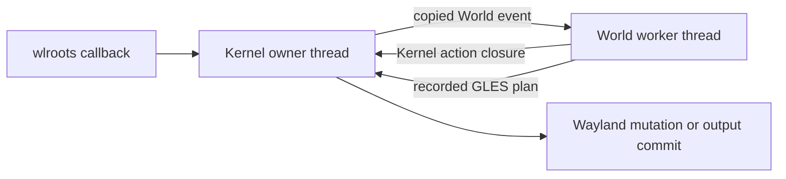

# Threaded World Experiment

## Purpose

The `codex/threaded-world` experiment moved World policy, animation, input
decisions, damage planning, and frame planning onto a supervised Lisp worker.
Kernel retained the wlroots event loop, Wayland mutation, EGL execution, output
buffers, and commits on the Runtime owner thread.

The goal was to recover from broken agent-authored World code without restarting
Runtime or disconnecting Wayland clients.

## Implemented Boundary



The experiment used direct Lisp references rather than IPC or serialization.
Two ordered queues connected the threads:

- Kernel-to-World events carried copied input, lifecycle, client-request, and
  presentation values.
- World-to-Kernel commands carried closures that performed owner-thread wlroots,
  Slint, EGL, and output operations.

A pipe registered with the Wayland event loop woke Kernel without polling.
World generations rejected work left behind by a restarted worker.

Rendering was split into two stages. World generated damage, presentation data,
and a recorded GLES command plan. Kernel later executed that plan with EGL
current and committed the acquired output buffer.

## Recovery Result

The supervision mechanism successfully recovered from several Lisp failures
while preserving existing Wayland connections:

- a World event raising a serious condition;
- a World worker stuck in a Lisp loop;
- a Kernel action submitted by World failing;
- a Lisp render command exceeding its deadline;
- a replacement World factory failing during live installation.

Recovery terminated the worker, abandoned its generation, failed the active
frame, constructed a replacement from the stored factory, and replayed current
outputs, seats, cursor requests, and Wayland applications.

Native process crashes, permanently blocked foreign calls, Runtime corruption,
and destructive changes to the supervisor remained unrecoverable.

## Latency Result

The separation added two scheduling transitions to ordinary input delivery:

```text
wlroots -> Kernel -> World -> Kernel -> wl_seat notification
```

A live UTM measurement of 250 Kernel-to-World-to-Kernel round trips produced:

| Measurement | Result |
| --- | ---: |
| Mean | 252 microseconds |
| Median | below 1 millisecond |
| 95th percentile | 1 millisecond |
| 99th percentile | 2 milliseconds |
| Maximum | 2 milliseconds |

The direct scheduling cost was small under light load, but visual input could
still miss the frame already being prepared. At the UTM output's 75 Hz refresh
rate, missing that deadline added approximately 13.3 milliseconds.

The architecture also allowed larger latency spikes:

- pointer motion was queued without coalescing;
- input waited behind earlier World events;
- World waited for owner-thread completion of every render plan;
- only one output frame could be active across the compositor;
- slow shaders, Slint work, or agent-authored hooks delayed subsequent input.

## Complexity Result

The first implementation represented supervision as a `threaded-world` proxy
that forwarded the complete World protocol. A second revision removed the proxy
and made threaded execution an intrinsic Kernel responsibility. That revision
was substantially cleaner, but the fundamental synchronization remained:

- event and command queues;
- completion semaphores;
- generation tracking;
- a pipe bridge into the Wayland loop;
- frame-plan recording;
- deferred surface commits and render-source release;
- special owner-thread handling for Slint and graphics lifecycle operations;
- recovery coordination for active events, timers, frames, and graphics.

This machinery was not arbitrary. It followed from keeping World code off the
wlroots owner thread while still requiring all wlroots and EGL mutation to occur
there. Nevertheless, it made the normal compositor path harder to understand and
increased the number of states involved in every input and frame transaction.

## Decision

The experiment is retained in `codex/threaded-world` for reference, but it is not
the preferred direction.

The next experiment returns World and Kernel callbacks to one synchronous owner
thread. A separate watchdog thread will observe bounded World calls and interrupt
only a call that exceeds its deadline. Kernel will unwind to a controlled
boundary, revoke the failed World generation, and install a minimal recovery
World at a Wayland event-loop safe point.

This trades continuous thread isolation for a simpler temporal boundary:

> World may execute on the owner thread, but only inside a Kernel-controlled,
> time-bounded invocation.

The design should preserve direct event ordering and eliminate normal-path queue
latency while retaining recovery from interruptible Lisp failures.

## Retained Lessons

The synchronous watchdog design should preserve the parts of the experiment that
proved necessary:

- Runtime and Kernel objects must survive World replacement.
- World callbacks need generation ownership.
- Frame acquisition and release require Kernel-owned `unwind-protect` cleanup.
- Recovery must happen after returning to a safe event-loop boundary.
- Old World cleanup must be optional and bounded.
- Recovery must not depend on invoking broken World methods.
- Foreign driver hangs and native crashes require an external process supervisor.

