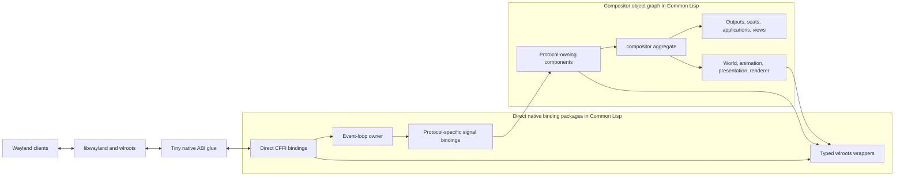
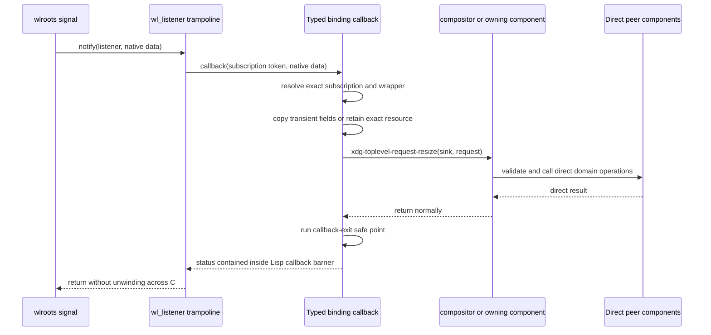
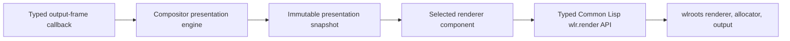
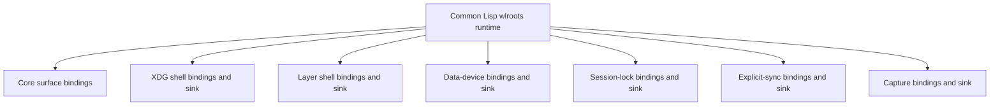
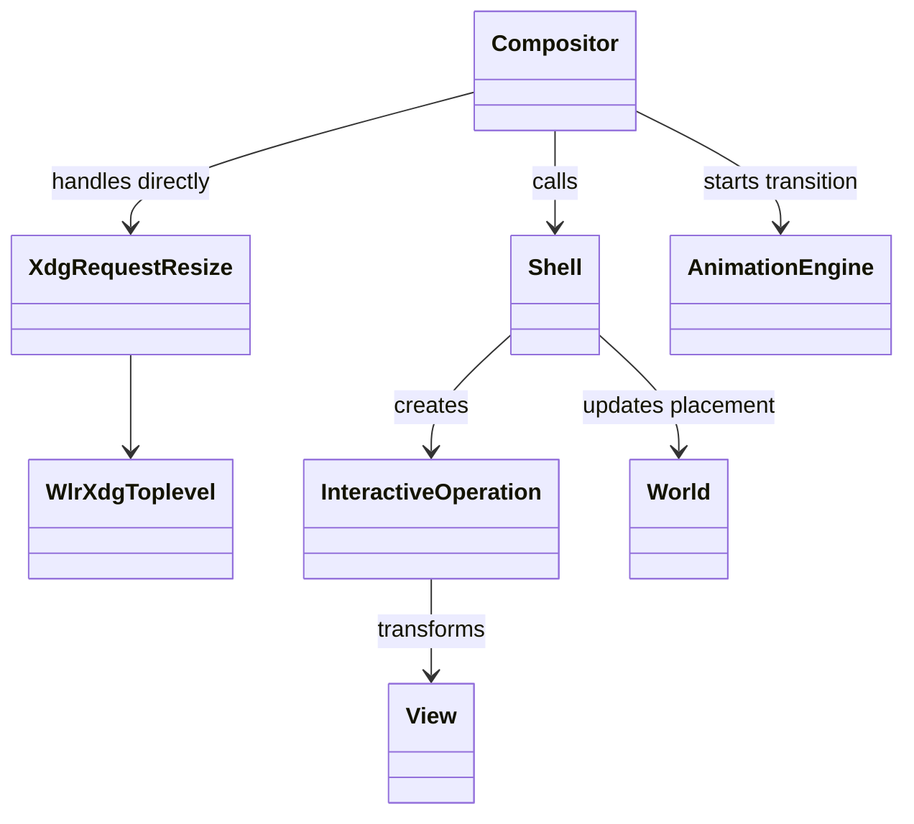
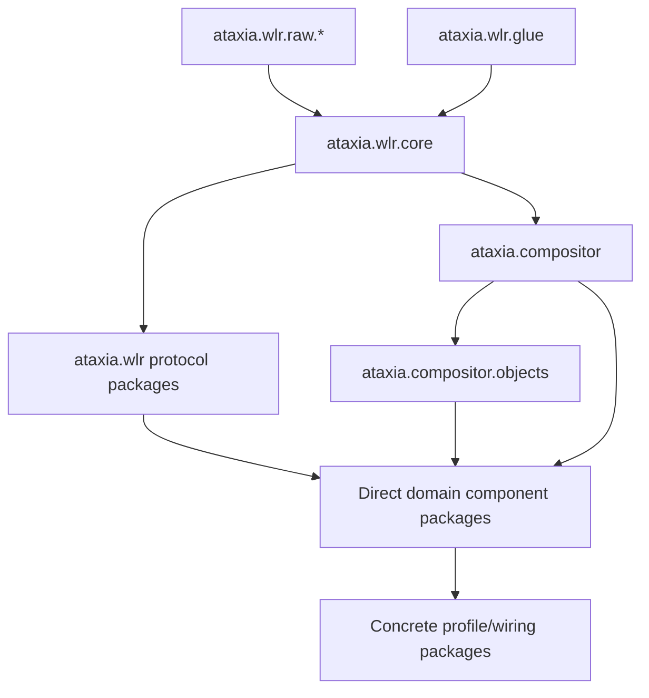

# wlroots–Compositor Common Lisp Interface

Status: planning only. This document replaces the rejected generic bridge ABI.

## 1. Decision

The wlroots binding packages are not a generic native host, and the compositor
does not communicate with them through an invented event protocol.

The new boundary is:

- wlroots and libwayland remain the native implementation;
- Ataxia-authored C contains only unavoidable wlroots/libwayland ABI glue;
- Common Lisp owns server construction, event-loop control, object wrappers,
  signal conversion, lifetime bookkeeping, protocol composition, and errors;
- binding packages and compositor components communicate through
  protocol-specific Common Lisp generic functions and ordinary typed return
  values;
- incoming names and values preserve the exact wlroots signal or Wayland
  protocol meaning;
- outgoing operations are typed Lisp wrappers around concrete `wlr_*` or
  `wl_*` calls;
- there is no module catalog, event envelope, command envelope, opcode router,
  native handle registry, completion protocol, or universal lease system.

This is a deliberate in-process design. It favors directness, Lisp
replaceability, and debuggability over a stable language-neutral ABI inside one
Lisp image.

## 2. Corrected Boundary



There are two different boundaries and they must not be conflated:

1. **Native-to-Lisp boundary:** CFFI calls and callback trampolines whose types
   follow the wlroots/libwayland ABI.
2. **Binding-to-compositor boundary:** Common Lisp protocol packages whose
   methods follow concrete wlroots signals and concrete compositor actions.

The second boundary has no C ABI at all.

## 3. What Ataxia-Authored C May Contain

The native shim is allowed only where CFFI cannot safely or conveniently express
the public native ABI.

### 3.1 Allowed native glue

The initial shim may contain:

- a compile-time wlroots/libwayland version fingerprint;
- wrappers for required C macros or `static inline` functions;
- allocation and destruction of a `wl_listener` holder;
- the `wl_listener.notify` trampoline into one registered Lisp callback;
- exact adaptors for callbacks whose native signature cannot be represented by
  the chosen Lisp implementation;
- a logging callback adaptor if direct CFFI callbacks are insufficient;
- generated Wayland protocol descriptor data when a protocol is not supplied by
  wlroots.

A representative listener helper is intentionally mechanical:

```c
typedef void (*atx_wl_notify_fn)(uintptr_t token, void *data);

struct atx_wl_listener {
    struct wl_listener listener;
    atx_wl_notify_fn notify;
    uintptr_t token;
};

struct atx_wl_listener *atx_wl_listener_create(
    atx_wl_notify_fn notify,
    uintptr_t token);
void atx_wl_listener_attach(
    struct atx_wl_listener *listener,
    struct wl_signal *signal);
void atx_wl_listener_detach(struct atx_wl_listener *listener);
void atx_wl_listener_destroy(struct atx_wl_listener *listener);
```

This helper does not identify event kinds, copy payloads, queue events, own
wlroots objects, or route policy. The Lisp subscription represented by `token`
already knows the exact signal type and exact `data` layout.

### 3.2 Forbidden native infrastructure

Ataxia-authored C must not contain:

- a compositor server abstraction above wlroots;
- protocol module descriptors or a module loader;
- arbitrary event or command records;
- numeric object handles or tombstone registries;
- a native event queue;
- a policy-request state machine;
- generic buffer/FD/fence/frame leases;
- scene, placement, focus, cursor, animation, or agent state;
- a renderer abstraction or command-buffer format;
- protocol-independent validation already performed by typed Lisp wrappers;
- a second lifecycle model for objects already owned by wlroots.

If new C starts accumulating switches over protocol names or compositor policy,
the boundary has failed.

## 4. Direct Binding Common Lisp Responsibilities

The binding layer is mostly Common Lisp. It contains the direct bindings and the
smallest safe wrapper around wlroots.

### 4.1 Server and event loop

The binding layer directly owns the root runtime:

- `wl_display` and its `wl_event_loop`;
- the Wayland socket and backend startup/shutdown sequence.

It also exposes exact typed constructors and destructors for server-owned
wlroots objects selected by the compositor or its components, including:

- backends, renderers, and allocators during bootstrap;
- compositor/protocol globals selected by the active profile;
- logical seats created and configured by seat policy;
- headless or nested outputs requested by output/agent policy;
- server-published handles, output cursors/layers, Xwayland instances, and
  scoped render/response objects;
- event-loop timer, FD, signal, and idle sources requested by compositor
  components;
- explicitly provisioned Wayland clients, activation tokens, synthetic input
  devices, and policy-granted native response objects.

Physical outputs and input devices are created by their backend and enter via
exact discovery callbacks. Client surfaces, roles, offers, constraints, and
similar resources are created by clients/protocol implementations. The
compositor does not construct those objects.

The Lisp runtime calls `wl_event_loop_dispatch` itself instead of hiding the
loop in a C `server_run` function. This makes native events, Lisp timers, the
external owner-thread inbox, and safe points visible in one place.

### 4.2 Typed native wrappers

Each public wlroots type used above the raw bindings has a Lisp wrapper class:

```lisp
(defclass wlr-object ()
  ((pointer :initarg :pointer :reader %wlr-pointer)
   (alive-p :initform t :reader wlr-object-alive-p)
   (generation :initarg :generation :reader wlr-object-generation)
   (destroy-listener :initform nil)))

(defclass wlr-surface (wlr-object) ())
(defclass wlr-xdg-toplevel (wlr-object) ())
(defclass wlr-output (wlr-object) ())
(defclass wlr-seat (wlr-object) ())
```

The raw foreign pointer is private to binding packages. Compositor components
receive the typed wrapper, not an opaque integer and not a naked CFFI pointer.

The binding layer maintains a weak pointer-to-wrapper table only to preserve Lisp identity
while a wlroots object is alive. This is not an independent native handle
registry. The wlroots destroy signal is authoritative.

### 4.3 Object invalidation

For an object destroy signal:

1. The binding package enters the Lisp callback barrier.
2. It delivers the exact typed `...-destroying` callback while the pointer is
   still valid for documented inspection.
3. The owning compositor component detaches or retires its related objects.
4. The binding package marks the wrapper dead, removes it from the identity table, clears
   its foreign pointer, and detaches remaining listeners.
5. Any later typed operation on the wrapper signals `dead-wlr-object` in Lisp
   before entering C.

The wrapper generation prevents an accidentally reused native address from
being confused with the old object.

### 4.4 Protocol packages

The bindings are horizontally split into packages that mirror real wlroots areas:

- `ataxia.wlr.core` — display, event loop, clients, surfaces, subsurfaces;
- `ataxia.wlr.backend` — backend factories, physical discovery, virtual outputs;
- `ataxia.wlr.render` — renderer/allocator factories, buffers, textures, passes;
- `ataxia.wlr.seat` — seat creation/lifecycle, request callbacks, input delivery;
- `ataxia.wlr.xdg-shell` — XDG surfaces, toplevels, popups, positioners;
- `ataxia.wlr.layer-shell` — layer surfaces;
- `ataxia.wlr.data-device` — selections and drag-and-drop;
- one package per optional wlroots protocol implementation;
- `ataxia.wlr.raw.*` — generated/private CFFI declarations.

No central package needs to know every protocol event.

## 5. The Binding–Compositor Common Lisp Interface

Every protocol family defines its own event sink protocol and typed outbound
functions. There is no universal `bridge-event` or `execute-command` function.

### 5.1 Protocol-specific sinks

The XDG shell package can define:

```lisp
(defgeneric xdg-new-toplevel (sink toplevel))
(defgeneric xdg-new-popup (sink popup))
(defgeneric xdg-surface-map (sink xdg-surface))
(defgeneric xdg-surface-unmap (sink xdg-surface))
(defgeneric xdg-surface-commit (sink commit))
(defgeneric xdg-toplevel-request-move (sink request))
(defgeneric xdg-toplevel-request-resize (sink request))
(defgeneric xdg-toplevel-request-maximize (sink request))
(defgeneric xdg-toplevel-request-fullscreen (sink request))
(defgeneric xdg-toplevel-destroying (sink toplevel))
```

The seat and input packages define different, equally concrete functions:

```lisp
(defgeneric pointer-motion (sink event))
(defgeneric pointer-motion-absolute (sink event))
(defgeneric pointer-button (sink event))
(defgeneric pointer-axis (sink event))
(defgeneric pointer-frame (sink pointer))
(defgeneric keyboard-key (sink event))
(defgeneric keyboard-modifiers (sink event))
(defgeneric touch-down (sink event))
(defgeneric touch-motion (sink event))
(defgeneric touch-up (sink event))
```

The output package defines:

```lisp
(defgeneric backend-new-output (sink output))
(defgeneric output-frame (sink output))
(defgeneric output-needs-frame (sink output))
(defgeneric output-request-state (sink request))
(defgeneric output-present (sink presentation))
(defgeneric output-destroying (sink output))
```

These names are intentionally specific. A new protocol adds new generic
functions in its own package; it does not add an opcode to the kernel.

### 5.2 Exact typed values

Event values are protocol-specific structs or classes with named fields:

```lisp
(defstruct xdg-request-move
  toplevel
  seat
  serial)

(defstruct xdg-request-resize
  toplevel
  seat
  serial
  edges)

(defstruct pointer-motion-event
  device
  time-msec
  delta-x
  delta-y
  unaccel-delta-x
  unaccel-delta-y)

(defstruct output-present-event
  output
  commit-sequence
  presented-p
  refresh-nsec
  when
  flags)
```

Fields correspond to the wlroots signal data for the pinned wlroots version.
There are no generic `subject`, `related`, `class`, `flags`, `payload`, or
`correlation` fields unless that concrete native event actually defines them.

Shared Lisp mixins may be used internally for logging or timestamps, but they
are not part of the binding–compositor contract.

### 5.3 Handler installation

Each protocol manager has a typed handler slot installed at a runtime safe
point:

```lisp
(install-xdg-shell-sink xdg-shell compositor)
(install-input-sink input-runtime input-router)
(install-output-sink backend output-manager)
```

The exact constructor for a new server-owned manager/resource receives its
initial sink when callbacks may begin immediately. The `install-*` operations
above replace an already-installed sink at a safe point; they are not a window
in which a newly advertised global exists without handlers.

Replacing a compositor component at a safe point swaps the corresponding Lisp
sink as part of the component rewiring sequence. Native listeners remain
attached and do not need to be recreated. Existing callback dispatch retains the
current sink for the callback extent; the replacement is visible to the next
callback.

This provides hot-replaceable policy without a generic event router.

### 5.4 Outgoing operations

Compositor components invoke concrete typed binding functions:

```lisp
(xdg-toplevel-set-size toplevel width height)
(xdg-toplevel-set-maximized toplevel maximized-p)
(xdg-toplevel-set-fullscreen toplevel fullscreen-p)
(xdg-surface-schedule-configure xdg-surface)

(seat-pointer-notify-enter seat surface sx sy)
(seat-pointer-notify-motion seat time-msec sx sy)
(seat-pointer-notify-button seat time-msec button state)
(seat-keyboard-notify-enter seat surface pressed-keycodes modifiers)
(seat-keyboard-notify-key seat time-msec keycode state)

(surface-send-frame-done surface monotonic-time)
(output-test-state output output-state)
(output-commit-state output output-state)
```

Each wrapper:

1. checks the concrete wrapper type and liveness in Lisp;
2. checks owner-thread and callback-safety rules;
3. converts exact arguments to the pinned wlroots ABI;
4. calls the concrete native function;
5. returns its concrete value or signals a typed Lisp condition.

There is no encoded command and no generic completion. A configure function
returns its serial. An output test/commit returns its native success value.
Later acknowledgements, presentation reports, and buffer releases arrive through
their real protocol-specific signals.

### 5.5 Exact native-object factories

The compositor must be able to request creation of server-owned wlroots objects when
their existence is compositor policy. This uses exact per-package constructors,
not a generic `create-native-object` operation.

Every public constructor declares:

- the exact wlroots type and native constructor it calls;
- the runtime phase in which it is legal;
- the concrete typed wrapper it returns;
- whether creation immediately advertises a Wayland global;
- the sink/listeners that must be installed before the next event-loop dispatch;
- the exact destroy, finish, release, or quiesce operation;
- whether failure leaves all native and compositor state unchanged;
- whether the object is persistent, callback-owned, or dynamically scoped.

Examples are intentionally concrete:

```lisp
(seat-create runtime name seat-sink)
(seat-destroy seat)

(headless-output-create headless-backend width height output-sink)
(output-cursor-create output)
(output-layer-create output)

(renderer-autocreate backend)
(allocator-autocreate backend renderer)
(output-state-create)
(output-begin-render-pass output output-state options)

(xdg-shell-create runtime advertised-version xdg-policy-sink)
(xdg-activation-token-create activation-manager launch-context)
(session-lock-manager-create runtime session-lock-sink)
(xwayland-create runtime compositor xwayland-sink :lazy-p t)

(event-timer-create runtime timer-sink)
(preconnected-client-create runtime owned-socket-fd client-sink)
(drm-lease-request-grant lease-request)
```

The exact names may track the pinned binding style, but each function remains in
the package for the native type it creates. There is no central factory switch
or type keyword registry.

### 5.6 Seat lifecycle reference interface

A logical seat is policy-owned. The binding package supplies the mechanism; the compositor decides
how many seats exist, their names/capabilities, device assignment, focus, and
delivery behavior.

The minimum public seat lifecycle is:

```lisp
(seat-create runtime name seat-sink) ; returns wlr-seat
(seat-destroy seat)
(seat-set-name seat name)
(seat-set-capabilities seat capabilities)
(seat-set-keyboard seat keyboard-or-nil)
```

`seat-create` directly calls `wlr_seat_create`. That native call registers the
`wl_seat` global, so the binding wrapper must install all seat listeners and the
provided sink before returning. Creation occurs on the owner thread while the
Wayland loop is not being re-entered; no client can bind between native creation
and listener installation.

The seat package delivers exact callbacks including:

```lisp
(seat-request-set-cursor sink request)
(seat-request-set-selection sink request)
(seat-request-set-primary-selection sink request)
(seat-request-start-drag sink request)
(seat-pointer-grab-begin sink seat)
(seat-pointer-grab-end sink seat)
(seat-keyboard-grab-begin sink seat)
(seat-keyboard-grab-end sink seat)
(seat-touch-grab-begin sink seat)
(seat-touch-grab-end sink seat)
(seat-destroying sink seat)
```

Physical device assignment remains a compositor relationship. A discovered
keyboard, pointer, touch device, or tablet can be assigned to a logical seat
without pretending the compositor created the backend device. Delivery then uses the
typed seat notification functions already defined above.

### 5.7 Native-object creation inventory

The wlroots 0.20 and libwayland server header scan yields six lifecycle classes.
The class is part of each typed API; it is not inferred from a pointer type.

#### 5.7.1 Composition-root and bootstrap factories

These objects are policy-selected, but normally created by the composition root
before the compositor enters its ordinary running state:

| Object family | Selection owner | Required binding interface |
|---|---|---|
| backend/session and multi-backend composition | launch profile | exact backend-specific create/start/destroy functions |
| renderer, EGL context, allocator, and output render initialization | selected renderer component | exact autocreate/create/init/destroy functions |
| core and initially enabled protocol globals | active protocol profile and security policy | protocol-package constructor with version, initial sink, and quiesce/destroy contract |
| Xwayland server/instance | Xwayland policy | exact lazy/eager create, ready/failure/new-surface callbacks, and destroy |

A profile may activate an optional global or backend later only when its exact
native API permits runtime creation. That follows normal construct-before-expose
ordering, but does not make bootstrap itself a generic compositor factory.

#### 5.7.2 Persistent server-owned objects the compositor may request at runtime

| Object family | Compositor owner/decision | Required binding interface |
|---|---|---|
| logical seats, including transient seats | seat policy | exact create/name/capabilities/keyboard/destroy functions and request callbacks |
| headless, Wayland, or X11 virtual outputs | output, capture, test-profile, or agent policy | backend-specific output constructor and normal output callbacks |
| output hardware cursors and output layers | cursor/render/direct-scanout policy | exact output-cursor/layer create, update, and destroy functions |
| keyboard groups and tablet-v2 seat objects | input/seat assignment policy | exact group/tablet/pad/tool constructors and lifecycle callbacks |
| compositor-owned synthetic input devices | agent/input-source provider | provider-specific pointer/keyboard/touch/tablet constructor built on the exact public `wlr_*_init`/`finish` interface |
| foreign-toplevel and workspace handles | publication components | exact manager/handle/group create, update, close, and destroy functions |
| compositor-owned data or primary-selection sources | clipboard/agent transfer broker | typed source initialization with Lisp callbacks and explicit source destruction |
| capture sources and synchronization timelines | capture/renderer components | exact source/timeline init/ref/unref/finish functions |
| event-loop FD, timer, signal, and idle sources | external inbox, timeout, repeat, and component policy | distinct `wl_event_loop_add_*`, update, callback-sink, and remove functions |
| explicitly provisioned `wl_client` from an owned FD | sandbox/application launch policy | exact `wl_client_create`, credential/label registration, destroy callback, and FD ownership transfer |

Synthetic input construction is not the default agent injection path. Agents
normally submit typed compositor input intents so mapping, grabs, focus, and hooks
still run. A provider creates a native synthetic device only when it needs to
participate as a first-class wlroots input source and wholly owns the concrete
implementation vtable and lifetime.

Ordinary clients accepted from the display socket are connection-created and
enter through the client-connected callback. The explicit-FD constructor is a
separate capability for a supervised or sandboxed process; it must never accept
an unowned FD or silently bypass per-client security policy.

#### 5.7.3 Policy-created results of launches or client requests

Some native objects are created only after the compositor authorizes or initiates a
concrete operation:

| Object family | Cause | Required binding interface |
|---|---|---|
| server-originated XDG activation token | trusted application/agent launch | exact create/add, metadata, exported-name, expiry, and destroy functions |
| DRM lease | accepted client lease request or privileged direct lease policy | exact request-grant/direct-create, rejection, revoke, and destroy callbacks |
| compositor-initiated drag | authorized transfer using an owned data source | exact drag creation/start/cancel/destruction contract |
| presentation feedback/sample | a surface sampled into a submitted frame | exact sampled, output-commit association, presented/discarded lifecycle |
| custom DRM connector mode | explicit output policy after backend capability validation | DRM-specific add-mode function; never mutation of a backend-reported mode |
| output-management response state | current-state publication or accepted client configuration | exact configuration/head creation, send/build, and destroy/finish functions |

These are not generic replies. Each is an exact protocol operation, and its
origin remains distinguishable from the corresponding client-created request.

#### 5.7.4 Scoped objects the compositor creates during one operation

These are not persistent semantic resources:

- `wlr_output_state` values initialized and finished around output operations;
- render passes begun and submitted for one frame;
- output configuration and configuration-head objects built for one response;
- allocator buffers, swapchains, textures, color transforms, render timers,
  synchronization waiters, and capture-operation objects scoped by the concrete
  renderer/capture provider;
- foreign arrays and protocol-specific configure values whose lifetime is one
  typed call.

Their wrapper APIs use `unwind-protect`-style dynamic ownership and the exact
native finish/submit/destroy operation. They are never placed in the semantic
object registry merely because they have a native pointer.

#### 5.7.5 Provider-private native helpers

Optional helpers such as `wlr_cursor`, `wlr_output_layout`,
`wlr_xcursor_manager`, `wlr_scene`, damage rings, swapchain managers, and native
addon records belong only to the concrete provider that selected them. A
conventional planar provider may use them privately. The world, presentation,
hit-test, animation, operation, and hook contracts must not depend on them.

A specialized provider may also implement a concrete backend, renderer, output,
buffer, or input subtype through wlroots' public interface `init`/`finish`
functions and exact implementation vtable. That native subtype belongs to the
provider and is exposed upward only through the same typed wrapper/callback
contracts as a stock wlroots subtype. It never becomes a generic compositor object
construction facility.

#### 5.7.6 Backend-, connection-, and client-created objects the compositor observes

The compositor observes rather than synthesizes:

- physical outputs, backend-reported output modes, DRM connectors, or physical
  input devices;
- backend-owned presentation/page-flip objects;
- native device subtypes emitted by libinput, nested Wayland, or X11 backends.

They enter through exact backend callbacks, receive typed wrappers, and retire
through their authoritative destroy signals. The compositor may configure, assign, or
present them but does not claim to have created them.

Connection/client origin includes:

- ordinary display-socket clients, `wlr_surface`, subsurface, or client buffer
  objects;
- XDG toplevels/popups, layer surfaces, lock surfaces, or Xwayland surfaces;
- client data sources/offers, drag requests, text-input objects, or input-method
  objects;
- pointer constraints, relative-pointer resources, inhibitors, activation
  token requests, or client capture requests.

These objects originate from a client connection or request and are instantiated
by libwayland or the concrete Wayland/wlroots protocol implementation. The compositor
handles their exact callbacks and may approve, configure, activate, reject, or
destroy them only through the operations that their protocol actually permits.
The explicitly server-originated client, activation-token, custom-mode, drag,
and lease paths above are separate typed operations, not exceptions hidden
inside an observed-object constructor.

### 5.8 Creation ordering contract

Persistent native creation follows construct-before-expose ordering:

```mermaid
sequenceDiagram
    participant M as seat-manager
    participant B as Exact seat binding package
    participant W as wlroots/libwayland
    participant C as compositor object graph

    M->>M: validate name, policy, phase, dependencies
    M->>B: seat-create(runtime, name, sink)
    B->>W: wlr_seat_create(display, name)
    W-->>B: wlr_seat pointer/global
    B->>B: wrap object and install exact listeners
    B-->>M: live typed wlr-seat wrapper
    M->>B: set capabilities/name/keyboard
    M->>C: expose Lisp seat object to peer components
    C-->>M: seat is live
```



Rules:

1. validate all compositor policy and dependencies before the native constructor;
2. execute the exact constructor on the owner thread;
3. attach destroy/request listeners and the active sink before returning;
4. expose the owning Lisp object to peer components only after the constructor
   and required setup succeed;
5. if later Lisp object wiring unexpectedly fails, call the exact destructor at
   the outermost safe point and never expose a half-created object;
6. store the returned typed wrapper as native provenance, not as the Lisp object
   identity;
7. do not create a general transaction or wait for future client binds.

### 5.9 Destruction and quiescing contract

Persistent destruction proceeds in the opposite direction:

1. mark the owning Lisp object `retiring` and stop new uses;
2. cancel focus, grabs, frames, transfers, and other relationships that depend on
   the object;
3. call the exact native destructor at the outermost callback-safe point;
4. let the authoritative destroy callback invalidate the typed wrapper;
5. remove it from its manager and release component references.

Destroying a Wayland global is not equivalent to unloading its protocol package.
If already-bound resources must remain serviced, the owning component quiesces
new exposure and remains attached until every resource is destroyed.
If wlroots offers no safe destructor for an object, the interface exposes
quiescing only and destruction is deferred to server shutdown.

## 6. Incoming Callback Flow



Dispatch is synchronous on the compositor owner thread. That is also how a
normal C wlroots compositor handles signals. Ataxia does not add a native queue
or duplicate wlroots ordering.

The sink mutates its owned objects and calls peer components directly. It must
never retain the native callback-data pointer. Any value that must survive is
copied or explicitly retained by a concrete binding operation before the
callback returns.

## 7. Callback Lifetime and Error Rules

### 7.1 Callback barrier

Every C-to-Lisp entry executes inside a callback barrier that:

- records callback depth and the exact active signal;
- prevents a Lisp condition from unwinding through C;
- retains the current protocol sink object for the callback extent;
- records a structured fault on failure;
- runs typed deferred destruction and safe-point actions at outermost exit;
- requests controlled compositor shutdown if a critical callback cannot be
  completed safely.

Nested wlroots signals are legal. The callback-depth counter makes outermost
exit explicit and prevents listener memory from being freed while a nested
callback still uses it.

### 7.2 Direct versus deferred native effects

Typed wrapper operations declare one of three call modes in Lisp metadata:

- **callback-safe** — may be called during its documented wlroots callback;
- **outermost-safe-point** — placed on the owner-thread deferred-action list
  until callback depth returns to zero;
- **event-loop-only** — callable only from the top-level runtime turn.

This metadata is attached to concrete functions, not encoded in a command
envelope. Destructive operations default to deferred.

### 7.3 No native event queue

Because events are dispatched synchronously:

- lifecycle and input events cannot be silently dropped by a bridge queue;
- ordering is the wlroots signal order;
- backpressure is simply time spent in the compositor callback;
- latency is measurable without a hidden producer/consumer boundary;
- coalescing, if desired, happens explicitly inside the input router or output
  manager after receipt.

The external control inbox is unrelated. It is awakened through an event-loop FD
and drained by the owner thread; compositor components do not send messages
through it.

## 8. Specialized Lifetime Objects

Removing generic leases does not remove native lifetime obligations. It replaces
them with concrete Lisp types whose operations match the underlying API.

### 8.1 Surface buffer snapshot

A surface commit that must outlive the callback creates a
`surface-buffer-snapshot` in Lisp:

```lisp
(defclass surface-buffer-snapshot ()
  ((surface :initarg :surface :reader snapshot-surface)
   (buffer :initarg :buffer :reader snapshot-buffer)
   (commit-sequence :initarg :commit-sequence :reader snapshot-sequence)
   (width :initarg :width :reader snapshot-width)
   (height :initarg :height :reader snapshot-height)
   (transform :initarg :transform :reader snapshot-transform)
   (scale :initarg :scale :reader snapshot-scale)
   (damage :initarg :damage :reader snapshot-damage)
   (released-p :initform nil :reader snapshot-released-p)))
```

The binding package calls the exact wlroots buffer-retention primitive during the surface
commit callback, copies commit state into Lisp values, and returns the snapshot.
`release-surface-buffer-snapshot` performs the matching wlroots release exactly
once. `unwind-protect` provides semantic cleanup; a finalizer is only a leak
safety net.

There is no numeric lease ID or native lease table.

### 8.2 File descriptors

`owned-fd` records one concrete ownership mode:

- borrowed for callback extent;
- duplicated and owned by Lisp;
- transferred to a wlroots/libwayland call;
- closed.

Protocol-specific functions state their FD rule in their Lisp signature and
documentation. A data-transfer call that consumes an FD marks that `owned-fd`
closed only after the native call has taken ownership.

### 8.3 Output state and render resources

`wlr-output-state`, `wlr-buffer`, `wlr-texture`, and `wlr-render-pass` wrappers
each have their own initialization, finish, lock, unlock, submit, or destroy
operations. They are not forced through a shared lease lifecycle.

## 9. Surface Commit Contract

`wlr_surface.events.commit` is handled directly and specifically.

The surface binding package copies the applied state needed by the owning
surface component:

- commit sequence;
- current surface size;
- buffer size and transform;
- scale and viewport source/destination;
- surface and buffer damage;
- opaque and input regions;
- subsurface synchronization state where applicable;
- the exact retained buffer snapshot when sampling is required.

The typed callback is:

```lisp
(surface-commit surface-policy surface-commit-event)
```

The surface manager decides whether this commit changes a view, invalidates
presentation, starts an animation, supplies frame callbacks, or is never shown.
The binding package does not translate it into a generic mutation.

The protocol adapter handling XDG semantics may observe the same committed
surface through an explicit relationship to its `wlr-xdg-surface` wrapper. The
core-surface package does not invent an application or window identity.

## 10. Rendering and DRM Practicality

The revised design keeps more graphics work in Common Lisp without pretending
that DRM/KMS can be bypassed.

### 10.1 Native mechanisms

wlroots continues to own the selected backend and its DRM/KMS implementation.
Common Lisp directly calls the public wlroots APIs for:

- backend and renderer creation;
- allocator and swapchain setup;
- buffer lock/unlock and texture import;
- output-state initialization and mutation;
- render-pass creation and submission;
- output-state test and commit;
- presentation and buffer-release signals.

There is no Ataxia C frame-target abstraction. The concrete compositor renderer
receives typed Lisp wrappers for the actual wlroots renderer, output, buffers,
textures, and render passes.

### 10.2 Replaceable renderer component

The compositor stores the active renderer component directly:



Possible renderer components include:

- a default wlroots render-pass renderer;
- a GLES renderer using Lisp EGL/GLES bindings and wlroots interop;
- a software/headless renderer;
- a capture renderer;
- a future Vulkan renderer if the selected wlroots version exposes the needed
  interop.

World coordinates, projections, hit testing, scene construction, effects, and
animation sampling remain entirely compositor concerns. A spherical world changes
the presentation snapshot and renderer math, not the wlroots bindings.

### 10.3 Performance implication

CFFI calls per output-state operation or render-pass item are practical at
ordinary compositor scale. The hot geometry, animation, culling, damage, and
draw-list construction remain Lisp computations. A renderer should amortize FFI
crossings by using wlroots render passes or GPU buffer uploads rather than
placing policy in C.

If profiling later proves that one exact wlroots call pattern needs a native
helper, that helper may batch only that concrete wlroots operation. It must not
become a protocol-independent render command language.

### 10.4 Direct scanout

The presentation engine may propose a concrete client `wlr_buffer` for direct
scanout after the renderer and output manager verify eligibility. It then builds a typed
`wlr-output-state` and calls the direct output test/commit wrappers. wlroots and
the backend decide whether KMS accepts it. Failure returns to the compositor, which
renders a composed frame instead.

## 11. Event Loop and Threading

The compositor owner thread executes a Lisp-controlled loop:

```lisp
(loop while (runtime-running-p runtime)
      do (drain-external-inbox compositor)
         (run-due-lisp-timers runtime)
         (wl-event-loop-dispatch event-loop (next-timeout runtime))
         (run-outermost-safe-point-actions compositor)
         (schedule-requested-frames runtime)
         (wl-display-flush-clients display)))
```

Exact ordering remains subject to wlroots event-loop requirements, but ownership
does not move into C.

Rules:

- all wlroots object mutation occurs on the compositor owner thread;
- C callbacks always re-enter the same Lisp thread;
- agent, worker, and off-thread shell code submit typed requests through the one
  external inbox;
- an `eventfd` or pipe wakes the `wl_event_loop`;
- worker results are immutable Lisp values until adopted on the owner thread;
- workers never hold or call raw wlroots pointers;
- callbacks never perform blocking agent, network, or disk operations.

## 12. Horizontal Protocol Expansion

Protocols expand horizontally as Lisp packages around actual wlroots protocol
implementations.



### 12.1 Protocol already implemented by wlroots

Adding such a protocol requires:

1. raw CFFI declarations for the pinned wlroots header;
2. typed Lisp wrappers for its objects and functions;
3. `wl_listener` subscriptions for its exact signals;
4. concrete Lisp event structs where signal data must be copied;
5. protocol-specific sink generic functions;
6. a compositor component or direct compositor method if behavior is optional.

It does not require native host registration or changes to a central router.

### 12.2 Protocol not implemented by wlroots

If only Wayland XML exists:

- `wayland-scanner` generated interface descriptors may be compiled as inert
  ABI data;
- Common Lisp binds the corresponding `wl_global`, `wl_resource`, dispatcher,
  and generated interface symbols;
- request callbacks are concrete to that protocol;
- all protocol state and policy stay in Lisp;
- any reusable native mechanism should preferably be added to wlroots rather
  than hidden in an Ataxia-specific host framework.

This tier is more work because wlroots no longer supplies validation and state
tracking. It is still horizontally additive, but it must implement the actual
Wayland state machine faithfully.

### 12.3 Loading and replacement limits

Lisp policy handlers, hooks, renderers, worlds, and animation components can be
replaced at an owner-thread safe point when their live-state contract permits it.

An advertised Wayland global and already-bound client resources cannot always
be safely unloaded. A protocol implementation may be quiesced for new clients,
but its old resource handlers must remain until all resources are destroyed.
This is a Wayland lifetime constraint, not a reason to add a native module ABI.

## 13. Protocol Coverage Model

The boundary uses three families of exact callbacks:

| Family | Examples | Meaning |
|---|---|---|
| Wayland/wlroots object lifecycle | surface commit/destroy, XDG map/unmap, popup creation | exact object or role transition |
| Wayland policy request | request move/resize, set selection, activation, session lock | client request requiring compositor policy |
| wlroots backend/device signal | new output, output frame/present, pointer motion, key | compositor hardware/backend fact |

Backend and device signals are not mislabeled as Wayland wire events. They keep
their wlroots-specific names.

wlroots internally consumes some wire-level requests and emits only the policy
signals its API exposes. Ataxia can expose every relevant wlroots signal, but it
cannot observe a request that wlroots deliberately handles internally without
patching wlroots or implementing that protocol directly. This is the principal
tradeoff of direct wlroots integration.

## 14. Security-Sensitive Synchronous Paths

### 14.1 Global filter

The Wayland global filter is synchronous. It may call a bounded Lisp predicate
that consults a precomputed immutable client-policy snapshot. It must not invoke
agents, hooks with unknown runtime, or blocking code.

Sensitive globals default to hidden if the callback encounters an error.

### 14.2 Session lock

Session lock remains in Common Lisp. Correct sequencing provides fail-closed
behavior without a native lock state machine:

1. receive the concrete lock request;
2. stop scheduling ordinary content for affected outputs;
3. commit blank or valid lock frames;
4. redirect/suppress ordinary input through the compositor seat/input objects;
5. only then call the typed wlroots function that reports the session locked.

If Lisp fails before step 5, the lock was never acknowledged. If it fails after
step 5, the last committed output remains blank or locked. The implementation
must never acknowledge first and hope to hide content later.

### 14.3 Serial validation

Move, resize, popup, selection, drag-and-drop, and activation requests retain
their concrete Wayland serials. The protocol-owning compositor component
authorizes the request, and the typed binding operation performs any wlroots validation
required at the time of use. Serial handling is never reduced to a generic
precondition field.

## 15. Performance Assessment

This design is practical if the following disciplines are observed.

### 15.1 Callback cost

Pointer, tablet, and touch signals may arrive at high frequency, but a direct
CFFI callback plus a specialized Lisp struct is not inherently expensive enough
to justify a native event protocol. The binding package should:

- avoid string conversion and hash-table discovery on the hot path;
- resolve the subscription directly from the listener token;
- use specialized numeric slot types where the Lisp implementation benefits;
- avoid copying regions unless the signal requires persistence;
- permit protocol-local object pools only after measurement;
- measure callback, input-to-presentation, and GC pause time.

### 15.2 Rendering cost

The dominant work is normally buffer import, GPU submission, effects, and KMS
commit, not the Lisp-to-C call itself. Scene traversal, animation, spatial math,
damage, and batching stay in Lisp. The concrete renderer minimizes native calls
without moving policy into C.

### 15.3 Garbage collection

Native callbacks may allocate Lisp values, so the implementation must use a Lisp
runtime configuration suitable for a compositor and keep event objects short
lived. Long-lived native resources use explicit cleanup; finalizers are never
the primary release mechanism.

An incremental or generational GC pause is a runtime concern to benchmark, not a
reason to duplicate all events in a C queue. If a particular Lisp implementation
cannot meet latency targets, the fallback is a protocol-specific optimization,
not restoration of the rejected generic ABI.

## 16. Versioning Strategy

wlroots does not promise a stable ABI across arbitrary releases. Ataxia therefore:

- pins one wlroots release line;
- compiles raw bindings and the tiny C shim against the same headers;
- checks a build/runtime version fingerprint at startup;
- treats a wlroots upgrade as an explicit binding migration;
- names event structs and wrapper functions after the pinned API;
- keeps Wayland advertised protocol versions separate from the wlroots library
  version.

There is no internal schema negotiation because the bindings and compositor are
Common Lisp systems loaded into one image. ASDF dependency versions and package
contracts provide the normal Lisp compatibility boundary.

## 17. Compositor Object Integration

The compositor has no `native gateway`, native event router, completion
reconciler, numeric native-resource handles, framework transactions, or internal
component mailbox.

Instead:

- the compositor or exact owning component specializes each protocol sink
  generic;
- compositor objects reference typed native wrappers as provenance;
- owning components request server-owned native objects through exact
  per-package constructors and expose the Lisp owner only after successful
  construction;
- a callback directly invokes the owning method on the owner thread;
- that method mutates its own state and calls peer components synchronously;
- native operations are ordinary typed function calls executed in their declared
  callback/safe-point phase;
- specialized pending objects model real protocol operations such as configure,
  presentation, transfer, and interactive resize;
- animations and hooks receive typed compositor objects and operation contexts,
  not raw wlroots opcodes.



Loading a new protocol adds one binding package and the component methods that
own its policy. It does not add a central event case or generic protocol router.

## 18. Representative End-to-End Flows

### 18.1 XDG move request

1. `wlr_xdg_toplevel.events.request_move` fires.
2. The listener trampoline calls the exact binding subscription.
3. The binding copies the toplevel, seat, and serial into `xdg-request-move`.
4. It calls `xdg-toplevel-request-move` on the compositor.
5. The compositor and shell directly validate focus, grab ownership, and policy.
6. The shell creates an `interactive-operation` object.
7. Subsequent concrete pointer-motion callbacks update that operation.
8. The world, animation engine, and presentation engine compute view geometry.
9. XDG configure functions are called directly when client size must change.

### 18.2 Firefox pointer interaction

1. A concrete pointer-motion or button signal enters Lisp.
2. The input router maps device coordinates through the active world and
   presentation snapshot.
3. Hit testing returns a surface and exact surface-local coordinates.
4. The seat/input objects call `seat-pointer-notify-enter`, motion, button, axis,
   and frame functions directly and in protocol order.
5. Pointer focus is changed only when the hit target changes.
6. Resize cursors and resize operations exist only while a concrete decorated
   edge or authorized XDG resize request is active.

No generic event translation can lose the seat, serial, coordinate, or frame
semantics in this path.

### 18.3 Output frame

1. `wlr_output.events.frame` calls `output-frame` on the output manager.
2. The presentation engine samples the compositor clock and animation engine.
3. It builds one frame-local scene/hit-test snapshot.
4. The chosen renderer uses typed wlroots render and buffer wrappers.
5. The output manager builds and tests a concrete output state.
6. It commits that output state directly.
7. `output-present` later supplies the actual presentation facts.

## 19. Package Dependency Rule



Rules:

- raw CFFI packages are private to the binding layer;
- protocol-owning component packages may depend on public typed binding APIs;
- the compositor aggregate package does not enumerate optional protocol cases;
- renderer implementations may depend on `ataxia.wlr.render`;
- world, animation, hook, and agent packages never depend on raw bindings;
- no package uses a generic bridge envelope.

## 20. Explicitly Removed Design Elements

The following parts of the previous contract are removed rather than renamed:

1. public server C ABI;
2. runtime native module catalog;
3. host/module/schema negotiation;
4. runtime-assigned module IDs;
5. event envelopes and event opcodes;
6. command envelopes and command opcodes;
7. completion envelopes and correlation IDs;
8. native event/command batching;
9. numeric object handles;
10. generic native object queries;
11. a generic native-object factory or type-keyword constructor;
12. common lease tables and lease dispositions;
13. generic graphics-image and frame-target leases;
14. `ataxia.native.gateway`;
15. generic protocol adapters selected by namespace/opcode;
16. compositor-policy restart while retaining an independent native server;
17. independent component actors and internal component mailboxes;
18. framework transactions, mutation descriptors, and universal effect queues;
19. service scopes, service generations, and runtime service-key lookup;
20. immutable entity-component storage as the compositor state model.

Independent policy restart is an accepted tradeoff. A Lisp image failure
restarts the compositor. Supporting a separate policy process would require the
kind of serialization boundary this in-process design rejects.

## 21. Interface Invariants

1. Every inbound call names one exact wlroots/libwayland signal in its defining
   package.
2. Every outbound call names one exact compositor action and ultimately calls a
   concrete public native API.
3. No raw callback-data pointer survives callback extent.
4. No Lisp condition unwinds across a C callback frame.
5. No wlroots call occurs from a non-owner thread.
6. No Ataxia-authored C object duplicates the wlroots object graph.
7. No central router changes when an optional protocol is added.
8. No C component knows about views, worlds, focus, animations, hooks, or agents.
9. Surface buffers, FDs, output states, and render resources use their own exact
   lifetime types.
10. Protocol versions and wlroots library versions are not conflated.
11. Render and hit testing consume the same frame-local presentation snapshot.
12. Replaceable compositor components are ordinary CLOS objects rewired only at
    an owner-thread safe point.
13. Active Wayland resources remain serviced until native destruction even if a
    protocol is quiesced.
14. Session lock is acknowledged only after ordinary content is no longer
    presentable.
15. Off-thread agent actions enter through the external owner-thread inbox,
    never through C or an internal component mailbox.
16. Every compositor-requested native object uses an exact package constructor and
    exact lifetime operation; no generic native-object factory exists.
17. A compositor object identity is never replaced by its native wrapper identity.
18. The compositor never misclassifies an observed backend-, connection-, or
    client-created object as policy-created; explicitly server-originated
    variants use separate exact typed operations.
19. Native callbacks invoke the compositor or exact owning component directly.
20. No general transaction, service-scope, or internal mailbox framework exists
    between compositor components.

## 22. Remaining Decisions Before Implementation

Only implementation-specific choices remain:

1. Choose the exact pinned wlroots release.
2. Choose whether the first Lisp runtime is SBCL-only or whether raw bindings
   must support another implementation immediately.
3. Decide whether direct CFFI `wl_listener` allocation is reliable enough or the
   four-function native listener helper is required.
4. Select the first concrete renderer: wlroots render pass or direct GLES.
5. Select the event-loop wake primitive for the external control inbox.
6. Define the callback-safe versus safe-point function table for the pinned
   wlroots API.
7. Define the first protocol coverage set and advertised versions.

These decisions do not reopen the boundary. They fill in concrete choices under
the direct wlroots/Common Lisp design.
