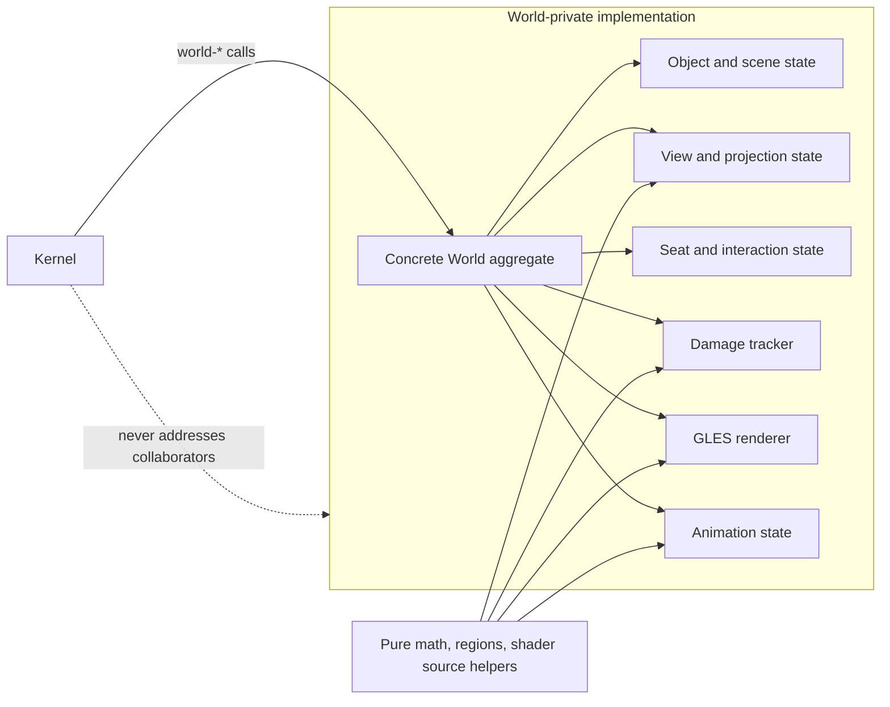

# World Composition Design

Status: proposed design for Worlds built on the current Kernel contract.

## 1. Decision

A World is one Kernel-facing CLOS aggregate, not one indivisible implementation.
It implements every `world-*` method and owns a graph of smaller collaborators.
Those collaborators may be reused by other Worlds, but they remain private to
the World boundary. Kernel never discovers, invokes, or stores them.

This preserves both requirements:

- Kernel sees one coherent policy object and invokes it synchronously.
- Worlds reuse difficult mechanisms such as damage history, shader compilation,
  animation sampling, and spatial indexing without sharing one universal World
  model.

“Monolithic World” therefore means **one authority and one external boundary**,
not **one class containing every algorithm and every slot**.



## 2. Composition Rules

1. A concrete World directly subclasses `ataxia.kernel:world`.
2. The World object is the only object installed into Kernel.
3. The World owns every collaborator for exactly its own lifetime.
4. Kernel callbacks enter through a `world-*` method and complete
   synchronously on the Runtime owner thread.
5. The World coordinates collaborators with direct Lisp calls. There are no
   internal mailboxes or generic event envelopes.
6. Collaborators may call one another only through explicit references or
   arguments supplied by the World. There is no global service locator.
7. Reuse is by composition and small protocols, not by inheriting a large base
   World containing planar assumptions.
8. A collaborator is optional unless the concrete World declares it as part of
   its own design. A spherical World need not adopt a planar scene or picker.
9. Native compositor objects remain entirely inside the World and may be held
   by its scene collaborator. Kernel-created Wayland objects remain stable
   references supplied through the existing Kernel protocol.
10. All GLES calls still occur only during graphics attachment, graphics
    detachment, or a valid frame lease.

## 3. Use the Smallest Suitable Abstraction

Not every reusable concept should be a CLOS object.

| Kind | Representation | Use when |
|---|---|---|
| Stateful service | CLOS class | It has identity, replaceable behavior, multiple implementations, or a lifecycle. |
| Closed state container | `defstruct` | It is owned locally and does not require method dispatch. |
| Immutable value | `defstruct` or list/vector | It represents a matrix, rectangle, draw item, hit, or snapshot value. |
| Pure algorithm | Function | Its result depends only on arguments, such as matrix composition or region intersection. |
| Scoped operation | Macro plus functions | Correctness depends on lexical or dynamic extent, such as temporary GL state. |
| Static asset | Constant or pathname | It is shader source, lookup data, or other immutable input. |

### Good function-level reuse

- vector, matrix, quaternion, and projection math;
- rectangle and region union, intersection, subtraction, and clipping;
- conversion between Wayland buffer transforms and texture coordinates;
- tessellation and mesh generation;
- easing curves and time normalization;
- shader source loading and diagnostic formatting;
- color conversion and interpolation;
- small search and sorting algorithms.

These functions do not need identity and should not receive the entire World.

### Good object-level reuse

- damage state with per-output and per-target history;
- a renderer holding GLES programs, buffers, textures, and intermediate targets;
- an animation collection containing active timelines;
- a spatial index whose contents change over time;
- per-output presentation state;
- a resource cache that must be created and destroyed with an EGL context.

## 4. Concrete World Aggregate

Each World chooses its own collaborators and data layout. No common class
requires the slots below, but a featureful planar World could look like:

```lisp
(defclass planar-world (ataxia.kernel:world)
  ((kernel        :accessor world-kernel)
   (objects       :initarg :objects :reader world-objects)
   (outputs       :initarg :outputs :reader world-outputs)
   (seats         :initarg :seats :reader world-seats)
   (scene         :initarg :scene :reader world-scene)
   (views         :initarg :views :reader world-views)
   (damage        :initarg :damage :reader world-damage)
   (renderer      :initarg :renderer :reader world-renderer)
   (animations    :initarg :animations :reader world-animations)))
```

A spherical World may instead own a spherical scene, globe cameras, ray-based
picking, spherical coverage, and its own renderer. It can still reuse the same
region functions, shader loader, animation sampler, and output damage-history
component where their contracts make no planar assumptions.

Construction should use an explicit factory:

```lisp
(defun make-planar-world (&key theme renderer-options)
  (let* ((damage (make-damage-tracker))
         (renderer (make-planar-renderer renderer-options))
         (animations (make-animation-set)))
    (make-instance 'planar-world
                   :objects (make-hash-table :test #'eq)
                   :outputs (make-hash-table :test #'eq)
                   :seats (make-hash-table :test #'eq)
                   :scene (make-planar-scene theme)
                   :views (make-planar-view-set)
                   :damage damage
                   :renderer renderer
                   :animations animations)))
```

The factory makes dependencies visible and allows a World to substitute one
collaborator without changing Kernel.

## 5. Internal Collaborator Boundaries

The following are recommended boundaries, not mandatory Kernel protocols.

### 5.1 Object and scene state

Owns the World-side entry associated with each Kernel object:

- position, orientation, scale, depth, and stacking meaning;
- current and previous presentation coverage;
- native decorations or related native components;
- visibility, workspace membership, and policy flags;
- cached drawable revision and retained render sources;
- world-specific animation bindings.

The scene does not send Wayland requests itself. The World interprets scene
results and invokes Kernel mechanisms such as `request-object-configuration`.

There should be one World-owned entry per presented Kernel object. The Kernel
object remains the stable key; World state is neither injected into it nor
stored by Kernel.

### 5.2 Output and view state

Owns per-output policy:

- camera and viewport;
- projection and inverse projection;
- visible scene selection;
- output-local overlays and native components;
- output configuration generation;
- pending frame request state;
- the damage tracker state associated with the output.

Projection is World-specific. It must expose coherent operations for rendering,
damage projection, and picking, but planar and spherical implementations do not
need to share a stateful superclass.

### 5.3 Seat and interaction state

Owns per-seat policy:

- cursor position in the World's chosen coordinate system;
- the output or viewport currently addressed;
- hover, focus intent, capture, drag, resize, and navigation state;
- cursor visual and cursor animation state;
- gesture interpretation.

Input callbacks update this state, perform picking through the World projection,
invoke `interactable-*`, accumulate resulting damage, and request a frame only
when presentation changed.

### 5.4 Renderer

Owns GLES resources and draw execution:

- shader programs and uniform locations;
- vertex, index, and uniform buffers;
- meshes and reusable geometry;
- intermediate framebuffers and textures;
- render passes, clipping, and blending choices;
- resource retirement after presentation snapshots stop referencing them.

The renderer consumes a World-private immutable presentation snapshot. It does
not query mutable scene state while issuing draw calls.

The renderer is a stateful object because GLES handles have identity and a
strict EGL-context lifetime. Shader loading, preprocessing, compilation-log
formatting, matrix math, and mesh generation remain ordinary helper functions.

### 5.5 Animation state

Owns active World-side timelines and samples them using the frame timestamp.
Reusable animation machinery should understand only:

- start time, duration, phase, easing, and completion;
- a sampling function or binding supplied by the concrete World;
- invalidated old and new coverage;
- whether another frame is required.

It must not encode core facts such as opacity, pickup, drop, mapping, or planar
coordinates. Those meanings belong to the concrete World.

### 5.6 Damage tracker

Owns bookkeeping that is independent of scene topology:

- pending output-space damage;
- committed damage history per output target token;
- output configuration generations;
- whether a target needs full repair;
- staged damage for the current frame;
- commit and failure transitions.

The tracker receives already projected output-buffer regions. It does not know
how an object's local damage became that region. A planar World may project a
rectangle with an affine transform; a spherical World may project a curved mesh
to conservative screen-space coverage.

This split is what makes damage machinery genuinely reusable.

## 6. Damage Flow

Damage is accumulated when visible state changes, not continuously.

```mermaid
sequenceDiagram
    participant K as Kernel
    participant W as World aggregate
    participant P as Projection/scene
    participant D as Damage tracker
    participant R as Renderer

    K->>W: object invalidated or input callback
    W->>P: compute old/new output coverage
    P-->>W: output-buffer regions
    W->>D: add pending damage
    W->>K: request-output-frame

    K->>W: world-render(frame lease)
    W->>W: freeze presentation snapshot
    W->>D: begin frame(target token, generation)
    D-->>W: repair region
    W->>R: render(snapshot, repair region)
    R-->>W: presented protocol tokens
    W-->>K: world-frame-result

    alt commit succeeds
      K->>W: world-frame-committed
      W->>D: commit staged history
    else commit fails
      K->>W: world-frame-failed
      W->>D: restore staged damage
    end
```



### 6.1 Invalidating a visible object

For movement, animation, resize, mapping, unmapping, or style changes:

1. obtain the object's previous output coverage;
2. apply the World mutation;
3. obtain its new output coverage;
4. add both regions to pending damage;
5. update the presentation snapshot source;
6. request frames for affected outputs.

Using both regions repairs the vacated pixels as well as the new pixels.

For committed Wayland surface damage, World projects the supplied object-local
damage through the exact mapping used to render that surface. Conservative
over-damage is valid; under-damage is not.

### 6.2 Beginning a frame

The damage tracker combines:

- newly pending output damage;
- repair required because the acquired target token contains older content;
- full-output damage after output configuration or render-graph changes;
- effect-specific expansion such as blur or shadow sampling radius.

If the output generation, dimensions, scale, transform, target history, or
render graph is incompatible with retained history, the tracker returns full
damage.

### 6.3 Commit and failure

Pending damage is not discarded by `world-render`.

- On `world-frame-committed`, staged state becomes committed target history and
  satisfied pending damage is removed.
- On `world-frame-failed`, staged state is discarded and its damage remains
  pending. World decides whether and when to request another frame.

The tracker never commits an output and never schedules frames itself.

## 7. Rendering Flow

`world-render` remains the sole normal rendering entry point:

1. validate World graphics state and output state;
2. sample animations at `frame-timestamp`;
3. apply sampled values to World-owned presentation state;
4. freeze one immutable presentation snapshot;
5. ask the damage tracker for the acquired target's repair region;
6. build or reuse draw passes for that snapshot;
7. invoke the renderer inside the valid frame lease;
8. return final buffer-space damage and presented protocol tokens.

The snapshot may contain `defstruct` values such as:

```lisp
(defstruct draw-instance
  drawable-surface
  transform
  clip
  opacity
  material
  conservative-coverage)

(defstruct presentation-snapshot
  output
  generation
  passes
  protocol-tokens
  resource-retirements)
```

These are immutable frame values, not extensible objects. The renderer should
receive all information needed to draw without reaching back into the World.

## 8. Internal Protocols

Use a small generic protocol only where Worlds actually need interchangeable
implementations. Suggested examples are:

```lisp
(defgeneric damage-add-region (tracker output region))
(defgeneric damage-begin-frame (tracker lease render-generation))
(defgeneric damage-commit-frame (tracker output cookie))
(defgeneric damage-fail-frame (tracker output cookie))
(defgeneric damage-reset-output (tracker output reason))

(defgeneric renderer-attach (renderer graphics-context))
(defgeneric renderer-render (renderer lease snapshot repair-region))
(defgeneric renderer-detach (renderer graphics-context reason))
```

Do not create a generic function merely because a function might someday have
a second implementation. Start with an ordinary function, and promote it to a
protocol only when dispatch is useful.

Internal protocols belong in a World-support package, not in
`ataxia.kernel`. Kernel's package must remain limited to the Kernel/World and
Kernel/object boundaries already defined.

## 9. Lifecycle

### Attach

1. Kernel installs the World and calls `world-attached`.
2. World records the Kernel reference.
3. World initializes non-GLES collaborators.
4. Kernel replays existing outputs, seats, and Wayland objects through the
   normal `world-*` callbacks.
5. When EGL is current, `world-graphics-attached` creates renderer resources.
6. World marks affected outputs fully damaged and requests their first frames.

### Detach or replacement

1. `world-quiescing` prevents new policy operations and frame requests.
2. Active interactions and captures are resolved by the old World.
3. With EGL current, `world-graphics-detaching` releases renderer resources.
4. World releases retained render sources and clears private Kernel-object
   references.
5. Kernel detaches the old World and installs the replacement at a safe point.

Collaborators are detached in reverse construction order. No collaborator may
outlive its owning World unless it is immutable Lisp data with no foreign
resources.

## 10. Communication Pattern

The World aggregate coordinates operations explicitly:

```lisp
(defmethod ataxia.kernel:world-object-invalidated
    ((world planar-world) object invalidation)
  (let* ((scene (world-scene world))
         (damage (world-damage world))
         (affected (scene-apply-invalidation scene object invalidation)))
    (dolist (entry affected)
      (damage-add-region damage (car entry) (cdr entry))
      (ataxia.kernel:request-output-frame (car entry)))))
```

This is intentionally direct. The aggregate decides ordering, translates
between collaborator-specific values, invokes Kernel mechanisms, and maintains
transactional behavior. Collaborators do not independently react to Kernel
events.

## 11. Package and Directory Layout

Shared code should be outside every concrete World:

```text
src/
  world-support/
    packages.lisp
    values.lisp
    math/
      affine.lisp
      matrix.lisp
      quaternion.lisp
      regions.lisp
    gl/
      bindings.lisp
      shader-loader.lisp
      resources.lisp
    damage/
      protocol.lisp
      history.lisp
    animation/
      timing.lisp
      timelines.lisp
  worlds/
    fullscreen/
      packages.lisp
      renderer.lisp
      world.lisp
      main.lisp
    planar/
      ...
    spherical/
      ...
```

`ataxia-world-support` should depend on `ataxia-kernel` only where a helper
uses Kernel value types. Math and region modules should avoid even that
dependency. Concrete World systems depend on both Kernel and the support
modules they choose to use.

The support library must not become a hidden third compositor layer. It owns no
active World, receives no Runtime callbacks, and has no global mutable state.

## 12. Reuse Examples

### Fullscreen and planar Worlds

Both may reuse:

- the same Wayland texture shader loader;
- buffer-transform texture matrix helpers;
- output target damage history;
- region operations;
- GLES resource retirement helpers.

They should not share a scene object merely because both currently use
rectangles. Fullscreen placement and planar placement have different policy.

### Planar and spherical Worlds

Both may reuse:

- animation timing and easing functions;
- immutable draw-instance definitions if expressive enough;
- shader compilation and diagnostics;
- conservative output-region operations after projection;
- damage target history.

They should independently implement camera state, projection, picking, object
placement, spatial indexes, and presentation graph construction.

### Multiple renderer styles in one World

A concrete World can inject a renderer implementation through its constructor.
The renderer protocol may support a minimal renderer, an effects renderer, or a
debug renderer while the World keeps the same interaction and placement model.
Renderer substitution is valid only when the renderer consumes the same
snapshot contract and reports equivalent coverage requirements.

## 13. Invariants

- Kernel knows only the World aggregate.
- Kernel callbacks are synchronous and owner-thread confined.
- A World owns its collaborators; collaborators do not become global services.
- World-specific geometry drives rendering, picking, and damage projection.
- Damage history operates only on final output-buffer regions.
- A frame snapshot is immutable once rendering begins.
- GLES resource objects exist only within the graphics-context lifetime.
- No GLES call occurs outside an allowed Kernel-provided graphics scope.
- No pending damage is lost before a successful output commit.
- Output configuration changes invalidate incompatible target history.
- Stateless math and transformation code stays callable without constructing a
  World or collaborator graph.

## 14. Initial Implementation Order

1. Extract pure affine, transform, and region helpers from the fullscreen
   renderer without changing behavior.
2. Extract reusable GLES shader and resource-lifetime helpers.
3. Define the internal damage tracker protocol and target-history
   implementation.
4. Refactor `fullscreen-world` into an aggregate with renderer and damage
   collaborators.
5. Preserve the current fullscreen behavior while validating the extracted
   boundaries on UTM.
6. Build the first involved World using composition rather than extending the
   fullscreen implementation.

The fullscreen World is the boundary proof: after refactoring, its Kernel-facing
methods should be short orchestration methods, while reusable mechanisms live
in `world-support` and fullscreen-specific placement and input policy remain in
`worlds/fullscreen`.
