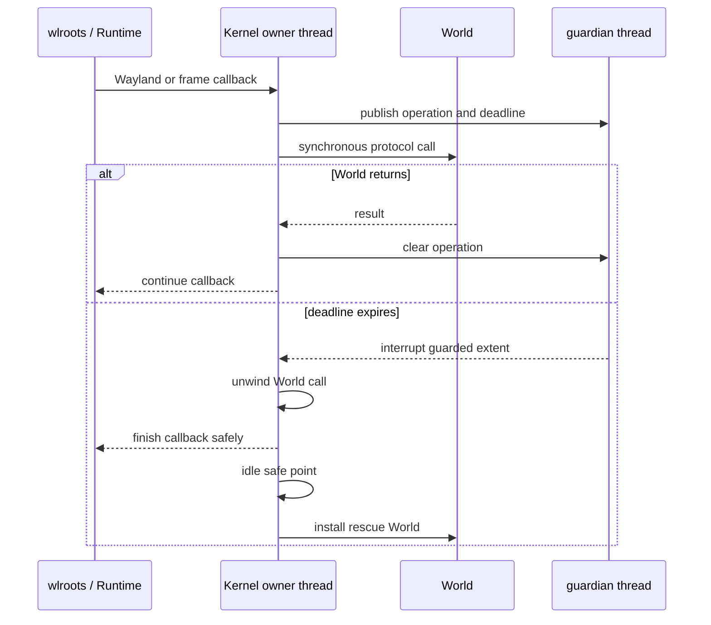

# World Watchdog

## Purpose

Kernel and World execution share one synchronous Runtime owner thread. A small
guardian thread recovers a stuck World without putting ordinary input or
rendering behind a queue and without dropping existing Wayland connections.

## Boundary

Every Kernel-to-World protocol invocation enters one guarded dynamic extent:

The guardian never calls wlroots, EGL, GLES, Kernel mechanisms, or World
methods. It only interrupts the exact Lisp extent published by Kernel. Recovery
then executes on the normal owner thread through a libwayland idle source.

The guard is outside CLOS dispatch at Kernel call sites. A World-specific
primary, `:before`, `:after`, or `:around` method is therefore inside the same
deadline. Putting the guard on a base-class `:around` method was rejected after
live testing showed that a more-specific `:around` method can execute outside
it.

## Recovery

On a condition or timeout, Kernel:

1. records the failed operation and condition;
2. suppresses further normal calls into that World;
3. schedules recovery at the next event-loop idle safe point;
4. attempts bounded quiescing and graphics cleanup of the old World;
5. constructs the configured rescue World;
6. replays live outputs, seats, cursor requests, and applications;
7. attaches rescue graphics and requests a frame.

The bundled rescue World draws a solid diagnostic frame and deliberately owns
no client layout, input policy, animation, or persistent GLES resources. After
repairing code, `ATAXIA.KERNEL:RESTART-WORLD` constructs and installs a fresh
normal World from the entrypoint-provided factory.

## Validation

A live validation injected a one-shot infinite loop into
`WORLD-OUTPUT-PRESENTED` with a one-second deadline.

- Kernel logged the timeout and installed rescue World generation 1.
- The compositor process retained the same PID.
- Foot retained the same PID and Wayland connection.
- Rescue rendering replaced the stuck World with a solid frame.
- `RESTART-WORLD` installed a fresh infinite World as generation 2.
- The existing Foot window rendered again without client restart.

## Scope and Limits

This is recovery from Lisp World failure, not arbitrary process recovery.

- It can unwind Lisp loops, sleeps, deadlocks that remain interruptible, and
  signaled conditions inside Kernel-to-World calls.
- It does not guard arbitrary Lisp run directly on the owner thread outside the
  World protocol boundary.
- It cannot guarantee interruption of a blocked driver, wlroots, EGL, GLES, or
  other foreign call.
- It cannot repair corrupted Kernel or Runtime state, native memory corruption,
  process termination, or a broken rescue factory.
- A World can partially invoke Kernel mechanisms before failing; those valid
  protocol mutations are not rolled back.
- World-created event-loop sources still rely on `WORLD-QUIESCING` for cleanup.
  A future revocable resource scope would be needed to reclaim them even when
  cleanup code is itself irreparable.

Hard failure still requires an external supervisor and loses Wayland
connections. The watchdog exists specifically to recover the narrower and more
common case where Runtime and Kernel remain healthy but World Lisp stops
returning.
